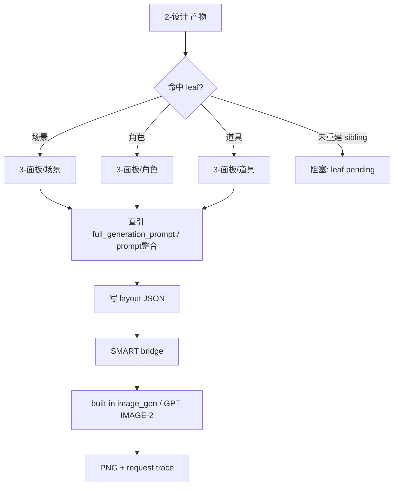
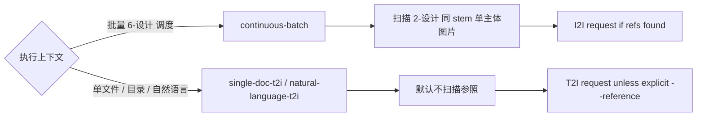
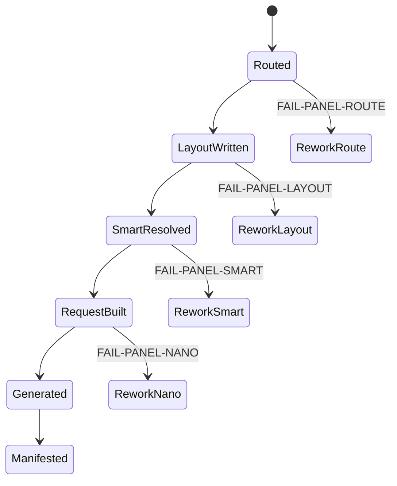

# aigc 6-设计 / 3-面板

## Context Loading Contract

- 每次调用本技能时，必须同时加载同目录 `CONTEXT.md` 作为预加载上下文。
- 若同目录 `CONTEXT.md` 缺失，应先补齐最小知识库骨架，或向用户明确报告阻塞；不得在未检查该上下文的情况下执行技能。
- 冲突优先级：用户显式请求 > 仓库/全局 `AGENTS.md` > 本 `SKILL.md` > 同目录 `CONTEXT.md`。

## 概述

`3-面板` 是 `6-设计` 的展示与派生生图 tranche。它只消费 `2-设计` 已稳定的设计产物，把其中可直接下游使用的 `full_generation_prompt / prompt整合` 收束为面板 layout JSON，并在默认路径下桥接内置 `$imagegen` / `image_gen` 生图，默认模型口径为 `GPT-IMAGE-2`。

`2-设计` 当前会为单一主体生成同目录同 stem 概念图；`3-面板` 在批量上下文中可把这些图片作为 SMART 连续性参照，但不得把它们升格为面板 layout 真源。

真实生图默认继承 `.agents/skills/aigc/_shared/image-generation-execution-contract.md`：先写 `panel_auto_generate_batch.json`，再由当前 Codex 会话逐张调用内置 `image_gen` 并复制回项目路径；API/CLI/nano-banana 仅作为用户显式 fallback。

本 tranche 当前已重建的 active leaf：

- `.agents/skills/aigc/6-设计/3-面板/场景`
- `.agents/skills/aigc/6-设计/3-面板/角色`
- `.agents/skills/aigc/6-设计/3-面板/道具`

未重建 sibling 仍不得伪装为 active；父 tranche 只提供路由、共享 SMART 桥与门禁。

## Business Requirement Analysis Contract

| 分析槽位 | 当前答案 |
| --- | --- |
| `business_goal` | 把设计真源的 `full_generation_prompt / prompt整合` 转换成 review-ready panel layout JSON，并默认生成派生 PNG |
| `business_object` | `2-设计/<域>/第N集/` 下的 Markdown 设计卡、结构化 JSON、同 stem 单主体图片、layout 模板、SMART 参考图与内置 imagegen request |
| `constraint_profile` | 不改写 `2-设计` 真源；layout JSON 是面板层第一派生真源；PNG 是再派生资产；SMART 参照只在批量 6-设计 调度时自动发现 |
| `success_criteria` | 每个命中主体都有独立 `*-Panel-layout.json`、可追踪 `_manifest.json`、默认准备并执行内置 imagegen 请求；批量上下文可绑定 `2-设计` 同 stem 图片，单文件/自然语言直生图默认无参照 |
| `non_goals` | 不重新设计主体；不回写 `3-Detail`、`1-清单` 或 `2-设计`；不把历史旧仓路径升为当前 runtime |
| `complexity_source` | 输入形态多样，且批量链路需要 continuity refs，单文件链路又不能自动污染参考图 |
| `topology_fit` | 适合“输入判型 -> leaf 路由 -> layout 写回 -> SMART 桥接 -> manifest 汇流”的混合型思行网络 |

## Total Input Contract

### 默认输入

- `projects/aigc/<项目名>/6-设计/<域>/2-设计/第N集/*.md`
- `projects/aigc/<项目名>/6-设计/<域>/2-设计/第N集/_manifest.json`
- `projects/aigc/<项目名>/6-设计/<域>/2-设计/第N集/*.{png,jpg,jpeg,webp}`（批量 SMART 参照，可选）
- 兼容 JSON：`道具设计.json`、`prop_design_prompt.json` 等 leaf 声明的投影

### 固定输出

- `projects/aigc/<项目名>/6-设计/<域>/3-面板/第N集/*-Panel-layout.json`
- `projects/aigc/<项目名>/6-设计/<域>/3-面板/第N集/_manifest.json`
- 自动生图请求侧车：`projects/aigc/<项目名>/6-设计/<域>/3-面板/第N集/generated/requests/*.json`
- 派生 PNG：`projects/aigc/<项目名>/6-设计/<域>/3-面板/第N集/generated/<layout-stem>/*.png`

### 硬门槛

1. `3-面板` 不拥有设计事实，只引用上游 `full_generation_prompt / prompt整合`。
2. `layout.json` 必须先落盘，再调用图片生成。
3. 自动生图统一走内置 `$imagegen` / `image_gen` 的结构化请求侧车承接，默认 `GPT-IMAGE-2`。
4. 批量 `6-设计` 调度默认启用 `continuous-batch`，自动扫描 `2-设计` 目录中同主体同 stem 图片作为参照。
5. 单独指定文件、目录、layout JSON 或自然语言生图默认启用 `single-doc-t2i / natural-language-t2i`，除非用户显式传 `--reference`，否则不自动绑定参照图。
6. `layout-only / json-only` 仍必须写出 `generated/requests/panel_auto_generate_batch.json` 与 bridge report；只是不调用内置 `image_gen`。
7. 跨 leaf 的“写 layout + request sidecar，但不真实调 provider”停点参数应兼容 `--generation-dry-run`；旧 `--dry-run` 仍保留为别名。

## Visual Maps

## Shared Canonical Sources

| 载体 | 位置 | 作用 |
| --- | --- | --- |
| SMART bridge | `.agents/skills/aigc/6-设计/3-面板/_shared/panel_auto_generate.py` | layout JSON -> built-in imagegen request |
| image execution contract | `.agents/skills/aigc/_shared/image-generation-execution-contract.md` | 内置 imagegen 默认执行模式 |
| design output contract | `.agents/skills/aigc/6-设计/2-设计/_shared/design-output-contract.md` | `full_generation_prompt` 与同目录同名单主体图真源 |
| 场景 leaf | `.agents/skills/aigc/6-设计/3-面板/场景/SKILL.md` | 当前 active leaf |
| 角色 leaf | `.agents/skills/aigc/6-设计/3-面板/角色/SKILL.md` | 当前 active leaf |
| 道具 leaf | `.agents/skills/aigc/6-设计/3-面板/道具/SKILL.md` | 当前 active leaf |
| imagegen 契约 | `/Users/vincentlee/.codex/skills/.system/imagegen/SKILL.md` | 内置 `image_gen` 生图请求承接真源 |

## Route And Topology Contract

1. 命中 `场景面板 / scene panel / 场景 layout / 场景面板生图` 时进入 `3-面板/场景`。
2. 命中 `角色面板 / character panel / 角色 layout / 角色面板生图` 时进入 `3-面板/角色`。
3. 命中 `道具面板 / prop panel / 道具 layout / 道具面板生图` 时进入 `3-面板/道具`。
4. 用户要求整个 `6-设计` 批量推进，且对应 `2-设计/<域>` 已产出，允许自动进入已 active 的 panel leaf。
5. 未重建的 `服装` panel leaf 只报告 pending，不得引用旧路径执行。
6. leaf 产出的 layout JSON 必须遵循共享 SMART bridge 合同；leaf 只能调用 `_shared/panel_auto_generate.py`，不得私造第二套 API payload、Assets 扫描或 SMART mode 解析。

## Thinking-Action Node Network

### NODE-PANEL-01 路由判型

- `objective`: 判断本轮是批量 6-设计 panel、单 leaf panel、单文件生图还是自然语言直生图。
- `actions`: 锁定 leaf、project、episode、输入根与 SMART 默认模式。
- `evidence`: `leaf_id`、`pipeline_context`、`smart_mode_resolved`。
- `route_out`: 场景/角色/道具 -> 对应 active leaf；未重建 sibling -> `FAIL-PANEL-ROUTE`。
- `gate`: 只有命中 active leaf 才允许执行。

### NODE-PANEL-02 JSON 先行

- `objective`: 保证任何生图前都已有可追溯 layout JSON。
- `actions`: leaf 从设计产物提取 `full_generation_prompt / prompt整合`，写 `*-Panel-layout.json` 与 `_manifest.json`。
- `evidence`: layout 文件列表、manifest 输出统计。
- `route_out`: JSON 完成 -> `NODE-PANEL-03`；缺 prompt 或模板 -> `FAIL-PANEL-LAYOUT`。
- `gate`: 不允许跳过 JSON 直接调用生图工具。

### NODE-PANEL-03 SMART 生图桥

- `objective`: 根据执行上下文决定是否自动绑定设计图参照。
- `actions`: 批量上下文扫描 `2-设计` 同 stem 单主体图片；单文件/自然语言上下文默认不扫描；构造内置 imagegen request sidecar；默认由 Codex 会话逐张调用 `image_gen`。
- `evidence`: `prompt_reference.smart_mode_resolved`、`continuity_reference_images`、`explicit_references`、`execution_mode`、`provider_skill`、`default_model`、`request_batch_path`。
- `route_out`: request 生成 -> built-in imagegen；映射失败 -> `FAIL-PANEL-SMART`。
- `gate`: 自动参照图只允许在批量上下文中出现。

## Field Master

| field_id | 输出位置/字段 | 内容要求 | 默认责任 Step | 质量维度 | 失败码 |
| --- | --- | --- | --- | --- | --- |
| `FIELD-PANEL-01` | leaf route | 只调度 active leaf | `NODE-PANEL-01` | 路由准确性 | `FAIL-PANEL-ROUTE` |
| `FIELD-PANEL-02` | `*-Panel-layout.json.prompt` | 直接来自上游 `full_generation_prompt / prompt整合` | `NODE-PANEL-02` | prompt 真源性 | `FAIL-PANEL-LAYOUT` |
| `FIELD-PANEL-03` | `image_generation` | 指向内置 imagegen，记录 SMART 默认、`provider_skill=imagegen` 与 `default_model=GPT-IMAGE-2` | `NODE-PANEL-03` | 生图桥接 | `FAIL-PANEL-SMART` |
| `FIELD-PANEL-04` | request sidecar | 批量自动参照、单文件默认无参照 | `NODE-PANEL-03` | SMART 语义 | `FAIL-PANEL-SMART` |
| `FIELD-PANEL-05` | `_manifest.json` | 记录 layout、request sidecar、`request_ready` 或真实图片完成结果 | `NODE-PANEL-02/03` | 可追溯性 | `FAIL-PANEL-MANIFEST` |

## Thought Pass Map

| step_id | 聚焦字段 | 核心问题 | 生成动作 | 未达标信号 |
| --- | --- | --- | --- | --- |
| `S1` | `FIELD-PANEL-01` | 当前 leaf 是否已重建 | 锁定 active leaf | 调度 pending sibling |
| `S2` | `FIELD-PANEL-02` | prompt 是否来自设计产物 | 提取上游 `full_generation_prompt / prompt整合` | 重新创作 prompt |
| `S3` | `FIELD-PANEL-03/04` | 是否该自动参照图 | 根据上下文解析 SMART 模式并扫描同 stem 设计图 | 单文件任务被自动塞参照 |
| `S4` | `FIELD-PANEL-05` | 是否能审计 layout 与生图 | 写 manifest 与 request trace | 成功/失败不可定位 |

## Pass Table

| field_id | Pass Standard | Fail Code | Rework Entry |
| --- | --- | --- | --- |
| `FIELD-PANEL-01` | 只进入 active leaf | `FAIL-PANEL-ROUTE` | `NODE-PANEL-01` |
| `FIELD-PANEL-02` | prompt 非空、可回链上游文件，且优先使用 `full_generation_prompt` | `FAIL-PANEL-LAYOUT` | leaf prompt extraction |
| `FIELD-PANEL-03` | request 指向内置 imagegen 标准字段，默认 `execution_mode=codex-builtin-imagegen` 且 `default_model=GPT-IMAGE-2` 可追踪 | `FAIL-PANEL-SMART` | `_shared/panel_auto_generate.py` |
| `FIELD-PANEL-04` | 批量/单文件参照策略符合合同 | `FAIL-PANEL-SMART` | `_shared/panel_auto_generate.py` |
| `FIELD-PANEL-05` | manifest 记录输出与生图结果 | `FAIL-PANEL-MANIFEST` | leaf manifest writeback |

## Review Gate Mapping

No independent gate: 本文件是旧 `3-面板` tranche parent 的 legacy archive，不再作为 active panel skill、独立生图桥或当前 review gate 真源；旧 `FAIL-PANEL-*` 只作为归档索引，当前阻断必须回接父级 active gate 与域级 leaf / 图像执行合同。

| Review Question | Review Gate | Fail Code | Rework Target | Report Evidence |
| --- | --- | --- | --- | --- |
| 是否仍把旧 `.agents/skills/aigc/6-设计/3-面板` 当作 active 面板入口，而不是路由到当前域级生成/图像链路？ | `GATE-DESIGN-LEGACY-01` | `FAIL-DESIGN-LEGACY-ACTIVE-ENTRY` | `D-N2-DOMAIN`；`references/阶段路由矩阵.md` | 旧 tranche 触发词、active route、legacy archive 只读声明 |
| 旧合同中的 `场景 / 角色 / 道具` panel leaf、SMART bridge、imagegen 默认模式是否未经当前 active 合同复核就被执行？ | `GATE-DESIGN-LEGACY-02` | `FAIL-DESIGN-LEGACY-UNVALIDATED-RULE` | `D-N4-DISPATCH`；对应 active leaf `SKILL.md + CONTEXT.md` / image execution contract | 被复用规则、active 合同位置、采用/废弃理由 |
| 未重建 sibling 或旧 panel leaf 是否被误判为 active，或旧 `3-面板` 路径仍出现在 registry/routes 中？ | `GATE-DESIGN-LEGACY-03` | `FAIL-DESIGN-LEGACY-PATH-DRIFT` | `D-N2-DOMAIN -> registry/routes/shared runtime 修复`；`references/阶段路由矩阵.md` | active/pending matrix、`rg` 旧路径结果、引用更新清单 |
| layout JSON 是否被跳过，或父级直接调用 imagegen / API / nano-banana，导致 layout、request sidecar 与 manifest 不可追溯？ | `GATE-DESIGN-CLOSEOUT-01` | `FAIL-DESIGN-CLOSEOUT-DOMAIN-GATE` | `D-N5-DOMAIN-GATE`；对应域级 generation/image Output Contract | layout path、request sidecar、manifest、provider mode 证据 |
| 批量 SMART 自动参照是否污染单文件/自然语言任务，或 `request_ready` 被写成真实图片成功？ | `GATE-DESIGN-CLOSEOUT-03` | `FAIL-DESIGN-CLOSEOUT-REPORT` | `D-N6-CLOSEOUT`；对应域级 generation/image report | smart mode、continuity refs、真实图片路径或缺口、residual risk |
| 旧 `FAIL-PANEL-*` 是否被写入当前父级 verdict，造成 fail code 无法解析或绕过 active leaf review？ | `GATE-DESIGN-LEGACY-02` | `FAIL-DESIGN-LEGACY-UNVALIDATED-RULE` | `review/review-contract.md`；对应 active leaf review contract | legacy fail code 对照、当前 gate/fail code 替换记录 |

## Root-Cause Execution Contract (Mandatory)

问题排查必须上溯：

`Symptom -> Direct Technical Cause -> Rule Source (3-面板 leaf / _shared bridge / template) -> Meta Rule Source (AGENTS.md / skill-知行合一 / imagegen) -> Fix Landing Points`

优先修复：

1. leaf `SKILL.md` 的输入/输出合同。
2. `_shared/panel_auto_generate.py` 的 SMART 判型与 request 映射。
3. layout template 的字段结构。
4. imagegen 的结构化请求承接说明。
5. `.agents/skills/aigc/_shared/image-generation-execution-contract.md` 的执行模式真源。

## Completion Criteria

- active leaf 产出 `layout.json`。
- 默认自动桥接内置 imagegen。
- 默认写出 request sidecar，并在 manifest/bridge report 中记录 `provider_skill=imagegen`、`provider_mode=built-in image_gen` 与 `default_model=GPT-IMAGE-2`。
- 批量上下文自动扫描 `2-设计` 同 stem 单主体图片作为参照。
- 单文件或自然语言生图默认无参照。
- `_manifest.json` 可追溯 layout 与生图状态。
