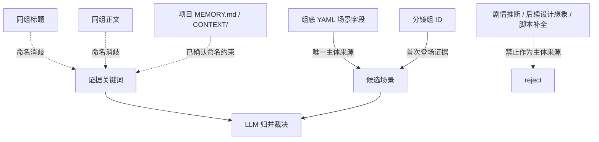

# Source And Merge Contract

## 上游真源

- 唯一准确信息来源：`projects/aigc/<项目名>/5-分组/第N集.md` 每个分镜组底部 YAML 的 `场景` 字段。
- 证据回查来源：同一分镜组正文、场景标题、分镜组 ID。
- 禁止来源：未被 `场景` 字段支持的剧情推断、后续设计想象、脚本自动补全。

## Source Trust Map

## 候选记录

每个候选场景至少记录：

| field | meaning |
| --- | --- |
| `source_episode` | 来源集号或文件名 |
| `group_id` | 来源分镜组 ID |
| `yaml_scene_value` | 组底 YAML 的 `场景` 原值 |
| `evidence_keywords` | 同组标题或正文中的消歧关键词 |

候选记录是 LLM 归并的证据，不直接等于最终输出表。

## 归并规则

1. 精确同名默认归并。
2. 明确别名、代称、简称、全称默认归并，但关键词中保留原文证据。
3. 同一地点不同时段或状态默认归并；若状态导致独立资产制作需求，可以拆分。
4. 同一地点的不同区域、房间、门口、走廊、天台、地下空间等默认保守区分。
5. 跨场景、移动路线、组合地点应拆成可制作空间，除非 YAML 明确只表达一个泛称空间。
6. 无法裁决时保留风险待核，不用脚本或模板强行二选一。

## 输出字段映射

| 输出字段 | 来源与规则 |
| --- | --- |
| `名称` | LLM 归并后的 canonical 场景名 |
| `首次登场` | 归并后最早出现的分镜组 ID，可附集号 |
| `原文描述（关键词式）` | YAML 原值、别名证据、标题/正文消歧关键词；不扩写设计 |

## Review Gate Mapping

| Review Question | Review Gate | Fail Code | Rework Target | Report Evidence |
| --- | --- | --- | --- | --- |
| 每个最终场景主体是否都能回指某个分镜组底部 YAML 的 `场景` 字段，而不是剧情推断、后续设计想象或脚本补全？ | `GATE-SCENE-LIST-01` | `FAIL-SCENE-SOURCE` | `N2-YAML-SCAN` | `candidate_records` 列出 `source_episode`、`group_id`、`yaml_scene_value`；报告删除或修正的 YAML 外主体。 |
| 同组标题、正文、项目 `MEMORY.md` / `CONTEXT/` 是否只用于命名消歧和证据关键词，没有变成新增主体来源？ | `GATE-SCENE-LIST-02` | `FAIL-SCENE-EVIDENCE` | `N3-EVIDENCE` | `evidence_keywords` 标明标题/正文/项目约束来源，并注明其只服务消歧。 |
| 每个候选记录是否至少保留 `source_episode`、`group_id`、`yaml_scene_value` 与必要 `evidence_keywords`，足以让 LLM 复核归并？ | `GATE-SCENE-LIST-03` | `FAIL-SCENE-EVIDENCE` | `N2-YAML-SCAN` / `N3-EVIDENCE` | 候选记录抽样或完整表，缺字段项与补证动作写入执行报告。 |
| 精确同名、别名、代称、简称、全称是否按证据归并为 canonical 名称，并在关键词中保留原文证据？ | `GATE-SCENE-LIST-04` | `FAIL-SCENE-MERGE` | `N5-MERGE` | `merge_decision` 记录 alias/canonical 映射、保留关键词和被合并候选来源。 |
| 同一地点的不同时段或状态是否默认归并，只有在独立资产制作需求明确时才拆分？ | `GATE-SCENE-LIST-04` | `FAIL-SCENE-TYPE` | `N4-TYPE-PROFILE` / `N5-MERGE` | `type_profile` 标记 `SCENE-TIME-STATE`，报告合并理由或资产差异拆分理由。 |
| 同一地点的不同区域、房间、门口、走廊、天台、地下空间是否被保守区分，没有被大场景吞并？ | `GATE-SCENE-LIST-04` | `FAIL-SCENE-TYPE` | `N4-TYPE-PROFILE` / `N5-MERGE` | `type_profile` 标记 `SCENE-SUBSPACE`，列出拆分后的可制作空间和对应来源组。 |
| 跨场景、移动路线、组合地点是否拆成可制作空间；若保留泛称空间，是否有 YAML 证据支持？ | `GATE-SCENE-LIST-04` | `FAIL-SCENE-MERGE` | `N3-EVIDENCE` / `N5-MERGE` | `merge_decision` 或待核项说明路线拆分、泛称保留依据和涉及分镜组。 |
| 无法裁决的别名、子空间、时段状态或路线问题是否保留风险待核，没有被脚本、模板或语感强行二选一？ | `GATE-SCENE-LIST-08` | `FAIL-SCENE-REVIEW` | `N7-REVIEW` | review finding 或 `执行报告.md` 待核清单列明候选值、证据不足点和建议确认问题。 |
| `首次登场` 是否取归并后所有候选中最早出现的分镜组 ID，而不是取命名最完整或最近处理的一次？ | `GATE-SCENE-LIST-05` | `FAIL-SCENE-MERGE` | `N5-MERGE` | `first_appearance_map` 列出各候选出现序列与最终最早组 ID。 |
| 输出表是否只保留 `名称`、`首次登场`、`原文描述（关键词式）` 三列，且关键词没有扩写成场景设定或视觉设计？ | `GATE-SCENE-LIST-06` | `FAIL-SCENE-RENDER` | `N6-RENDER` | 渲染后的 `场景清单.md` 表头检查、扩写删除记录和关键词来源说明。 |
| 别名归并、空间拆分、时段状态处理和路线拆分是否由 LLM 主判，脚本只做读取、字段检查、格式检查或机械校验？ | `GATE-SCENE-LIST-07` | `FAIL-SCENE-LLM-FIRST` | `N5-MERGE` | 执行报告记录 LLM 裁决摘要、脚本辅助范围；若使用脚本，列明脚本没有生成 canonical 名称或归并判断。 |
