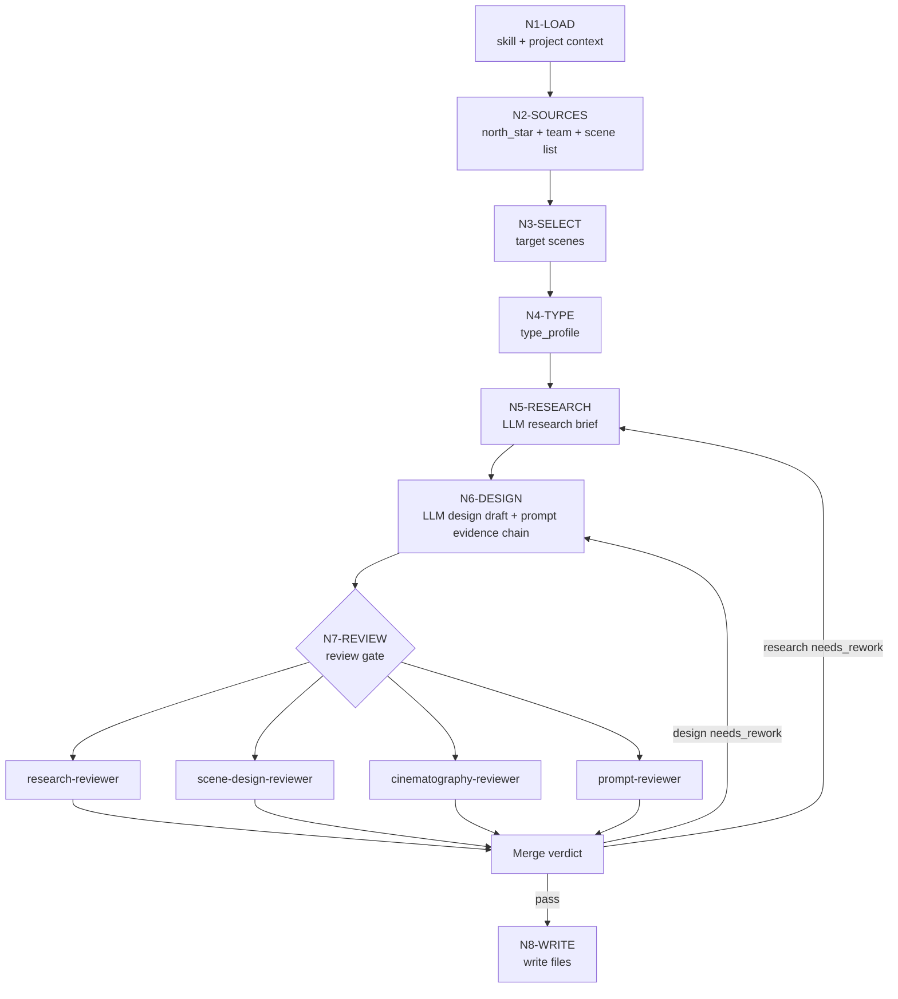

# Scene Design Workflow

## Business Requirement Analysis

| slot | answer |
| --- | --- |
| `business_goal` | 将上游场景清单扩展为单场景细目设计稿 |
| `business_object` | `场景清单.md` 的单个场景主体与项目级上下文 |
| `constraint_profile` | LLM-first、项目风格继承、字段完整、输出路径边界、`## 4. 解构` 下主体 ID、prompt 长度、最终英文 prompt 以同一主体 ID 号开头并显式包含时间和地域，且整合 `## 4. 解构` 全部有效信息 |
| `success_criteria` | 设计稿可回指上游，包含 research_brief / source posture / uncertainty / visual translation / 物语 / 解构主体 ID / prompt evidence chain，最终英文 prompt 以主体 ID 号开头，显式包含时间和地域，并完整吸收 Scene Design 与 Cinematography 的有效槽位后可进入图像生成 |
| `non_goals` | 不改清单、不生成图片、不改 registry、不写其他 worker 包 |
| `complexity_source` | 场景类型分型、团队监制上下文、研究可靠性、来源姿态、不确定性处理、视觉翻译和批量一致性 |
| `topology_fit` | 串行输入锁定 + 类型分流 + 可并行 reviewer + 汇流验收 |

## Node Network

| node_id | objective | inputs | actions | evidence | route_out | gate |
| --- | --- | --- | --- | --- | --- | --- |
| `N1-LOAD` | 加载技能与项目上下文 | `SKILL.md`、`CONTEXT.md`、项目 `MEMORY.md`、项目 `CONTEXT/` | 锁定强制规则、项目偏好、禁区 | loaded context list | `N2-SOURCES` | 必需上下文缺失已报告 |
| `N2-SOURCES` | 建立输入证据 | `north_star.yaml`、`team.yaml.init_synthesis`、`场景清单.md` | 提取全局风格、初始化综合设计种子、清单行 | `input_manifest` | `N3-SELECT` | 三个核心来源可回指 |
| `N3-SELECT` | 选择目标场景 | 用户指定或清单缺口 | 确定单个/批量场景与 `S###` 编号 | target scene list | `N4-TYPE` | 不新增清单外主体 |
| `N4-TYPE` | 形成类型画像 | 目标场景、清单关键词、项目资料 | 按 `types/` 判定空间类型、研究重点、来源姿态和风格入口 | `type_profile` | `N5-RESEARCH` | 类型画像足以指导研究 |
| `N5-RESEARCH` | LLM 直出研究闭环 | 上游证据、north star、team、type profile、`init_team_synthesis_context` | 写 `research_brief`、`source_posture`、`uncertainty_register`、`visual_translation`；顾问参谋必须绑定当前节点，不得退化为固定字段问卷 | research brief、advisor node notes | `N6-DESIGN` | 研究能落到可见空间，不把猜测写成事实 |
| `N6-DESIGN` | LLM 直出设计正文 | research brief、north star、team、type profile、`references/design-output-contract.md`、advisor node notes | 写物语、`## 4. 解构` 下的主体 ID、Scene Design、Cinematography、prompt 和 `prompt_evidence_chain`，并把同一主体 ID、时间与地域锚点以及 `## 4. 解构` 全部有效信息投进最终英文 prompt | draft markdown | `N7-REVIEW` | 核心正文非脚本生成，输出合同硬规则已逐条满足，prompt token 可回指，且最终英文 prompt 以主体 ID 号开头、含时间和地域，并覆盖 Scene Design 与 Cinematography 的有效槽位 |
| `N7-REVIEW` | 质量门禁与 reviewer 汇流 | draft markdown、review contract、`references/design-slot-review-contract.md`、`references/workflow-supervision-contract.md` | 执行初始化综合消费或本地 checklist，解析 `SCENE-BUNDLE-01` 并记录缺槽或通过结论，检查 `init_synthesis_node_coverage`，修复阻断项 | review verdict、slot bundle review、workflow supervision record | `N8-WRITE` 或 `N6-DESIGN` | verdict 非阻断，slot bundle 无缺槽，supervision 记录非空且初始化综合采纳内容绑定节点 |
| `N8-WRITE` | 落盘与报告 | accepted draft | 写入 canonical 路径，可选执行报告 | output files | done | 路径和命名正确 |

## Branch And Merge

## Evidence Rules

- `input_manifest` 至少记录项目路径、清单路径、north star 路径、team 路径和目标场景行。
- `type_profile` 至少记录 `scene_type`、`research_focus`、`architecture_style_entry`、`source_posture_need`、`uncertainty_level`、`cinematography_risk`。
- `research_brief` 至少记录 `research_questions`、`source_posture`、`evidence_matrix`、`uncertainty_register`、`visual_translation`。
- `prompt_evidence_chain` 至少记录 subject ID prefix、style、period/region、spatial、material、light/camera、deconstruction coverage 和 empty-shot token group 的证据来源；subject ID prefix 必须与 `## 4. 解构` 下方 `主体ID号：<主体ID>` 一致。
- `slot_bundle_review` 至少记录 `SCENE-BUNDLE-01` 的 required slots、证据位置、缺槽 finding 和返工入口。
- `workflow_supervision_record` 至少记录 执行模式、阻断层级、初始化综合/reviewer 路径、本地流程、`init_synthesis_node_coverage` 和汇流裁决。
- `review verdict` 至少记录字段完整性、research brief 完整性、prompt 字符数、LLM-first 边界、slot bundle 结论、workflow supervision 结论和写入路径。
