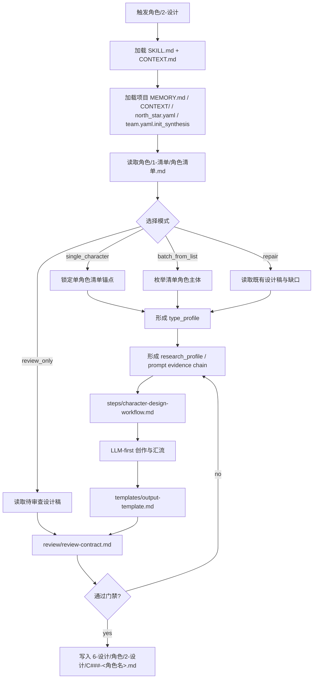
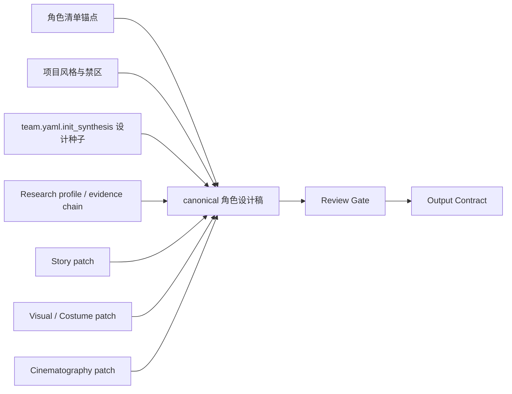
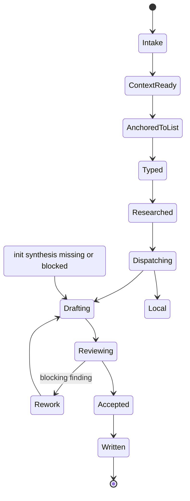

# aigc 6-设计/角色/2-设计

`角色/2-设计` 消费上游 `角色/1-清单` 的汇总式清单输出，把每个角色主体扩展为可进入后续图像生成、服装设计和镜头设计的细目设计稿。它只负责角色主体设计，不生成最终图片、不替代 `3-生成`，也不改写上游清单真源。

## Context Loading Contract

- 每次调用 `$aigc-design-character-detail` 时，必须同时加载同目录 `CONTEXT.md`。
- 每次调用本技能时，必须同时加载同目录 `CONTEXT.md`。
- 每次调用本技能时，必须同时识别并加载同目录 `types/` 中选中的类型包（单选或多选）。
- 若任务绑定 `projects/aigc/<项目名>/`，必须先加载项目根 `MEMORY.md`，再按需加载项目根 `CONTEXT/` 中与角色、风格、服装、禁区和既有设定相关的上下文文件。
- 项目运行时必须读取 `projects/aigc/<项目名>/0-初始化/north_star.yaml`，用于抽取全局风格、主题方向、影像基调和项目禁区。
- 项目运行时必须读取 `projects/aigc/<项目名>/team.yaml.init_synthesis`，只消费初始化阶段已统合的设计种子、问答 provenance、约束、启发和风险；不得把 team 成员身份、旧 stage profile 或无关成员意见硬塞进角色设计稿。
- 初始化综合存在时，必须读取 `../../../_shared/team-advisor-consultation-contract.md`，优先消费 `team.yaml.init_synthesis.stage_seed_summary."6-设计"`、`init_handoff.design_seed` 与 `north_star.yaml.创作阶段不变量.设计`；不得在本阶段调用项目监制成员、解析叶子专属 profile、派生新顾问问题或代入顾问角色意识，只能在 LLM 角色设计前形成 `init_team_synthesis_context`。
- 上游角色入口固定为 `projects/aigc/<项目名>/6-设计/角色/1-清单/角色清单.md`；清单字段至少包含 `名称`、`首次登场`、`原文描述（关键词式）`。
- 固定画面约束：角色设计默认是纯色背景全身定妆照，不得置身于剧情场景、建筑空间、街景、室内陈设或复杂环境中；英文提示词必须显式包含 `full-body costume fitting photo, solid color background, no scene environment` 等等价约束。
- 冲突优先级：用户显式请求 > 根 `AGENTS.md` / meta 规则 > 本 `SKILL.md` > `references/` / `steps/` / `types/` / `review/` / `templates/` > `agents/openai.yaml` > 项目 `MEMORY.md` > 项目 `CONTEXT/` > 本 `CONTEXT.md`。
- 研究考据、物语、视觉解构、服装细节、摄影描述和英文提示词必须由 LLM 直接创作；`scripts/` 只能做读取、分发、字段校验、路径创建、长度检查和 manifest 汇总等机械辅助。
- 研究层必须转化为可执行设计证据链：身份、职业、阶层、地域年代、服饰工艺、身体姿态、禁区、不确定性和 prompt evidence chain 均需落到后续角色外观、服装、姿态、摄影或英文提示词，不允许停留在资料摘抄。

## Init Synthesis And Reviewer Contract

- 本技能只消费初始化阶段冻结综合；用户点名本技能或父级路由命中本技能，不代表允许创作阶段 team 身份调用。
- 推荐运行时路径：主 agent 读取 `team.yaml.init_synthesis.stage_seed_summary."6-设计"`、`init_handoff.design_seed` 与 `north_star.yaml.创作阶段不变量.设计`，筛出与角色、服装、美术、摄影、导演相关的可执行约束、启发和风险，压缩为 `init_team_synthesis_context`。
- reviewer / worker 只允许作为本地或工具层质量检查、局部 patch 与 risk note；它们不得从 `team.yaml` 派生成员人格、顾问问答或创作阶段 subagent 预设。
- `init_team_synthesis_context` 必须转化为当前节点可消费的判断、局部 patch、执行取舍或风险提示后才能进入设计稿，不得停留在大师名字、固定字段填充、冗长人格模仿或抽象审美口号。
- 若初始化综合缺失，记录 `not_applicable` 或 `blocked`；不得用本地顾问问答补造 team 综合。

## Multi-Subskill Continuous Workflow

本叶子技能以单角色或批量角色为执行粒度；当父级域包或用户整体命中本技能时，视为已授权按本级声明的内部节点和初始化综合消费合同连续完成角色细目设计。

- 无序号同级子技能包若未来出现，默认全选并发执行，由本技能汇总、裁决和写回唯一 canonical 输出。
- 数字序号子技能包或节点（如 `1-`、`2-`、`3-`）默认按数字升序串行执行，前一节点产物自动作为后一节点输入。
- 英文序号子技能包或路线（如 `A-`、`B-`、`C-`）默认按用户意图、父级路由或输入类型单选分流；只有用户明确要求对比、并跑或批量多路线时才多选。
- 卫星技能只承担查询、恢复、审查承接或辅助动作；不会自动改写本技能的角色设计 canonical 输出，除非父级合同或用户明确要求回接。
- 每个被调度的子技能、卫星技能或 reviewer 仍必须加载自身 `SKILL.md + CONTEXT.md`；脚本只能承担机械辅助，不得替代 LLM 角色设计主创或主 agent 最终裁决。

## Input Contract

Accepted input:

- 项目名、项目路径、单个角色名、角色范围，或“角色 2-设计 / 角色细目设计 / 从角色清单生成角色设计稿”等任务。
- 已存在的 `projects/aigc/<项目名>/6-设计/角色/1-清单/角色清单.md`。
- 项目初始化文件 `0-初始化/north_star.yaml` 与 `team.yaml.init_synthesis`。

Required input:

- 可定位、可读取的项目根 `projects/aigc/<项目名>/`。
- 可读取的上游 `角色清单.md`，且每个待设计角色至少有 `名称`、`首次登场`、`原文描述（关键词式）`。
- 可读取的 `north_star.yaml` 和 `team.yaml.init_synthesis`；若缺失，必须在输出中标记上下文缺口，不得伪造全局风格或初始化综合。

Optional input:

- 用户指定的角色优先级、单角色目标、时代/地域考据要求、服装材质偏好、摄影风格偏好或禁区。
- 项目 `CONTEXT/` 中已有视觉设定、服装设定、世界观材料、角色关系说明或风格提示词。
- 网络搜索许可；仅用于冷门历史、地域、职业、器物、服饰或文化考据，且必须记录来源摘要和使用边界。

Reject or clarify when:

- 用户要求跳过 `角色/1-清单`，直接凭剧情印象批量生成角色设计稿。
- 用户要求脚本自动生成研究、设计、物语或提示词正文。
- 用户要求把场景、道具、最终图片或视频生成结果写入本路径。
- 同一角色主体在清单中无法区分，且没有足够上下文裁决，应先返回上游清单修复建议。

## Mode Selection

| mode | 触发信号 | 输出 |
| --- | --- | --- |
| `single_character` | 指定单个角色名或清单行 | 单个角色细目设计 markdown |
| `batch_from_list` | 给定项目且未限制角色 | 每个清单角色一个 markdown，可附批量执行报告 |
| `incremental_fill` | 上游清单 merge 后存在新增角色或 `design-manifest.yaml` 标出 `design_gaps` | 只为缺设计稿的角色补齐设计，不覆盖既有设计稿 |
| `repair` | 已有设计稿缺字段、提示词超长、与清单或项目风格冲突 | 最小修复后的角色设计稿 |
| `review_only` | 用户只要求检查角色设计稿 | 审查报告，不改写 canonical 设计稿，除非用户随后要求修复 |

## Reference Loading Guide

| 场景 | 必读文件 |
| --- | --- |
| 任意角色细目设计任务 | `references/character-design-contract.md`、`steps/character-design-workflow.md` |
| 初始化综合消费 / init team synthesis consumption | `../../../_shared/team-advisor-consultation-contract.md` |
| 反抽象语言、研究/物语/解构/prompt 的具象角色转译 | `../../../_shared/anti-abstract-language-contract.md` |
| 清单 merge 后的设计缺口补齐 | `../../references/incremental-reconciliation-contract.md` |
| 角色类型、主体粒度和设计深度分流 | `types/character-design-type-map.md` |
| 输出结构、主体 ID 和 prompt 整合硬规则 | `references/design-output-contract.md` |
| 设计槽位 bundle 验收 | `references/design-slot-review-contract.md` |
| 初始化综合/reviewer 汇流监督 | `references/workflow-supervision-contract.md` |
| 输出验收、初始化综合/reviewer 汇流和风险分级 | `review/review-contract.md` |
| 输出样板 | `templates/output-template.md` |
| 脚本辅助边界与机械校验 | `scripts/README.md` |
| 可复用经验 | `knowledge-base/character-design-heuristics.md` |
| 产品入口元数据 | `agents/openai.yaml` |

## Visual Maps

## Execution Contract

1. 读取本 `SKILL.md + CONTEXT.md`，并在项目任务中加载项目 `MEMORY.md`、相关项目 `CONTEXT/`、`north_star.yaml` 和 `team.yaml.init_synthesis`。
2. 读取上游 `角色清单.md` 和可选 `projects/aigc/<项目名>/6-设计/角色/design-manifest.yaml`，锁定待设计角色主体、首次登场和原文描述关键词；不得新增清单外角色作为 canonical 输出。
3. 按用户指定、清单缺口或 manifest 的 `design_gaps` 选择目标角色；已有设计稿默认跳过，除非用户明确要求 repair / regenerate。
4. 按 `types/character-design-type-map.md` 判定角色主体类型，形成 `type_profile`。
5. 形成 `research_profile`：将清单、项目上下文与必要考据转化为身份、职业、阶层、地域年代、服饰工艺、身体姿态、禁区、不确定性和 prompt evidence chain。
6. 按初始化综合消费合同只读消费 `team.yaml.init_synthesis.stage_seed_summary."6-设计"`、`init_handoff.design_seed` 或 `north_star.yaml.创作阶段不变量.设计`，形成 `init_team_synthesis_context`，再把节点级可执行指导作为额外上下文交给主 agent 创作或本地 reviewer 检查；不得解析叶子专属 profile、请教项目监制顾问、派生新 team 问答或把 team 成员作为 worker/reviewer 预设。
7. 由 LLM 完成研究考据、物语、视觉解构、服装解构、摄影描述和英文提示词；创作时必须吸收 `init_team_synthesis_context` 中已裁决的可执行指导，并同时执行 `references/design-output-contract.md` 的结构硬规则、prompt 整合硬规则和 `../../../_shared/anti-abstract-language-contract.md`。身份压力、性格气质、阶层、审美风格和表演印象必须转译为面部/发型/身体、服装系统、材质工艺、姿态、光线、构图和 prompt evidence token；冷门信息可按允许条件搜索并保留来源摘要。
8. 最终英文整合提示词的整合对象是 `## 4. 解构` 的全部有效信息，而不是只拼接主体 ID、全局风格、服装风格、固定画面词或负向词等前缀/后缀；提示词必须把身份压力、视觉驱动、面部/发型/身体、服装系统、姿态、光线、构图和固定画面约束蒸馏成自然流畅的英文。
9. 摄影描述和英文提示词固定为纯色背景全身定妆照，不得把角色置入具体场景或复杂环境；负向约束必须用自然语言写入 prompt，例如 `avoid scene environment, architecture, street, interior set, props cluster, extra characters, crowds, cropped body, sexualized framing`，不得使用 Midjourney `--no` 参数。
10. 为每个角色锁定唯一主体 ID；若上游清单已有 ID 则沿用，否则按清单顺序生成 `C###`，必要时再用安全名派生 ASCII ID。该 ID 必须同时写入 `## 4. 解构` 标题下方的 `主体ID号：<主体ID>`、`## 5. 提示词设计` 的主体 ID 字段、英文 prompt 的开头 `<主体ID>: ...`，并作为输出文件名前缀。
11. 使用 `templates/output-template.md` 为每个角色生成唯一 markdown，写入 `projects/aigc/<项目名>/6-设计/角色/2-设计/<主体ID>-<角色名>.md`，并可更新 `design-manifest.yaml` 的 `design_file` 与 `design_gaps`。
12. 按 `review/review-contract.md`、`references/design-slot-review-contract.md` 与 `references/workflow-supervision-contract.md` 检查字段完整、清单可回指、项目风格一致、研究证据链、LLM-first、`## 4. 解构` 下主体 ID 存在且与英文提示词前缀一致、英文提示词不超过 1300 characters，且不包含 `--no`；默认 reviewer 路径启用时必须留下非空 slot bundle 验收和 supervision 记录。

## Field Mapping

| field_id | 输出/证据 | 内容要求 | 失败码 |
| --- | --- | --- | --- |
| `FIELD-CHAR-DESIGN-01` | 上游清单锚点 | 名称、首次登场、原文描述复述可回指 `角色/1-清单` | `FAIL-CHAR-DESIGN-01` |
| `FIELD-CHAR-DESIGN-01A` | 增量补缺 | 只处理缺设计稿或用户指定 repair 的主体，未静默覆盖既有设计稿 | `FAIL-CHAR-DESIGN-01A` |
| `FIELD-CHAR-DESIGN-02` | 项目风格锚点 | `north_star.yaml` 的全局风格、主题、禁区已消费并显式折入提示词 | `FAIL-CHAR-DESIGN-02` |
| `FIELD-CHAR-DESIGN-03` | 初始化综合上下文 | `team.yaml.init_synthesis` 中设计相关约束、启发和风险已选择性消费，不无关堆砌 | `FAIL-CHAR-DESIGN-03` |
| `FIELD-CHAR-DESIGN-04` | 解构字段 | `## 4. 解构` 标题下方先写 `主体ID号：<主体ID>`，且 `Identity & Story Pressure`、`Visual Drivers`、`Detailed Character Design`、`Detailed Costume Design`、`Cinematography` 全部存在 | `FAIL-CHAR-DESIGN-04` |
| `FIELD-CHAR-DESIGN-05` | 提示词 | 英文、以主体 ID 号开头、含全局风格提示词与服装风格、不超过 1300 characters；整合对象是 `## 4. 解构` 全部有效字段，并使用自然语言负向约束，不使用 `--no`；prompt 前缀必须与 `## 4. 解构` 和 `## 5. 提示词设计` 中的主体 ID 完全一致 | `FAIL-CHAR-DESIGN-05` |
| `FIELD-CHAR-DESIGN-06` | LLM-first | 脚本没有生成研究、物语、解构或提示词正文 | `FAIL-CHAR-DESIGN-06` |
| `FIELD-CHAR-DESIGN-07` | 初始化综合消费 | 只读消费初始化综合；缺失时记录 `not_applicable` / `blocked`；未触发 team 身份调用、旧 stage profile 或伪顾问问答 | `FAIL-CHAR-DESIGN-07` |
| `FIELD-CHAR-DESIGN-08` | 定妆照约束 | 默认为纯色背景全身定妆照，不置身剧情场景或复杂环境 | `FAIL-CHAR-DESIGN-08` |
| `FIELD-CHAR-DESIGN-09` | 研究证据链 | 身份、职业、阶层、地域年代、服饰工艺、身体姿态、禁区、不确定性和 prompt evidence chain 均有结论并回流到设计字段 | `FAIL-CHAR-DESIGN-09` |
| `FIELD-CHAR-DESIGN-10` | Init team synthesis | 已按 `team.yaml.init_synthesis.stage_seed_summary."6-设计"`、`init_handoff.design_seed` 或 `north_star.yaml.创作阶段不变量.设计` 形成 `init_team_synthesis_context`，并把节点级判断、执行取舍、局部 patch 或风险提示作为创作前上下文；缺失时有明确记录 | `FAIL-CHAR-DESIGN-10` |
| `FIELD-CHAR-DESIGN-11` | 反抽象设计投影 | `anti_abstract_design_projection` 或等价证据能说明抽象身份、性格、阶层、审美和表演印象已转为可见身体、服饰、姿态、光线、构图与 prompt token | `FAIL-ANTI-ABSTRACT-DESIGN` |

## Root-Cause Execution Contract (Mandatory)

出现以下问题时，必须沿链路上溯并修复源层合同：

- 设计稿脱离 `角色/1-清单`，新增或替换 canonical 角色主体。
- 上游清单增量更新后，没有识别缺设计稿主体，或覆盖了已有角色设计稿。
- 没有消费 `north_star.yaml` / `team.yaml.init_synthesis`，却声称符合项目风格或初始化设计约束。
- 研究考据、物语、设计解构或提示词由脚本拼接、模板灌字或启发式扩写生成。
- 角色设计变成图片生成执行、场景设计、道具设计或最终视频提示词。
- 英文提示词未以主体 ID 号开头、未引用全局风格与服装风格、超过 1300 characters、包含 `--no` 参数，或只是拼接前缀后缀而未整合 `## 4. 解构` 全部有效信息。
- `## 4. 解构` 下方缺少 `主体ID号：<主体ID>`，或该值与 `## 5. 提示词设计` 的主体 ID / 英文 prompt 前缀不一致。
- 角色 prompt 或摄影字段把角色放进具体场景、建筑空间、街景、室内陈设或复杂背景，而不是纯色背景全身定妆照。
- 研究层只写资料、风格口号或世界观摘要，没有转化为身份/职业/阶层/地域年代/服饰工艺/身体姿态/禁区/不确定性和 prompt evidence chain。
- 角色研究、物语、解构或 prompt 停留在“高级、冷峻、压迫、神秘、破碎、贵气、反差”等抽象词，没有转成可见身体、服饰、材质、工艺、姿态、光线、构图和 prompt evidence token。
- 初始化综合存在却被静默跳过。
- 执行初始化综合消费时调用 team 身份、解析旧 stage profile、补造顾问问答，或没有把初始化综合转成节点级可执行判断、局部 patch 或风险提示。

必经链路：

`Symptom -> Direct Script/Init Synthesis/Prompt Overreach -> 角色/2-设计 Section Owner -> AGENTS.md LLM-first / init-only team / Skill 2.0 Rule`

## Output Contract

### Required output

1. 每个待设计角色输出一份细目设计 markdown。
2. 输出必须包含：`名称 / 首次登场 / 原文描述复述`、`研究考据`、`物语`、`解构`、`提示词设计`。
3. `研究考据` 必须包含字段：`Identity Evidence`、`Occupation / Class Evidence`、`Region & Era Evidence`、`Costume Craft Evidence`、`Body & Posture Evidence`、`Taboo / Safety Constraints`、`Uncertainty Notes`、`Prompt Evidence Chain`。
4. `解构` 必须在 `## 4. 解构` 标题下方先写 `主体ID号：<主体ID>`，再包含字段：`Identity & Story Pressure`、`Visual Drivers`、`Detailed Character Design`、`Detailed Costume Design`、`Cinematography`。
5. `提示词设计` 必须为英文、以主体 ID 号开头、引用全局风格提示词与服装风格，整合 `## 4. 解构` 全部有效信息，使用自然语言负向约束而不使用 `--no`，并控制在 1300 characters 内；`## 4. 解构`、`## 5. 提示词设计` 与英文 prompt 开头三处主体 ID 必须一致。
6. 画面固定为纯色背景全身定妆照，不得置身具体场景、建筑空间、街景、室内陈设或复杂环境。
7. 可选更新 `projects/aigc/<项目名>/6-设计/角色/design-manifest.yaml`，记录 `design_file` 和剩余 `design_gaps`；manifest 不替代设计稿真源。

### Output format

| output_id | format |
| --- | --- |
| `OUTPUT-CHARACTER-DESIGN` | Markdown 单角色设计稿，使用 `templates/output-template.md` |
| `OUTPUT-CHARACTER-DESIGN-REPORT` | Markdown 执行或审查报告，可选 |

### Output path

| output_id | canonical path |
| --- | --- |
| `OUTPUT-CHARACTER-DESIGN` | `projects/aigc/<项目名>/6-设计/角色/2-设计/C###-<角色名>.md` |
| `OUTPUT-CHARACTER-DESIGN-REPORT` | `projects/aigc/<项目名>/6-设计/角色/2-设计/执行报告.md` |
| `OUTPUT-CHARACTER-MANIFEST` | `projects/aigc/<项目名>/6-设计/角色/design-manifest.yaml` |

### Naming convention

- 角色设计稿默认命名为 `<主体ID>-<角色名>.md`，例如 `C001-沈砚.md`；若上游清单已有主体 ID，则沿用该 ID 作为文件名前缀。
- `<主体ID>` 默认按上游 `角色清单.md` 的角色顺序从 `C001` 起补零；已有 `C###-<角色名>.md` 不因清单 merge 或新增角色而重排，新增角色追加下一个可用 `C###`。
- `<角色名>` 使用上游 canonical 角色名，文件名中 `/\:*?"<>|` 与换行替换为 `-`。
- 同一角色多状态或同名冲突时，保留同一 `<主体ID>`，在 `<角色名>` 后追加状态或首次登场 ID，例如 `C001-沈砚-少年期.md`。
- 已有 `<主体ID>-<角色名>.md` 不因清单 merge 或 canonical 名称变化而静默覆盖；名称变化默认记录映射，重命名需先同步引用。
- 本技能不改写 `角色清单.md`；发现清单问题时只在报告中提出上游修复建议。

### Completion gate

- 已读取本 `SKILL.md + CONTEXT.md`，并在项目任务中加载项目 `MEMORY.md`、相关项目 `CONTEXT/`、`north_star.yaml` 和 `team.yaml.init_synthesis`。
- 待设计角色均来自 `角色/1-清单/角色清单.md`。
- 已识别并跳过既有设计稿；仅补齐缺设计稿或用户明确指定 repair 的主体。
- 输出文件名包含主体 ID 前缀，且该 ID 与 `## 4. 解构`、`## 5. 提示词设计` 和英文 prompt 开头一致。
- 每份设计稿字段齐全，且研究、物语、解构和提示词由 LLM 直接创作。
- 研究层已从资料转化为设计证据链，并明确不确定性与禁区。
- 已按 `../../../_shared/anti-abstract-language-contract.md` 完成反抽象设计投影，身份压力、性格气质、阶层感、审美风格和表演印象均已转成可见身体、服饰、姿态、光线、构图与 prompt token。
- 已按 `team.yaml.init_synthesis.stage_seed_summary."6-设计"`、`init_handoff.design_seed` 或 `north_star.yaml.创作阶段不变量.设计` 形成 `init_team_synthesis_context`，且采纳内容已绑定当前 `node_id / pass_id / gate_id` 并转成节点级判断、执行取舍、局部 patch 或风险提示；若不可用，已记录 `not_applicable` 或 `blocked`。
- 英文提示词以主体 ID 号开头，含全局风格提示词与服装风格，整合 `## 4. 解构` 全部有效信息，使用自然语言负向约束且不含 `--no`，长度不超过 1300 characters。
- Cinematography 与英文提示词固定为 `full-body costume fitting photo`、纯色背景、无场景环境。
- 已执行 `review/review-contract.md` 的人工审查或等价机械校验。
- 初始化综合消费已确认未触发 team 身份调用、旧 stage profile 或伪顾问问答；本地 review 仅作为质量检查记录。
