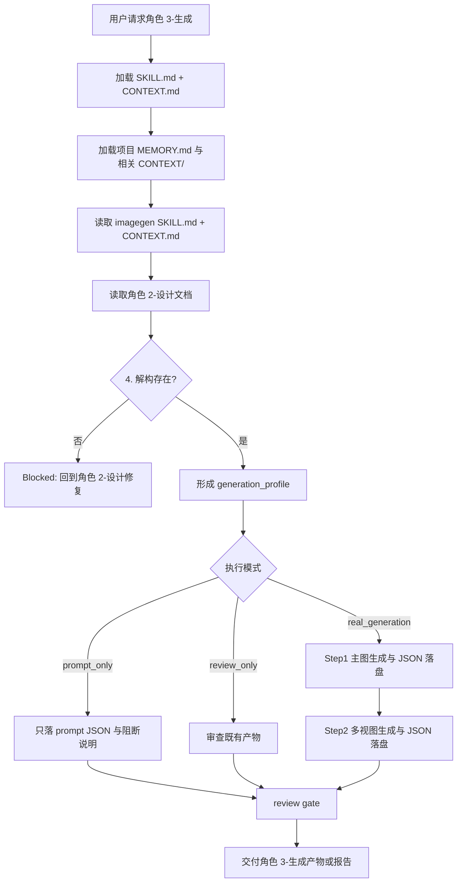
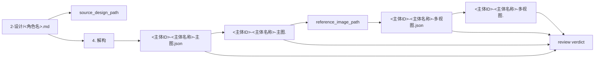
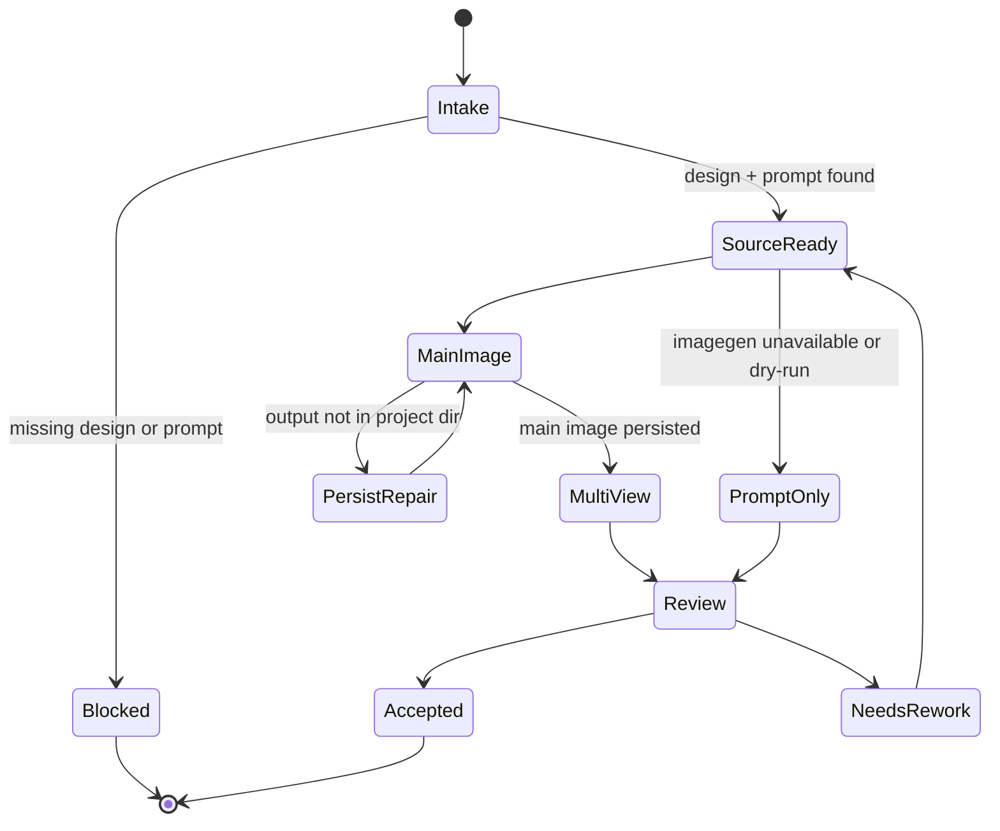

# aigc 6-设计/角色/3-生成

`角色/3-生成` 消费上游 `角色/2-设计` 已完成的单角色细目设计文档，调用 `imagegen` 生成角色主图与多视图主体设计图。它只执行基于设计稿的图像生成与提示词落盘，不重新设计角色主体，不改写上游设计稿，也不承担场景、道具或视频生成职责。

## Executor Lock

- 默认唯一执行器是 `.agents/skills/cli/imagegen/SKILL.md + CONTEXT.md`。
- 除非用户本轮显式点名其他执行器、API、模型或子技能，不得改用 `nano-banana`、`seedream`、AnyFast 子技能、道具/场景多视图子技能或其他图像 API fallback。
- “补全全部生图”“批量生成”“多视图”“参考图生成”“高清”“2K/4K”等措辞本身不构成切换执行器授权；这些需求仍由 `.agents/skills/cli/imagegen` 路由处理。
- 若 `.agents/skills/cli/imagegen` 当前无法真实持久化项目图片，本技能必须降级为 `prompt_only` 不可用说明或等待用户显式指定替代执行器；不得自行选择其他生图技能完成交付。
- 若用户显式要求使用其他执行器，必须在输出报告中记录：用户授权原文、执行器名称、偏离默认 imagegen 路径的原因、生成产物与回滚范围。

## Context Loading Contract

- 每次调用 `$aigc-design-character-generation` 时，必须同时加载同目录 `CONTEXT.md`。
- 每次调用本技能时，必须同时识别并加载同目录 `types/` 中选中的类型包（单选或多选）。
- 若任务绑定 `projects/aigc/<项目名>/`，必须先加载项目根 `MEMORY.md`，再按需加载项目根 `CONTEXT/` 中与角色、视觉风格、禁区和既有生成资产相关的上下文文件。
- 必须读取上游设计文档：`projects/aigc/<项目名>/6-设计/角色/2-设计/<角色名>.md`；本技能只消费相关设计文档，不重新设计主体。
- 生成执行必须加载并遵守 `.agents/skills/cli/imagegen/SKILL.md + CONTEXT.md`；默认按 imagegen 的 built-in route 或其当前合同执行，且不得在未获用户显式授权时切换到其他图像执行器。
- 冲突优先级：用户显式请求 > 根 `AGENTS.md` / meta 规则 > 本 `SKILL.md` > `imagegen/SKILL.md` > `references/` / `steps/` / `types/` / `review/` / `templates/` > `agents/openai.yaml` > 项目 `MEMORY.md` > 项目 `CONTEXT/` > 本 `CONTEXT.md` > `imagegen/CONTEXT.md`。
- 脚本只能做读取、路径创建、JSON schema 检查、文件存在检查、manifest 汇总等机械辅助；不得生成或改写创作提示词正文。

## Advisor/Reviewer Coordination Contract

- 本技能默认使用本地顾问与复核流程；用户点名本技能或父级路由命中本技能时，视为已许可按仓库合同执行顾问与复核流程。
- 推荐路径：主 agent 路由并汇流，按单个角色主体启动 `Worker-角色生成` 子任务；每个 worker 执行 Step1 主图与 Step2 多视图生成，并返回产物路径、JSON prompt 路径、imagegen 模式和 review verdict。
- 顾问与复核流程 不得改写上游 `2-设计` 文档；只能返回本阶段输出目录内的生成产物、prompt JSON 和局部报告。
- 若外部顾问与复核 provider 不可用，直接使用本地顾问与复核流程。
- 若外部顾问与复核 provider 不可用，本技能直接由主 agent 本地串行执行或执行本地 review checklist。

## Input Contract

Accepted input:

- 项目名、项目路径、单个角色名、角色范围，或“角色 3-生成 / 角色生图 / 从角色设计稿生成主图和多视图”等任务。
- 已存在的上游角色设计文档目录：`projects/aigc/<项目名>/6-设计/角色/2-设计/`。
- 用户指定的生成范围、重跑策略、imagegen 执行模式或已有参考图补充。

Required input:

- 可定位、可读取的项目根 `projects/aigc/<项目名>/`。
- 至少一份可读取的上游角色设计文档，且包含 `4. 解构` 区块与可追溯主体 ID；主体 ID 优先读取 `## 4. 解构` 下方的 `主体ID号：<主体ID>`，缺失时从 `C###-<角色名>.md` 文件名前缀派生。
- 可调用的 imagegen 生成能力；如当前环境不能真实生图，只能输出 prompt JSON 与不可用说明，不得伪造图片路径。执行 Step2 多视图前，作为 reference image 的角色主图必须先通过 `view_image` 检视进入对话上下文。

Optional input:

- 单角色目标、批量范围、覆盖/跳过已存在产物策略、期望图片格式、是否需要执行报告。
- 用户额外指定的 imagegen 参数；若与 imagegen 合同冲突，按 imagegen 当前合同追问或降级。
- 用户显式指定的替代执行器、API 或模型；若未显式指定，替代执行器不可被推断启用。

Reject or clarify when:

- 用户要求跳过上游 `2-设计`，直接重新设计角色或凭剧情印象生成角色。
- 用户要求本技能修改角色设计、场景设计、道具设计、分镜或视频提示词真源。
- 待生成角色的设计文档缺少 `4. 解构`，且用户未允许回到 `角色/2-设计` 修复。
- 目标输出会覆盖已有图片或 JSON，且用户未说明覆盖意图。

## Mode Selection

| mode | 触发信号 | 输出 |
| --- | --- | --- |
| `single_character` | 指定单个角色设计文档或角色名 | 一组 `<主体ID>-<主体名称>-主图` 与 `<主体ID>-<主体名称>-多视图` 图片及 JSON |
| `batch_from_designs` | 给定项目且未限制角色 | 为 `2-设计/` 下每份角色设计文档生成主图、多视图与 JSON |
| `prompt_only` | imagegen 不可用、用户要求 dry-run 或只要提示词 | 仅输出主图 JSON、多视图 JSON 与阻断/执行说明 |
| `incremental_fill` | `design-manifest.yaml` 或 `2-设计` 显示存在 `generation_gaps` | 只补缺主图、多视图或 JSON，不覆盖既有资产 |
| `repair_or_regenerate` | 已有产物缺失、命名错误、JSON 不匹配或需要重跑 | 最小范围重生成或修复本阶段产物 |
| `review_only` | 用户只要求检查生成阶段产物 | 审查报告，不改写或重跑产物，除非用户随后要求 |

## Visual Maps

## Reference Loading Guide

| 场景 | 必读文件 |
| --- | --- |
| 任意角色生成任务 | `references/character-generation-contract.md`、`steps/character-generation-workflow.md` |
| 设计稿增量后的生成缺口补齐 | `../../references/incremental-reconciliation-contract.md` |
| 角色范围、重跑策略、prompt-only 分流 | `types/character-generation-type-map.md` |
| 输出验收、imagegen 证据和风险分级 | `review/review-contract.md` |
| 多视图 prompt JSON 模板 | `templates/character-multiview-prompt-template.json` |
| 单体图 prompt JSON 模板 | `templates/character-main-image-prompt-template.json` |
| 脚本辅助边界 | `scripts/README.md` |
| 可复用经验 | `knowledge-base/character-generation-heuristics.md` |
| 产品入口元数据 | `agents/openai.yaml` |

## Execution Contract

1. 读取本 `SKILL.md + CONTEXT.md`，项目任务中加载项目 `MEMORY.md` 与相关项目 `CONTEXT/`。
2. 读取 `.agents/skills/cli/imagegen/SKILL.md + CONTEXT.md`，确认本轮 imagegen 执行路径与保存策略。
   - 默认执行器锁定为 `.agents/skills/cli/imagegen`。
   - 只有用户本轮显式点名替代执行器时，才允许加载和调用其他图像 API skill；否则 imagegen 不可用时进入 `prompt_only`。
3. 读取上游 `角色/2-设计` 目标设计文档和可选 `projects/aigc/<项目名>/6-设计/角色/design-manifest.yaml`，抽取角色名称、设计锚点与 `4. 解构` 内容；不得再把 `提示词设计` 的英文整合 prompt 作为导入给 gpt-image-2 的源文本，不得重写角色设定。
4. 按 `types/character-generation-type-map.md` 形成 `generation_profile`，决定单角色、批量、prompt-only、incremental_fill 或重跑；已有主图、多视图和 JSON 默认跳过，覆盖必须有明确授权。
5. Step1：依据每份设计文档生成单主体图，保存图片与 `<主体ID>-<主体名称>-主图.json`。
6. Step2：套用 `templates/character-multiview-prompt-template.json`，以 Step1 的单主体图为参照图；调用 built-in `image_gen` 前必须先对该主图执行 `view_image`，标注为 `character main image / multiview reference`，使其进入对话上下文后再生成多视图主体设计图，保存图片与 `<主体ID>-<主体名称>-多视图.json`。
7. 所有输出落入 `projects/aigc/<项目名>/6-设计/角色/3-生成/`，按命名合同写入；可更新 `design-manifest.yaml` 的 `generation_assets` 与 `generation_gaps`。
8. 按 `review/review-contract.md` 检查路径、命名、JSON 可回指、设计稿不被重写、imagegen 产物真实存在或 prompt-only 阻断清楚。

## Field Mapping

| field_id | 输出/证据 | 内容要求 | 失败码 |
| --- | --- | --- | --- |
| `FIELD-CHAR-GEN-01` | 上游设计锚点 | 每个 JSON 记录 source_design_path 与角色名称 | `FAIL-CHAR-GEN-01` |
| `FIELD-CHAR-GEN-02` | 主图生成 | `<主体ID>-<主体名称>-主图` 图片存在，prompt 来自设计文档 `4. 解构` | `FAIL-CHAR-GEN-02` |
| `FIELD-CHAR-GEN-03` | 多视图生成 | `<主体ID>-<主体名称>-多视图` 图片存在，reference_image 指向主图，且主图已 `view_image` 进入对话上下文 | `FAIL-CHAR-GEN-03` |
| `FIELD-CHAR-GEN-04` | JSON 落盘 | 主图与多视图 JSON 均存在且可解析 | `FAIL-CHAR-GEN-04` |
| `FIELD-CHAR-GEN-05` | 非设计边界 | 未新增、改写或重解释角色身份、服装、时代和视觉事实 | `FAIL-CHAR-GEN-05` |
| `FIELD-CHAR-GEN-06` | imagegen 合同 | 已遵守 imagegen 的模式、2K 默认和项目持久化规则 | `FAIL-CHAR-GEN-06` |
| `FIELD-CHAR-GEN-07` | 顾问与复核流程 | 默认外部 provider 调度；不可用时有完整本地 checklist 结果 | `FAIL-CHAR-GEN-07` |
| `FIELD-CHAR-GEN-08` | 执行器锁定 | 未获用户显式授权时，只使用 `.agents/skills/cli/imagegen`，不调用 nano-banana / AnyFast / 其他图像 API 子技能 | `FAIL-CHAR-GEN-08` |

## Root-Cause Execution Contract (Mandatory)

出现以下问题时，必须沿链路上溯并修复源层合同：

- 生成提示词脱离或改写 `角色/2-设计` 的 `4. 解构`，或继续引用旧 `提示词设计` 英文整合 prompt 作为主源。
- 多视图模板覆盖了角色身份、服装事实、时代、风格或叙事压力。
- 多视图使用本地主图作为参照但未先 `view_image` 进入对话上下文。
- 本技能试图补写角色设定、场景设定、道具设定或视频提示词。
- 新设计稿追加后没有识别生成缺口，或覆盖了已有主图、多视图或 JSON。
- 图片没有真实生成却被报告为已生成。
- 产物没有落到 `projects/aigc/<项目名>/6-设计/角色/3-生成/`。
- 未获用户显式授权时切换到 nano-banana、AnyFast、seedream 或其他非 `.agents/skills/cli/imagegen` 执行器。
- 默认顾问与复核流程被静默跳过。

必经链路：

`Symptom -> Direct Generation/Prompt Overreach -> 角色/3-生成 Section Owner -> imagegen Contract -> AGENTS.md LLM-first / 顾问与复核流程 / Skill 2.0 Rule`

## Output Contract

### Required output

1. 每个目标角色输出一张单主体图、一张多视图主体设计图。
2. 每张图片同时落一份同名 JSON prompt 文件。
3. JSON 必须记录 `source_design_path`、`source_deconstruction_section`、`imagegen_mode`、`output_image_path`；多视图 JSON 还必须记录 `reference_image_path` 与 `reference_context_status`。
4. 可选更新 `projects/aigc/<项目名>/6-设计/角色/design-manifest.yaml`，记录 `generation_assets` 和剩余 `generation_gaps`；manifest 不替代生成资产真源。

### Output format

| output_id | format |
| --- | --- |
| `OUTPUT-CHARACTER-MAIN-IMAGE` | PNG/JPEG/WebP 等 imagegen 产物，默认按 imagegen 2K 目标 |
| `OUTPUT-CHARACTER-MAIN-PROMPT` | JSON prompt 文件，使用 `templates/character-main-image-prompt-template.json` |
| `OUTPUT-CHARACTER-MULTIVIEW-IMAGE` | PNG/JPEG/WebP 等 imagegen 产物，默认按 imagegen 2K 目标 |
| `OUTPUT-CHARACTER-MULTIVIEW-PROMPT` | JSON prompt 文件，使用 `templates/character-multiview-prompt-template.json` |
| `OUTPUT-CHARACTER-GENERATION-REPORT` | Markdown 执行或审查报告，可选 |

### Output path

| output_id | canonical path |
| --- | --- |
| `OUTPUT-CHARACTER-*` | `projects/aigc/<项目名>/6-设计/角色/3-生成/` |
| `OUTPUT-CHARACTER-GENERATION-REPORT` | `projects/aigc/<项目名>/6-设计/角色/3-生成/执行报告.md` |
| `OUTPUT-CHARACTER-MANIFEST` | `projects/aigc/<项目名>/6-设计/角色/design-manifest.yaml` |

### Naming convention

- `<主体ID>` 优先使用上游设计文档 `## 4. 解构` 下方的 `主体ID号：<主体ID>`；若缺失，使用上游设计文件名前缀 `C###`，并在 JSON 中记录派生来源。
- 单体图：`<主体ID>-<主体名称>-主图.<ext>`。
- 单体图 JSON：`<主体ID>-<主体名称>-主图.json`。
- 多视图：`<主体ID>-<主体名称>-多视图.<ext>`。
- 多视图 JSON：`<主体ID>-<主体名称>-多视图.json`。
- 若主体名称包含路径分隔符、控制字符或与现有产物冲突，使用安全名并在 JSON 中保留 `subject_id`、`subject_id_source` 与 `subject_name_original`。
- 增量补缺默认跳过已有完整资产，只生成缺失的主图、多视图或 JSON。

### Completion gate

- 已读取本 `SKILL.md + CONTEXT.md`、目标设计文档和 imagegen `SKILL.md + CONTEXT.md`。
- 每个目标角色都有记录 `subject_id` 的主图 JSON、多视图 JSON；真实生图模式下对应图片存在于项目输出目录。
- 主图 prompt 来自设计文档 `4. 解构`；多视图模板只组织画面，不改写主体设计，也不回退引用旧英文整合 prompt。
- 多视图生成以对应主图作为参照图；真实生成模式下，该本地主图已先通过 `view_image` 检视进入对话上下文，并记录 `reference_context_status: visible_in_conversation_context`。
- 已识别并跳过既有完整资产；仅补齐缺主图、缺多视图、缺 JSON 或用户明确指定 repair 的主体。
- 已执行 `review/review-contract.md` 的人工审查或等价机械校验。
- 顾问与复核流程 默认路径已外部执行；若不可用，已使用本地流程报告。
