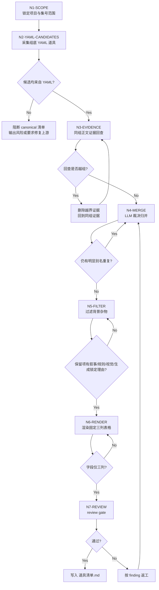
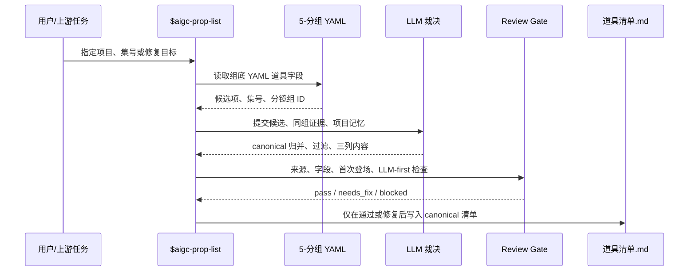

# Prop List Workflow

## Node Map

| node_id | input | judgment | action | output | gate |
| --- | --- | --- | --- | --- | --- |
| `N1-SCOPE` | 项目路径、集号范围 | 是否能定位 `5-分组/第N集.md` | 建立输入 manifest | `source_manifest` | 输入文件可读 |
| `N2-YAML-CANDIDATES` | 分镜组文本 | 是否存在组底 YAML `道具` | 采集候选项、集号、组 ID | `prop_candidates` | 候选均来自 YAML |
| `N3-EVIDENCE` | 候选项与同组正文 | 是否需要回查正文 | 摘取关键词证据 | `evidence_notes` | 回查不越组 |
| `N4-MERGE` | 候选项与证据 | 是否同一叙事道具 | LLM 裁决归并与 canonical 名称 | `merged_props` | 无重复别名项 |
| `N5-FILTER` | `merged_props` | 是否叙事/规则/视觉/生成锁定物 | 过滤背景杂物 | `accepted_props` | 保留项有理由 |
| `N6-RENDER` | `accepted_props` | 三列字段是否齐备 | 渲染 Markdown table | `道具清单.md` | 表格三列固定 |
| `N7-REVIEW` | 清单与来源 | 是否通过 review gate | 人工 review 或机械格式检查 | `review_result` | 问题已修复或报告 |

## Workflow Topology

## Evidence Rules

- `首次登场` 取同一道具最早出现的分镜组。
- `原文描述（关键词式）` 来源优先级：YAML 原词 > 同组正文可见词 > 同组动作关系词。
- 回查正文只用于证据，不用于绕过 YAML 新增候选。

## Fallback

若 YAML `道具` 字段缺失或格式异常，停止生成 canonical 清单，输出风险报告或要求先修复 `5-分组`。
