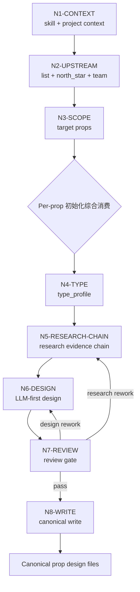

# Prop Design Thinking-Action Workflow

本文件定义 `道具/2-设计` 的思行一体节点。主拓扑为 `串行取证 -> 类型分流 -> 单道具设计 -> 并行审查 -> 汇流落盘`。

## Business Requirement Analysis

| slot | answer |
| --- | --- |
| `business_goal` | 将上游道具清单扩展为可生成、可审美复核、可回指来源的单道具细目设计 |
| `business_object` | `道具清单.md` 中的单个道具主体 |
| `constraint_profile` | 上游清单、north_star、team 初始化综合上下文、研究证据链、LLM-first、`## 4. 解构` 下 `主体ID号：<主体ID>`、prompt 以同一主体 ID 号开头、prompt 1300 characters、整合 `## 4. 解构` 全部有效信息、自然语言负向约束、不得使用 `--no`、输出路径边界、纯色背景 45 度单道具完整全貌展示、完整展示道具全貌、完整轮廓和主要结构、仅展示道具、无局部特写/裁切特写/半截道具、无人物与背景元素 |
| `success_criteria` | 每个文件能指导后续图像生成和美术锁定，且不改写上游事实 |
| `non_goals` | 不生成图像，不改 registry，不重做清单，不写角色/场景设计 |
| `complexity_source` | 类型分流、初始化综合上下文转译、冷门考据、研究到 prompt 的证据链、初始化综合消费汇流 |
| `topology_fit` | Hybrid：前段串行取证，中段可按道具并行，后段统一 review gate |

## Node Network

| node_id | objective | inputs | actions | evidence | route_out | gate |
| --- | --- | --- | --- | --- | --- | --- |
| `N1-CONTEXT` | 锁定技能与项目上下文 | `SKILL.md`、`CONTEXT.md`、项目 `MEMORY.md`、项目 `CONTEXT/` | 读取强制合同和项目长期偏好 | context manifest | `N2-UPSTREAM` | 必要上下文缺失已标注 |
| `N2-UPSTREAM` | 锁定上游清单与初始化综合来源 | `1-清单/道具清单.md`、`north_star.yaml`、`team.yaml.init_synthesis` | 读取清单项、全局风格、设计相关初始化约束、启发和风险 | upstream manifest | `N3-SCOPE` | 清单存在且目标道具可定位 |
| `N3-SCOPE` | 选择本轮处理主体 | 用户指定项或清单全量 | 只调度命中道具，生成主体 ID 前缀和安全文件名 | prop worklist | `N4-TYPE` | 未调度项不补占位 |
| `N4-TYPE` | 形成 `type_profile` | 单道具清单项、上下文 | 按 `types/prop-design-type-map.md` 判型 | type profile | `N5-RESEARCH-CHAIN` | 类型不确定时采用最保守通用路线 |
| `N5-RESEARCH-CHAIN` | 把研究推进为可见设计证据链 | 清单项、north_star、team 初始化综合、type profile、可选来源、`init_team_synthesis_context` | 由 LLM 判断来源、置信度、不确定性，并转译为形制、材料、工艺、年代、使用痕迹、功能逻辑、prompt token；初始化综合采纳内容必须绑定当前节点，不得退化为固定字段问卷 | research evidence chain、init synthesis node notes | `N6-DESIGN` | 每条关键研究都服务至少一个设计或 prompt 决策 |
| `N6-DESIGN` | 完成单道具 LLM-first 设计 | 清单项、north_star、team 初始化综合、type profile、research evidence chain、`references/design-output-contract.md`、init synthesis node notes | 写物语、`## 4. 解构` 下的 `主体ID号：<主体ID>`、Photography、Prop Design、prompt evidence chain、英文 prompt；prompt 必须整合 `## 4. 解构` 全部有效信息并补 `deconstruction_coverage` | design draft | `N7-REVIEW` | 必填章节齐全，输出合同硬规则已逐条满足，prompt 英文、以同一主体 ID 号开头且 1300 characters 内，使用自然语言负向约束且不含 `--no`，并包含 full-view prop shot、full prop in view、entire prop fully visible、uncropped full silhouette、prop only、no people、no background elements |
| `N7-REVIEW` | 执行质量门禁和初始化综合消费汇流 | design draft、review contract、`references/design-slot-review-contract.md`、`references/workflow-supervision-contract.md` | reviewer provider 或本地 review 检查来源、研究转译、字段、路径、prompt；解析 `PROP-BUNDLE-01` 并记录缺槽或通过结论；检查 `init_synthesis_node_coverage` | review verdict、slot bundle review、workflow supervision record | `N8-WRITE` 或 `N5-RESEARCH-CHAIN` / `N6-DESIGN` | verdict 非阻断，slot bundle 无缺槽，supervision 记录非空且初始化综合采纳内容绑定节点 |
| `N8-WRITE` | canonical 落盘 | 通过审查的 design draft | 写入 `6-设计/道具/2-设计/<主体ID>-<安全文件名>.md` | output file | done | 文件路径和主体 ID 前缀正确，未触碰授权范围外文件 |

## Branch And Merge Rules

- `N1-CONTEXT -> N2-UPSTREAM -> N3-SCOPE` 必须串行，不能并行绕过。
- `N3-SCOPE` 之后可以按道具主体并行分发给多个 `Worker-Prop` 初始化综合消费。
- 每个 `Worker-Prop` 只返回自己负责的单道具文件 patch。
- `N7-REVIEW` 汇流时只聚合已调度主体；未调度主体不得补空文件或默认占位；每个已调度主体必须按 `PROP-BUNDLE-01` 形成 slot bundle review、workflow supervision record 和 `init_synthesis_node_coverage`。
- 任一 worker 需要新增输出字段时，必须先回改根 `SKILL.md` 和 `templates/output-template.md`，否则不得写入 canonical 文件。
- 研究链分歧时优先保守：确定事实进入 `design lock`，推断和灵感进入 `inspired_by`，无法验证的内容进入 `risk_uncertainty`，不得直接进入确定性 prompt token。

## Mermaid Topology

## Research Chain Node Detail

`N5-RESEARCH-CHAIN` 必须按以下顺序思考和落盘：

1. 从上游清单复述最小事实，不新增清单外主体。
2. 判断道具需要 `low` / `medium` / `high` 研究强度；仅在 `high` 或事实不稳时使用网络搜索。
3. 将研究分成 `source_fact`、`inference`、`inspired_by`、`unknown`，并标注 `confirmed` / `probable` / `inferred` / `uncertain`。
4. 把研究转译到形制、材料、工艺、年代、使用痕迹、功能逻辑和风险/不确定性。
5. 为后续 prompt 预留短 token，必须保留 `## 4. 解构` 下的主体 ID 号并用同一 ID 作为英文 prompt 开头，同时保留 full-view prop shot、full prop in view、entire prop fully visible、uncropped full silhouette、prop only、no people、no background elements，不把局部特写、裁切特写、半截道具、人物、手持、桌面、室内、街景、背景元素或剧情场景写进 token。
6. 将 `design lock` 与 `allow_variation` 分开，避免生成阶段丢失核心识别点或过度僵硬。

## Failure Routes

| failure | rework target |
| --- | --- |
| 上游清单缺失 | 回到 `道具/1-清单` 或请求用户提供清单 |
| `north_star.yaml` / `team.yaml.init_synthesis` 缺失 | 标注缺口，降级为基于清单与项目记忆的草案 |
| 研究无法转译为可见设计 | 回到 `N5-RESEARCH-CHAIN` 删除百科噪声并补形制/材料/工艺/年代/使用痕迹/功能逻辑 |
| prompt token 无证据来源 | 回到 `N5-RESEARCH-CHAIN` 或 `N6-DESIGN` 补 prompt evidence chain |
| slot bundle 未解析或缺 required slot | 回到 `N7-REVIEW` 按 `design-slot-review-contract.md` 生成缺槽 finding，再回到对应研究或设计节点 |
| prompt 超长 | 回到 `N6-DESIGN` 压缩提示词 |
| 字段缺失 | 回到 `templates/output-template.md` 补齐对应章节 |
| 写入越界 | 停止并只保留目标目录内 patch |
