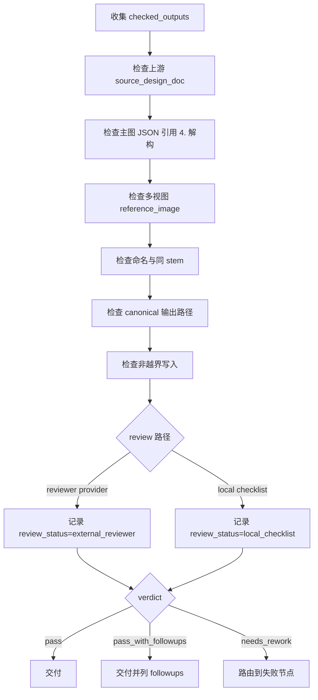

# Review Contract

本文件定义 `道具/3-生成` 的验收门禁。review 不拥有业务主真源改写权；修复建议必须回流到 `SKILL.md`、`references/`、`steps/` 或对应模板。

## Default Provider

- 默认辅助 provider：外部 reviewer provider。
- 仓库层合同允许 `$aigc-prop-generation` 命中时启用 worker/reviewer provider 路径。
- 若当前运行环境不使用外部 provider，主 agent 直接执行本地 review checklist。
- 本地 checklist 只记录 review verdict、finding 和必要修复项。

## Review Gates

| review_gate | requirement | fail code | rework target |
| --- | --- | --- | --- |
| `REV-PROP-GEN-01` | 每个目标道具都有 canonical 上游 `2-设计` 文档、可用 `4. 解构`、可追溯 `subject_id` 与处理范围证据 | `FAIL-PROP-GEN-SOURCE` | `N1-INTAKE` |
| `REV-PROP-GEN-02` | 主图 prompt / JSON 忠实消费上游 `4. 解构`，未重新设计主体，未回退旧英文整合 prompt | `FAIL-PROP-GEN-PROMPT-DRIFT` | `N3-MAIN-PROMPT` |
| `REV-PROP-GEN-03` | 多视图 JSON 和图片使用对应主图作为参照，保持同一道具主体，不跨主体复用或混合多个道具 | `FAIL-PROP-GEN-REFERENCE` | `N5-MULTIVIEW-PROMPT` |
| `REV-PROP-GEN-04` | 图像与 JSON 同 stem，文件名包含主体 ID，并包含 `-主图` 或 `-多视图` | `FAIL-PROP-GEN-NAMING` | `N7-REVIEW` |
| `REV-PROP-GEN-05` | 项目资产、JSON 证据链和持久化路径完整，所有最终输出位于项目 `6-设计/道具/3-生成/` | `FAIL-PROP-GEN-PERSISTENCE` | `N4-MAIN-IMAGE` |
| `REV-PROP-GEN-06` | 未修改 `2-设计`、父级 registry / routes / runbook、角色/场景生成目录或其他 worker 文件 | `FAIL-PROP-GEN-WRITE-BOUNDARY` | `N7-REVIEW` |
| `REV-PROP-GEN-07` | 真实生成模式下，多视图参照主图已通过 `view_image` 进入对话上下文，并记录 `reference_context_status` | `FAIL-PROP-GEN-REFERENCE-CONTEXT` | `N5-MULTIVIEW-PROMPT` |
| `REV-PROP-GEN-08` | 未获用户显式授权时只通过 `.agents/skills/cli/imagegen` 默认入口执行，不漂移到其他 provider / API / model | `FAIL-PROP-GEN-EXECUTOR-DRIFT` | `N2-TYPE` |
| `REV-PROP-GEN-09` | `prompt_only` 模式没有伪造图片生成事实，阻断原因、planned path 与 `pending_view_image` 状态清楚 | `FAIL-PROP-GEN-PROMPT-ONLY-CLAIM` | `N7-REVIEW` |
| `REV-PROP-GEN-10` | 真实生成模式下，多视图图片和同名 JSON 已产出，且套用道具多视图模板保持同一主体 | `FAIL-PROP-GEN-MULTIVIEW` | `N6-MULTIVIEW-IMAGE` |
| `REV-PROP-GEN-11` | 主图与多视图 JSON 都有来源、主体 ID、输出路径、参考图和可复跑证据链 | `FAIL-PROP-GEN-JSON` | `N3-MAIN-PROMPT` |

## Review Checklist

| check_id | gate | pass condition | fail route |
| --- | --- | --- | --- |
| `REV-PROP-GEN-01` | 上游取证 | 每组资产回指一个 `2-设计` Markdown | `references/prop-generation-contract.md` |
| `REV-PROP-GEN-02` | 主图忠实度 | 主图 JSON 直接引用设计文档 `4. 解构`，未重新设计主体，未回退引用旧英文整合 prompt | `templates/single-subject-prompt.json` |
| `REV-PROP-GEN-03` | 多视图参照 | 多视图 JSON 使用对应 `主体ID-主体名称-主图` 作为 `reference_image`，真实生成模式下该主图已 `view_image` 进入对话上下文 | `templates/prop-multiview-prompt.json` |
| `REV-PROP-GEN-04` | 命名 | 图像与 JSON 同 stem，文件名包含主体 ID，且包含 `-主图` 或 `-多视图` | `SKILL.md Output Contract` |
| `REV-PROP-GEN-05` | 路径 | 所有项目资产落入 `projects/aigc/<项目名>/6-设计/道具/3-生成/` | `$imagegen` persistence gate |
| `REV-PROP-GEN-06` | 非越界 | 未修改 `2-设计`、父级 registry、角色/场景生成目录或其他 worker 文件 | 根写入边界 |
| `REV-PROP-GEN-07` | 参照上下文 | 多视图 JSON / 报告记录 `reference_context_status: visible_in_conversation_context`；prompt-only 可为 `pending_view_image` | `steps/prop-generation-workflow.md` |
| `REV-PROP-GEN-08` | 执行入口 | 未获用户显式授权时只通过 `.agents/skills/cli/imagegen` 默认入口执行 | `steps/prop-generation-workflow.md` |
| `REV-PROP-GEN-09` | prompt-only 声明 | prompt-only 模式只落盘 JSON / planned path，不声称图片已生成 | `steps/prop-generation-workflow.md` |
| `REV-PROP-GEN-10` | 多视图产物 | 真实生成模式下多视图图片和同名 JSON 存在，且保持同一道具主体 | `templates/prop-multiview-prompt.json` |
| `REV-PROP-GEN-11` | JSON 证据链 | 主图与多视图 JSON 均记录来源、主体 ID、输出路径、参考图和可复跑证据 | `templates/single-subject-prompt.json` / `templates/prop-multiview-prompt.json` |

## Review Flow



## Verdict Schema

```yaml
verdict: pass | pass_with_followups | needs_rework | blocked
reviewer: ""
review_status: external_reviewer | local_checklist | not_requested
checked_outputs:
  - subject: ""
    subject_id: ""
    main_image: ""
    main_prompt_json: ""
    multiview_image: ""
    multiview_prompt_json: ""
    reference_context_status: ""
findings: []
next_action: ""
```

## Provider Rule

- 默认优先使用外部 reviewer provider。
- 若工具不可用外部顾问与复核 provider 调度，主 agent 直接执行本地 review checklist。
- 本地 review checklist 只记录 verdict、finding、修复动作和 residual risk。
