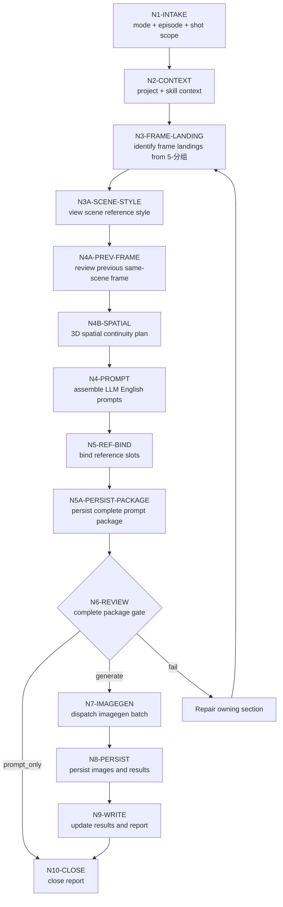

# Frame Image Workflow

本文件承载 `A-分镜画面` 的思行一体化节点。业务拓扑是先为指定范围完整锁源、组装 prompt、绑定参照并落盘 prompts 文档，再按 `shot_id` 严格串行逐镜生成，最后统一汇流审查。

## Mermaid Workflow

## Thinking-Action Nodes

| node_id | objective | inputs | actions | evidence | route_out | gate |
| --- | --- | --- | --- | --- | --- | --- |
| `N1-INTAKE` | 锁定任务目标、mode、集号和分镜范围 | 用户请求、目标项目 | 判定 `prompt_only` / `single_shot_generate` / `episode_batch_generate` / `shot_batch_generate` / `repair` / `review_only` | mode note | `N2` | 目标范围明确 |
| `N2-CONTEXT` | 加载项目与技能上下文 | `SKILL.md`、`CONTEXT.md`、`MEMORY.md`、`north_star.yaml` | 读取三项 north_star 字段和相关项目上下文 | input manifest | `N3` | 必需文件可读 |
| `N3-SHOT-INDEX` | 从 `5-分组` 判断 frame landing 并建立四段式分镜帧索引 | `第N集.md` | 解析 `## x-y-z`、上游 `分镜N` / 画面字段 / 分镜明细，判断开场构图、动作决定瞬间、反应帧、道具插入、环境压力或群像调度等 frame landing，提取桥段、角色、场景、道具 | `shot-index.json` | `N3A` | 每个 ID 唯一，并可回指源组、`source_camera_units`、`frame_landing_type` 与 `frame_landing_reason` |
| `N3A-SCENE-STYLE` | 用场景参照图锁定画面风格、光影、色调和氛围 | shot index、`6-设计/场景/3-生成`、north_star | 按场景名预绑定场景参照图；若本地图存在则先 `view_image`，提炼光源方向、光比、色温、主色/辅色、暗部密度、高光形态、雾气/湿度、材质和整体氛围；写入固定提示词“画面风格，光影，色调和氛围与场景参照图保持一致。” | scene visual style lock note | `N4A` | `scene_visual_style_lock_status` 为 `visible_in_conversation_context` 或缺失原因明确 |
| `N4A-PREV-FRAME` | 回看同场景上一生成图 | shot index、已有 `imagegen-results.json`、`images/<上一分镜ID>.*` | 判断上一分镜是否同场景；同场景且本地图存在时用 `view_image` 检视上一画面，提炼站位、走位、朝向、遮挡、关键道具相对位置和镜头轴线；无上一图或不同场景时记录原因 | previous frame context note | `N4B` | 同场景上一图已可见，或缺失原因明确 |
| `N4B-SPATIAL` | 建立三维空间连续性规划 | shot index、previous frame context、场景参照、分镜桥段 | 按 `references/spatial-continuity-contract.md` 执行单镜锚点投影与固定锚点锁定：先从当前四段式分镜帧的 frame landing 真相抽取候选锚点，再筛选主锚点和辅助锚点，定义 `x/y/z` 三轴，匹配锚定模式库，建立 `space_model`；定位角色起点/终点/移动轨迹、身体朝向、视线、遮挡、道具相对位置；正反打需说明相对背景面、对话轴线和视线闭合；蒙太奇/插入/转场/道具特写不得直接继承分组主场景锚点 | spatial continuity plan + shot anchor projection note | `N4` | 主锚点和辅助锚点明确且匹配当前单帧内容；3D 方位、移动路径、正反打轴线和锚定模式自洽 |
| `N4-PROMPT` | 生成完整目标范围的英文单帧 prompt | shot index、north_star、scene visual style lock、previous frame context、spatial continuity plan | LLM 直接为指定范围内每个目标 frame landing 生成自然英文 prompt，并填充模板；必须消费场景参照图视觉风格锁，同场景非首镜必须消费上一画面观察或缺失原因和 3D 空间规划，保持空间站位、走位、轴线和正反打逻辑一致 | prompt markdown draft | `N5` | 目标范围无缺口；每条 prompt <= 800 English words，且 frame landing truth / anchors / spatial blocking / camera / scene style lock / materials / avoid 进入英文 prompt 本体 |
| `N5-REF-BIND` | 保守绑定主体参照 | prompt package、6-设计生成目录 | 多视图优先、主图次之、缺图留空；为每个已绑定本地图记录 `context_role` | reference manifest draft | `N5A` | 无猜测路径 |
| `N5A-PERSIST-PACKAGE` | 前置落盘完整 prompts 文档和执行计划 | prompt draft、reference manifest draft、shot index | 写入 `第N集-分镜画面-prompts.md`、`第N集-reference-manifest.json`、`第N集-imagegen-plan.json`；plan 逐镜引用已落盘 prompt block，记录 `prompt_package_status: complete_before_imagegen` | prompt markdown + manifest + plan | `N6` | prompts 文档覆盖全部目标 `shot_id`，且 imagegen 尚未开始 |
| `N6-REVIEW` | 执行生成前审查完整 prompt package | prompt、manifest、plan | 检查 ID、直引、固定场景参照图提示词、场景视觉风格锁、词数、完整 prompt 设计体系、同场景上一画面回看记录、三维空间规划、正反打轴线、路径、mode、目标范围完整性；生成模式下逐张 `view_image` 已绑定本地参照图并记录上下文状态 | review note | `N7` / `N10` / repair | 必需项通过，完整 prompts 文档先于 imagegen，场景视觉风格锁、上一画面、3D 空间规划与参照图状态合规 |
| `N7-IMAGEGEN` | 串行调用 imagegen | 已落盘 prompt package、imagegen plan | 每镜独立任务，消费已落盘 prompt block 和已进入上下文的参照图，按 `shot_id` 严格串行逐镜执行；当前镜完成生成、持久化和结果记录后才允许进入下一镜；禁止在此阶段补写后续 prompt、并发、后台并行、分片并跑或更高吞吐绕过顺序 | plan/result json | `N8` | 不覆盖、不越权、不并发、不现场补 prompt |
| `N8-PERSIST` | 持久化生成图像 | generated assets | 保存到项目目录，记录源路径 | images + results | `N9` | 项目内路径存在 |
| `N9-WRITE` | 写生成结果工件 | prompt、manifest、result | 更新 result、report；不得改写后续未执行分镜的 prompt 正文 | file list | `N10` | 文件命名正确，prompt package 保持可追溯 |
| `N10-CLOSE` | 汇流交付 | 所有证据 | 总结 generated / skipped / failed 与返工入口 | 执行报告 | done | review verdict `pass` 或 `pass_with_todo` |

## Parallel Boundary

- `N1-N6` 是完整 prompt package 前置门禁，不应并发绕过。
- `N3A-SCENE-STYLE` 必须在 `N4-PROMPT` 之前完成；不能先写 prompt 再回填“参考场景风格一致”。
- `N5A` 必须在任何 imagegen 调用之前完成；批量生成不得一边生图一边补写同一范围的后续 prompt。
- `N7` 必须按 `shot_id` 顺序严格串行执行；每个任务只能写自己的图片和结果记录。
- `N7` 不允许并发、后台并行、分片并跑或更高吞吐执行方式，即使工具能力支持也不得启用。
- `N9-N10` 必须统一汇流，避免多个任务同时改写同一个报告文件；如需补充 runtime 上一画面回看状态，应写入 result/report，不得覆盖已审核 prompt 正文。

## N4B Anchor Lock Detail

`N4B-SPATIAL` 是 prompt 生成前的空间推理节点，不是可选备注。它必须输出可被 `N4-PROMPT` 消费的 `Spatial Continuity Plan`。

### Action Sequence

1. **当前单镜真相锁定**：先锁定当前四段式分镜对应的 `分镜N`、直接画面字段、分镜明细和必要入场/出场桥段；不得用整组三段式场景替代当前单镜画面。
2. **单镜候选锚点扫描**：从当前单镜文本、上一生成图和场景参照中列出门、窗、桌椅阵列、讲台、楼梯口、走廊拐角、柱子、柜台、车辆、墙面标记、地面边线、飞檐、城门、桅杆、船帆、海图朱线、纸边、刀尖、布纹、油绢、铜镜边、酒葫芦、港口木栈等候选锚点；默认忽略相邻组间连接件，不把连接件作为本镜锚点来源。
3. **主锚点筛选**：选择稳定不移动、当前画面可见或强约束、能定义构图/动作方向的主锚点；再选至少两个辅助锚点用于深度、遮挡和背景面校验。若分组主场景锚点不在当前单镜画面中支配构图，不得选为主锚点。
4. **三轴定义**：用锚点定义 `x_axis`、`y_axis`、`z_axis`，避免直接使用会随机位反转的屏幕左右。
5. **桥段模式匹配**：判断是否属于追逐/逃跑、进门/出门、多人围站/对峙、绕物移动、上下楼、过肩/主观视角、遮挡出现、道具交接、群体队列、同场景换机位、环绕镜头、分层窥视、坐下/起身、抛掷/坠落、车辆/电梯移动、蒙太奇插入、转场匹配、道具微距、路线图或环境建立等锚定模式。
6. **角色和道具投影**：把每个角色和关键道具写成相对锚点的位置，包含起点、路径、终点、朝向、视线目标、前/中/后景和遮挡关系。
7. **镜头轴线锁定**：为对话、追逐、对峙、交接、反打、过肩、主观视角、换机位、蒙太奇插入、道具特写或转场端点定义 line of action、screen direction、camera side 和可见背景面。
8. **漂移检查**：检查角色是否瞬移、移动路径是否穿越不可穿越锚点、视线是否闭合、道具是否跳位、背景面变化是否由机位解释、遮挡层级是否合理、`primary_anchor` 是否真的匹配当前单镜源真相。

### Required Evidence

`spatial continuity plan + anchor lock note` 至少包含：

- `candidate_anchors`
- `shot_anchor_projection_status`
- `source_frame_anchor_evidence`
- `primary_anchor`
- `supporting_anchors`
- `axis_definition`
- `anchor_pattern`
- `character_positions`
- `movement_paths`
- `camera_axis`
- `background_plane_logic`
- `drift_check`
