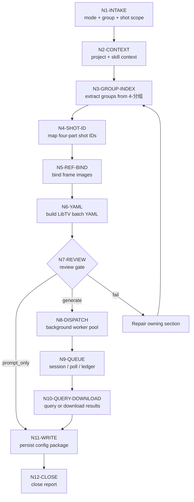
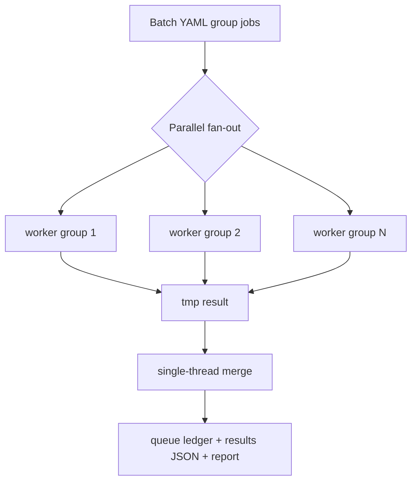

# Frame Reference Video Workflow

本文件承载 `A-分镜画面参照` 的思行一体化节点。拓扑是前段串行锁源、映射四段式 ID 与生成 YAML，中段按分镜组后台并发提交 LibTV，后段统一汇流 queue、结果和报告。

## Mermaid Workflow

## Thinking-Action Nodes

| node_id | objective | inputs | actions | evidence | route_out | gate |
| --- | --- | --- | --- | --- | --- | --- |
| `N1-INTAKE` | 锁定任务目标、mode、集号、分镜组范围和分镜范围 | 用户请求、目标项目 | 判定 `prompt_only` / `single_group_generate` / `episode_batch_generate` / `group_batch_generate` / `shot_batch_generate` / `query_or_download` / `repair` / `review_only` | mode note | `N2` | 目标范围明确 |
| `N2-CONTEXT` | 加载项目与技能上下文 | `SKILL.md`、`CONTEXT.md`、`MEMORY.md`、项目 `CONTEXT/` | 读取项目偏好与视频阶段上下文 | input manifest | `N3` | 必需文件可读 |
| `N3-GROUP-INDEX` | 从 `4-分组` 建立组级索引 | `第N集.md` | 解析 `## x-y-z`、完整组正文、组边界和 `时长估算` | `group-shot-index.json` | `N4` | 每个组 ID 唯一可回指，时长估算可追溯 |
| `N4-SHOT-ID` | 建立四段式镜级索引 | group index、组内 `分镜N` / 已有 `分镜ID` | 映射 `shot_id`，记录源标签和顺序 | `group-shot-index.json` | `N5` | 每个 `shot_id` 唯一可回指 |
| `N5-REF-BIND` | 保守绑定对应分镜画面图 | shot index、`6-图像/A-分镜画面` | 按 `shot_id` 查真实图片；无图移除空槽位 | reference manifest | `N6` | 无猜测路径 |
| `N6-YAML` | 生成 LibTV batch YAML | prompt package、reference manifest | 投影 command_type、prompt、reference_images、`duration_hint=clamp(duration_estimate_seconds, 4, 15)`、output path、poll、`prompt_fidelity_mode` | batch YAML | `N7` | YAML 可投影为 $libTV 脚本调用，默认 `allow_libtv_prompt_optimization=false` |
| `N7-REVIEW` | 执行提交前审查 | prompt、manifest、YAML | 检查 ID、正文完整性、路径、LibTV 脚本投影、mode、prompt fidelity opt-in | review note | `N8` / `N11` / repair | 必需项通过；未 opt-in 时禁止远端优化 |
| `N8-DISPATCH` | 后台多线程提交 | LibTV batch YAML | 运行 `LIBTV_ACCESS_KEY credential check`；逐组上传后先建立 `generation_slots`，执行 `scripts/build-upload-ledger.py <package_dir> --sync` 将槽位注册表投影回 manifest、batch/plan、final YAML 和远端 `imageList`，再建立 worker pool 逐组提交 | tmp result、queue row、slot ledger | `N9` | 保留 sessionId，图N与分镜ID/URL同槽一致 |
| `N9-QUEUE` | 维护异步队列 | submit outputs | 写 `第N集-libtv-queue.md`、results JSON 初稿 | queue ledger | `N10` | 每组状态明确 |
| `N10-QUERY-DOWNLOAD` | 查询或下载已完成任务 | queue ledger、sessionId | `query_session`、自动下载到 `第N集/`、处理下载超时 | local videos、results JSON | `N11` | 本地状态真实 |
| `N11-WRITE` | 写业务工件 | prompt、manifest、YAML、queue、result | 写 prompt 文档、manifest、batch、queue、report | file list | `N12` | 文件命名正确 |
| `N12-CLOSE` | 汇流交付 | 所有证据 | 总结 submitted / querying / downloaded / failed / skipped 与返工入口 | 执行报告 | done | review verdict `pass` 或 `pass_with_todo` |

## Branch Rules

- `prompt_only`：执行 `N1 -> N2 -> N3 -> N4 -> N5 -> N6 -> N7 -> N11 -> N12`。
- `single_group_generate`：只对目标 `group_id` 执行 `N1 -> N12`。
- `episode_batch_generate`：对该集所有组执行，`N8` 默认并发，`N11/N12` 统一汇流。
- `group_batch_generate`：只对目标组集合执行，不补未调度组空字段。
- `shot_batch_generate`：先把四段式 `shot_id` 回推到所属组，再只调度命中组；未命中镜头记录在 report。
- `query_or_download`：可从 `N9/N10` 进入，但必须先读取已有 queue ledger 与 results JSON。
- `repair`：按 fail code 回到 owning section，不全量重跑无关组。

## Parallel Boundary

- `N1-N7` 是串行门禁，不应并发绕过。
- `N8-N10` 可以按 group job 并发，但每个 worker 只能写自己的临时结果和安全追加 queue row。
- `N11-N12` 必须统一汇流，避免多个任务同时改写同一个报告文件。
- 并发失败时，保留已提交组的 `sessionId`，仅返工失败组。
