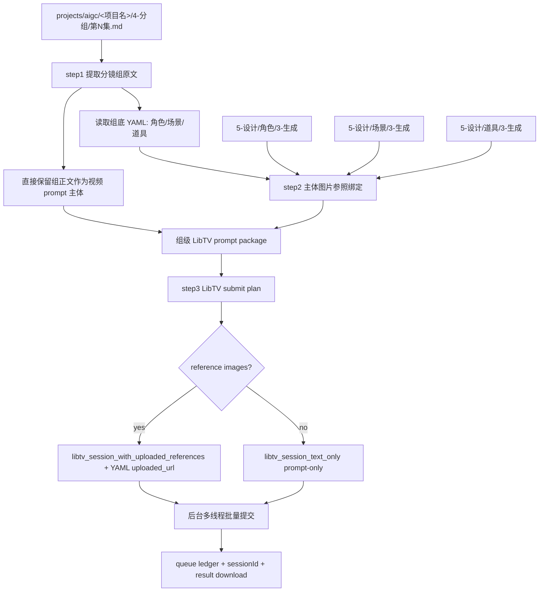
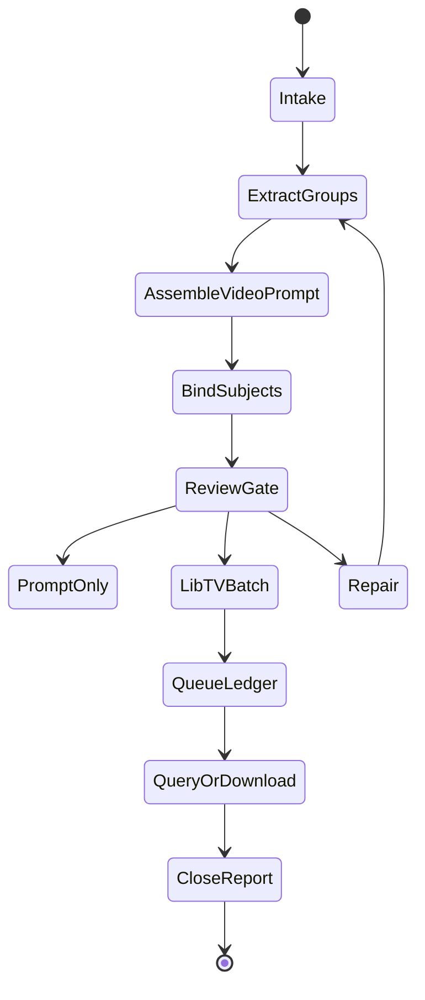

# aigc 7-视频 / C-主体参照

`C-主体参照` 负责把 `projects/aigc/<项目名>/4-分组/` 中的每个分镜组转为一条组级 LibTV 视频生成任务：直接使用现有分镜组内容作为生视频提示词主体，按组底 YAML 绑定角色、场景、道具图片参照，并调用 `.agents/skills/cli/libTV` 以分镜组为单位批量提交视频任务。

## Context Loading Contract

- 每次调用本技能时，必须同时加载同目录 `CONTEXT.md`。
- 每次调用本技能时，必须同时识别并加载同目录 `types/` 中选中的类型包（单选或多选）。
- 若任务绑定 `projects/aigc/<项目名>/`，必须先加载项目根 `MEMORY.md`，再加载 `projects/aigc/<项目名>/0-初始化/north_star.yaml` 与项目根 `CONTEXT/` 中和视频阶段、主体资产、生成偏好相关的上下文。
- `4-分组` 是本技能的主要信息来源；不得回到 `3-摄影`、`3-Detail` 或更早阶段重写分镜组内容，除非用户显式要求修复上游。
- 分镜组视频 prompt 主体直接采用 `4-分组` 的现有分镜组正文；LLM 只负责裁决提取范围、保真组织、缺口说明和审查，不得扩写或改写剧情事实。
- 主体参照以分镜组底部 YAML 的 `角色 / 场景 / 道具` 为基准；不得用正文泛词、子串或猜测名自动扩展主体列表；名称命中多个候选图片时，先把候选图发送到当前窗口作为可加载上下文执行视觉消歧，无法唯一判定才进入 `ambiguous`。
- 指定视频生成时必须调用 `.agents/skills/cli/libTV` 官方技能包完成；执行顺序以 `references/libtv-handoff.md` 的官方脚本顺序为准：先锁定 `projectUuid/projectUrl`（新建任务执行 `change_project.py`，或使用用户显式指定的 existing 画布）、优先复用同画布 active uploaded URL、必要时 `upload_file.py` 替换/补传、`create_session.py`、`query_session.py`、生成完成后 `download_results.py --filename <group_id>.mp4` 自动下载。
- 调用 LibTV 前必须加载 `.agents/skills/cli/libTV/SKILL.md`，并遵守其登录自检、命令选择、队列台账、画布同步和异步查询规则。
- 冲突优先级：用户显式请求 > 根 `AGENTS.md` / meta 规则 > `.agents/skills/aigc/SKILL.md` > `.agents/skills/aigc/7-视频/SKILL.md` > 本 `SKILL.md` > `references/` / `steps/` / `types/` / `review/` / `templates/` > `.agents/skills/cli/libTV/SKILL.md` > `agents/openai.yaml` > 项目 `MEMORY.md` > 项目 `CONTEXT/` > 本 `CONTEXT.md`。

## Multi-Subskill Continuous Workflow

当本技能被整体调用时，在满足必要输入、显式选择和安全门后，不再为“是否继续下一步”额外确认。

- 无序号同级子技能包默认全选并发执行，由所属父级汇总、裁决和写回唯一 canonical 输出。
- 数字序号子技能包或节点默认按数字升序串行执行，前一节点产物自动作为后一节点输入。
- 英文序号子技能包或路线默认按用户意图、父级路由或输入类型单选分流；只有用户明确要求对比、并跑或批量多路线时才多选。
- 卫星技能、旁路 reviewer、query/resume/review 类辅助入口不默认纳入主链连续调度；只有用户请求、阶段门禁或父级合同显式需要时才回接。
- 连续调度不得绕过阻断门：缺少项目根、分镜组、组底 YAML、主体参照裁决、`LIBTV_ACCESS_KEY` 或既有队列归属会造成错误提交时，必须先阻断并说明最小修复项。
- 每个被调度的子技能包仍必须加载自身 `SKILL.md + CONTEXT.md`；脚本只能承担机械辅助，不得替代 LLM 视频 prompt 主创、参照裁决或父级最终裁决。

## Input Contract

Accepted input:

- 项目名、项目路径、单集或多集范围，要求从 `4-分组` 批量生成组级视频。
- 用户指定一个或多个三段式分镜组 ID，例如 `1-1-1`。
- 已有 `7-视频/C-主体参照/` prompt、参照绑定、LibTV 计划、队列或结果需要 repair / review / rerun。
- 一次处理一集或多个分镜组，并默认按后台多线程批量并发提交 LibTV 视频任务。

Required input:

- 可定位的 `projects/aigc/<项目名>/4-分组/第N集.md`。
- 每个目标分镜组必须有可解析的 `## x-y-z` 标题、组正文和底部 fenced YAML。
- 可定位的设计生成目录：`5-设计/角色/3-生成`、`5-设计/场景/3-生成`、`5-设计/道具/3-生成`；目录缺失时允许 prompt-only 或缺图继续，但必须写入报告。
- 调用 LibTV 前必须能确定项目内输出目录，默认集级目录为 `projects/aigc/<项目名>/7-视频/C-主体参照/第N集/`，每个分镜组的 canonical 执行包必须写入 `projects/aigc/<项目名>/7-视频/C-主体参照/第N集/groups/<分镜组ID>/`。

Optional input:

- `prompt_only`：只生成视频 prompt、参照 manifest、LibTV 计划，不提交任务。
- `prompt_fidelity_mode`：默认 `strict_original`；可选 `strict_original / transport_only / controlled_libtv_optimize / libtv_optimize`。
- `allow_libtv_prompt_optimization`：默认 `false`；除非用户显式 opt-in `controlled_libtv_optimize` 或 `libtv_optimize`，否则不得授权 LibTV 远端 Agent 优化、润色、压缩、重排或改写提示词表达。默认只允许运输层投影：上传 URL、`mixedList`、时长、比例、分辨率和声音参数。
- `episode_batch`：一次处理一集全部分镜组。
- `group_batch`：一次处理多个指定分镜组。
- `multi_episode_batch`：一次处理多集，每集保持独立队列与报告。
- `libtv_model`：默认留空并使用 `$libTV` 后端默认视频路由；仅当用户显式指定模型或质量档时，才把该要求原样写入自然语言任务。
- `duration`：默认从当前分镜组 `4-分组` 组底 YAML 的 `时长估算` 读取，并按 LibTV 当前范围 clamp 到 4-15 秒：估算值小于等于 4 秒时按 4 秒，4 到 15 秒之间按估算值，估算值大于等于 15 秒时按 15 秒。缺少 `时长估算` 时，先按组内 `分镜明细` 秒数求和，仍无法确定才回退 15 秒并记录原因。
- `ratio` / `video_resolution`：默认 `16:9`、720P，声音开启；仅当用户显式指定比例、分辨率或质量档时覆盖。
- `parallelism`：默认后台多线程批量并发提交；若用户未指定，按保守并发执行并记录实际值。
- `artifact_mode`：默认 `compact`。单组根目录只保留 canonical 输出；原始命令回显、gate 明细和多轮修复过程默认折叠进 `libtv-results.json.attempts[]`、`reference-manifest.json.asset_uploads / generation_slots` 和 `执行报告.md`。只有用户要求排障、审计留痕、复盘或本轮失败需要保全原始证据时，才切换为 `full_trace` 并展开到 `debug/attempts/<attempt_id>/`。
- 用户指定 aspect ratio、resolution、额外禁止项、输出目录、rerun / replace 策略或只查询既有 `sessionId`。

Reject or clarify when:

- `4-分组` 缺失、目标分镜组 ID 无法唯一追溯，或组底 YAML 缺失到无法确定主体槽位。
- 用户要求改变 `4-分组` 的剧情核心、镜头顺序、角色事实、动作结果或组边界。
- 用户要求脚本主创视频 prompt 正文、自动扩写剧情或用模板补写未知画面。
- 任务目标是基于单帧或故事板图像做视频首帧/故事板参照，应转入 `A-分镜画面参照` 或 `B-分镜故事板参照`。

## Prompt Fidelity Policy

默认提交策略为 `strict_original + transport_only`：

| mode | allowed | forbidden | default |
| --- | --- | --- | --- |
| `strict_original` | 直接把 `4-分组` 的组正文作为生成 prompt 主体；保留原有镜头顺序、段落、对白、音效、转场和分镜明细 | 改写、摘要、重排、合并镜头、补镜头、重新编排、把正文转为优化版提示词 | yes |
| `transport_only` | 只做运输层投影：本地路径换为上传 URL、补 `mixed2video / duration / ratio / resolution / enableSound` 参数、按 provider 上限裁剪非关键参照图 | 改写 `group_body`、压缩剧情、重组镜头、替换原文表达 | yes |
| `controlled_libtv_optimize` | 用户显式 opt-in 后，允许 LibTV 远端 Agent 优化影像生成提示词、镜头衔接、动作连贯、光影氛围和物理音效表达；source-first enriched YAML 仍作为事实真源 | 改写、删减、翻译或替换所有对白、旁白、音效文字；改变角色名、分镜顺序、主体绑定、`reference_index`、`uploaded_url`、`mixedList` 顺序或视频参数 | no |
| `libtv_optimize` | 允许 LibTV 远端 Agent 做更强提示词优化或镜头压缩，但仍必须冻结对白、旁白、音效文字和主体绑定 | 改写台词或破坏主体绑定；未经用户显式同意时启用更强摘要/重排 | no |

- `allow_libtv_prompt_optimization` 默认必须为 `false`；只有用户显式要求远端优化时才改为 `true`，并在 submit plan、queue 和 report 中记录 opt-in。
- `prompt.md` 必须采用 source-first YAML，两阶段处理：draft 阶段直接保留 `4-分组` 中对应 `## x-y-z` 分镜组原文和原始 fenced YAML，不提前写死 `reference_index / uploaded_url`；final 阶段只在 fenced YAML 的对应主体项下注入最终 `reference_index`、真实 `uploaded_url` 和可选 `portrait_token`。不得在原文前另写二次组织的“主体参照说明 / 分镜组原文 / 缺图说明”段。
- 远端 `libtv-submission.txt` 必须明确声明默认不授权提示词优化：必须直接使用 final source-first YAML 中的原始正文和 YAML `reference_index + uploaded_url + portrait_token` 主体绑定作为 Seedance 生成 prompt 事实真源，并逐字冻结对白、旁白、音效文字和分镜表达。
- 远端提交文本不得脱离 YAML 另造 `参照图1/2/N` 映射；但必须承认 LibTV 最终可能只按图片顺序理解图号，因此 `reference_index=1` 必须对应 `mixedList[0]` / 系统自动图1，`reference_index=2` 对应 `mixedList[1]` / 系统自动图2。若远端系统自动产生图片 token、图片编号或参照 URL，每个 token/编号/URL 必须邻近对应主体名称和 `reference_index`，不得出现裸 `{{Image 1}} {{Image 2}} ...`、裸 `图片1 图片2 ...` 或裸 URL 列表。
- 源层规则：OSS 上传只建立 `asset_uploads: name -> uploaded_url` 身份映射，不承载图N顺序真源；视频生成框 UI 里实际加载的缩略图槽位 / `Portrait N` 才是 `generation_slots: 图N -> uploaded_url -> name` 顺序真源。`create_generation_task.params.mixedList` 只能作为工具层观测，若它与 UI 缩略图槽位冲突，以 UI 槽位为准回刷 YAML 并重提。最终 YAML 的 `reference_index` 必须来自 `generation_slots`，可额外写 `portrait_token` 记录 UI 图N，但 `uploaded_url` 仍保留真实 OSS URL。
- final 阶段的本地 prompt、远端 `libtv-submission.txt`、manifest 和 submit plan 的图片引用必须一致：已绑定主体不得同时出现在缺图/未入预算清单；`reference-manifest.json.generation_slots` 是槽位注册真源，必须逐项锁定 `reference_index -> yaml_name -> uploaded_url -> mixedList[n-1]`；YAML 按 `reference_index` 排序后的主体名和 `uploaded_url`、`mixedList` 和 `images[]` 必须逐项同名同 URL 一致；未声明共享关系时不得重复 URL。draft 阶段不得因此伪造空 `reference_index` 或空 `uploaded_url`。
- C 路线默认请求有声视频，远端提交仍写入 `enableSound:on` 和声音要求；但生成前无法验证 `create_generation_task.params.enableSound` 不再作为硬阻断。该风险必须写入 submit plan、queue 和执行报告，生成后仍需用 `task_result.audios`、音频 URL 或下载后 `ffprobe` 做音频验收。
- 若用户显式选择 `controlled_libtv_optimize` 或更强 `libtv_optimize`，必须在 submit plan、queue 和 report 中记录该选择；否则任何提示词优化、润色、改写、改变主体绑定、改变分镜顺序或脱离 source-first YAML 的重排/摘要都按 `route drift / prompt fidelity violation` 处理。

## Positioning

本技能是 `7-视频` 阶段的组级主体参照视频入口，向上承接 `4-分组`，向下调用 `.agents/skills/cli/libTV`。它拥有组级视频 prompt 包、主体参照绑定、LibTV 提交计划、队列台账、异步结果持久化和执行报告的裁决权；它不拥有上游分组改写权，也不拥有主体资产重设计权。

## LLM-First Creative Authorship Contract

- 视频 prompt 中的创作性组织必须由 LLM 直接完成，但事实主体必须来自 `4-分组` 原文，不得由脚本拼接生成 canonical creative truth。
- 主体槽位裁决以 YAML 为准；脚本只能读取、解析、校验、枚举文件、生成命令计划和队列台账。
- `.agents/skills/cli/libTV` 是生成运输层；不得把它的命令模板或脚本输出视为剧情、镜头或主体判断的主真源。

## Mode Selection

| mode | 触发信号 | 主要动作 |
| --- | --- | --- |
| `prompt_only` | 只要求提示词、配置或提交计划 | 执行 step1-step2，写 prompt、reference manifest、LibTV plan |
| `single_group_generate` | 指定一个三段式分镜组 ID 且要求出视频 | 执行 step1-step3，单组调用 LibTV |
| `episode_batch_generate` | 指定一集或默认整集批量 | 对该集全部分镜组执行 step1-step3，默认后台多线程并发提交 |
| `group_batch_generate` | 指定多个分镜组 ID | 只处理目标分镜组集合，保持独立 prompt、引用和 sessionId |
| `multi_episode_batch_generate` | 指定多集或多个 `第N集.md` | 每集独立索引、计划、队列和报告，提交层可统一并发 |
| `query_or_download` | 已有 sessionId，需要查询或下载 | 按 LibTV queue ledger 和 `query_session` 更新结果 |
| `repair` | prompt 缺组、槽位错绑、图片缺失、提交计划漂移 | 按 `review/review-contract.md` 定位返工节点 |
| `review_only` | 只检查现有输出 | 审查 prompt、参照、LibTV 计划、队列与落盘结果，不提交新任务 |

## Reference Loading Guide

| 场景 | 必读文件 |
| --- | --- |
| 从 `4-分组` 提取组级正文与底部 YAML | `references/group-source-extraction.md` |
| 组装组级视频 prompt | `references/video-prompt-assembly-contract.md` |
| 查找并绑定角色、场景、道具参照图 | `references/reference-slot-binding.md` |
| 调用 `.agents/skills/cli/libTV` 与批量生成交接 | `references/libtv-handoff.md` |
| 执行 step1-step3 主流程 | `steps/subject-reference-video-workflow.md` |
| 判定单组、整集、多组、多集、查询、修复模式 | `types/type-map.md` |
| 输出审查与返工 | `review/review-contract.md` |
| 输出模板 | `templates/output-template.md`、`templates/libtv-submit-plan.template.json` |
| 脚本辅助边界 | `scripts/README.md` |
| 可复用经验 | `knowledge-base/video-subject-reference-heuristics.md` |
| 产品侧入口元数据 | `agents/openai.yaml` |

## Visual Maps

## Execution Contract

1. 加载本 `SKILL.md + CONTEXT.md`；项目任务中加载 `MEMORY.md`、`north_star.yaml` 与相关项目上下文；提交任务前加载 `.agents/skills/cli/libTV/SKILL.md`。
2. 按 `types/type-map.md` 锁定 mode、集号范围、目标分镜组集合、是否执行 LibTV、并发策略和输出根。
3. 执行 step1：以 `projects/aigc/<项目名>/4-分组` 为主要信息来源，解析每个 `## x-y-z` 分镜组，完整提取组正文和底部 YAML；同步提取组底 YAML 的 `时长估算`，形成 `duration_estimate_seconds`；若缺失则按组内 `分镜明细` 秒数求和估算，区间时长优先取上限，仍无法确定才回退 15 秒并记录 `duration_source=fallback_default`；`## x-y-z~x-y-z` 组间连接件默认忽略，不进入视频 prompt、YAML 主体槽位、主体参照 manifest、LibTV job 或视频文件命名；视频 prompt 主体直接使用现有组内容，不进行剧情改写。
4. 执行 step2：读取每个分镜组底部 YAML 的 `角色 / 场景 / 道具`；同一 LibTV `projectUuid/projectID` 画布内，已经按同一 YAML 主体名成功上传并登记为 active 的主体图 URL 可直接复用，不要求每次重新从本地生成目录 fresh resolve 或按本地指纹命中；只有缺少 active URL、同名登记歧义、图片被调整/更换或用户明确要求“替换/更新/重新上传”时，才检查 `projects/aigc/<项目名>/5-设计/角色/3-生成`、`5-设计/场景/3-生成`、`5-设计/道具/3-生成` 中的对应主体图片并上传。需要新上传时多视图优先，没有多视图就主图，都没有就空着并从参照图片数组中移除；名称命中多个候选时先把候选图发送到窗口作为可加载上下文自动识图匹配，仍不能唯一确认才列入 `ambiguous`。本地图片路径、候选集合和消歧证据只写入 manifest / submit plan，不写进 prompt 正文。提交 LibTV 前必须执行参照预算裁决：单组进入 `images[]` / `mixedList` 的图片最多 9 张；超过时角色和场景优先，先排除道具，其次排除重复、不必要或可由源文本保留的次要主体，并在 manifest / submit plan 记录 `excluded_from_libtv_images` 或 `excluded_due_to_budget`；无法合理压缩到 9 张以内时状态为 `needs_rework / reference_budget_unresolved`，不得提交。
5. 执行 step3：根据每个分镜组的完整组正文、`duration_estimate_seconds` 和已绑定主体图片，生成符合 `.agents/skills/cli/libTV` 的提交计划。每组 `duration_hint` 必须按 `clamp(duration_estimate_seconds, 4, 15)` 决定：估算值小于等于 4 秒时按 4 秒，4 到 15 秒之间按估算值，估算值大于等于 15 秒时统一封顶 15 秒；若未来 LibTV provider 时长范围变化，按当前 provider 范围 clamp 并记录 `duration_clamp_reason`。存在参照图时必须先运行 `change_project.py` 锁定本组或本批次的 `projectUuid/projectUrl`；随后优先从同一 `projectUuid` 的 active `asset_uploads` / 项目级上传登记中按 YAML 主体名复用已有 uploaded URL，只有缺少 active URL、同名登记歧义无法裁决、图片已调整或用户显式要求替换时，才运行 `upload_file.py` 取得新 OSS URL。任何 uploaded URL 的 `/claw/<projectUuid>/` 必须与 submit plan 中锁定的 `projectUuid` 一致，不一致即判定为 `reference_project_scope_mismatch` 并阻断提交。随后必须在 `reference-manifest.json` 中记录两层映射：`asset_uploads` 只建立 `yaml_name -> uploaded_url` 身份映射并标明 `reuse_policy` 或上传证据，`generation_slots` 建立 `图N / Portrait N / mixedList[n] -> uploaded_url -> yaml_name` 顺序映射；OSS 上传顺序本身不得决定 `reference_index`，`oss_upload_index` 只能作为上传证据字段。若视频生成框 UI 缩略图实际顺序可观测，必须以 UI 图N/Portrait N 为最终槽位真源；若 UI 槽位与工具层 `mixedList` 回显不同，以 UI 槽位回刷 YAML并重提。再按最终 `generation_slots` 把 `reference_index`、真实 uploaded URL 和可选 `portrait_token` 注入 source-first prompt 的 YAML 主体项，并投影到 `*-libtv-submission.txt`；这个投影必须由 `scripts/build-upload-ledger.py <package_dir> --sync` 或等价机械同步器完成，不得手写第二套名称-图片映射；`uploaded_url` 不得写占位符。无参照图时可跳过 `upload_file.py`，但仍必须在 create session 后记录返回的 `projectUuid/projectUrl`；禁止传空图片槽。`*-libtv-submission.txt` 必须以 `【LibTV 调用锁定】` 开头：有主体参照图时固定 `provider=seedance2.0 / taskType=video / modeType=mixed2video / mixedList=[{"url": "<真实 uploaded_url>", "type": "image"}]`，`mixedList` 内不得保留占位符且必须是严格 JSON 对象数组，数量必须小于等于 9；无图时固定 `modeType=text2video`。远端工具 envelope 只作为 query 后观测项，`task_type` 或字符串型 `params` 不单独判死；只有明确 tool error、`params is required`、`ask_user`、无生成节点超时、主体名绑定丢失或最终槽位顺序错位才阻断。若远端实际槽位顺序与预期不一致，必须用实际 URL 反查 `asset_uploads` 得到 name，回刷 YAML 的 `reference_index` 后重新提交，不得假设 LibTV 会按 YAML 名称自动匹配图片。远端提交不得包含本地图片路径，不得脱离 YAML 另造第二套映射，不得单独创建长篇主体参照说明。缺图、无可复用 URL、未进入预算或被取舍主体只能保留为 YAML 中没有 `uploaded_url` 的原主体名，并写入本地 manifest / submit plan / report，不得写成远端缺图解释。`【直接生成请求】` 必须在严格原文模式下基于 `【分镜组源文本】` 中的原始正文和 fenced YAML `reference_index + uploaded_url + portrait_token` 主体绑定，并把两者共同作为生成 prompt 完整体；连续性句必须并入 `【直接生成请求】` 或首段生成请求、位于 `【分镜组源文本】` 前只出现一次，不得单独列 `参照连续性总领` 标题。默认必须包含 `strict_original + transport_only` 声明，`allow_libtv_prompt_optimization=false`，只允许技术投影并硬锁定全部分镜正文、对白、旁白、音效文字、主体绑定、分镜顺序和视频参数；`【直接生成请求】` 不写“不生成字幕，不生成背景音乐”句；禁止把主体参照简化为裸图片 token / 裸图片编号 / 裸 URL。提交前必须运行引用一致性 gate：已绑定主体、缺图主体、预算排除主体互斥；YAML 按 `reference_index` 排序后的 `uploaded_url`、`mixedList` 和 `images[]` URL 逐项一致；未声明共享关系时 URL 不重复；所有 uploaded URL 的 LibTV project scope 与 plan `projectUuid` 一致；远端提交不得出现缺图/无可复用 URL/未入预算主体列表。提交后必须查询一次并运行远端顺序 gate：若已观测到 `create_generation_task`，其 `params.modeType` 必须是 `mixed2video`，`params.mixedList` / `imageList` URL 顺序必须逐项等于最终 `generation_slots`，且 prompt 保留主体名、`reference_index` 与真实 URL 或 `mixedList[n]` / `Portrait N` / `Image N` / `图片N` 邻近绑定；否则判定为 `reference_order_mismatch / prompt_reference_binding_lost`。若当前调用面不能生成前验证 `enableSound`，仅记录 `audio_preflight_unverified_non_blocking`，不得因此阻断提交。
6. 生成前必须运行 `LIBTV_ACCESS_KEY credential check`；$libTV skill scripts 不可用或登录失败时，写入 `blocked` 队列状态，不得伪造 sessionId。
7. 默认以分镜组为单位后台多线程批量并发提交；每个任务只能写自己的 submit 记录、下载文件和状态行；统一报告在汇流阶段写入。
8. 所有异步任务必须进入 queue ledger，至少记录 `queue_id / group_id / command / sessionId / projectUuid / projectUrl / canvas_link / local_status / remote_status / prompt_summary / reference_images / output_path / next_action`；其中 `canvas_link` 必须是可直接打开的 Markdown 链接，例如 `[打开画布](https://www.liblib.tv/canvas?projectId=<projectUuid>)`。
9. 每个分镜组的 canonical 执行包写入 `projects/aigc/<项目名>/7-视频/C-主体参照/第N集/groups/<分镜组ID>/`。默认 `artifact_mode=compact` 时，组根目录只保留 `prompt.md`、`reference-manifest.json`、`libtv-submission.txt`、`libtv-submit-plan.json`、`queue.md`、`libtv-results.json`、`执行报告.md` 与 `<分镜组ID>.mp4`；`source_group_body` 折叠进 `prompt.md` 与 `reference-manifest.json.group_source`，`group-index` 折叠进 `reference-manifest.json.group_source / yaml_subjects`，`upload-ledger` 折叠进 `reference-manifest.json.asset_uploads / generation_slots`，`change-project / upload-* / create-session / query / gate / reference-order` 原始输出折叠进 `libtv-results.json.attempts[]`。只有 `artifact_mode=full_trace` 时，才把这些原始命令回显展开到 `debug/attempts/<attempt_id>/`；不得在 group 根目录平铺 `latest-*`、`post-submit-*`、`corrected-*`、`followup-*` 等过程文件。集级 `第N集-*.json/md` 只作为派生汇总视图，可由 group package 重建。所有 Markdown 报告和最终用户回执必须把 LibTV 画布返回为可点击链接，同时在 JSON 中保留原始 `projectUrl` 与 `canvasMarkdown` 字段。生成完成后必须通过 `.agents/skills/cli/libTV/scripts/download_results.py` 自动下载到对应 group package，不再默认写入 `videos/` 子目录；下载后必须执行 `ffprobe` 音轨检查并写入 `libtv-results.json` / `执行报告.md`。
10. 交付前执行 `review/review-contract.md`；组 ID 追溯、组正文完整性、YAML 主体基准、同画布 URL 复用与 project scope、prompt 图片引用一致性、LibTV submit plan 合法性、post-submit 远端参照顺序、生成后音频证据、队列台账和项目内持久化必须通过；生成前音频控制面只作为风险记录，不作为硬阻断。

## Field Mapping

| field_id | 输出/证据 | 内容要求 | 失败码 |
| --- | --- | --- | --- |
| `FIELD-VIDSUBJ-01` | input manifest | 项目根、集号、`4-分组`、设计生成目录、LibTV 环境可追溯 | `FAIL-VIDSUBJ-INPUT` |
| `FIELD-VIDSUBJ-02` | group index | 三段式 `x-y-z` 可回指 `## x-y-z`，组正文和 YAML 被完整提取 | `FAIL-VIDSUBJ-GROUP` |
| `FIELD-VIDSUBJ-03` | video prompt package | 现有组内容作为事实主体，保留分镜顺序、分镜明细、台词和音效文字；默认忽略相邻组间连接件；远端提交以 `【LibTV 调用锁定】` 开头，有主体图时 `modeType=mixed2video`；默认 `strict_original + transport_only` 且 `allow_libtv_prompt_optimization=false`，只允许技术投影并冻结全部源文本、台词/音效/主体绑定；不得预设 `参照图N` 人工编号；本地 prompt、远端提交、manifest、submit plan 的图片引用一致 | `FAIL-VIDSUBJ-PROMPT` / `FAIL-VIDSUBJ-REF-PROMPT-INTEGRITY` |
| `FIELD-VIDSUBJ-04` | reference manifest | Characters / Scene / Props 只来自组底 YAML，且只绑定真实图片，多视图优先；多候选先视觉消歧并留证；进入 LibTV 的参照图最多 9 张，超限取舍有记录；同一 LibTV projectID 内同名 active uploaded URL 可直接复用，图片调整或显式替换请求才重传；所有 URL 必须匹配当前 project scope | `FAIL-VIDSUBJ-REF` / `FAIL-VIDSUBJ-REFERENCE-PROJECT-SCOPE` |
| `FIELD-VIDSUBJ-05` | LibTV submit plan / queue | 一组一任务，合法 `libtv_session_text_only` 或 `libtv_session_with_uploaded_references` 命令，`duration_hint` 来自组级时长估算并按 4-15 秒 clamp，`images[]` / `mixedList` 不超过 9，默认并发提交，有 sessionId 台账、可点击 `canvas_link` 和音频验收证据 | `FAIL-VIDSUBJ-LIBTV` / `FAIL-VIDSUBJ-AUDIO-MISSING` |
| `FIELD-VIDSUBJ-06` | execution report | 说明 submitted / queued / downloaded / skipped / failed、缺图、查询入口、可直接打开的画布链接和返工入口 | `FAIL-VIDSUBJ-REPORT` |

## Field Master

| field_id | owner | canonical file | must contain | fail code |
| --- | --- | --- | --- | --- |
| `FIELD-VIDSUBJ-01` | input lock | `groups/<分镜组ID>/reference-manifest.json.group_source` / 集级 summary | 项目根、集号、`4-分组`、设计生成目录、LibTV self-check | `FAIL-VIDSUBJ-INPUT` |
| `FIELD-VIDSUBJ-02` | group extraction | `groups/<分镜组ID>/reference-manifest.json.group_source / yaml_subjects` | `group_id`、source heading、shot count、YAML subjects | `FAIL-VIDSUBJ-GROUP` |
| `FIELD-VIDSUBJ-03` | prompt assembly | `groups/<分镜组ID>/prompt.md` / `groups/<分镜组ID>/libtv-submission.txt` | `prompt.md` 直接保留原分镜组标题、正文和 YAML；draft 相位不得提前写死 `reference_index / uploaded_url`，final 相位只按最终 `generation_slots` 回刷 YAML `reference_index + uploaded_url + portrait_token`；远端提交外层只加 LibTV 调用锁定，生成 prompt 完整体必须包含 final source-first enriched YAML；不得脱离 YAML 另造 `参照图N`、不得写缺图/无可复用 URL/未入预算主体解释、不得二次重排原文 | `FAIL-VIDSUBJ-PROMPT` |
| `FIELD-VIDSUBJ-04` | reference binding | `groups/<分镜组ID>/reference-manifest.json` | 角色/场景/道具真实图片路径，多视图优先，无空槽位；多候选视觉消歧证据；超 9 图时有取舍记录；`asset_uploads` 注册 `yaml_name -> uploaded_url`，`generation_slots` 注册 `reference_index / 图N / mixedList[n-1] -> uploaded_url -> yaml_name`，两者在 compact 模式下同文件保存并作为最终匹配真源 | `FAIL-VIDSUBJ-REF` |
| `FIELD-VIDSUBJ-05` | LibTV handoff | `groups/<分镜组ID>/libtv-submit-plan.json` / `groups/<分镜组ID>/queue.md` | 一组一任务、命令参数、组级 `duration_estimate_seconds` 与 `duration_hint`、`images[]` / `mixedList` <= 9、并发策略、sessionId、projectUrl、Markdown `canvas_link`、查询动作 | `FAIL-VIDSUBJ-LIBTV` |
| `FIELD-VIDSUBJ-06` | convergence | `groups/<分镜组ID>/执行报告.md` / 集级 `执行报告.md` | submitted / queued / downloaded / skipped / failed、review verdict、可点击画布链接、返工入口 | `FAIL-VIDSUBJ-REPORT` |

## Thought Pass Map

| pass_id | focus field | core question | action | evidence |
| --- | --- | --- | --- | --- |
| `PASS-VIDSUBJ-01` | `FIELD-VIDSUBJ-01` | 本轮处理哪个项目、集号、分镜组范围和 LibTV 执行意图 | 锁定 mode、读取项目上下文和 LibTV 自检要求 | input manifest |
| `PASS-VIDSUBJ-02` | `FIELD-VIDSUBJ-02` | 如何从 `4-分组` 保真提取组正文和 YAML | 解析 `## x-y-z` 与 fenced YAML | group index |
| `PASS-VIDSUBJ-03` | `FIELD-VIDSUBJ-03` | 如何保证视频 prompt 以组内容为事实真源且适配 LibTV 顺序图号 | 保留原分镜组全文；draft 保持 YAML 未绑定，final 只按 UI/最终 mixedList 槽位回刷 `reference_index + uploaded_url + portrait_token`，远端外层添加严格原文 provider 指令并冻结台词/音效/主体绑定 | prompt markdown |
| `PASS-VIDSUBJ-04` | `FIELD-VIDSUBJ-04` | 哪些 YAML 主体有真实本地图片可绑定，哪些可进入 9 图预算 | 多视图优先、主图次之、缺图移除槽位；多候选先窗口识图消歧；超限时角色/场景优先、道具先排除 | reference manifest |
| `PASS-VIDSUBJ-05` | `FIELD-VIDSUBJ-05` | LibTV submit plan如何批量安全执行并可续查 | 生成一组一任务 submit plan、queue ledger，按组级估算生成 `duration_hint`，确认 `images[]` / `mixedList` <= 9 后按需调用 | plan / queue / results |
| `PASS-VIDSUBJ-06` | `FIELD-VIDSUBJ-06` | 输出如何闭环并可返工 | 汇总审查、失败、跳过、sessionId 和下载路径 | execution report |

## Pass Table

| pass_id | pass standard | fail code | rework entry |
| --- | --- | --- | --- |
| `PASS-VIDSUBJ-01` | 必需输入可读，设计生成目录状态与 LibTV 执行意图已记录 | `FAIL-VIDSUBJ-INPUT` | `types/type-map.md` |
| `PASS-VIDSUBJ-02` | 每个 `group_id` 唯一且可回指源标题、组正文和 YAML | `FAIL-VIDSUBJ-GROUP` | `references/group-source-extraction.md` |
| `PASS-VIDSUBJ-03` | prompt 直接采用现有组正文主体，镜头未缺失乱序，参照标记可读；LibTV 远端提交锁定 `mixed2video + mixedList` 或无图 `text2video` | `FAIL-VIDSUBJ-PROMPT` | `references/video-prompt-assembly-contract.md` |
| `PASS-VIDSUBJ-04` | 所有绑定路径存在，且图片选择遵守 YAML 基准、多视图优先、多候选视觉消歧和单组 9 图预算规则 | `FAIL-VIDSUBJ-REF` | `references/reference-slot-binding.md` |
| `PASS-VIDSUBJ-05` | LibTV plan 一组一任务，`duration_hint=clamp(duration_estimate_seconds, 4, 15)` 且可回指源组，`images[]` / `mixedList` <= 9，命令合法，队列可续查，输出路径在项目内 | `FAIL-VIDSUBJ-LIBTV` | `references/libtv-handoff.md` |
| `PASS-VIDSUBJ-06` | 执行报告记录 verdict、处理范围、sessionId、失败/跳过与返工入口 | `FAIL-VIDSUBJ-REPORT` | `review/review-contract.md` |

## Root-Cause Execution Contract (Mandatory)

出现失败时必须沿链路上溯：

`Symptom -> Direct Cause -> Section Owner -> Source Contract -> AGENTS.md / skill-工作车间`

优先修复：

1. 组无法追溯或 YAML 解析失败：回到 `references/group-source-extraction.md` 与 `steps/subject-reference-video-workflow.md`。
2. prompt 缺镜头、改写组正文或 LibTV 引用标记不清：回到 `references/video-prompt-assembly-contract.md`。
3. 槽位错绑、路径不存在、猜测引用或没有多视图优先：回到 `references/reference-slot-binding.md`。
4. LibTV submit plan选错、并发写位冲突、缺少 `LIBTV_ACCESS_KEY` credential check 或队列不可续查：回到 `.agents/skills/cli/libTV/SKILL.md` 与 `references/libtv-handoff.md`。
5. 输出格式不一致：回到 `templates/output-template.md`。
6. 同类失败可复用：沉淀到同目录 `CONTEXT.md`，稳定后晋升到本文件或分区规范。

## Output Contract

Required output:

- 默认 compact 分镜组级 canonical package：`prompt.md`、`reference-manifest.json`、`libtv-submission.txt`、`libtv-submit-plan.json`、`queue.md`、`libtv-results.json`、`执行报告.md`、生成视频。`reference-manifest.json` 承载原 `group-index / reference-manifest / upload-ledger` 的稳定字段；`libtv-results.json` 承载原 `change-project / create-session / query / gate / reference-order` 的多轮 attempt 记录。
- 可选 full-trace 调试包：`debug/attempts/<attempt_id>/` 下保存原始命令回显和 gate 明细。full-trace 是排障证据，不是日常交付默认。
- 集级 summary：prompt / group-source summary / reference summary / submit-plan / queue / results / 执行报告。

Output format:

- Markdown prompt 文档 + JSON manifest / submit plan / results + Markdown queue ledger / report；生成视频为 MP4 或 LibTV 返回的当前视频格式。

Output path:

- 技能包：`.agents/skills/aigc/7-视频-backup/C-主体参照/`
- 项目运行时：`projects/aigc/<项目名>/7-视频/C-主体参照/第N集/`
- 分镜组 canonical package：`projects/aigc/<项目名>/7-视频/C-主体参照/第N集/groups/<分镜组ID>/`
- 视频下载目录：`projects/aigc/<项目名>/7-视频/C-主体参照/第N集/groups/<分镜组ID>/`

Naming convention:

- compact group package 内命名：`reference-manifest.json`、`prompt.md`、`libtv-submission.txt`、`libtv-submit-plan.json`、`queue.md`、`libtv-results.json`、`执行报告.md`
- full-trace 调试命名：`debug/attempts/<attempt_id>/change-project.json`、`upload-*.json`、`create-session.json`、`query.json`、`gate.json`、`reference-order.json`；不得平铺在 group 根目录
- 集级汇总命名：`第N集-主体参照-video-prompts.md`、`第N集-video-group-index.json`、`第N集-reference-manifest.json`、`第N集-libtv-submit-plan.json`、`第N集-libtv-queue.md`、`第N集-libtv-results.json`、`执行报告.md`，这些文件是派生 summary，不得作为单个分镜组的唯一真源
- 视频文件命名 `<分镜组ID>.mp4`；同组多变体命名 `<分镜组ID>-a.mp4`、`<分镜组ID>-b.mp4`，sessionId 只写入队列台账、结果记录和执行报告

Completion gate:

- 目标分镜组均可从 `4-分组` 回指。
- 每条 prompt 完整保留组正文主体，且主体参照只来自组底 YAML。
- 每条 `*-libtv-submission.txt` 以 `【LibTV 调用锁定】` 开头，不含本地图片路径；有主体参照图时锁定 `modeType=mixed2video` 和 `mixedList`，无图时锁定 `text2video`；默认声明 `strict_original + transport_only` 且 `allow_libtv_prompt_optimization=false`，同时冻结所有分镜正文、对白、旁白、音效文字和主体绑定；`【直接生成请求】` 使用 source-first enriched YAML `【分镜组源文本】` 作为生成 prompt 完整体，且该段不写“不生成字幕，不生成背景音乐”句；远端 query 若出现明确 tool error、`params is required`、`ask_user`、裸图片 token 丢失主体名绑定或未授权提示词优化才阻断，`task_type` / 字符串型 `params` 仅记录为 envelope 观测项。
- 参照槽位只绑定存在的本地图片且多视图优先；缺图不保留空路径。
- LibTV submit plan符合 `.agents/skills/cli/libTV` 上传、会话、查询和下载约束，提交前有 `LIBTV_ACCESS_KEY` credential check 自检策略。
- 执行生成时有 queue ledger 和 sessionId 追踪；审查结果为 `pass` 或 `pass_with_todo`。
