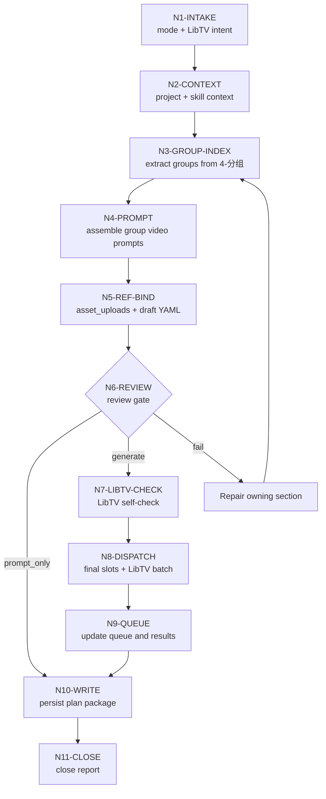

# Subject Reference Video Workflow

本文件承载 `C-主体参照` 的思行一体化节点。业务拓扑是先串行锁源、组装视频 prompt 和绑定主体，再按 $libTV skill scripts 能力逐组后台并发提交，最后统一汇流审查。

## Mermaid Workflow

## Thinking-Action Nodes

| node_id | objective | inputs | actions | evidence | route_out | gate |
| --- | --- | --- | --- | --- | --- | --- |
| `N1-INTAKE` | 锁定任务目标、mode、集号、分镜组范围和 LibTV 意图 | 用户请求、目标项目 | 判定 `prompt_only` / `single_group_generate` / `episode_batch_generate` / `group_batch_generate` / `multi_episode_batch_generate` / `query_or_download` / `repair` / `review_only` | mode note | `N2` | 目标范围明确 |
| `N2-CONTEXT` | 加载项目与技能上下文 | `SKILL.md`、`CONTEXT.md`、`MEMORY.md`、`north_star.yaml`、LibTV skill | 读取项目偏好、视频阶段上下文和 LibTV 约束 | input manifest | `N3` | 必需文件可读 |
| `N3-GROUP-INDEX` | 从 `4-分组` 建立组级索引 | `第N集.md` | 解析 `## x-y-z`、组正文、底部 YAML、分镜数量和 `时长估算` | `video-group-index.json` | `N4` | 每个 ID 唯一可回指，时长估算可追溯 |
| `N4-PROMPT` | 生成组级视频 prompt draft | group index | 直接接入现有组正文主体，保留原 fenced YAML，不提前写死图N字段 | prompt markdown / per-group txt | `N5` | 组正文完整且未改写，draft YAML 未伪造空绑定 |
| `N5-REF-BIND` | 保守绑定 YAML 主体参照和 OSS 身份映射 | prompt package、5-设计生成目录 | 多视图优先、主图次之、缺图保留原主体名；上传只建立 `asset_uploads: name -> uploaded_url`，不决定 `reference_index` | reference manifest / upload ledger draft | `N6` | 无猜测路径，上传层与槽位层分离 |
| `N6-REVIEW` | 执行生成前审查 | prompt、manifest、mode | 检查 ID、组正文、路径、LibTV submit plan可行性 | review note | `N7` / `N10` / repair | 必需项通过 |
| `N7-LIBTV-CHECK` | 确认 $libTV 脚本与凭据 | $libTV scripts | 执行或规划 `LIBTV_ACCESS_KEY credential check` | self-check record | `N8` 或 blocked | 脚本可用且登录态正常 |
| `N8-DISPATCH` | 批量调用 LibTV | submit plan | 每组独立任务；先按 UI 图N或最终 mixedList 建立 `generation_slots`，运行 `scripts/build-upload-ledger.py <package_dir> --sync` 将槽位注册表机械投影回 manifest、submit plan、final YAML 和远端 `mixedList`，再写远端提交；按 `duration_hint=clamp(duration_estimate_seconds, 4, 15)` 提交，默认后台多线程并发 | session ids / final upload ledger | `N9` | 不覆盖、不越权、不固定 15 秒，图N顺序与 final YAML 一致 |
| `N9-QUEUE` | 持久化异步状态 | submit output、query_session | 写 queue ledger、results JSON、下载路径 | queue + results | `N10` | 每个任务可续查 |
| `N10-WRITE` | 写业务工件 | prompt、manifest、plan、result | 写 prompt 文档、manifest、plan、queue、report 草稿 | file list | `N11` | 文件命名正确 |
| `N11-CLOSE` | 汇流交付 | 所有证据 | 总结 submitted / queued / downloaded / skipped / failed 与返工入口 | 执行报告 | done | review verdict `pass` 或 `pass_with_todo` |

## Parallel Boundary

- `N1-N7` 是串行门禁，不应并发绕过。
- `N8-N9` 默认按 `group_id` 维度后台多线程并发；每个任务只能写自己的 submit/result 记录。
- `N10-N11` 必须统一汇流，避免多个任务同时改写同一个报告文件。
