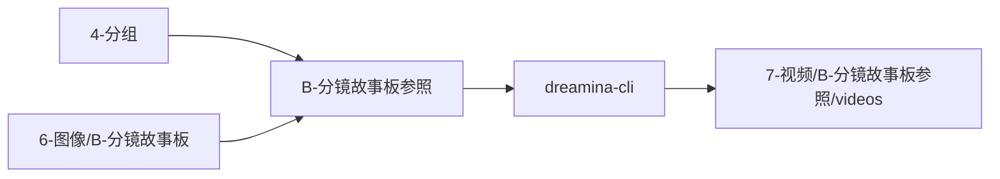

# B-分镜故事板参照

`7-视频` Skill 2.0 包：从 `4-分组` 读取完整分镜组内容，按 `group_id` 绑定 `6-图像/B-分镜故事板` 的可选故事板图，并通过 Dreamina CLI 批量生成组级视频。

## Directory Tree

```text
B-分镜故事板参照/
├── references/
├── scripts/
├── templates/
├── review/
├── steps/
├── knowledge-base/
├── types/
├── agents/
│   └── openai.yaml
├── CHANGELOG.md
├── SKILL.md
├── CONTEXT.md
└── README.md
```

## Quick Entry

- 技能目录：`.agents/skills/aigc/7-视频/B-分镜故事板参照/`
- 主要输入：`projects/aigc/<项目名>/4-分组/第N集.md`
- 故事板参照：`projects/aigc/<项目名>/6-图像/B-分镜故事板/第N集/images/<分镜组ID>.*`
- 项目输出根：`projects/aigc/<项目名>/7-视频/B-分镜故事板参照/第N集/`
- 主要模式：`prompt_only`、`single_group_generate`、`episode_batch_generate`、`group_batch_generate`、`query_or_download`、`repair`、`review_only`



## Runtime Artifacts

```text
第N集-group-index.json
第N集-video-prompts.md
第N集-reference-manifest.json
第N集-dreamina-batch.yaml
第N集-dreamina-queue.md
第N集-dreamina-results.json
执行报告.md
videos/<分镜组ID>.mp4
```
