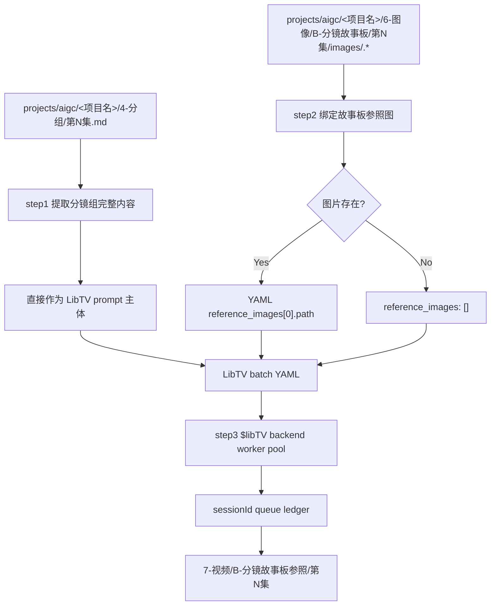
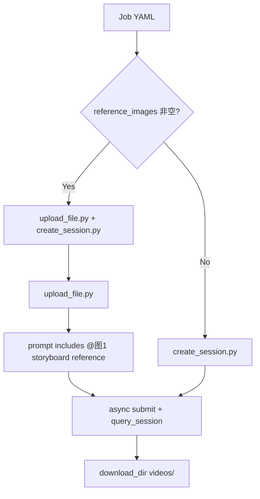
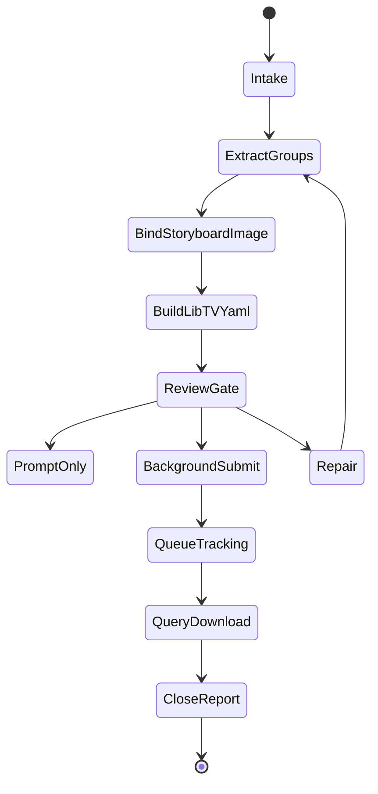

# aigc 7-视频 / B-分镜故事板参照

`B-分镜故事板参照` 负责把 `projects/aigc/<项目名>/4-分组/` 中的分镜组转为 LibTV 视频生成任务：step1 直接使用现有分镜组内容作为生视频提示词主体；step2 检查 `6-图像/B-分镜故事板/` 是否存在对应分镜组 ID 的图像，有则写入 YAML 参照图路径，没有则保持空引用；step3 调用 `.agents/skills/cli/libTV`，以分镜组为单位默认后台多线程批量并发提交视频任务。

## Context Loading Contract

- 每次调用 `$aigc-video-storyboard-reference` 时，必须同时加载同目录 `CONTEXT.md`。
- 每次调用本技能时，必须同时加载同目录 `CONTEXT.md`。
- 每次调用本技能时，必须同时识别并加载同目录 `types/` 中选中的类型包（单选或多选）。
- 若任务绑定 `projects/aigc/<项目名>/`，必须先加载项目根 `MEMORY.md`，再加载项目根 `CONTEXT/` 中与视频阶段、风格、角色、场景或生成限制相关的上下文。
- `4-分组` 是本技能的主要信息来源；不得回到 `3-摄影` 或更早阶段改写分镜组内容，除非用户显式要求修复上游。
- 分镜组视频 prompt 主体直接采用 `4-分组` 的现有分镜组正文；LLM 只负责保真组织、LibTV 指令化封装、缺口说明和审查，不得扩写或改写剧情事实。
- 故事板参照图只来自 `projects/aigc/<项目名>/6-图像/B-分镜故事板/` 中与 `group_id` 对应的真实本地图片；不存在时引用为空，不猜测、不补占位、不改用无关图片。
- 调用 LibTV 前必须同时遵循 `.agents/skills/cli/libTV/SKILL.md + CONTEXT.md`：先执行 `LIBTV_ACCESS_KEY credential check`，多任务写 queue ledger，异步任务保留 `sessionId`。
- 冲突优先级：用户显式请求 > 根 `AGENTS.md` / meta 规则 > `.agents/skills/aigc/SKILL.md` > `.agents/skills/aigc/7-视频/SKILL.md` > 本 `SKILL.md` > `references/` / `steps/` / `types/` / `review/` / `templates/` > `.agents/skills/cli/libTV/SKILL.md` > `agents/openai.yaml` > 项目 `MEMORY.md` > 项目 `CONTEXT/` > 本 `CONTEXT.md`。

## Multi-Subskill Continuous Workflow

当本技能被整体调用时，在满足必要输入、显式选择和安全门后，不再为“是否继续下一步”额外确认。

- 无序号同级子技能包默认全选并发执行，由所属父级汇总、裁决和写回唯一 canonical 输出。
- 数字序号子技能包或节点默认按数字升序串行执行，前一节点产物自动作为后一节点输入。
- 英文序号子技能包或路线默认按用户意图、父级路由或输入类型单选分流；只有用户明确要求对比、并跑或批量多路线时才多选。
- 卫星技能、旁路 reviewer、query/resume/review 类辅助入口不默认纳入主链连续调度；只有用户请求、阶段门禁或父级合同显式需要时才回接。
- 连续调度不得绕过阻断门：缺少项目根、分镜组、故事板参照判定、`LIBTV_ACCESS_KEY` 或既有队列归属会造成错误提交时，必须先阻断并说明最小修复项。
- 每个被调度的子技能包仍必须加载自身 `SKILL.md + CONTEXT.md`；脚本只能承担机械辅助，不得替代 LLM 视频 prompt 主创、参照裁决或父级最终裁决。

## Input Contract

Accepted input:

- 项目名、项目路径、单集或多集范围，要求从 `4-分组` 批量生成组级视频。
- 用户指定一个或多个三段式分镜组 ID，例如 `1-1-1`。
- 已有 `7-视频/B-分镜故事板参照/` 的 prompt、YAML、LibTV 计划、queue ledger 或生成结果需要 repair / review / rerun / query。
- 用户要求“用分镜故事板图作为参照”“按分镜组批量出视频”“后台并发跑 LibTV”等任务。

Required input:

- 可定位的 `projects/aigc/<项目名>/4-分组/第N集.md`。
- 每个目标分镜组必须有可解析的 `## x-y-z` 标题和非空组正文。
- 调用 LibTV 前必须能确定项目内输出目录，默认 `projects/aigc/<项目名>/7-视频/B-分镜故事板参照/第N集/`。
- 执行生成前必须能运行 `LIBTV_ACCESS_KEY credential check`；若失败，停止提交并进入 LibTV 登录/环境排障。

Optional input:

- `prompt_only`：只生成 LibTV YAML、prompt 包、参照 manifest 和提交计划，不执行 LibTV。
- `episode_batch`：一次处理一集全部分镜组。
- `group_batch`：一次处理多个指定分镜组。
- `execution.concurrency`：并发 worker 数；默认 `min(4, job_count)`，不得让多个 worker 同时改写同一个最终报告。
- 用户指定 LibTV 模型、duration、ratio、video_resolution、poll 秒数、输出目录、rerun / replace 策略或下载策略。

Reject or clarify when:

- `4-分组` 缺失、目标分镜组 ID 无法唯一追溯，或用户要求改变分镜组剧情核心、镜头顺序、角色事实、动作结果或组边界。
- 用户要求脚本主创视频 prompt 正文、自动扩写剧情或用模板补写未知画面。
- 用户要求生成分镜故事板图本体，应转入 `6-图像/B-分镜故事板`。
- 用户指定的图片参照路径不存在、位于项目外且未明确授权，或同一 `group_id` 命中多个同优先级图片候选。

## Positioning

本技能是 `7-视频` 阶段的组级 LibTV 视频入口，向上承接 `4-分组`，横向读取 `6-图像/B-分镜故事板` 的已生成故事板图，向下调用 `.agents/skills/cli/libTV`。它拥有视频 prompt 包、故事板参照 YAML、LibTV 提交计划、queue ledger、结果下载记录和执行报告的裁决权；它不拥有上游分组改写权，也不拥有故事板图生成权。

## LLM-First Creative Authorship Contract

- 视频 prompt 的 LibTV 指令化组织、运动/声音约束、节奏保真说明和失败诊断必须由 LLM 直接完成。
- 脚本只允许承担读取、抽取、路径匹配、YAML/JSON 投影、队列台账、并发提交、状态查询、下载和校验等机械辅助职责。
- 脚本不得把 `4-分组` 正文规则拼接成新的创作正文，不得扩写剧情、替代镜头判断或生成 canonical prompt truth。
- 参照图路径属于机械绑定；是否使用参照图、如何在 prompt 中描述 `@图1` 的约束，仍须由本技能合同和 LLM 审查裁决。

## Mode Selection

| mode | 触发信号 | 主要动作 |
| --- | --- | --- |
| `prompt_only` | 只要求配置、YAML、prompt 包或提交计划 | 执行 step1-step2，写 LibTV batch YAML，不提交 |
| `single_group_generate` | 指定一个三段式分镜组 ID 且要求出视频 | 执行 step1-step3，单组提交 LibTV |
| `episode_batch_generate` | 指定一集或默认整集批量 | 对该集全部分镜组执行 step1-step3，默认后台多线程并发提交 |
| `group_batch_generate` | 指定多个分镜组 ID | 只处理目标分镜组集合，保持独立 YAML job 与输出 |
| `query_or_download` | 已有 sessionId 或 queue ledger，需要查询/下载 | 按 LibTV queue 规则刷新状态和下载结果 |
| `repair` | prompt 缺组、图像错绑、YAML 漂移、sessionId 缺失、下载不完整 | 按 review gate 定位返工节点 |
| `review_only` | 只检查现有输出 | 审查 prompt、参照、LibTV plan、queue 和本地视频结果 |

## Reference Loading Guide

| 场景 | 必读文件 |
| --- | --- |
| 从 `4-分组` 提取组级正文 | `references/group-source-contract.md` |
| 匹配 `6-图像/B-分镜故事板` 的故事板图 | `references/storyboard-image-binding-contract.md` |
| 组织 LibTV YAML、命令和后台并发提交 | `references/libtv-handoff-contract.md`、`.agents/skills/cli/libTV/SKILL.md`、`.agents/skills/cli/libTV/CONTEXT.md` |
| 执行 step1-step3 主流程 | `steps/storyboard-video-workflow.md` |
| 判定单组、整集、多组、查询、修复模式 | `types/type-map.md` |
| 输出审查与返工 | `review/review-contract.md` |
| 输出模板 | `templates/output-template.md`、`templates/libtv-batch.template.yaml` |
| 脚本辅助边界 | `scripts/README.md` |
| 可复用经验 | `knowledge-base/storyboard-video-heuristics.md` |
| 产品侧入口元数据 | `agents/openai.yaml` |

## Visual Maps

## Execution Contract

1. 加载本 `SKILL.md + CONTEXT.md`；项目任务中加载项目 `MEMORY.md` 与相关项目 `CONTEXT/`。
2. 按 `types/type-map.md` 锁定 mode、集号范围、目标分镜组集合、是否执行 LibTV、是否查询下载。
3. step1：以 `projects/aigc/<项目名>/4-分组` 为主要信息来源，解析每个 `## x-y-z` 分镜组，完整提取组正文；视频 prompt 主体直接使用现有组内容，不进行剧情改写。
4. step1 组装 prompt 时添加 LibTV 视频约束前缀：`根据以下完整分镜组内容生成一条连续视频。保持分镜顺序、角色动作、镜头运动、场景与情绪连续；不生成字幕，不生成BGM，保留物理互动音效与环境音。`
5. step2：检查 `projects/aigc/<项目名>/6-图像/B-分镜故事板/第N集/` 下是否存在与 `group_id` 对应的图片；优先 `images/<group_id>.*`，其次同集目录内 `<group_id>.*`，允许常见扩展名 `png/jpg/jpeg/webp`。
6. step2 绑定结果必须写入 YAML：有图则 `reference_images: [{path, role: storyboard_sheet, marker: "@图1"}]`；无图则 `reference_images: []`，并记录 `reference_status: missing_optional`，不阻断 text-to-video。
7. step3：根据 YAML 转换为 `$libTV` 脚本提交格式。一组一个 job：有故事板图时，先运行 `upload_file.py <path>`，再把返回的 URL 作为 `参照图1` 写入 prompt，并运行 `create_session.py "<完整组内容 + 参照图1 URL>"`；无故事板图时直接运行 `create_session.py "<完整组内容>"`。
8. 默认后台多线程批量并发执行：提交前生成 `第N集-libtv-batch.yaml` 和 queue ledger；worker 数默认 `min(4, job_count)`，每个 worker 只写自己的临时结果，最终由主流程汇流更新 `第N集-libtv-results.json` 与 `执行报告.md`。
9. 每次生成前必须运行 `LIBTV_ACCESS_KEY credential check`；若失败，停止提交并按 `$libTV` 技能进入登录或环境排障。
10. 短轮询只作等待窗口；超时后必须保存 `sessionId`，把状态写入 queue ledger，并使用 `python3 .agents/skills/cli/libTV/scripts/query_session.py <sessionId>` 后续查询。下载默认写入 `projects/aigc/<项目名>/7-视频/B-分镜故事板参照/第N集/videos/`。
11. 交付前执行 `review/review-contract.md`：组 ID 追溯、prompt 完整性、YAML 参照路径、LibTV 上传/会话/查询/下载计划、queue ledger、并发写入边界和本地视频结果状态必须可复核。

## Field Mapping

| field_id | 输出/证据 | 内容要求 | 失败码 |
| --- | --- | --- | --- |
| `FIELD-SBVID-01` | input manifest | 项目根、集号、`4-分组`、目标组范围可追溯 | `FAIL-SBVID-INPUT` |
| `FIELD-SBVID-02` | group index | `group_id` 可回指 `## x-y-z`，组正文完整提取 | `FAIL-SBVID-GROUP` |
| `FIELD-SBVID-03` | prompt package | LibTV 视频约束前缀 + 现有组内容主体，镜头未缺失乱序 | `FAIL-SBVID-PROMPT` |
| `FIELD-SBVID-04` | storyboard reference manifest | 只绑定真实 `6-图像/B-分镜故事板` 图片；缺图为空引用 | `FAIL-SBVID-REF` |
| `FIELD-SBVID-05` | LibTV YAML / commands | 有图走 `libtv_session_with_uploaded_references`，无图走 `libtv_session_text_only`，参数符合 $libTV | `FAIL-SBVID-LIBTV` |
| `FIELD-SBVID-06` | queue ledger / session ids | 多任务均有 queue row、sessionId、next_action | `FAIL-SBVID-QUEUE` |
| `FIELD-SBVID-07` | results / report | generated / submitted / querying / failed / skipped 状态清楚 | `FAIL-SBVID-REPORT` |

## Field Master

| field_id | owner | canonical file | must contain | fail code |
| --- | --- | --- | --- | --- |
| `FIELD-SBVID-01` | input lock | `第N集-group-index.json` / report | 项目根、集号、`4-分组`、视频输出根 | `FAIL-SBVID-INPUT` |
| `FIELD-SBVID-02` | group extraction | `第N集-group-index.json` | `group_id`、source heading、source body hash、shot labels | `FAIL-SBVID-GROUP` |
| `FIELD-SBVID-03` | prompt assembly | `第N集-video-prompts.md` | LibTV 前缀、完整组正文、参照说明 | `FAIL-SBVID-PROMPT` |
| `FIELD-SBVID-04` | reference binding | `第N集-reference-manifest.json` | storyboards paths or empty refs with reason | `FAIL-SBVID-REF` |
| `FIELD-SBVID-05` | LibTV handoff | `第N集-libtv-batch.yaml` | command type、prompt、reference_images、output path、poll | `FAIL-SBVID-LIBTV` |
| `FIELD-SBVID-06` | queue tracking | `第N集-libtv-queue.md` | queue_id、sessionId、remote_status、next_action | `FAIL-SBVID-QUEUE` |
| `FIELD-SBVID-07` | convergence | `执行报告.md` | verdict、处理范围、失败/跳过与返工入口 | `FAIL-SBVID-REPORT` |

## Thought Pass Map

| pass_id | focus field | core question | action | evidence |
| --- | --- | --- | --- | --- |
| `PASS-SBVID-01` | `FIELD-SBVID-01` | 本轮处理哪个项目、集号和分镜组范围 | 锁定 mode、读取项目上下文 | input manifest |
| `PASS-SBVID-02` | `FIELD-SBVID-02` | 如何从 `4-分组` 保真提取组正文 | 解析 `## x-y-z` 与组边界 | group index |
| `PASS-SBVID-03` | `FIELD-SBVID-03` | 如何保证 prompt 直接承接现有组内容 | 添加固定视频约束，接入完整组正文 | prompt markdown |
| `PASS-SBVID-04` | `FIELD-SBVID-04` | 该组是否有对应故事板图 | 按 group_id 查 `6-图像/B-分镜故事板` | reference manifest |
| `PASS-SBVID-05` | `FIELD-SBVID-05` | YAML 如何转换为 $libTV skill scripts 命令 | 有图选 `libtv_session_with_uploaded_references`，无图选 `libtv_session_text_only` | batch YAML / command preview |
| `PASS-SBVID-06` | `FIELD-SBVID-06` | 批量任务如何后台并发且可追踪 | 建 ledger、提交、记录 sessionId | queue ledger |
| `PASS-SBVID-07` | `FIELD-SBVID-07` | 输出如何闭环并可返工 | 汇总审查、失败和跳过原因 | execution report |

## Pass Table

| pass_id | pass standard | fail code | rework entry |
| --- | --- | --- | --- |
| `PASS-SBVID-01` | 必需输入可读，输出根明确 | `FAIL-SBVID-INPUT` | `types/type-map.md` |
| `PASS-SBVID-02` | 每个 `group_id` 唯一且可回指源标题和组正文 | `FAIL-SBVID-GROUP` | `references/group-source-contract.md` |
| `PASS-SBVID-03` | prompt 以固定视频约束起笔，现有组内容作为主体，镜头未缺失乱序 | `FAIL-SBVID-PROMPT` | `references/group-source-contract.md` |
| `PASS-SBVID-04` | 参照图路径真实存在；缺图为空引用并记录原因 | `FAIL-SBVID-REF` | `references/storyboard-image-binding-contract.md` |
| `PASS-SBVID-05` | LibTV YAML 可转为合法 `libtv_session_with_uploaded_references` 或 `libtv_session_text_only` 命令 | `FAIL-SBVID-LIBTV` | `references/libtv-handoff-contract.md` |
| `PASS-SBVID-06` | 每个提交任务都有 queue row、sessionId 或明确失败原因 | `FAIL-SBVID-QUEUE` | `.agents/skills/cli/libTV/SKILL.md` |
| `PASS-SBVID-07` | 执行报告记录 verdict、处理范围、失败/跳过与返工入口 | `FAIL-SBVID-REPORT` | `review/review-contract.md` |

## Root-Cause Execution Contract (Mandatory)

出现失败时必须沿链路上溯：

`Symptom -> Direct Cause -> Section Owner -> Source Contract -> AGENTS.md / skill-工作车间`

优先修复：

1. 组无法追溯、正文截断或改写：回到 `references/group-source-contract.md` 与 `steps/storyboard-video-workflow.md`。
2. 故事板图错绑、路径不存在、猜测引用或缺图仍写占位：回到 `references/storyboard-image-binding-contract.md`。
3. YAML 无法转换为 LibTV submit plan、子命令选择错误或参数越权：回到 `references/libtv-handoff-contract.md` 与 `.agents/skills/cli/libTV/SKILL.md`。
4. 并发提交丢 `sessionId`、queue ledger 漂移或下载半截文件误判成功：回到 `.agents/skills/cli/libTV/CONTEXT.md`。
5. 输出格式不一致：回到 `templates/output-template.md`。
6. 同类失败可复用：沉淀到同目录 `CONTEXT.md`，稳定后晋升到本文件或分区规范。

## Output Contract

- Required output: 组级视频 prompt 包、故事板参照 manifest、LibTV batch YAML、LibTV queue ledger、submit/result JSON、逐集执行报告；若执行下载，还应包含本地视频文件。
- Output format: Markdown prompt / report / queue ledger + YAML batch config + JSON manifest / plan / result；生成视频为 LibTV 返回的 MP4 或等价视频文件。
- Output path: `projects/aigc/<项目名>/7-视频/B-分镜故事板参照/第N集/`，其中 prompt、manifest、batch YAML、queue、result、报告与视频均在该集目录或其 `videos/` 子目录下。
- Naming convention: prompt 文档命名 `第N集-video-prompts.md`；索引命名 `第N集-group-index.json`；参照清单命名 `第N集-reference-manifest.json`；LibTV 配置命名 `第N集-libtv-batch.yaml`；队列命名 `第N集-libtv-queue.md`；结果命名 `第N集-libtv-results.json`；执行报告命名 `执行报告.md`；视频命名 `<分镜组ID>.mp4`，例如 `1-1-1.mp4`。
- Completion gate: 目标分镜组均可从 `4-分组` 回指；每条 prompt 完整保留组正文主体；YAML 参照图只绑定真实故事板图片或保持空引用；生成前已通过 `LIBTV_ACCESS_KEY credential check`；批量任务均有 queue ledger；执行 LibTV 时遵循 `.agents/skills/cli/libTV` 的提交、轮询、查询与下载门禁；审查结果为 `pass` 或 `pass_with_todo`。
