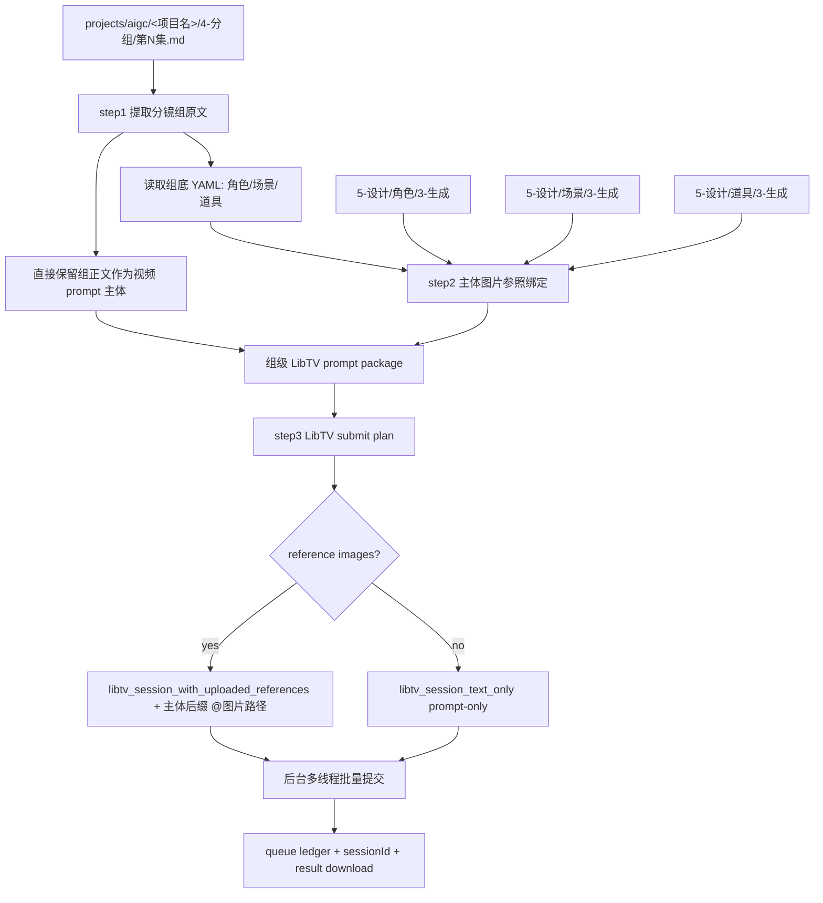
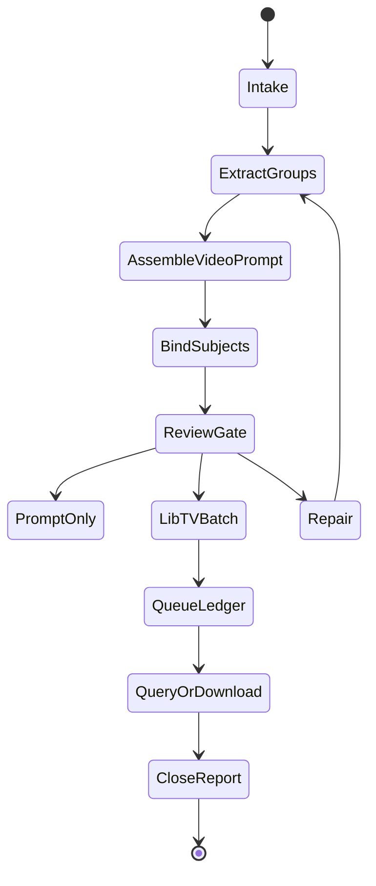

# aigc 7-视频 / C-主体参照

`C-主体参照` 负责把 `projects/aigc/<项目名>/4-分组/` 中的每个分镜组转为一条组级 LibTV 视频生成任务：直接使用现有分镜组内容作为生视频提示词主体，按组底 YAML 绑定角色、场景、道具图片参照，并调用 `.agents/skills/cli/libTV` 以分镜组为单位批量提交视频任务。

## Context Loading Contract

- 每次调用本技能时，必须同时加载同目录 `CONTEXT.md`。
- 每次调用本技能时，必须同时识别并加载同目录 `types/` 中选中的类型包（单选或多选）。
- 若任务绑定 `projects/aigc/<项目名>/`，必须先加载项目根 `MEMORY.md`，再加载 `projects/aigc/<项目名>/0-初始化/north_star.yaml` 与项目根 `CONTEXT/` 中和视频阶段、主体资产、生成偏好相关的上下文。
- `4-分组` 是本技能的主要信息来源；不得回到 `3-摄影`、`3-Detail` 或更早阶段重写分镜组内容，除非用户显式要求修复上游。
- 分镜组视频 prompt 主体直接采用 `4-分组` 的现有分镜组正文；LLM 只负责裁决提取范围、保真组织、缺口说明和审查，不得扩写或改写剧情事实。
- 主体参照以分镜组底部 YAML 的 `角色 / 场景 / 道具` 为基准；不得用正文泛词、子串或猜测名自动扩展主体列表；名称命中多个候选图片时，先把候选图发送到当前窗口作为可加载上下文执行视觉消歧，无法唯一判定才进入 `ambiguous`。
- 指定视频生成时必须调用 `.agents/skills/cli/libTV` 官方技能包完成；执行顺序以 `references/libtv-handoff.md` 的官方脚本顺序为准：按需 `change_project.py`、逐图 `upload_file.py`、`create_session.py`、`query_session.py`、生成完成后 `download_results.py` 自动下载。
- 调用 LibTV 前必须加载 `.agents/skills/cli/libTV/SKILL.md`，并遵守其登录自检、命令选择、队列台账、画布同步和异步查询规则。
- 冲突优先级：用户显式请求 > 根 `AGENTS.md` / meta 规则 > `.agents/skills/aigc/SKILL.md` > `.agents/skills/aigc/7-视频/SKILL.md` > 本 `SKILL.md` > `references/` / `steps/` / `types/` / `review/` / `templates/` > `.agents/skills/cli/libTV/SKILL.md` > `agents/openai.yaml` > 项目 `MEMORY.md` > 项目 `CONTEXT/` > 本 `CONTEXT.md`。

## Multi-Subskill Continuous Workflow

当本技能被整体调用时，在满足必要输入、显式选择和安全门后，不再为“是否继续下一步”额外确认。

- 无序号同级子技能包默认全选并发执行，由所属父级汇总、裁决和写回唯一 canonical 输出。
- 数字序号子技能包或节点默认按数字升序串行执行，前一节点产物自动作为后一节点输入。
- 英文序号子技能包或路线默认按用户意图、父级路由或输入类型单选分流；只有用户明确要求对比、并跑或批量多路线时才多选。
- 卫星技能、旁路 reviewer、query/resume/review 类辅助入口不默认纳入主链连续调度；只有用户请求、阶段门禁或父级合同显式需要时才回接。
- 连续调度不得绕过阻断门：缺少项目根、分镜组、组底 YAML、主体参照裁决、`LIBTV_ACCESS_KEY` 或既有队列归属会造成错误提交时，必须先阻断并说明最小修复项。
- 每个被调度的子技能包仍必须加载自身 `SKILL.md + CONTEXT.md`；脚本只能承担机械辅助，不得替代 LLM 视频 prompt 主创、参照裁决或父级最终裁决。

## Input Contract

Accepted input:

- 项目名、项目路径、单集或多集范围，要求从 `4-分组` 批量生成组级视频。
- 用户指定一个或多个三段式分镜组 ID，例如 `1-1-1`。
- 已有 `7-视频/C-主体参照/` prompt、参照绑定、LibTV 计划、队列或结果需要 repair / review / rerun。
- 一次处理一集或多个分镜组，并默认按后台多线程批量并发提交 LibTV 视频任务。

Required input:

- 可定位的 `projects/aigc/<项目名>/4-分组/第N集.md`。
- 每个目标分镜组必须有可解析的 `## x-y-z` 标题、组正文和底部 fenced YAML。
- 可定位的设计生成目录：`5-设计/角色/3-生成`、`5-设计/场景/3-生成`、`5-设计/道具/3-生成`；目录缺失时允许 prompt-only 或缺图继续，但必须写入报告。
- 调用 LibTV 前必须能确定项目内输出目录，默认集级目录为 `projects/aigc/<项目名>/7-视频/C-主体参照/第N集/`，每个分镜组的 canonical 执行包必须写入 `projects/aigc/<项目名>/7-视频/C-主体参照/第N集/groups/<分镜组ID>/`。

Optional input:

- `prompt_only`：只生成视频 prompt、参照 manifest、LibTV 计划，不提交任务。
- `prompt_fidelity_mode`：默认 `strict_original`；可选 `strict_original / transport_only / libtv_optimize`。
- `allow_libtv_prompt_optimization`：默认 `false`。只有用户显式设为 `true` 或显式选择 `libtv_optimize` 时，才允许 LibTV 远端 Agent 做提示词优化、摘要、镜头重排、补镜头或重新编排。
- `episode_batch`：一次处理一集全部分镜组。
- `group_batch`：一次处理多个指定分镜组。
- `multi_episode_batch`：一次处理多集，每集保持独立队列与报告。
- `libtv_model`：默认留空并使用 `$libTV` 后端默认视频路由；仅当用户显式指定模型或质量档时，才把该要求原样写入自然语言任务。
- `duration`：默认 15 秒；必须落在 LibTV 当前视频命令允许范围内。
- `ratio` / `video_resolution`：默认 `16:9`、720P；默认时长 15 秒，声音开启；仅当用户显式指定比例、分辨率或质量档时覆盖。
- `parallelism`：默认后台多线程批量并发提交；若用户未指定，按保守并发执行并记录实际值。
- 用户指定 aspect ratio、resolution、额外禁止项、输出目录、rerun / replace 策略或只查询既有 `sessionId`。

Reject or clarify when:

- `4-分组` 缺失、目标分镜组 ID 无法唯一追溯，或组底 YAML 缺失到无法确定主体槽位。
- 用户要求改变 `4-分组` 的剧情核心、镜头顺序、角色事实、动作结果或组边界。
- 用户要求脚本主创视频 prompt 正文、自动扩写剧情或用模板补写未知画面。
- 任务目标是基于单帧或故事板图像做视频首帧/故事板参照，应转入 `A-分镜画面参照` 或 `B-分镜故事板参照`。

## Prompt Fidelity Policy

默认提交策略为 `strict_original + transport_only`：

| mode | allowed | forbidden | default |
| --- | --- | --- | --- |
| `strict_original` | 直接把 `4-分组` 的组正文作为生成 prompt 主体；保留原有镜头顺序、段落、对白、音效、转场和分镜明细 | 改写、摘要、重排、合并镜头、补镜头、重新编排、把正文转为优化版提示词 | yes |
| `transport_only` | 只做运输层投影：本地路径换为上传 URL、补 `mixed2video / duration / ratio / resolution / enableSound` 参数、按 provider 上限裁剪非关键参照图 | 改写 `group_body`、压缩剧情、重组镜头、替换原文表达 | yes |
| `libtv_optimize` | 允许 LibTV 远端 Agent 进行提示词优化、摘要、镜头合并、工作流规划或重新编排 | 未经用户显式同意时启用 | no |

- `allow_libtv_prompt_optimization` 默认必须为 `false`。
- 远端 `libtv-submission.txt` 必须明确声明：禁止提示词优化、禁止重新编排、禁止摘要、禁止改写、禁止补镜头；直接使用 `【主体参照说明】中相关主体名/参照图绑定关系 + 【分镜组源文本】原文` 作为 Seedance 生成 prompt 完整体。
- 远端生成 prompt 中每个图片 token、图片编号或参照 URL 必须邻近对应主体名称；不得出现裸 `{{Image 1}} {{Image 2}} ...`、裸 `图片1 图片2 ...` 或裸 URL 列表。
- 若用户显式选择 `libtv_optimize`，必须在 submit plan、queue 和 report 中记录该选择；否则任何远端优化、重排或摘要都按 `route drift / prompt fidelity violation` 处理。

## Positioning

本技能是 `7-视频` 阶段的组级主体参照视频入口，向上承接 `4-分组`，向下调用 `.agents/skills/cli/libTV`。它拥有组级视频 prompt 包、主体参照绑定、LibTV 提交计划、队列台账、异步结果持久化和执行报告的裁决权；它不拥有上游分组改写权，也不拥有主体资产重设计权。

## LLM-First Creative Authorship Contract

- 视频 prompt 中的创作性组织必须由 LLM 直接完成，但事实主体必须来自 `4-分组` 原文，不得由脚本拼接生成 canonical creative truth。
- 主体槽位裁决以 YAML 为准；脚本只能读取、解析、校验、枚举文件、生成命令计划和队列台账。
- `.agents/skills/cli/libTV` 是生成运输层；不得把它的命令模板或脚本输出视为剧情、镜头或主体判断的主真源。

## Mode Selection

| mode | 触发信号 | 主要动作 |
| --- | --- | --- |
| `prompt_only` | 只要求提示词、配置或提交计划 | 执行 step1-step2，写 prompt、reference manifest、LibTV plan |
| `single_group_generate` | 指定一个三段式分镜组 ID 且要求出视频 | 执行 step1-step3，单组调用 LibTV |
| `episode_batch_generate` | 指定一集或默认整集批量 | 对该集全部分镜组执行 step1-step3，默认后台多线程并发提交 |
| `group_batch_generate` | 指定多个分镜组 ID | 只处理目标分镜组集合，保持独立 prompt、引用和 sessionId |
| `multi_episode_batch_generate` | 指定多集或多个 `第N集.md` | 每集独立索引、计划、队列和报告，提交层可统一并发 |
| `query_or_download` | 已有 sessionId，需要查询或下载 | 按 LibTV queue ledger 和 `query_session` 更新结果 |
| `repair` | prompt 缺组、槽位错绑、图片缺失、提交计划漂移 | 按 `review/review-contract.md` 定位返工节点 |
| `review_only` | 只检查现有输出 | 审查 prompt、参照、LibTV 计划、队列与落盘结果，不提交新任务 |

## Reference Loading Guide

| 场景 | 必读文件 |
| --- | --- |
| 从 `4-分组` 提取组级正文与底部 YAML | `references/group-source-extraction.md` |
| 组装组级视频 prompt | `references/video-prompt-assembly-contract.md` |
| 查找并绑定角色、场景、道具参照图 | `references/reference-slot-binding.md` |
| 调用 `.agents/skills/cli/libTV` 与批量生成交接 | `references/libtv-handoff.md` |
| 执行 step1-step3 主流程 | `steps/subject-reference-video-workflow.md` |
| 判定单组、整集、多组、多集、查询、修复模式 | `types/type-map.md` |
| 输出审查与返工 | `review/review-contract.md` |
| 输出模板 | `templates/output-template.md`、`templates/libtv-submit-plan.template.json` |
| 脚本辅助边界 | `scripts/README.md` |
| 可复用经验 | `knowledge-base/video-subject-reference-heuristics.md` |
| 产品侧入口元数据 | `agents/openai.yaml` |

## Visual Maps

## Execution Contract

1. 加载本 `SKILL.md + CONTEXT.md`；项目任务中加载 `MEMORY.md`、`north_star.yaml` 与相关项目上下文；提交任务前加载 `.agents/skills/cli/libTV/SKILL.md`。
2. 按 `types/type-map.md` 锁定 mode、集号范围、目标分镜组集合、是否执行 LibTV、并发策略和输出根。
3. 执行 step1：以 `projects/aigc/<项目名>/4-分组` 为主要信息来源，解析每个 `## x-y-z` 分镜组，完整提取组正文和底部 YAML；`## x-y-z~x-y-z` 组间连接件默认忽略，不进入视频 prompt、YAML 主体槽位、主体参照 manifest、LibTV job 或视频文件命名；视频 prompt 主体直接使用现有组内容，不进行剧情改写。
4. 执行 step2：读取每个分镜组底部 YAML 的 `角色 / 场景 / 道具`，检查 `projects/aigc/<项目名>/5-设计/角色/3-生成`、`5-设计/场景/3-生成`、`5-设计/道具/3-生成` 中是否存在对应主体名称图片；多视图优先，没有多视图就主图，都没有就空着并从参照图片数组中移除；名称命中多个候选时先把候选图发送到窗口作为可加载上下文自动识图匹配，仍不能唯一确认才列入 `ambiguous`；有图主体必须在对应主体信息后追加 `@<图片路径>`。
5. 执行 step3：根据每个分镜组的完整组正文和已绑定主体图片，生成符合 `.agents/skills/cli/libTV` 的提交计划。存在参照图时先逐图运行 `upload_file.py`，再把返回的 URL 编号写入 `*-libtv-submission.txt` 的角色、场景、道具主体信息后，并运行 `create_session.py`；无参照图时直接运行 `create_session.py`，禁止传空图片槽。`*-libtv-submission.txt` 必须以 `【LibTV 调用锁定】` 开头：有主体参照图时固定 `provider=seedance2.0 / taskType=video / modeType=mixed2video / mixedList=[{"url": "<真实 uploaded_url>", "type": "image"}]`，`mixedList` 内不得保留占位符且必须是严格 JSON 对象数组；无图时固定 `modeType=text2video`。远端工具调用必须使用 `taskType` 而不是 `task_type`，并把 `params` 作为 `create_generation_task` 顶层参数传入；若返回 `params is required`，记录为 `generation_tool_error`。远端提交不得包含本地图片路径，只能包含真实上传 URL 和 `主体名：参照图N <uploaded_url>`；`【直接生成请求】` 必须要求基于 `【主体参照说明】（包含主体名和主体参照 URL）+【分镜组源文本】`，并把两者共同作为生成 prompt 完整体。默认必须包含 `strict_original + transport_only` 声明，禁止远端 Agent 对 `【分镜组源文本】` 做提示词优化、摘要、重排、改写或补镜头，也禁止把主体参照简化为裸图片 token / 裸图片编号 / 裸 URL。
6. 生成前必须运行 `LIBTV_ACCESS_KEY credential check`；$libTV skill scripts 不可用或登录失败时，写入 `blocked` 队列状态，不得伪造 sessionId。
7. 默认以分镜组为单位后台多线程批量并发提交；每个任务只能写自己的 submit 记录、下载文件和状态行；统一报告在汇流阶段写入。
8. 所有异步任务必须进入 queue ledger，至少记录 `queue_id / group_id / command / sessionId / projectUuid / projectUrl / canvas_link / local_status / remote_status / prompt_summary / reference_images / output_path / next_action`；其中 `canvas_link` 必须是可直接打开的 Markdown 链接，例如 `[打开画布](https://www.liblib.tv/canvas?projectId=<projectUuid>)`。
9. 每个分镜组的 canonical 执行包写入 `projects/aigc/<项目名>/7-视频/C-主体参照/第N集/groups/<分镜组ID>/`，包含 `group-index.json`、`reference-manifest.json`、`prompt.md`、`libtv-submission.txt`、`libtv-submit-plan.json`、`queue.md`、`libtv-results.json`、`执行报告.md` 与 `<分镜组ID>.mp4`；集级 `第N集-*.json/md` 只作为派生汇总视图，可由 group package 重建。所有 Markdown 报告和最终用户回执必须把 LibTV 画布返回为可点击链接，同时在 JSON 中保留原始 `projectUrl` 与 `canvasMarkdown` 字段。生成完成后必须通过 `.agents/skills/cli/libTV/scripts/download_results.py` 自动下载到对应 group package，不再默认写入 `videos/` 子目录。
10. 交付前执行 `review/review-contract.md`；组 ID 追溯、组正文完整性、YAML 主体基准、参照路径存在性、LibTV submit plan合法性、队列台账和项目内持久化必须通过。

## Field Mapping

| field_id | 输出/证据 | 内容要求 | 失败码 |
| --- | --- | --- | --- |
| `FIELD-VIDSUBJ-01` | input manifest | 项目根、集号、`4-分组`、设计生成目录、LibTV 环境可追溯 | `FAIL-VIDSUBJ-INPUT` |
| `FIELD-VIDSUBJ-02` | group index | 三段式 `x-y-z` 可回指 `## x-y-z`，组正文和 YAML 被完整提取 | `FAIL-VIDSUBJ-GROUP` |
| `FIELD-VIDSUBJ-03` | video prompt package | 现有组内容作为主体，保留分镜顺序、分镜明细和音效；默认忽略相邻组间连接件；远端提交以 `【LibTV 调用锁定】` 开头，有主体图时 `modeType=mixed2video`；默认 `strict_original + transport_only` 且禁止远端优化；最终生成 prompt 必须保留主体名与图片 token/编号绑定 | `FAIL-VIDSUBJ-PROMPT` |
| `FIELD-VIDSUBJ-04` | reference manifest | Characters / Scene / Props 只来自组底 YAML，且只绑定真实图片，多视图优先；多候选先视觉消歧并留证 | `FAIL-VIDSUBJ-REF` |
| `FIELD-VIDSUBJ-05` | LibTV submit plan / queue | 一组一任务，合法 `libtv_session_text_only` 或 `libtv_session_with_uploaded_references` 命令，默认并发提交，有 sessionId 台账和可点击 `canvas_link` | `FAIL-VIDSUBJ-LIBTV` |
| `FIELD-VIDSUBJ-06` | execution report | 说明 submitted / queued / downloaded / skipped / failed、缺图、查询入口、可直接打开的画布链接和返工入口 | `FAIL-VIDSUBJ-REPORT` |

## Field Master

| field_id | owner | canonical file | must contain | fail code |
| --- | --- | --- | --- | --- |
| `FIELD-VIDSUBJ-01` | input lock | `groups/<分镜组ID>/group-index.json` / 集级 summary | 项目根、集号、`4-分组`、设计生成目录、LibTV self-check | `FAIL-VIDSUBJ-INPUT` |
| `FIELD-VIDSUBJ-02` | group extraction | `groups/<分镜组ID>/group-index.json` | `group_id`、source heading、shot count、YAML subjects | `FAIL-VIDSUBJ-GROUP` |
| `FIELD-VIDSUBJ-03` | prompt assembly | `groups/<分镜组ID>/prompt.md` / `groups/<分镜组ID>/libtv-submission.txt` | 组正文主体、完整分镜顺序、本地主体信息后缀 `@图片路径`；远端提交只含 uploaded URL 且有直接生视频锁定开头；远端生成 prompt 完整体必须包含主体名/参照图绑定关系 + 源文本原文 | `FAIL-VIDSUBJ-PROMPT` |
| `FIELD-VIDSUBJ-04` | reference binding | `groups/<分镜组ID>/reference-manifest.json` | 角色/场景/道具真实图片路径，多视图优先，无空槽位；多候选视觉消歧证据 | `FAIL-VIDSUBJ-REF` |
| `FIELD-VIDSUBJ-05` | LibTV handoff | `groups/<分镜组ID>/libtv-submit-plan.json` / `groups/<分镜组ID>/queue.md` | 一组一任务、命令参数、并发策略、sessionId、projectUrl、Markdown `canvas_link`、查询动作 | `FAIL-VIDSUBJ-LIBTV` |
| `FIELD-VIDSUBJ-06` | convergence | `groups/<分镜组ID>/执行报告.md` / 集级 `执行报告.md` | submitted / queued / downloaded / skipped / failed、review verdict、可点击画布链接、返工入口 | `FAIL-VIDSUBJ-REPORT` |

## Thought Pass Map

| pass_id | focus field | core question | action | evidence |
| --- | --- | --- | --- | --- |
| `PASS-VIDSUBJ-01` | `FIELD-VIDSUBJ-01` | 本轮处理哪个项目、集号、分镜组范围和 LibTV 执行意图 | 锁定 mode、读取项目上下文和 LibTV 自检要求 | input manifest |
| `PASS-VIDSUBJ-02` | `FIELD-VIDSUBJ-02` | 如何从 `4-分组` 保真提取组正文和 YAML | 解析 `## x-y-z` 与 fenced YAML | group index |
| `PASS-VIDSUBJ-03` | `FIELD-VIDSUBJ-03` | 如何保证视频 prompt 直接使用组内容且适配 LibTV | 保留组正文主体，添加最小 provider 指令和主体后缀 `@图片路径` | prompt markdown |
| `PASS-VIDSUBJ-04` | `FIELD-VIDSUBJ-04` | 哪些 YAML 主体有真实本地图片可绑定 | 多视图优先、主图次之、缺图移除槽位；多候选先窗口识图消歧 | reference manifest |
| `PASS-VIDSUBJ-05` | `FIELD-VIDSUBJ-05` | LibTV submit plan如何批量安全执行并可续查 | 生成一组一任务 submit plan、queue ledger 并按需调用 | plan / queue / results |
| `PASS-VIDSUBJ-06` | `FIELD-VIDSUBJ-06` | 输出如何闭环并可返工 | 汇总审查、失败、跳过、sessionId 和下载路径 | execution report |

## Pass Table

| pass_id | pass standard | fail code | rework entry |
| --- | --- | --- | --- |
| `PASS-VIDSUBJ-01` | 必需输入可读，设计生成目录状态与 LibTV 执行意图已记录 | `FAIL-VIDSUBJ-INPUT` | `types/type-map.md` |
| `PASS-VIDSUBJ-02` | 每个 `group_id` 唯一且可回指源标题、组正文和 YAML | `FAIL-VIDSUBJ-GROUP` | `references/group-source-extraction.md` |
| `PASS-VIDSUBJ-03` | prompt 直接采用现有组正文主体，镜头未缺失乱序，参照标记可读；LibTV 远端提交锁定 `mixed2video + mixedList` 或无图 `text2video` | `FAIL-VIDSUBJ-PROMPT` | `references/video-prompt-assembly-contract.md` |
| `PASS-VIDSUBJ-04` | 所有绑定路径存在，且图片选择遵守 YAML 基准、多视图优先和多候选视觉消歧规则 | `FAIL-VIDSUBJ-REF` | `references/reference-slot-binding.md` |
| `PASS-VIDSUBJ-05` | LibTV plan 一组一任务，命令合法，队列可续查，输出路径在项目内 | `FAIL-VIDSUBJ-LIBTV` | `references/libtv-handoff.md` |
| `PASS-VIDSUBJ-06` | 执行报告记录 verdict、处理范围、sessionId、失败/跳过与返工入口 | `FAIL-VIDSUBJ-REPORT` | `review/review-contract.md` |

## Root-Cause Execution Contract (Mandatory)

出现失败时必须沿链路上溯：

`Symptom -> Direct Cause -> Section Owner -> Source Contract -> AGENTS.md / skill-工作车间`

优先修复：

1. 组无法追溯或 YAML 解析失败：回到 `references/group-source-extraction.md` 与 `steps/subject-reference-video-workflow.md`。
2. prompt 缺镜头、改写组正文或 LibTV 引用标记不清：回到 `references/video-prompt-assembly-contract.md`。
3. 槽位错绑、路径不存在、猜测引用或没有多视图优先：回到 `references/reference-slot-binding.md`。
4. LibTV submit plan选错、并发写位冲突、缺少 `LIBTV_ACCESS_KEY` credential check 或队列不可续查：回到 `.agents/skills/cli/libTV/SKILL.md` 与 `references/libtv-handoff.md`。
5. 输出格式不一致：回到 `templates/output-template.md`。
6. 同类失败可复用：沉淀到同目录 `CONTEXT.md`，稳定后晋升到本文件或分区规范。

## Output Contract

Required output:

- 分镜组级 canonical package：`group-index.json`、`reference-manifest.json`、`prompt.md`、`libtv-submission.txt`、`libtv-submit-plan.json`、`queue.md`、`libtv-results.json`、`执行报告.md`、生成视频；集级 summary：prompt / group-index / reference-manifest / submit-plan / queue / results / 执行报告。

Output format:

- Markdown prompt 文档 + JSON manifest / submit plan / results + Markdown queue ledger / report；生成视频为 MP4 或 LibTV 返回的当前视频格式。

Output path:

- 技能包：`.agents/skills/aigc/7-视频/C-主体参照/`
- 项目运行时：`projects/aigc/<项目名>/7-视频/C-主体参照/第N集/`
- 分镜组 canonical package：`projects/aigc/<项目名>/7-视频/C-主体参照/第N集/groups/<分镜组ID>/`
- 视频下载目录：`projects/aigc/<项目名>/7-视频/C-主体参照/第N集/groups/<分镜组ID>/`

Naming convention:

- group package 内命名：`group-index.json`、`reference-manifest.json`、`prompt.md`、`source-group-body.md`、`libtv-submission.txt`、`libtv-submit-plan.json`、`queue.md`、`libtv-results.json`、`执行报告.md`
- 集级汇总命名：`第N集-主体参照-video-prompts.md`、`第N集-video-group-index.json`、`第N集-reference-manifest.json`、`第N集-libtv-submit-plan.json`、`第N集-libtv-queue.md`、`第N集-libtv-results.json`、`执行报告.md`，这些文件是派生 summary，不得作为单个分镜组的唯一真源
- 视频文件命名 `<分镜组ID>.mp4`；同组多变体命名 `<分镜组ID>-a.mp4`、`<分镜组ID>-b.mp4`，sessionId 只写入队列台账、结果记录和执行报告

Completion gate:

- 目标分镜组均可从 `4-分组` 回指。
- 每条 prompt 完整保留组正文主体，且主体参照只来自组底 YAML。
- 每条 `*-libtv-submission.txt` 以 `【LibTV 调用锁定】` 开头，不含本地图片路径；有主体参照图时锁定 `modeType=mixed2video` 和 `mixedList`，无图时锁定 `text2video`；默认声明 `strict_original + transport_only` 且 `allow_libtv_prompt_optimization=false`；`【直接生成请求】` 使用 `【主体参照说明】 + 【分镜组源文本】` 作为生成 prompt 完整体；远端工具 envelope 不得出现 `task_type`、`params is required` 或裸图片 token 丢失主体名绑定。
- 参照槽位只绑定存在的本地图片且多视图优先；缺图不保留空路径。
- LibTV submit plan符合 `.agents/skills/cli/libTV` 上传、会话、查询和下载约束，提交前有 `LIBTV_ACCESS_KEY` credential check 自检策略。
- 执行生成时有 queue ledger 和 sessionId 追踪；审查结果为 `pass` 或 `pass_with_todo`。
