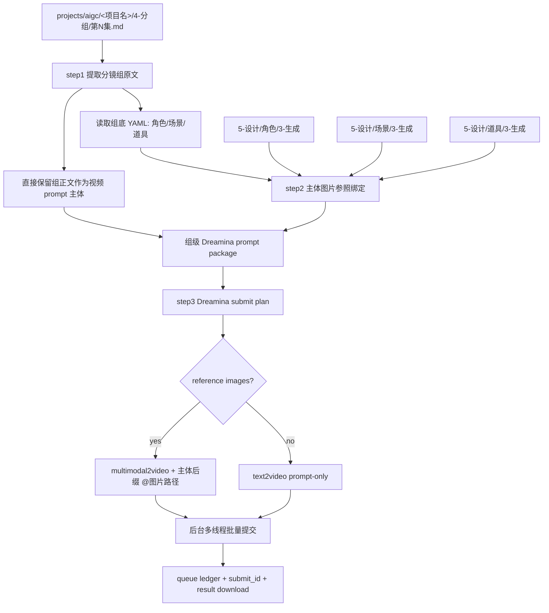
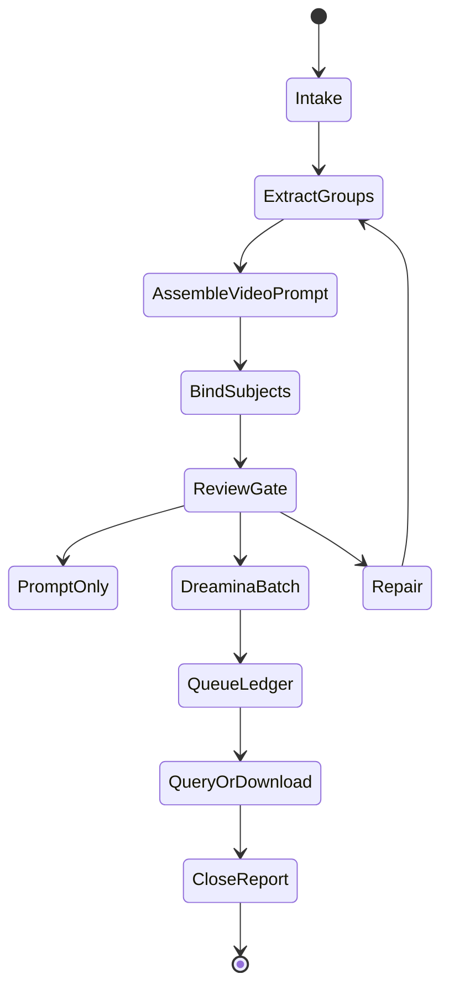

# aigc 7-视频 / C-主体参照

`C-主体参照` 负责把 `projects/aigc/<项目名>/4-分组/` 中的每个分镜组转为一条组级 Dreamina 视频生成任务：直接使用现有分镜组内容作为生视频提示词主体，按组底 YAML 绑定角色、场景、道具图片参照，并调用 `.agents/skills/cli/dreamina-cli` 以分镜组为单位批量提交视频任务。

## Context Loading Contract

- 每次调用本技能时，必须同时加载同目录 `CONTEXT.md`。
- 每次调用本技能时，必须同时识别并加载同目录 `types/` 中选中的类型包（单选或多选）。
- 若任务绑定 `projects/aigc/<项目名>/`，必须先加载项目根 `MEMORY.md`，再加载 `projects/aigc/<项目名>/0-初始化/north_star.yaml` 与项目根 `CONTEXT/` 中和视频阶段、主体资产、生成偏好相关的上下文。
- `4-分组` 是本技能的主要信息来源；不得回到 `3-摄影`、`3-Detail` 或更早阶段重写分镜组内容，除非用户显式要求修复上游。
- 分镜组视频 prompt 主体直接采用 `4-分组` 的现有分镜组正文；LLM 只负责裁决提取范围、保真组织、缺口说明和审查，不得扩写或改写剧情事实。
- 主体参照以分镜组底部 YAML 的 `角色 / 场景 / 道具` 为基准；不得用正文泛词、子串或猜测名自动扩展主体列表。
- 调用 Dreamina 前必须加载 `.agents/skills/cli/dreamina-cli/SKILL.md + CONTEXT.md`，并遵守其登录自检、命令选择、队列台账和异步查询规则。
- 冲突优先级：用户显式请求 > 根 `AGENTS.md` / meta 规则 > `.agents/skills/aigc/SKILL.md` > `.agents/skills/aigc/7-视频/SKILL.md` > 本 `SKILL.md` > `references/` / `steps/` / `types/` / `review/` / `templates/` > `.agents/skills/cli/dreamina-cli/SKILL.md` > `agents/openai.yaml` > 项目 `MEMORY.md` > 项目 `CONTEXT/` > 本 `CONTEXT.md`。

## Input Contract

Accepted input:

- 项目名、项目路径、单集或多集范围，要求从 `4-分组` 批量生成组级视频。
- 用户指定一个或多个三段式分镜组 ID，例如 `1-1-1`。
- 已有 `7-视频/C-主体参照/` prompt、参照绑定、Dreamina 计划、队列或结果需要 repair / review / rerun。
- 一次处理一集或多个分镜组，并默认按后台多线程批量并发提交 Dreamina 视频任务。

Required input:

- 可定位的 `projects/aigc/<项目名>/4-分组/第N集.md`。
- 每个目标分镜组必须有可解析的 `## x-y-z` 标题、组正文和底部 fenced YAML。
- 可定位的设计生成目录：`5-设计/角色/3-生成`、`5-设计/场景/3-生成`、`5-设计/道具/3-生成`；目录缺失时允许 prompt-only 或缺图继续，但必须写入报告。
- 调用 Dreamina 前必须能确定项目内输出目录，默认 `projects/aigc/<项目名>/7-视频/C-主体参照/第N集/`。

Optional input:

- `prompt_only`：只生成视频 prompt、参照 manifest、Dreamina 计划，不提交任务。
- `episode_batch`：一次处理一集全部分镜组。
- `group_batch`：一次处理多个指定分镜组。
- `multi_episode_batch`：一次处理多集，每集保持独立队列与报告。
- `dreamina_model`：默认 `seedance2.0`，可按 `.agents/skills/cli/dreamina-cli` 当前子命令能力调整。
- `duration`：默认 15 秒；必须落在 Dreamina 当前视频命令允许范围内。
- `parallelism`：默认后台多线程批量并发提交；若用户未指定，按保守并发执行并记录实际值。
- 用户指定 aspect ratio、resolution、额外禁止项、输出目录、rerun / replace 策略或只查询既有 `submit_id`。

Reject or clarify when:

- `4-分组` 缺失、目标分镜组 ID 无法唯一追溯，或组底 YAML 缺失到无法确定主体槽位。
- 用户要求改变 `4-分组` 的剧情核心、镜头顺序、角色事实、动作结果或组边界。
- 用户要求脚本主创视频 prompt 正文、自动扩写剧情或用模板补写未知画面。
- 任务目标是基于单帧或故事板图像做视频首帧/故事板参照，应转入 `A-分镜画面参照` 或 `B-分镜故事板参照`。

## Positioning

本技能是 `7-视频` 阶段的组级主体参照视频入口，向上承接 `4-分组`，向下调用 `.agents/skills/cli/dreamina-cli`。它拥有组级视频 prompt 包、主体参照绑定、Dreamina 提交计划、队列台账、异步结果持久化和执行报告的裁决权；它不拥有上游分组改写权，也不拥有主体资产重设计权。

## LLM-First Creative Authorship Contract

- 视频 prompt 中的创作性组织必须由 LLM 直接完成，但事实主体必须来自 `4-分组` 原文，不得由脚本拼接生成 canonical creative truth。
- 主体槽位裁决以 YAML 为准；脚本只能读取、解析、校验、枚举文件、生成命令计划和队列台账。
- `.agents/skills/cli/dreamina-cli` 是生成运输层；不得把它的命令模板或脚本输出视为剧情、镜头或主体判断的主真源。

## Mode Selection

| mode | 触发信号 | 主要动作 |
| --- | --- | --- |
| `prompt_only` | 只要求提示词、配置或提交计划 | 执行 step1-step2，写 prompt、reference manifest、Dreamina plan |
| `single_group_generate` | 指定一个三段式分镜组 ID 且要求出视频 | 执行 step1-step3，单组调用 Dreamina |
| `episode_batch_generate` | 指定一集或默认整集批量 | 对该集全部分镜组执行 step1-step3，默认后台多线程并发提交 |
| `group_batch_generate` | 指定多个分镜组 ID | 只处理目标分镜组集合，保持独立 prompt、引用和 submit_id |
| `multi_episode_batch_generate` | 指定多集或多个 `第N集.md` | 每集独立索引、计划、队列和报告，提交层可统一并发 |
| `query_or_download` | 已有 submit_id，需要查询或下载 | 按 Dreamina queue ledger 和 `query_result` 更新结果 |
| `repair` | prompt 缺组、槽位错绑、图片缺失、提交计划漂移 | 按 `review/review-contract.md` 定位返工节点 |
| `review_only` | 只检查现有输出 | 审查 prompt、参照、Dreamina 计划、队列与落盘结果，不提交新任务 |

## Reference Loading Guide

| 场景 | 必读文件 |
| --- | --- |
| 从 `4-分组` 提取组级正文与底部 YAML | `references/group-source-extraction.md` |
| 组装组级视频 prompt | `references/video-prompt-assembly-contract.md` |
| 查找并绑定角色、场景、道具参照图 | `references/reference-slot-binding.md` |
| 调用 `.agents/skills/cli/dreamina-cli` 与批量生成交接 | `references/dreamina-handoff.md` |
| 执行 step1-step3 主流程 | `steps/subject-reference-video-workflow.md` |
| 判定单组、整集、多组、多集、查询、修复模式 | `types/type-map.md` |
| 输出审查与返工 | `review/review-contract.md` |
| 输出模板 | `templates/output-template.md`、`templates/dreamina-submit-plan.template.json` |
| 脚本辅助边界 | `scripts/README.md` |
| 可复用经验 | `knowledge-base/video-subject-reference-heuristics.md` |
| 产品侧入口元数据 | `agents/openai.yaml` |

## Visual Maps

## Execution Contract

1. 加载本 `SKILL.md + CONTEXT.md`；项目任务中加载 `MEMORY.md`、`north_star.yaml` 与相关项目上下文；提交任务前加载 `.agents/skills/cli/dreamina-cli/SKILL.md + CONTEXT.md`。
2. 按 `types/type-map.md` 锁定 mode、集号范围、目标分镜组集合、是否执行 Dreamina、并发策略和输出根。
3. 执行 step1：以 `projects/aigc/<项目名>/4-分组` 为主要信息来源，解析每个 `## x-y-z` 分镜组，完整提取组正文和底部 YAML；视频 prompt 主体直接使用现有组内容，不进行剧情改写。
4. 执行 step2：读取每个分镜组底部 YAML 的 `角色 / 场景 / 道具`，检查 `projects/aigc/<项目名>/5-设计/角色/3-生成`、`5-设计/场景/3-生成`、`5-设计/道具/3-生成` 中是否存在对应主体名称图片；多视图优先，没有多视图就主图，都没有就空着并从参照图片数组中移除；有图主体必须在对应主体信息后追加 `@<图片路径>`。
5. 执行 step3：根据每个分镜组的完整组正文和已绑定主体图片，生成符合 `.agents/skills/cli/dreamina-cli` 的提交计划。存在参照图时优先 `dreamina multimodal2video --image ... --prompt ...`，并在 prompt 的角色、场景、道具主体信息后以内联 `@<图片路径>` 显式绑定本地图片；无参照图时走 `dreamina text2video --prompt ...`，禁止传空图片槽。
6. 生成前必须运行 `dreamina user_credit`；Dreamina CLI 不可用或登录失败时，写入 `blocked` 队列状态，不得伪造 submit_id。
7. 默认以分镜组为单位后台多线程批量并发提交；每个任务只能写自己的 submit 记录、下载文件和状态行；统一报告在汇流阶段写入。
8. 所有异步任务必须进入 queue ledger，至少记录 `queue_id / group_id / command / submit_id / local_status / remote_status / prompt_summary / reference_images / output_path / next_action`。
9. 每个分镜组的 canonical 输出写入 `projects/aigc/<项目名>/7-视频/C-主体参照/第N集/`，视频文件默认写入其 `videos/` 子目录。
10. 交付前执行 `review/review-contract.md`；组 ID 追溯、组正文完整性、YAML 主体基准、参照路径存在性、Dreamina 命令合法性、队列台账和项目内持久化必须通过。

## Field Mapping

| field_id | 输出/证据 | 内容要求 | 失败码 |
| --- | --- | --- | --- |
| `FIELD-VIDSUBJ-01` | input manifest | 项目根、集号、`4-分组`、设计生成目录、Dreamina 环境可追溯 | `FAIL-VIDSUBJ-INPUT` |
| `FIELD-VIDSUBJ-02` | group index | 三段式 `x-y-z` 可回指 `## x-y-z`，组正文和 YAML 被完整提取 | `FAIL-VIDSUBJ-GROUP` |
| `FIELD-VIDSUBJ-03` | video prompt package | 现有组内容作为主体，保留分镜顺序、入场/出场画面、镜头语言和音效 | `FAIL-VIDSUBJ-PROMPT` |
| `FIELD-VIDSUBJ-04` | reference manifest | Characters / Scene / Props 只来自组底 YAML，且只绑定真实图片，多视图优先 | `FAIL-VIDSUBJ-REF` |
| `FIELD-VIDSUBJ-05` | Dreamina submit plan / queue | 一组一任务，合法 `text2video` 或 `multimodal2video` 命令，默认并发提交，有 submit_id 台账 | `FAIL-VIDSUBJ-DREAMINA` |
| `FIELD-VIDSUBJ-06` | execution report | 说明 submitted / queued / downloaded / skipped / failed、缺图、查询入口和返工入口 | `FAIL-VIDSUBJ-REPORT` |

## Field Master

| field_id | owner | canonical file | must contain | fail code |
| --- | --- | --- | --- | --- |
| `FIELD-VIDSUBJ-01` | input lock | `第N集-video-group-index.json` / report | 项目根、集号、`4-分组`、设计生成目录、Dreamina self-check | `FAIL-VIDSUBJ-INPUT` |
| `FIELD-VIDSUBJ-02` | group extraction | `第N集-video-group-index.json` | `group_id`、source heading、shot count、YAML subjects | `FAIL-VIDSUBJ-GROUP` |
| `FIELD-VIDSUBJ-03` | prompt assembly | `第N集-主体参照-video-prompts.md` | 组正文主体、完整分镜顺序、主体信息后缀 `@图片路径` | `FAIL-VIDSUBJ-PROMPT` |
| `FIELD-VIDSUBJ-04` | reference binding | `第N集-reference-manifest.json` | 角色/场景/道具真实图片路径，多视图优先，无空槽位 | `FAIL-VIDSUBJ-REF` |
| `FIELD-VIDSUBJ-05` | Dreamina handoff | `第N集-dreamina-submit-plan.json` / `第N集-dreamina-queue.md` | 一组一任务、命令参数、并发策略、submit_id、查询动作 | `FAIL-VIDSUBJ-DREAMINA` |
| `FIELD-VIDSUBJ-06` | convergence | `执行报告.md` | submitted / queued / downloaded / skipped / failed、review verdict、返工入口 | `FAIL-VIDSUBJ-REPORT` |

## Thought Pass Map

| pass_id | focus field | core question | action | evidence |
| --- | --- | --- | --- | --- |
| `PASS-VIDSUBJ-01` | `FIELD-VIDSUBJ-01` | 本轮处理哪个项目、集号、分镜组范围和 Dreamina 执行意图 | 锁定 mode、读取项目上下文和 Dreamina 自检要求 | input manifest |
| `PASS-VIDSUBJ-02` | `FIELD-VIDSUBJ-02` | 如何从 `4-分组` 保真提取组正文和 YAML | 解析 `## x-y-z` 与 fenced YAML | group index |
| `PASS-VIDSUBJ-03` | `FIELD-VIDSUBJ-03` | 如何保证视频 prompt 直接使用组内容且适配 Dreamina | 保留组正文主体，添加最小 provider 指令和主体后缀 `@图片路径` | prompt markdown |
| `PASS-VIDSUBJ-04` | `FIELD-VIDSUBJ-04` | 哪些 YAML 主体有真实本地图片可绑定 | 多视图优先、主图次之、缺图移除槽位 | reference manifest |
| `PASS-VIDSUBJ-05` | `FIELD-VIDSUBJ-05` | Dreamina 命令如何批量安全执行并可续查 | 生成一组一任务 submit plan、queue ledger 并按需调用 | plan / queue / results |
| `PASS-VIDSUBJ-06` | `FIELD-VIDSUBJ-06` | 输出如何闭环并可返工 | 汇总审查、失败、跳过、submit_id 和下载路径 | execution report |

## Pass Table

| pass_id | pass standard | fail code | rework entry |
| --- | --- | --- | --- |
| `PASS-VIDSUBJ-01` | 必需输入可读，设计生成目录状态与 Dreamina 执行意图已记录 | `FAIL-VIDSUBJ-INPUT` | `types/type-map.md` |
| `PASS-VIDSUBJ-02` | 每个 `group_id` 唯一且可回指源标题、组正文和 YAML | `FAIL-VIDSUBJ-GROUP` | `references/group-source-extraction.md` |
| `PASS-VIDSUBJ-03` | prompt 直接采用现有组正文主体，镜头未缺失乱序，参照标记可读 | `FAIL-VIDSUBJ-PROMPT` | `references/video-prompt-assembly-contract.md` |
| `PASS-VIDSUBJ-04` | 所有绑定路径存在，且图片选择遵守 YAML 基准和多视图优先 | `FAIL-VIDSUBJ-REF` | `references/reference-slot-binding.md` |
| `PASS-VIDSUBJ-05` | Dreamina plan 一组一任务，命令合法，队列可续查，输出路径在项目内 | `FAIL-VIDSUBJ-DREAMINA` | `references/dreamina-handoff.md` |
| `PASS-VIDSUBJ-06` | 执行报告记录 verdict、处理范围、submit_id、失败/跳过与返工入口 | `FAIL-VIDSUBJ-REPORT` | `review/review-contract.md` |

## Root-Cause Execution Contract (Mandatory)

出现失败时必须沿链路上溯：

`Symptom -> Direct Cause -> Section Owner -> Source Contract -> AGENTS.md / skill-工作车间`

优先修复：

1. 组无法追溯或 YAML 解析失败：回到 `references/group-source-extraction.md` 与 `steps/subject-reference-video-workflow.md`。
2. prompt 缺镜头、改写组正文或 Dreamina 引用标记不清：回到 `references/video-prompt-assembly-contract.md`。
3. 槽位错绑、路径不存在、猜测引用或没有多视图优先：回到 `references/reference-slot-binding.md`。
4. Dreamina 命令选错、并发写位冲突、缺少 `user_credit` 或队列不可续查：回到 `.agents/skills/cli/dreamina-cli/SKILL.md` 与 `references/dreamina-handoff.md`。
5. 输出格式不一致：回到 `templates/output-template.md`。
6. 同类失败可复用：沉淀到同目录 `CONTEXT.md`，稳定后晋升到本文件或分区规范。

## Output Contract

Required output:

- 组级视频 prompt 包、参照绑定 manifest、Dreamina 提交计划、队列台账、生成结果记录、逐集执行报告。

Output format:

- Markdown prompt 文档 + JSON manifest / submit plan / results + Markdown queue ledger / report；生成视频为 MP4 或 Dreamina 返回的当前视频格式。

Output path:

- 技能包：`.agents/skills/aigc/7-视频/C-主体参照/`
- 项目运行时：`projects/aigc/<项目名>/7-视频/C-主体参照/第N集/`
- 视频下载目录：`projects/aigc/<项目名>/7-视频/C-主体参照/第N集/videos/`

Naming convention:

- prompt 文档命名 `第N集-主体参照-video-prompts.md`
- 索引命名 `第N集-video-group-index.json`
- 参照清单命名 `第N集-reference-manifest.json`
- 提交计划命名 `第N集-dreamina-submit-plan.json`
- 队列台账命名 `第N集-dreamina-queue.md`
- 结果记录命名 `第N集-dreamina-results.json`
- 执行报告命名 `执行报告.md`
- 视频文件命名 `<分镜组ID>.mp4` 或 `<分镜组ID>-<submit_id>.mp4`

Completion gate:

- 目标分镜组均可从 `4-分组` 回指。
- 每条 prompt 完整保留组正文主体，且主体参照只来自组底 YAML。
- 参照槽位只绑定存在的本地图片且多视图优先；缺图不保留空路径。
- Dreamina 命令计划符合 `.agents/skills/cli/dreamina-cli` 当前命令约束，提交前有 `user_credit` 自检策略。
- 执行生成时有 queue ledger 和 submit_id 追踪；审查结果为 `pass` 或 `pass_with_todo`。
