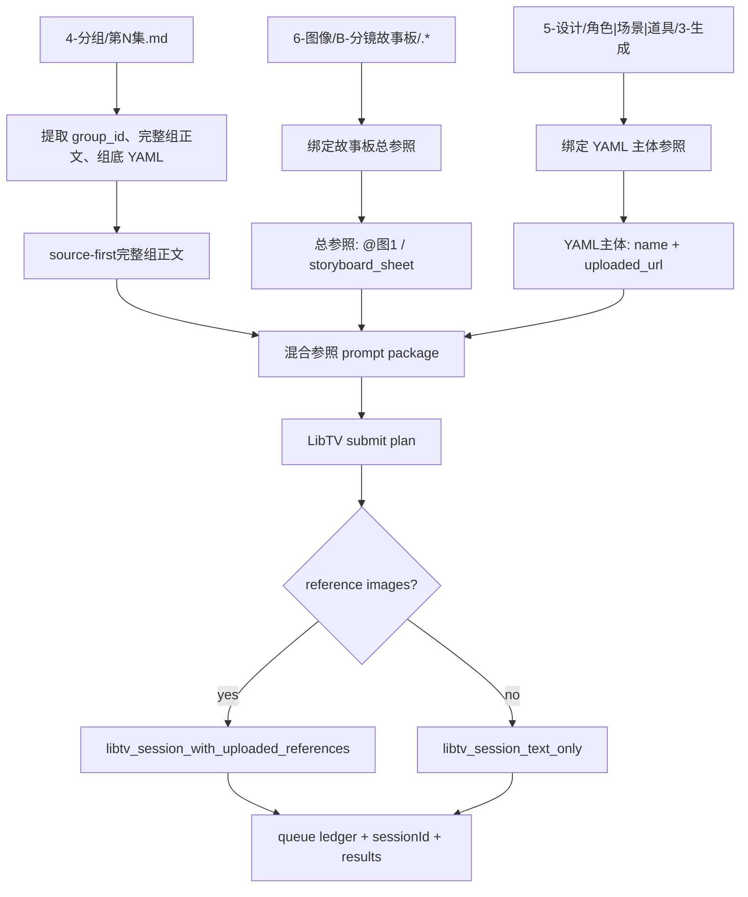

# aigc 7-视频 / D-主板混合参照

`D-主板混合参照` 负责把 `projects/aigc/<项目名>/4-分组/` 中的分镜组转为 LibTV 组级视频生成任务，并在同一个分镜组提示词中同时导入两类参照：`6-图像/B-分镜故事板` 中与 `group_id` 对应的故事板图作为整组总参照，`5-设计/角色|场景|道具/3-生成` 中与组底 YAML 主体对应的图片作为主体参照。故事板和主体参照必须注入 source-first fenced YAML 的 `uploaded_url` 字段；用途说明进入远端 `【直接生成请求】`，不得在本地 prompt 前另起说明段。

## Context Loading Contract

- 每次调用 `$aigc-video-hybrid-board-subject-reference` 时，必须同时加载同目录 `CONTEXT.md`。
- 每次调用本技能时，必须同时加载同目录 `CONTEXT.md`。
- 每次调用本技能时，必须同时识别并加载同目录 `types/` 中选中的类型包（单选或多选）。
- 若任务绑定 `projects/aigc/<项目名>/`，必须先加载项目根 `MEMORY.md`，再加载 `projects/aigc/<项目名>/0-初始化/north_star.yaml` 与项目根 `CONTEXT/` 中和视频阶段、主体资产、故事板、生成偏好相关的上下文。
- `4-分组` 是视频 prompt 主体的主要信息来源；不得回到 `3-摄影`、`3-Detail` 或更早阶段重写分镜组内容，除非用户显式要求修复上游。
- 分镜组视频 prompt 主体直接采用 `4-分组` 的现有分镜组正文；LLM 只负责保真组织 source-first enriched YAML、故事板与主体 uploaded_url 绑定、缺口说明和审查，不得扩写或改写剧情事实。
- 故事板总参照只来自 `projects/aigc/<项目名>/6-图像/B-分镜故事板/` 中与 `group_id` 对应的真实本地图片；主体参照只来自组底 YAML 的 `角色 / 场景 / 道具` 与 `5-设计/*/3-生成` 的真实本地图片。
- 指定视频生成时必须调用 `.agents/skills/cli/libTV` 官方技能包完成；执行顺序以 `references/libtv-handoff.md` 的官方脚本顺序为准：按需 `change_project.py`、逐图 `upload_file.py`、`create_session.py`、`query_session.py`、生成完成后 `download_results.py` 自动下载。
- 调用 LibTV 前必须加载 `.agents/skills/cli/libTV/SKILL.md`，并遵守其登录自检、命令选择、图片上限、队列台账、画布同步和异步查询规则。
- 发送给 LibTV 远端画布的 `*-libtv-submission.txt` 必须以 D 路线专属的 `【LibTV 调用锁定】` 开头：有任一故事板或主体参照图时固定 `provider=seedance2.0 / taskType=video / modeType=mixed2video / mixedList=[{"url": "<真实 uploaded_url>", "type": "image"}]`；无图时固定 `modeType=text2video`。D 路线的故事板总参照和主体参照必须在同一个 `mixed2video` 任务里生效。
- D 路线真实提交给 LibTV 的单组 `mixedList` 最多 9 张图，且 9 张预算包含故事板总参照和所有主体参照；超限时故事板总参照优先保留，其次角色和场景优先，先排除道具，再排除重复、不必要或可由源文本保留的次要主体；无法合理压到 9 张以内时不得提交。
- 冲突优先级：用户显式请求 > 根 `AGENTS.md` / meta 规则 > `.agents/skills/aigc/SKILL.md` > `.agents/skills/aigc/7-视频/SKILL.md` > 本 `SKILL.md` > `references/` / `steps/` / `types/` / `review/` / `templates/` > `.agents/skills/cli/libTV/SKILL.md` > `agents/openai.yaml` > 项目 `MEMORY.md` > 项目 `CONTEXT/` > 本 `CONTEXT.md`。

## Multi-Subskill Continuous Workflow

当本技能被整体调用时，在满足必要输入、显式选择和安全门后，不再为“是否继续下一步”额外确认。

- 无序号同级子技能包默认全选并发执行，由所属父级汇总、裁决和写回唯一 canonical 输出。
- 数字序号子技能包或节点默认按数字升序串行执行，前一节点产物自动作为后一节点输入。
- 英文序号子技能包或路线默认按用户意图、父级路由或输入类型单选分流；只有用户明确要求对比、并跑或批量多路线时才多选。
- 卫星技能、旁路 reviewer、query/resume/review 类辅助入口不默认纳入主链连续调度；只有用户请求、阶段门禁或父级合同显式需要时才回接。
- 连续调度不得绕过阻断门：缺少项目根、分镜组、故事板总参照裁决、主体参照裁决、`LIBTV_ACCESS_KEY` 或既有队列归属会造成错误提交时，必须先阻断并说明最小修复项。
- 每个被调度的子技能包仍必须加载自身 `SKILL.md + CONTEXT.md`；脚本只能承担机械辅助，不得替代 LLM 视频 prompt 主创、参照裁决或父级最终裁决。

## Input Contract

Accepted input:

- 项目名、项目路径、单集或多集范围，要求从 `4-分组` 批量生成组级视频，并同时使用故事板总参照与主体参照。
- 用户指定一个或多个三段式分镜组 ID，例如 `1-1-1`。
- 用户要求“主体参照和分镜故事板参照合二为一”“同一分镜组提示词既导入主体参照图又导入分镜故事板”“主体后 @参照图”“故事板作为总参照”等任务。
- 已有 `7-视频/D-主板混合参照/` prompt、参照绑定、LibTV 计划、队列或结果需要 repair / review / rerun / query。

Required input:

- 可定位的 `projects/aigc/<项目名>/4-分组/第N集.md`。
- 每个目标分镜组必须有可解析的 `## x-y-z` 标题、组正文和底部 fenced YAML。
- 可定位的故事板候选目录：`projects/aigc/<项目名>/6-图像/B-分镜故事板/第N集/`。
- 可定位的设计生成目录：`5-设计/角色/3-生成`、`5-设计/场景/3-生成`、`5-设计/道具/3-生成`；目录缺失时允许 prompt-only 或缺图继续，但必须写入报告。
- 调用 LibTV 前必须能确定项目内输出目录，默认 `projects/aigc/<项目名>/7-视频/D-主板混合参照/第N集/`。

Optional input:

- `prompt_only`：只生成视频 prompt、参照 manifest、LibTV 提交计划，不提交任务。
- `episode_batch`：一次处理一集全部分镜组。
- `group_batch`：一次处理多个指定分镜组。
- `multi_episode_batch`：一次处理多集，每集保持独立队列与报告。
- `prompt_fidelity_mode`：默认 `strict_original`；可选 `strict_original / transport_only / libtv_optimize`。
- `allow_libtv_prompt_optimization`：默认 `false`。只有用户显式设为 `true` 或显式选择 `libtv_optimize` 时，才允许 LibTV 远端 Agent 做提示词优化、摘要、镜头重排、补镜头或重新编排。
- 默认视频规格为 720P、16:9、声音开启；`duration` 默认从当前分镜组 `4-分组` 组底 YAML 的 `时长估算` 读取，并按 LibTV 当前范围 clamp 到 4-15 秒：估算值小于等于 4 秒时按 4 秒，4 到 15 秒之间按估算值，估算值大于等于 15 秒时按 15 秒。用户显式指定 LibTV 模型、duration、ratio、resolution、额外禁止项、输出目录、rerun / replace 策略、下载策略或并发数时，以用户要求为准。

Reject or clarify when:

- `4-分组` 缺失、目标分镜组 ID 无法唯一追溯，或组底 YAML 缺失到无法确定主体槽位。
- 用户要求改变 `4-分组` 的剧情核心、镜头顺序、角色事实、动作结果或组边界。
- 用户要求脚本主创视频 prompt 正文、自动扩写剧情或用模板补写未知画面。
- 任务目标只需要单一故事板参照，应转入 `B-分镜故事板参照`；只需要主体参照，应转入 `C-主体参照`；只需要镜级分镜画面参照，应转入 `A-分镜画面参照`。

## Positioning

本技能是 `7-视频` 阶段的组级混合参照视频入口，向上承接 `4-分组`，横向读取 `6-图像/B-分镜故事板` 与 `5-设计/*/3-生成`，向下调用 `.agents/skills/cli/libTV`。它拥有混合参照视频 prompt 包、故事板与主体参照 manifest、LibTV 提交计划、队列台账、异步结果持久化和执行报告的裁决权；它不拥有上游分组改写权、故事板图生成权或主体资产重设计权。

## LLM-First Creative Authorship Contract

- 视频 prompt 中的参照语义说明、source-first YAML 绑定、运动/声音约束和失败诊断必须由 LLM 直接完成。
- 脚本只允许承担读取、抽取、路径匹配、YAML/JSON 投影、队列台账、并发提交、状态查询、下载和校验等机械辅助职责。
- 脚本不得把 `4-分组` 正文规则拼接成新的创作正文，不得扩写剧情、替代镜头判断或生成 canonical prompt truth。
- 参照图路径属于机械绑定；故事板作为总参照、主体图片跟随对应主体的语义裁决，必须由本技能合同和 LLM 审查裁决。

## Mode Selection

| mode | 触发信号 | 主要动作 |
| --- | --- | --- |
| `prompt_only` | 只要求提示词、配置或提交计划 | 执行 step1-step2，写 prompt、reference manifest、LibTV plan |
| `single_group_generate` | 指定一个三段式分镜组 ID 且要求出视频 | 执行 step1-step3，单组调用 LibTV |
| `episode_batch_generate` | 指定一集或默认整集批量 | 对该集全部分镜组执行 step1-step3，默认后台多线程并发提交 |
| `group_batch_generate` | 指定多个分镜组 ID | 只处理目标分镜组集合，保持独立 prompt、引用和 sessionId |
| `multi_episode_batch_generate` | 指定多集或多个 `第N集.md` | 每集独立索引、计划、队列和报告，提交层可统一并发 |
| `query_or_download` | 已有 sessionId，需要查询或下载 | 按 LibTV queue ledger 和 `query_session` 更新结果 |
| `repair` | prompt 缺组、source-first YAML 绑定缺失、主体错绑、故事板错绑、提交计划漂移 | 按 `review/review-contract.md` 定位返工节点 |
| `review_only` | 只检查现有输出 | 审查 prompt、参照、LibTV 计划、队列与落盘结果，不提交新任务 |

## Prompt Fidelity Modes

默认提交策略为 `strict_original + transport_only`：

| fidelity_mode | 允许 | 禁止 | 默认 |
| --- | --- | --- | --- |
| `strict_original` | 直接把 `4-分组` 的组正文作为生成 prompt 主体；保留原有镜头顺序、段落、对白、音效、转场和分镜明细 | 改写、摘要、重排、合并镜头、补镜头、重新编排、把正文转为优化版提示词 | yes |
| `transport_only` | 只做运输层投影：本地路径换为上传 URL、补 `mixed2video / mixedList / duration / ratio / resolution / enableSound` 参数、按 provider 上限裁剪非关键参照图 | 改写 `group_body`、压缩剧情、重组镜头、替换原文表达 | yes |
| `libtv_optimize` | 允许 LibTV 远端 Agent 进行提示词优化、摘要、镜头合并、工作流规划或重新编排 | 未经用户显式同意时启用 | no |

- `allow_libtv_prompt_optimization` 默认必须为 `false`。
- 远端 `*-libtv-submission.txt` 必须明确声明：禁止提示词优化、禁止重新编排、禁止摘要、禁止改写、禁止补镜头；直接使用 source-first enriched YAML 形态的 `【分镜组源文本】` 作为 Seedance 生成 prompt 完整体，其中 fenced YAML 的 `故事板参照.uploaded_url` 和主体列表项 `uploaded_url` 绑定故事板总参照/主体名与 uploaded URL；提交文本不得另起 `【混合参照说明】`，不得人工预设 `参照图1/2/N` 编号，避免和 LibTV 导入图片后生成的真实编号冲突。
- `transport_only` 不等于提示词优化；它只允许上传 URL、参照图数量上限裁剪和视频参数补齐，不允许改变分镜内容。
- 若用户显式选择 `libtv_optimize`，必须在 submit plan、queue 和 report 中记录该选择；否则任何远端优化、重排或摘要都按 `route drift / prompt fidelity violation` 处理。

## Reference Loading Guide

| 场景 | 必读文件 |
| --- | --- |
| 从 `4-分组` 提取组级正文与底部 YAML | `references/group-source-extraction.md` |
| 组装 source-first mixed-reference prompt | `references/hybrid-prompt-assembly-contract.md` |
| 查找并绑定故事板总参照与主体参照图 | `references/hybrid-reference-binding.md` |
| 调用 `.agents/skills/cli/libTV` 与批量生成交接 | `references/libtv-handoff.md` |
| 执行 step1-step3 主流程 | `steps/hybrid-reference-video-workflow.md` |
| 判定单组、整集、多组、多集、查询、修复模式 | `types/type-map.md` |
| 输出审查与返工 | `review/review-contract.md` |
| 输出模板 | `templates/output-template.md`、`templates/libtv-submit-plan.template.json` |
| 脚本辅助边界 | `scripts/README.md` |
| 可复用经验 | `knowledge-base/hybrid-reference-video-heuristics.md` |
| 产品侧入口元数据 | `agents/openai.yaml` |

## Visual Maps

## Execution Contract

1. 加载本 `SKILL.md + CONTEXT.md`；项目任务中加载 `MEMORY.md`、`north_star.yaml` 与相关项目上下文；提交任务前加载 `.agents/skills/cli/libTV/SKILL.md`。
2. 按 `types/type-map.md` 锁定 mode、集号范围、目标分镜组集合、是否执行 LibTV、并发策略和输出根。
3. step1：以 `projects/aigc/<项目名>/4-分组` 为主要信息来源，解析每个 `## x-y-z` 分镜组，完整提取组正文和底部 YAML；同步提取组底 YAML 的 `时长估算`，形成 `duration_estimate_seconds`；若缺失则按组内 `分镜明细` 秒数求和估算，区间时长优先取上限，仍无法确定才回退 15 秒并记录 `duration_source=fallback_default`；`## x-y-z~x-y-z` 组间连接件默认忽略，不进入混合参照 prompt、故事板总参照、主体参照 manifest、LibTV job 或视频文件命名；视频 prompt 主体直接使用现有组内容，不进行剧情改写。
4. step2a：检查 `projects/aigc/<项目名>/6-图像/B-分镜故事板/第N集/` 下是否存在与 `group_id` 对应的故事板图；优先 `images/<group_id>.*`，其次同集目录内 `<group_id>.*`，允许 `png/jpg/jpeg/webp`。
5. step2b：读取组底 YAML 的 `角色 / 场景 / 道具`，检查 `5-设计/角色/3-生成`、`5-设计/场景/3-生成`、`5-设计/道具/3-生成` 中是否存在对应主体名称图片；多视图优先，没有多视图就主图，都没有就空着并从参照图片数组中移除。
6. step2c：组装本地审核 `prompt.md` 时必须使用 source-first enriched YAML：直接保留原 `## group_id` 分镜组全文，只在 fenced YAML 内注入 `故事板参照.uploaded_url` 和主体列表项 `uploaded_url`；故事板用途和主体连续性说明移入远端 `【直接生成请求】`，不得在 `prompt.md` 前另起固定开头或缺图说明。发送给 LibTV 的 `*-libtv-submission.txt` 必须以 `【LibTV 调用锁定】` 开头锁定 D 专属 `modeType=mixed2video`。
7. step2d：有主体参照图时，必须把对应 YAML 主体列表项对象化并写入 `name + uploaded_url`；故事板图不得夹在某个主体后，只能作为整组总参照写入 YAML `故事板参照` 和 manifest 的 `storyboard_total_reference`。
8. step3：根据每个分镜组的完整组正文、`duration_estimate_seconds`、故事板总参照和主体参照，生成符合 `.agents/skills/cli/libTV` 的提交计划。每组 `duration_hint` 必须按 `clamp(duration_estimate_seconds, 4, 15)` 决定，估算值小于等于 4 秒时按 4 秒，4 到 15 秒之间按估算值，估算值大于等于 15 秒时统一封顶 15 秒。存在任一参照图时先执行 9 图预算裁决，确保真实进入 `mixedList` 的故事板图 + 主体图总数不超过 9；超限时故事板总参照优先保留，其次角色和场景优先，先排除道具，再排除重复、不必要或可由源文本保留的次要主体，并在 manifest / submit plan / report 记录 `excluded_due_to_budget`；无法合理压到 9 张以内时标记 `needs_rework / reference_budget_unresolved`，不得提交。预算通过后逐图运行 `upload_file.py`，再把返回的 uploaded URL 注入 source-first enriched YAML，并锁定 LibTV 调用为 `provider=seedance2.0 / taskType=video / modeType=mixed2video / mixedList=[{"url": "<真实 uploaded_url>", "type": "image"}]`；无参照图时直接运行对应提交文本并锁定 `modeType=text2video`，禁止传空图片槽。远端提交文本不得包含本地图片路径，只能在 `【分镜组源文本】` fenced YAML 内保留真实 uploaded URL 与故事板/主体名绑定；不得人工写入 `参照图1/2/N` 编号。`【直接生成请求】` 必须要求基于下方 `【分镜组源文本】`，并把原始正文和 YAML uploaded_url 共同作为生成 prompt 完整体。默认必须包含 `strict_original + transport_only` 声明，禁止远端 Agent 对 `【分镜组源文本】` 做提示词优化、摘要、重排、改写或补镜头，也禁止把混合参照简化为裸图片 token / 裸图片编号 / 裸 URL。
9. 若故事板图和主体图总数超过 9 张或 $libTV skill scripts 当前图片上限，必须记录 `reference_over_limit` / `excluded_due_to_budget`，按预算裁决、用户策略阻断、压缩主体图、分段提交或降级为文字 prompt，不得静默丢图，不得提交超过 9 张图的任务。
10. 生成前必须运行 `LIBTV_ACCESS_KEY credential check`；$libTV skill scripts 不可用或登录失败时，写入 `blocked` 队列状态，不得伪造 sessionId。
11. 默认以分镜组为单位后台多线程批量并发提交；每个任务只能写自己的 submit 记录、下载文件和状态行；统一报告在汇流阶段写入。
12. 所有异步任务必须进入 queue ledger，至少记录 `queue_id / group_id / command / sessionId / local_status / remote_status / storyboard_reference / subject_references / output_path / next_action`。
13. 每个分镜组的 canonical 输出写入 `projects/aigc/<项目名>/7-视频/D-主板混合参照/第N集/`；生成完成后必须通过 `.agents/skills/cli/libTV/scripts/download_results.py` 自动下载到该集目录，不再默认写入 `videos/` 子目录。
14. 交付前执行 `review/review-contract.md`；组 ID 追溯、组正文完整性、source-first YAML 绑定、YAML 主体基准、故事板路径、主体路径、LibTV submit plan合法性、队列台账和项目内持久化必须通过。

## Field Mapping

| field_id | 输出/证据 | 内容要求 | 失败码 |
| --- | --- | --- | --- |
| `FIELD-VIDHYB-01` | input manifest | 项目根、集号、`4-分组`、故事板目录、设计生成目录、LibTV 环境可追溯 | `FAIL-VIDHYB-INPUT` |
| `FIELD-VIDHYB-02` | group index | 三段式 `x-y-z` 可回指 `## x-y-z`，组正文和 YAML 被完整提取 | `FAIL-VIDHYB-GROUP` |
| `FIELD-VIDHYB-03` | video prompt package | source-first enriched YAML：现有组内容主体 + fenced YAML `故事板参照.uploaded_url` 和主体 `uploaded_url` 绑定；远端 `*-libtv-submission.txt` 以 D 专属 `【LibTV 调用锁定】` 开头且有图时锁定 `mixed2video + mixedList`；默认 `strict_original + transport_only` 且禁止远端优化；不得预设 `参照图N` 人工编号，最终生成 prompt 必须保留故事板/主体名与真实图片 token/编号/URL 绑定 | `FAIL-VIDHYB-PROMPT` |
| `FIELD-VIDHYB-04` | reference manifest | 故事板总参照来自 `6-图像/B-分镜故事板`，主体参照来自 YAML 和 `5-设计` 真实图片 | `FAIL-VIDHYB-REF` |
| `FIELD-VIDHYB-05` | LibTV submit plan / queue | 一组一任务，合法 `libtv_session_text_only` 或 `libtv_session_with_uploaded_references` 命令，`duration_hint=clamp(duration_estimate_seconds, 4, 15)`，`mixedList` <= 9，默认并发提交，有 sessionId 台账 | `FAIL-VIDHYB-LIBTV` |
| `FIELD-VIDHYB-06` | execution report | 说明 submitted / queued / downloaded / skipped / failed、缺图、查询入口和返工入口 | `FAIL-VIDHYB-REPORT` |

## Field Master

| field_id | owner | canonical file | must contain | fail code |
| --- | --- | --- | --- | --- |
| `FIELD-VIDHYB-01` | input lock | `第N集-hybrid-group-index.json` / report | 项目根、集号、`4-分组`、故事板目录、设计生成目录、LibTV self-check | `FAIL-VIDHYB-INPUT` |
| `FIELD-VIDHYB-02` | group extraction | `第N集-hybrid-group-index.json` | `group_id`、source heading、shot count、YAML subjects | `FAIL-VIDHYB-GROUP` |
| `FIELD-VIDHYB-03` | prompt assembly | `第N集-主板混合参照-video-prompts.md` / `prompts/*-libtv-submission.txt` | source-first enriched YAML、组正文主体、fenced YAML 内故事板总参照和主体 uploaded_url；远端提交首段为 `【LibTV 调用锁定】` 和正确 `modeType`；远端生成 prompt 完整体必须包含源文本原文和 YAML uploaded_url 绑定；默认记录 `allow_libtv_prompt_optimization=false` | `FAIL-VIDHYB-PROMPT` |
| `FIELD-VIDHYB-04` | reference binding | `第N集-reference-manifest.json` | storyboard_total_reference、角色/场景/道具真实图片路径、多视图优先、无空槽位 | `FAIL-VIDHYB-REF` |
| `FIELD-VIDHYB-05` | LibTV handoff | `第N集-libtv-submit-plan.json` / `第N集-libtv-queue.md` | 一组一任务、命令参数、组级 `duration_estimate_seconds` 与 `duration_hint`、`mixedList` <= 9、并发策略、sessionId、查询动作 | `FAIL-VIDHYB-LIBTV` |
| `FIELD-VIDHYB-06` | convergence | `执行报告.md` | submitted / queued / downloaded / skipped / failed、review verdict、返工入口 | `FAIL-VIDHYB-REPORT` |

## Thought Pass Map

| pass_id | focus field | core question | action | evidence |
| --- | --- | --- | --- | --- |
| `PASS-VIDHYB-01` | `FIELD-VIDHYB-01` | 本轮处理哪个项目、集号、分镜组范围和 LibTV 执行意图 | 锁定 mode、读取项目上下文和 LibTV 自检要求 | input manifest |
| `PASS-VIDHYB-02` | `FIELD-VIDHYB-02` | 如何从 `4-分组` 保真提取组正文和 YAML | 解析 `## x-y-z` 与 fenced YAML | group index |
| `PASS-VIDHYB-03` | `FIELD-VIDHYB-03` | 如何保证故事板总参照和主体参照都进入同一 prompt | 保留 source-first 组正文，在 fenced YAML 注入故事板和主体 uploaded_url | prompt markdown |
| `PASS-VIDHYB-04` | `FIELD-VIDHYB-04` | 哪些故事板和 YAML 主体有真实本地图片可绑定 | 故事板按 group_id，主体多视图优先、主图次之、缺图移除槽位 | reference manifest |
| `PASS-VIDHYB-05` | `FIELD-VIDHYB-05` | LibTV submit plan如何批量安全执行并可续查 | 生成一组一任务 submit plan、queue ledger，确认 `mixedList` <= 9 后按需调用 | plan / queue / results |
| `PASS-VIDHYB-06` | `FIELD-VIDHYB-06` | 输出如何闭环并可返工 | 汇总审查、失败、跳过、sessionId 和下载路径 | execution report |

## Pass Table

| pass_id | pass standard | fail code | rework entry |
| --- | --- | --- | --- |
| `PASS-VIDHYB-01` | 必需输入可读，故事板与设计生成目录状态、LibTV 执行意图已记录 | `FAIL-VIDHYB-INPUT` | `types/type-map.md` |
| `PASS-VIDHYB-02` | 每个 `group_id` 唯一且可回指源标题、组正文和 YAML | `FAIL-VIDHYB-GROUP` | `references/group-source-extraction.md` |
| `PASS-VIDHYB-03` | 本地 prompt 为 source-first enriched YAML，现有组内容为主体，故事板和主体参照只在 fenced YAML 内通过 uploaded_url 绑定；远端提交以 D 专属 `【LibTV 调用锁定】` 起笔并锁定 `mixed2video + mixedList`；默认 `strict_original + transport_only` 且未 opt-in 时禁止远端优化 | `FAIL-VIDHYB-PROMPT` | `references/hybrid-prompt-assembly-contract.md` / `references/libtv-handoff.md` |
| `PASS-VIDHYB-04` | 绑定路径存在，故事板不被当作主体，主体不从正文泛词扩展 | `FAIL-VIDHYB-REF` | `references/hybrid-reference-binding.md` |
| `PASS-VIDHYB-05` | LibTV plan 一组一任务，`duration_hint=clamp(duration_estimate_seconds, 4, 15)` 且可回指源组，`mixedList` <= 9，命令合法，队列可续查，输出路径在项目内 | `FAIL-VIDHYB-LIBTV` | `references/libtv-handoff.md` |
| `PASS-VIDHYB-06` | 执行报告记录 verdict、处理范围、sessionId、失败/跳过与返工入口 | `FAIL-VIDHYB-REPORT` | `review/review-contract.md` |

## Root-Cause Execution Contract (Mandatory)

出现失败时必须沿链路上溯：

`Symptom -> Direct Cause -> Section Owner -> Source Contract -> AGENTS.md / skill-工作车间`

优先修复：

1. 组无法追溯或 YAML 解析失败：回到 `references/group-source-extraction.md` 与 `steps/hybrid-reference-video-workflow.md`。
2. prompt 缺 source-first YAML 绑定、故事板用途不清、主体参照未进入对应 YAML 主体项：回到 `references/hybrid-prompt-assembly-contract.md`。
3. 故事板错绑、主体槽位错绑、路径不存在、猜测引用或没有多视图优先：回到 `references/hybrid-reference-binding.md`。
4. LibTV submit plan选错、参照图超过上限未处理、并发写位冲突、缺少 `LIBTV_ACCESS_KEY` credential check 或队列不可续查：回到 `.agents/skills/cli/libTV/SKILL.md` 与 `references/libtv-handoff.md`。
5. 输出格式不一致：回到 `templates/output-template.md`。
6. 同类失败可复用：沉淀到同目录 `CONTEXT.md`，稳定后晋升到本文件或分区规范。

## Output Contract

Required output:

- 组级混合参照视频 prompt 包、故事板与主体参照 manifest、LibTV 提交计划、`*-libtv-submission.txt`、队列台账、生成结果记录、逐集执行报告。

Output format:

- Markdown prompt 文档 + JSON manifest / submit plan / results + Markdown queue ledger / report；生成视频为 MP4 或 LibTV 返回的当前视频格式。

Output path:

- 技能包：`.agents/skills/aigc/7-视频/D-主板混合参照/`
- 项目运行时：`projects/aigc/<项目名>/7-视频/D-主板混合参照/第N集/`
- 视频下载目录：`projects/aigc/<项目名>/7-视频/D-主板混合参照/第N集/`

Naming convention:

- prompt 文档命名 `第N集-主板混合参照-video-prompts.md`
- 每组远端提交文本命名 `prompts/<分镜组ID>-libtv-submission.txt`
- 索引命名 `第N集-hybrid-group-index.json`
- 参照清单命名 `第N集-reference-manifest.json`
- 提交计划命名 `第N集-libtv-submit-plan.json`
- 队列台账命名 `第N集-libtv-queue.md`
- 结果记录命名 `第N集-libtv-results.json`
- 执行报告命名 `执行报告.md`
- 视频文件命名 `<分镜组ID>.mp4`；同组多变体命名 `<分镜组ID>-a.mp4`、`<分镜组ID>-b.mp4`，sessionId 只写入队列台账、结果记录和执行报告

Completion gate:

- 目标分镜组均可从 `4-分组` 回指。
- 每条 prompt 完整保留 source-first 组正文主体，并在 fenced YAML 内说明故事板总参照和主体参照 uploaded_url 绑定。
- 每条 `*-libtv-submission.txt` 首行为 `【LibTV 调用锁定】`，不含本地图片路径；有参照图时锁定 `modeType=mixed2video` 和 `mixedList`，且 `mixedList` <= 9；无图时锁定 `text2video`；默认声明 `strict_original + transport_only` 且 `allow_libtv_prompt_optimization=false`；`【直接生成请求】` 使用 source-first enriched YAML 形态的 `【分镜组源文本】` 作为生成 prompt 完整体；不得另起 `【混合参照说明】`，不得预设 `参照图N` 人工编号。
- 故事板参照只作为整组总参照；主体参照只来自组底 YAML，并在对应 YAML 主体项注入 `uploaded_url`。
- 参照槽位只绑定存在的本地图片且多视图优先；缺图不保留空路径。
- LibTV submit plan符合 `.agents/skills/cli/libTV` 上传、会话、查询和下载约束，提交前有 `LIBTV_ACCESS_KEY` credential check 自检策略。
- 执行生成时有 queue ledger 和 sessionId 追踪；审查结果为 `pass` 或 `pass_with_todo`。
