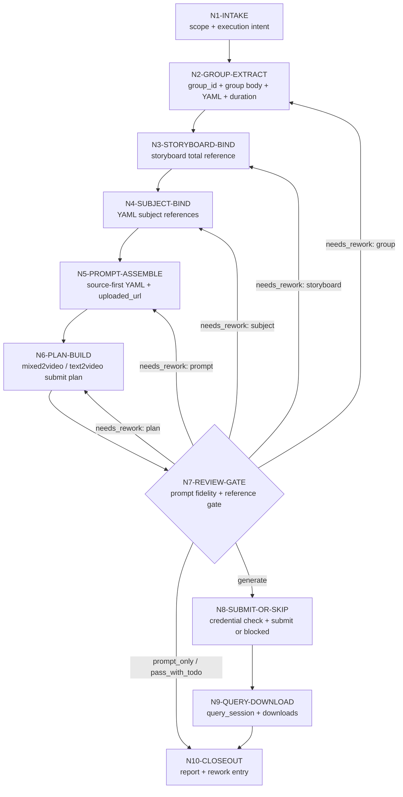

# Hybrid Reference Video Workflow

本文件承载 `D-主板混合参照` 的思行一体化节点。拓扑是先锁源、提取组正文与 YAML，再绑定故事板总参照和主体参照，之后生成混合 prompt 与 LibTV 提交计划，最后统一汇流审查。

## Workflow Nodes

| node_id | judgement | action | evidence | gate |
| --- | --- | --- | --- | --- |
| `N1-INTAKE` | 项目、集号、分镜组范围和执行意图是否明确 | 读取用户输入、父级路由、项目上下文 | input manifest | scope 明确 |
| `N2-GROUP-EXTRACT` | 目标组是否可从 `4-分组` 唯一回指 | 提取 `group_id`、组正文、YAML、`时长估算` | hybrid group index | 组正文、YAML 和时长估算可读或有 fallback |
| `N3-STORYBOARD-BIND` | 是否存在对应故事板总参照 | 按 `group_id` 搜索 `6-图像/B-分镜故事板` | manifest storyboard slot | 无空槽位 |
| `N4-SUBJECT-BIND` | YAML 主体是否有真实图片 | 按角色/场景/道具目录绑定，多视图优先 | manifest subject slots | 不猜主体，不绑非图 |
| `N5-PROMPT-ASSEMBLE` | prompt 是否同时表达总参照和主体参照 | 保留 source-first 组正文，只在 fenced YAML 注入故事板和主体 uploaded_url | prompt markdown | source-first enriched YAML 通过 |
| `N6-PLAN-BUILD` | LibTV submit plan是否合法 | 生成 submit plan、处理图片上限、写入 `duration_hint=clamp(duration_estimate_seconds, 4, 15)` 与 `prompt_fidelity_mode` | submit plan | 有图时 `modeType=mixed2video` 和 `mixedList` 正确，默认 `allow_libtv_prompt_optimization=false` |
| `N7-REVIEW-GATE` | 输出是否可提交或交付 | 执行 review gate，检查 prompt fidelity opt-in | review verdict | pass / pass_with_todo；未 opt-in 时禁止远端优化 |
| `N8-SUBMIT-OR-SKIP` | 是否执行 LibTV | prompt_only 则跳过；否则 credential check 后提交 | queue ledger | sessionId 或 blocked reason |
| `N9-QUERY-DOWNLOAD` | 结果是否需要刷新或下载 | query_session、下载视频 | results json / videos | 状态可续查 |
| `N10-CLOSEOUT` | 是否形成唯一闭环 | 汇总报告、失败与返工入口 | 执行报告 | 输出路径完整 |

## Mermaid Topology

## Branches

- `prompt_only`: `N1 -> N2 -> N3 -> N4 -> N5 -> N6 -> N7 -> N10`
- `generate`: `N1 -> N2 -> N3 -> N4 -> N5 -> N6 -> N7 -> N8 -> N9 -> N10`
- `query_or_download`: `N1 -> N8 -> N9 -> N10`
- `repair`: 从 review 指出的失败节点重新进入，不得整集无差别重跑。

## Evidence Rule

每个节点必须留下可复核证据。prompt 是 LLM 主创组织结果；manifest、plan、queue 和 results 是机械投影与追踪载体。
