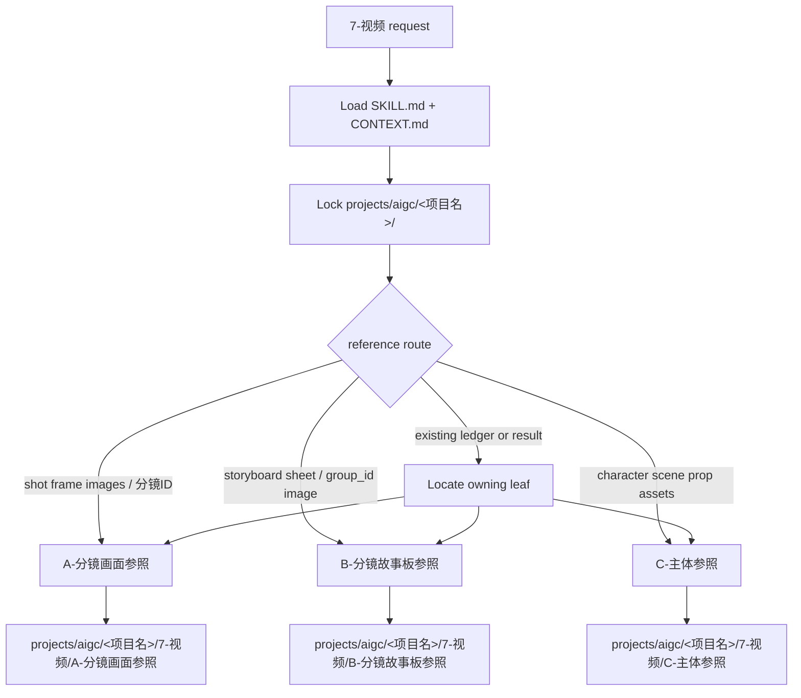

# aigc 7-视频

`7-视频` 是 AIGC 项目的视频阶段父级入口。它只负责判定视频生成路线、加载目标叶子技能、约束项目 runtime 与上游真源边界；不直接主创视频 prompt，不直接调用 Dreamina，不直接改写 `4-分组`、`5-设计` 或 `6-图像` 产物。

## Context Loading Contract

- 每次调用 `$aigc-video-stage` 时，必须同时加载同目录 `CONTEXT.md`。
- 每次调用本技能时，必须同时加载同目录 `CONTEXT.md`。
- 若任务绑定 `projects/aigc/<项目名>/`，必须先加载项目根 `MEMORY.md`、`0-初始化/north_star.yaml`，再按需加载项目 `CONTEXT/` 中与视频阶段、风格、角色、场景、主体资产或生成限制相关的上下文。
- 父级只做路由和汇流判断；视频 prompt 组织、参照绑定、Dreamina 提交与结果追踪由命中的 A/B/C 叶子技能负责。
- `A-分镜画面参照`、`B-分镜故事板参照`、`C-主体参照` 是英文序号互斥候选；除非用户明确要求多路线对比或批量运行，否则一次任务默认选择唯一叶子入口。
- 冲突优先级：用户显式请求 > 根 `AGENTS.md` / meta 规则 > `.agents/skills/aigc/SKILL.md` > 本 `SKILL.md` > 目标叶子 `SKILL.md` > 目标叶子分区规范 > `.agents/skills/cli/dreamina-cli/SKILL.md` > `agents/openai.yaml` > 项目 `MEMORY.md` > 项目 `CONTEXT/` > 本 `CONTEXT.md` > 目标叶子 `CONTEXT.md`。

## Input Contract

Accepted input:

- 用户命中 `7-视频`、视频阶段、生视频、Dreamina、分镜参照、故事板参照、主体参照或批量视频生成。
- 来自 `projects/aigc/<项目名>/4-分组/` 的分镜组稿，需要转为组级视频任务。
- 来自 `projects/aigc/<项目名>/6-图像/A-分镜画面/` 的镜级图像参照，或 `6-图像/B-分镜故事板/` 的组级故事板参照。
- 来自 `projects/aigc/<项目名>/5-设计/*/3-生成/` 的角色、场景、道具主体资产参照。
- 已有 `projects/aigc/<项目名>/7-视频/*/` 的 prompt、manifest、Dreamina batch、queue ledger 或生成结果需要 query / download / repair / review / rerun。

Required input:

- 项目名或项目根。
- 可读的上游分镜组稿，或可定位的既有 `7-视频` 阶段工件。
- 能够从用户意图、已有产物或文件路径判断目标参照路线：分镜画面图、分镜故事板图、主体资产，或查询/修复既有路线。

Reject or clarify when:

- 用户要求父级直接生成视频 prompt 正文、直接提交 Dreamina、或跨过叶子技能改写业务真源。
- 用户要生成分镜画面图或故事板图本体，应转入 `6-图像` 对应叶子技能。
- 用户要求修改剧情、镜头顺序、角色事实或分组边界，应转回 `4-分组` 或明确声明这是上游修复。
- A/B/C 路线无法唯一判断，且自动选择会造成参照资产错用或重复提交。

## Mode Selection

| mode | trigger | route |
| --- | --- | --- |
| `frame_visual_reference` | 单镜图、多张分镜画面图、四段式 `分镜ID`、`6-图像/A-分镜画面`、镜级图参照出视频 | `A-分镜画面参照/SKILL.md` |
| `storyboard_reference` | 分镜故事板、组级 storyboard 图、`6-图像/B-分镜故事板`、用整张故事板图参照出视频 | `B-分镜故事板参照/SKILL.md` |
| `subject_reference` | 角色/场景/道具主体参照、组底 YAML、`5-设计/*/3-生成`、按主体图片出视频 | `C-主体参照/SKILL.md` |
| `query_or_download` | 已有 submit_id、queue ledger、视频结果查询或下载 | 先从路径/ledger 判断所属叶子，再进入该叶子 |
| `repair_or_review` | prompt、manifest、YAML、queue、结果漂移或只审查 | 先定位原产物所属叶子，再执行对应 review / repair |
| `multi_route_compare` | 用户明确要求 A/B/C 对比、并跑或方案选择 | 逐个进入被点名叶子，父级只汇总差异与风险 |

## Reference Loading Guide

| 场景 | 读取文件 |
| --- | --- |
| 镜级图像作为多图参照生成组级视频 | `A-分镜画面参照/SKILL.md` + `A-分镜画面参照/CONTEXT.md` |
| 组级故事板图作为单图参照生成组级视频 | `B-分镜故事板参照/SKILL.md` + `B-分镜故事板参照/CONTEXT.md` |
| 角色、场景、道具主体资产作为参照生成组级视频 | `C-主体参照/SKILL.md` + `C-主体参照/CONTEXT.md` |
| Dreamina 提交、查询、下载或登录排障 | 由目标叶子加载 `.agents/skills/cli/dreamina-cli/SKILL.md + CONTEXT.md` |
| 上游事实边界核对 | `.agents/skills/aigc/4-分组/SKILL.md + CONTEXT.md`、必要时读取 `5-设计` 或 `6-图像` 对应入口 |

## Visual Maps

## Execution Contract

1. 读取本 `SKILL.md + CONTEXT.md`，锁定项目根、用户目标、上游可用资产和是否已有视频阶段工件。
2. 根据 `Mode Selection` 选择唯一叶子技能；若用户明确要求多路线，则只调度被点名的路线。
3. 加载目标叶子的 `SKILL.md + CONTEXT.md`，并把本轮输入、项目根、集号/分镜组/分镜 ID 范围传入叶子合同。
4. 父级不得直接写视频 prompt、参照 manifest、Dreamina batch、queue ledger 或结果报告；这些业务产物必须由目标叶子定义。
5. 查询、下载、修复或审查任务必须先定位原产物所属叶子，未定位前不得创建新的平行视频真源。
6. 若目标叶子缺失、不可读或与用户目标不匹配，报告阻断原因和建议入口，不临时伪造叶子合同。

## Field Mapping

| field_id | owner | must_contain |
| --- | --- | --- |
| `VID-STAGE-01` | 父级路由 | 项目根、任务类型、目标叶子、处理范围 |
| `VID-STAGE-02` | 目标叶子 | 叶子 `SKILL.md + CONTEXT.md` 加载证据 |
| `VID-STAGE-03` | 边界 | 父级不替代 prompt 主创、参照绑定或 Dreamina 执行 |
| `VID-STAGE-04` | 既有真源 | query / repair / review 时能回指原所属叶子 |

## Field Master

| field_id | owner | must contain | fail code |
| --- | --- | --- | --- |
| `FIELD-VID-STAGE-01` | route lock | 项目根、任务类型、目标叶子、处理范围 | `FAIL-VID-STAGE-ROUTE` |
| `FIELD-VID-STAGE-02` | leaf handoff | 进入目标叶子并加载其 `SKILL.md + CONTEXT.md` | `FAIL-VID-STAGE-HANDOFF` |
| `FIELD-VID-STAGE-03` | boundary | 父级不替代 prompt 主创、参照绑定或 Dreamina 执行 | `FAIL-VID-STAGE-BOUNDARY` |
| `FIELD-VID-STAGE-04` | existing truth | query / repair / review 时能回指原所属叶子和既有产物 | `FAIL-VID-STAGE-TRUTH` |

## Thought Pass Map

| pass_id | focus field | action | evidence |
| --- | --- | --- | --- |
| `PASS-VID-STAGE-01` | `FIELD-VID-STAGE-01` | 判定 A / B / C / query / repair / multi-route | route note |
| `PASS-VID-STAGE-02` | `FIELD-VID-STAGE-02` | 加载目标叶子技能对 | loaded skill pair |
| `PASS-VID-STAGE-03` | `FIELD-VID-STAGE-03` | 检查父级没有越权主创或提交 | closeout note |
| `PASS-VID-STAGE-04` | `FIELD-VID-STAGE-04` | 对既有产物建立所属叶子回指 | artifact ownership note |

## Pass Table

| pass_id | pass standard | fail code | rework entry |
| --- | --- | --- | --- |
| `PASS-VID-STAGE-01` | 目标叶子唯一；多路线必须来自用户显式要求 | `FAIL-VID-STAGE-ROUTE` | Mode Selection |
| `PASS-VID-STAGE-02` | 叶子 `SKILL.md + CONTEXT.md` 可读 | `FAIL-VID-STAGE-HANDOFF` | Reference Loading Guide |
| `PASS-VID-STAGE-03` | 父级只导引、路由、汇流，不直接产出业务真源 | `FAIL-VID-STAGE-BOUNDARY` | Execution Contract |
| `PASS-VID-STAGE-04` | 既有视频产物能定位到 A/B/C 所属目录 | `FAIL-VID-STAGE-TRUTH` | Reference Loading Guide |

## Root-Cause Execution Contract (Mandatory)

失败链路：

`Symptom -> Direct Cause -> Parent Route Owner -> Leaf Skill Contract -> AGENTS.md / skill-工作车间`

优先修复：

1. 路由误判或 A/B/C 混用：回到本文件 `Mode Selection` 与 `CONTEXT.md` 的 Type Map。
2. 叶子加载缺失：补齐目标叶子的 `SKILL.md + CONTEXT.md` 或报告配置缺口。
3. 父级越权生成 prompt / YAML / queue：回收为叶子技能执行，父级只保留路由说明。
4. 既有产物无法回指：按 `projects/aigc/<项目名>/7-视频/<叶子名>/` 目录、文件名、ledger 和 report 重建所属关系。

## Output Contract

- Required output: 唯一叶子路由，或明确的多路线用户授权，或阻断原因。
- Output format: 面向用户的简短路由说明；实际视频阶段产物由叶子技能输出。
- Output path: 父级不直接落业务产物；A/B/C 分别写入 `projects/aigc/<项目名>/7-视频/A-分镜画面参照/`、`B-分镜故事板参照/`、`C-主体参照/`。
- Naming convention: 叶子技能自定命名；父级不创建平行真源、不补未执行路线占位。
- Completion gate: 目标叶子明确且已加载；若无法唯一判断，已向用户说明需要的最小澄清。
