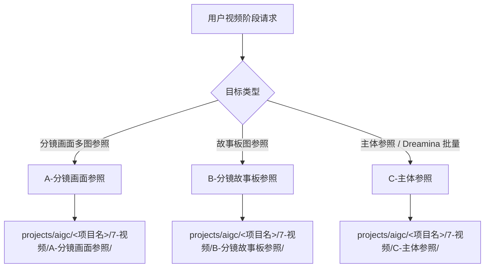

# aigc 7-视频

`7-视频` 是当前中文 AIGC 影视工作流的视频阶段入口。它只负责阶段路由、运行时边界、视频子技能选择和交付门禁；具体生成逻辑由 `A-分镜画面参照`、`B-分镜故事板参照`、`C-主体参照` 执行。

## Context Loading Contract

- 每次调用本技能时，必须同时加载同目录 `CONTEXT.md`。
- 若任务绑定 `projects/aigc/<项目名>/`，必须先加载项目根 `MEMORY.md`，再加载项目根 `CONTEXT/` 中与视频阶段、主体资产、Dreamina 队列或生成偏好相关的上下文。
- 当前中文视频 runtime 真源固定为 `projects/aigc/<项目名>/7-视频/`；legacy `.agents/skills/aigc/6-Video/` 只允许作为旧产物兼容回读，不再作为默认执行入口。
- 冲突优先级：用户显式请求 > 根 `AGENTS.md` / meta 规则 > 本 `SKILL.md` > 子技能 `SKILL.md` > `references/` / `steps/` / `types/` / `review/` / `templates/` > `agents/openai.yaml` > 项目记忆与上下文 > 本 `CONTEXT.md`。

## Input Contract

Accepted input:

- 需要把 `4-分组`、`6-图像` 或主体资产转入视频生成准备、提交计划、队列或结果查询。
- 需要选择 `A-分镜画面参照`、`B-分镜故事板参照` 或 `C-主体参照`。
- 需要审查、修复或续跑 `projects/aigc/<项目名>/7-视频/` 下的视频阶段产物。

Required input:

- `project_name` 或可定位的 `projects/aigc/<项目名>/`。
- 可判断的目标类型：分镜画面多图参照、分镜故事板参照、主体参照、查询/下载、repair 或 review。
- 对生成任务，必须有可回指的上游源文件或既有队列。

Reject or reroute when:

- 任务是图像生成而非视频，应转入 `6-图像`。
- 任务要求重写 `4-分组`、`5-设计` 或 `6-图像` 主真源，应转对应阶段修复。
- 用户明确点名 legacy `6-Video` 旧路径时，只做兼容回读或迁移说明，不把旧路径写作新 runtime。

## Mode Selection

| mode | 触发信号 | route |
| --- | --- | --- |
| `frame_reference` | `4-分组` + `6-图像/A-分镜画面`、四段式 `分镜ID@路径`、组级多图分镜画面参照 | `A-分镜画面参照/SKILL.md` |
| `storyboard_reference` | 组级 storyboard 图参照、`6-图像/B-分镜故事板` 转视频 | `B-分镜故事板参照/SKILL.md` |
| `subject_reference` | 角色、场景、道具主体参照，或 Dreamina 分镜组批量视频 | `C-主体参照/SKILL.md` |
| `query_or_download` | 已有 submit_id、队列、下载或状态查询 | 路由到拥有该队列的子技能，再调用 Dreamina CLI |
| `repair` | 路径漂移、槽位错绑、队列不一致 | 按 review gate 路由到 owning child |
| `review_only` | 只审查视频阶段产物 | `review/review-contract.md` |

## Reference Loading Guide

| 场景 | 必读文件 |
| --- | --- |
| 判断视频子技能路由 | `types/type-map.md` |
| 执行阶段路由与汇流 | `steps/video-stage-routing.md` |
| 审查视频阶段输出 | `review/review-contract.md` |
| 阶段 runtime 与 legacy 边界 | `references/video-stage-runtime.md` |
| 输出模板 | `templates/output-template.md` |
| 脚本辅助边界 | `scripts/README.md` |
| 可复用经验 | `knowledge-base/video-stage-heuristics.md` |
| 产品侧入口元数据 | `agents/openai.yaml` |

## Visual Maps

## Execution Contract

1. 加载本 `SKILL.md + CONTEXT.md`，锁定项目根、目标类型、集号/分镜范围、是否生成或只查询。
2. 按 `types/type-map.md` 选择唯一子技能；不得同时把同一任务发往多个视频子技能。
3. 若命中 `A-分镜画面参照`，必须使用 `4-分组` 为主源，按组内镜头建立四段式 `分镜ID`，并只从 `6-图像/A-分镜画面` 绑定真实 `分镜ID@路径`。
4. 若命中 `C-主体参照`，必须使用 `4-分组` 为主源，组底 YAML 为主体基准，并遵守主体后缀 `@图片路径` 规则。
5. 子技能完成后，按 `review/review-contract.md` 审查输出根、队列、submit_id 和下一步。
6. 最终只给一个下一入口：继续查询/下载、重试失败组、回上游修复或交付。

## Field Mapping

| field_id | 输出/证据 | 内容要求 | 失败码 |
| --- | --- | --- | --- |
| `FIELD-VIDEO-01` | route manifest | 项目根、目标类型、目标子技能、输出根 | `FAIL-VIDEO-ROUTE` |
| `FIELD-VIDEO-02` | child handoff | 子技能输入满足其 Input Contract | `FAIL-VIDEO-HANDOFF` |
| `FIELD-VIDEO-03` | runtime path | 输出位于 `projects/aigc/<项目名>/7-视频/<子技能>/` | `FAIL-VIDEO-RUNTIME` |
| `FIELD-VIDEO-04` | review verdict | 阶段汇流审查结果和下一入口 | `FAIL-VIDEO-REVIEW` |

## Field Master

| field_id | owner | canonical file | must contain | fail code |
| --- | --- | --- | --- | --- |
| `FIELD-VIDEO-01` | stage route | final note / report | mode、child skill、source root、output root | `FAIL-VIDEO-ROUTE` |
| `FIELD-VIDEO-02` | child skill | child artifacts | 输入门和子技能门禁证据 | `FAIL-VIDEO-HANDOFF` |
| `FIELD-VIDEO-03` | runtime | child output root | `7-视频` 中文 runtime，不落 legacy `6-Video` | `FAIL-VIDEO-RUNTIME` |
| `FIELD-VIDEO-04` | convergence | review note | verdict、next_action、rework_entry | `FAIL-VIDEO-REVIEW` |

## Thought Pass Map

| pass_id | focus field | core question | action | evidence |
| --- | --- | --- | --- | --- |
| `PASS-VIDEO-01` | `FIELD-VIDEO-01` | 当前视频任务应走哪个子技能 | 判型并锁定唯一 route | route manifest |
| `PASS-VIDEO-02` | `FIELD-VIDEO-02` | 子技能输入是否齐备 | 检查上游源和项目上下文 | handoff note |
| `PASS-VIDEO-03` | `FIELD-VIDEO-03` | 输出是否落在中文 runtime | 检查输出根与 legacy 边界 | runtime note |
| `PASS-VIDEO-04` | `FIELD-VIDEO-04` | 交付是否可继续执行 | 执行 review gate | verdict |

## Pass Table

| pass_id | pass standard | fail code | rework entry |
| --- | --- | --- | --- |
| `PASS-VIDEO-01` | route 唯一且可解释 | `FAIL-VIDEO-ROUTE` | `types/type-map.md` |
| `PASS-VIDEO-02` | 子技能输入满足 Input Contract | `FAIL-VIDEO-HANDOFF` | owning child `SKILL.md` |
| `PASS-VIDEO-03` | 输出根为 `projects/aigc/<项目名>/7-视频/` | `FAIL-VIDEO-RUNTIME` | `references/video-stage-runtime.md` |
| `PASS-VIDEO-04` | review verdict 为 `pass` 或 `pass_with_todo` | `FAIL-VIDEO-REVIEW` | `review/review-contract.md` |

## Root-Cause Execution Contract (Mandatory)

出现失败时必须沿链路上溯：

`Symptom -> Direct Cause -> Section Owner -> Source Contract -> AGENTS.md / skill-工作车间`

优先修复：

1. 路由到旧 `6-Video`：回 `references/video-stage-runtime.md` 与 registry。
2. 子技能选择不唯一：回 `types/type-map.md`。
3. 子技能输入缺失：回 owning child 的 `Input Contract`。
4. 输出路径漂移：回 `templates/output-template.md`。
5. 同类失败可复用：沉淀到本 `CONTEXT.md`。

## Output Contract

Required output:

- 一个视频阶段 route / review 结论，或路由到唯一子技能后的子技能产物。

Output format:

- Markdown route note / review note；子技能产物按其 Output Contract 输出。

Output path:

- 阶段根：`projects/aigc/<项目名>/7-视频/`
- 子技能根：`projects/aigc/<项目名>/7-视频/A-分镜画面参照/`、`B-分镜故事板参照/`、`C-主体参照/`
- 阶段审查载体：`projects/aigc/<项目名>/7-视频/validation-report.md`

Naming convention:

- 阶段报告命名 `执行报告.md` 或 `validation-report.md`；子技能文件名遵循各自合同。

Completion gate:

- 任务路由唯一；输出根不落 legacy `6-Video`；子技能 review verdict 为 `pass` 或 `pass_with_todo`。
