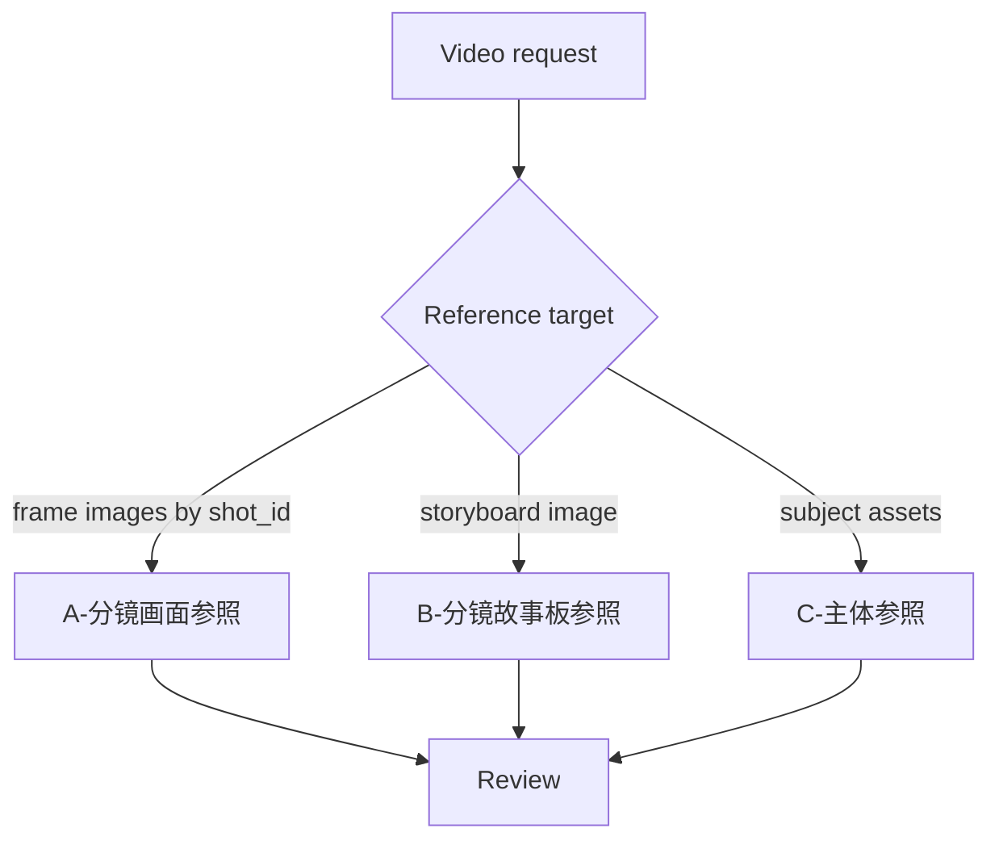

# Video Stage Routing

| node_id | objective | inputs | actions | evidence | route_out | gate |
| --- | --- | --- | --- | --- | --- | --- |
| `N1-INTAKE` | 锁定项目与视频目标 | user request | 判型 | route note | `N2` | mode 明确 |
| `N2-ROUTE` | 选择唯一子技能 | mode、source roots | 路由 A/B/C | child handoff | `N3` | 不并行误派 |
| `N3-REVIEW` | 汇流检查 | child artifacts | 检查 runtime 和 verdict | review note | done / repair | 输出根正确 |
