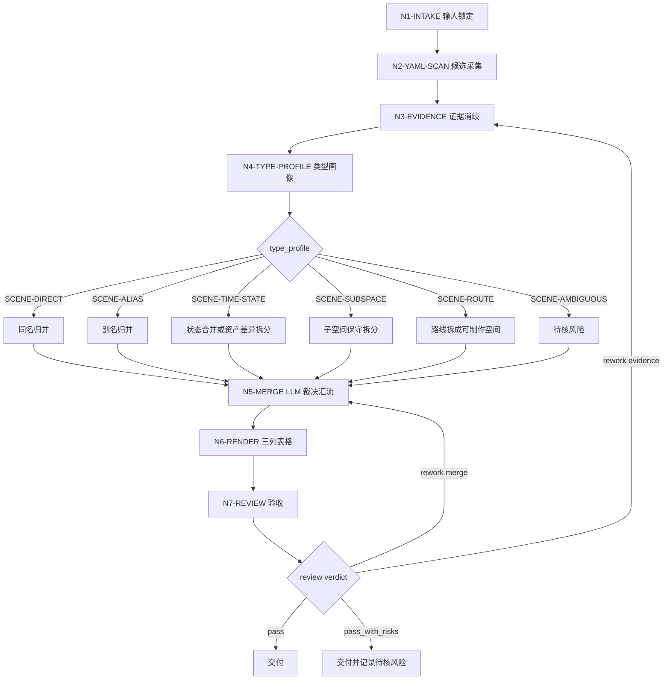

# Scene List Workflow

## Business Requirement Analysis

| slot | answer |
| --- | --- |
| `business_goal` | 从 `6-分组` 组底 YAML 的 `场景` 字段建立后续场景设计入口清单。 |
| `business_object` | `projects/aigc/<项目名>/6-分组/第N集.md` 与 canonical 输出 `7-设计/场景/1-清单/场景清单.md`。 |
| `constraint_profile` | 来源真源、项目记忆、LLM-first 归并、固定三列表格和 review gate。 |
| `success_criteria` | 每行场景可回指 YAML 来源，归并/拆分可解释，表格字段固定且不扩写设计稿。 |
| `non_goals` | 不生成场景设定、视觉方案、道具清单或后续设计正文。 |
| `complexity_source` | 别名、代称、子空间、时段/状态、跨空间路线与首次登场裁决。 |
| `topology_fit` | 串行主干 + 类型分支 + review 返工回路的 hybrid topology。 |

## Mermaid Topology

## Node Map

| node_id | objective | inputs | actions | evidence | route_out | gate |
| --- | --- | --- | --- | --- | --- | --- |
| `N1-INTAKE` | 锁定项目、目标集与输入边界 | 用户请求、项目路径、集号范围 | 读取项目根、输入范围和上游文件清单 | `input_manifest` | `N2-YAML-SCAN` | 上游 `6-分组` 文件存在 |
| `N2-YAML-SCAN` | 只采集 YAML `场景` 来源 | `6-分组/第N集.md` | 抽取候选场景与分镜组 ID | `candidate_records` | `N3-EVIDENCE` | 候选均来自组底 YAML |
| `N3-EVIDENCE` | 为候选补消歧证据但不新增主体 | 候选、同组标题、同组正文 | 回查标题和正文关键词 | `evidence_keywords` | `N4-TYPE-PROFILE` | 不新增 YAML 外主体 |
| `N4-TYPE-PROFILE` | 判断归并问题类型 | 候选与证据关键词 | 形成 `type_profile` | `type_map_result` | `N5-MERGE` | 分型可解释且能回指证据 |
| `N5-MERGE` | 完成 canonical 场景裁决 | `type_profile`、候选序列、项目上下文 | LLM 执行归并、拆分、待核标记 | `merge_decision` | `N6-RENDER` 或 `N3-EVIDENCE` | 别名/区域/时段规则通过 |
| `N6-RENDER` | 生成固定三列表格 | canonical 场景映射 | 渲染 `场景清单.md` | Markdown table | `N7-REVIEW` | 表头固定且无设计扩写 |
| `N7-REVIEW` | 验收来源、归并、字段和越权边界 | 清单、候选、review contract | 执行 review gate，必要时写报告 | `review_result` | done / rework | verdict 为 `pass` 或 `pass_with_risks` |

## 汇流规则

- `N2-YAML-SCAN` 输出候选全集，不直接落盘。
- `N5-MERGE` 是唯一归并裁决节点，必须由 LLM 完成。
- `N6-RENDER` 只渲染通过 `N5-MERGE` 的结果，不补空场景、不生成设计描述。
- `N7-REVIEW` 可以要求回到 `N3-EVIDENCE` 或 `N5-MERGE`，但不改写业务真源。

## Failure Routes

| fail_code | symptom | return_node | repair_action |
| --- | --- | --- | --- |
| `FAIL-SCENE-SOURCE` | 有主体无法回指 YAML `场景` 字段 | `N2-YAML-SCAN` | 删除越权主体或重新抽取来源 |
| `FAIL-SCENE-EVIDENCE` | 归并依据只有语感，缺少标题/正文/项目上下文证据 | `N3-EVIDENCE` | 补同组证据关键词或标记待核 |
| `FAIL-SCENE-TYPE` | 子空间、时段、路线类型混淆 | `N4-TYPE-PROFILE` | 重新判型并读取 `types/scene-type-map.md` |
| `FAIL-SCENE-MERGE` | 不同空间误合或同一空间重复拆分 | `N5-MERGE` | 由 LLM 重新裁决 canonical 映射 |
| `FAIL-SCENE-RENDER` | 表格字段漂移或关键词扩写成设计稿 | `N6-RENDER` | 回到模板，只保留三列和来源关键词 |
| `FAIL-SCENE-REVIEW` | 验收未通过或风险未报告 | `N7-REVIEW` | 按 review verdict 定向返工 |
