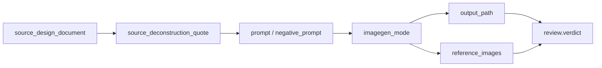

# Scene Generation Contract

## Scope

This reference owns the detailed business contract for `$aigc-scene-generation`.

The skill consumes completed upstream scene design markdown files and produces project-bound bitmap assets plus JSON prompt records. It does not own scene research, scene design, cinematography design, prompt distillation, registry updates, or parent skill governance.

## Source Inputs

Required source document:

```text
projects/aigc/<项目名>/7-设计/场景/2-设计/S###-<场景名>.md
```

Required fields or recoverable sections:

- Scene name from the document title or `名称`.
- Subject ID from `## 4. 解构` line `主体ID号：<主体ID>`; if absent, recover it from the source filename prefix such as `S###`.
- Source design document path.
- `## 4. 解构`.
- Global style and architecture style references when present.

If the source document lacks a usable `4. 解构` section, stop and report `FAIL-SCENE-GEN-01`; do not invent a new scene prompt in this stage or fall back to the old English integrated prompt.

## Step1 Main Image Contract

Step1 creates one primary scene image per source design document.

Prompt source:

- Load `templates/scene-main-image-prompt.json`.
- Use the upstream `4. 解构` content as the main prompt body.
- Preserve upstream scene identity, era, architecture, material, lighting, and no-human constraints.
- Add only operational delivery details required by `$imagegen`, such as default 2K target and project persistence.

Output:

```text
projects/aigc/<项目名>/7-设计/场景/3-生成/<主体ID>-<主体名称>-主图.<ext>
projects/aigc/<项目名>/7-设计/场景/3-生成/<主体ID>-<主体名称>-主图.json
```

## Step2 Multi-View Contract

Step2 creates one multi-view scene design sheet per source design document.

Prompt source:

- Load `templates/scene-multiview-prompt.json`.
- Set `reference_main_image` to the generated or user-provided `主体ID-主体名称-主图`.
- Set `source_deconstruction` to the upstream design document's `4. 解构` content.
- `critical_requirements` may directly cite the upstream design document's `4. 解构` as the primary scene truth; do not use the former `提示词设计` English integrated prompt as the gpt-image-2 source.
- Built-in `image_gen` gate: `reference_main_image` 是本地图片路径时，执行 Step2 前必须先用 `view_image` 检视并标注为 `scene main image / multiview reference`；多视图 JSON 必须记录 `reference_context_status: visible_in_conversation_context`。`prompt_only` 可记录 `pending_view_image`，但不得声称已完成参考图生成。

The multi-view sheet must read as views of one coherent scene, not nine unrelated spaces.

Output:

```text
projects/aigc/<项目名>/7-设计/场景/3-生成/<主体ID>-<主体名称>-多视图.<ext>
projects/aigc/<项目名>/7-设计/场景/3-生成/<主体ID>-<主体名称>-多视图.json
```

## JSON Prompt Record Contract

Each prompt JSON should include:

- `schema`
- `skill_id`
- `stage`
- `source_design_document`
- `subject_id`
- `subject_id_source`
- `subject_name`
- `image_role`
- `imagegen_mode`
- `prompt`
- `negative_prompt`
- `reference_images`
- `reference_context_status`
- `output_path`
- `review`
- `created_at`

For versioned outputs, include `variant_of` or `supersedes`.

## Evidence Chain



The evidence chain is blocking for completion: every generated bitmap must be recoverable from a same-name JSON record that names the upstream source, prompt lineage, imagegen mode, output path and review state.

## Boundary Rules

- Do not modify upstream design documents.
- Do not generate design text by script or template.
- Do not alter registry, route files, parent directories, sibling role/prop skills, or other workers' files.
- Do not silently overwrite existing generated assets.
- Do not use CLI/API fallback unless the user explicitly opted in or confirmed it after being asked.

## Review Gate Mapping

| Review Question | Review Gate | Fail Code | Rework Target | Report Evidence |
| --- | --- | --- | --- | --- |
| Can every requested output trace to one readable upstream `2-设计/S###-<场景名>.md` source document with scene name, source path, and a recoverable subject ID? | `REV-SCENE-GEN-01` | `FAIL-SCENE-GEN-01` | `N2-SOURCE` | `source_design_document`, `subject_id`, `subject_id_source`, source path list, unresolved source errors |
| Is the upstream `## 4. 解构` section present and used as the blocking prompt truth instead of inventing a scene prompt or falling back to the old English integrated prompt? | `REV-SCENE-GEN-01` | `FAIL-SCENE-GEN-01` | `N2-SOURCE` | `source_deconstruction_quote`, missing-section finding, prompt lineage note excluding old `提示词设计` source |
| Does Step1 use `templates/scene-main-image-prompt.json` plus upstream `4. 解构` while preserving scene identity, era, architecture, material, lighting, and no-human constraints without redesigning the scene? | `REV-SCENE-GEN-02` | `FAIL-SCENE-GEN-02` | `N4-MAIN` | main prompt JSON, copied source deconstruction, no-redesign checklist, boundary finding if new design facts appear |
| Does each Step1 deliver a project-bound `<主体ID>-<主体名称>-主图.<ext>` asset under `projects/aigc/<项目名>/7-设计/场景/3-生成`? | `REV-SCENE-GEN-03` | `FAIL-SCENE-GEN-03` | `N4-MAIN` | main image output path, filesystem existence check, generation mode, persistence action |
| Does each Step1 main image have a same-name JSON prompt record that records source, subject ID, prompt, negative prompt, imagegen mode, output path, and review state? | `REV-SCENE-GEN-05` | `FAIL-SCENE-GEN-05` | `N5-MAIN-JSON` | `<主体ID>-<主体名称>-主图.json`, required field checklist, JSON parse result |
| Before Step2 real generation, is `reference_main_image` the matching main image, has it been inspected with `view_image`, and does evidence mark it as `scene main image / multiview reference`? | `REV-SCENE-GEN-09` | `FAIL-SCENE-GEN-09` | `N6-MULTIVIEW` | `reference_images`, `reference_context_status: visible_in_conversation_context`, view_image note or `pending_view_image` for prompt-only mode |
| Does Step2 use `templates/scene-multiview-prompt.json`, `reference_main_image`, and upstream `4. 解构` rather than the former English integrated prompt? | `REV-SCENE-GEN-04` | `FAIL-SCENE-GEN-04` | `N6-MULTIVIEW` | multi-view prompt JSON, `reference_main_image`, `source_deconstruction`, prompt lineage note |
| Does the multi-view sheet read as views of one coherent scene instead of nine unrelated spaces or drifted scene identities? | `REV-SCENE-GEN-07` | `FAIL-SCENE-GEN-07` | `N6-MULTIVIEW` | visual continuity checklist, subject invariant notes, reviewer finding or local checklist verdict |
| Does each Step2 deliver a project-bound `<主体ID>-<主体名称>-多视图.<ext>` asset with a same-name JSON record reusing the same subject ID and source design document? | `REV-SCENE-GEN-04` / `REV-SCENE-GEN-05` | `FAIL-SCENE-GEN-04` / `FAIL-SCENE-GEN-05` | `N7-MULTIVIEW-JSON` | multi-view image path, multi-view JSON, subject/source parity check, required field checklist |
| Is every bitmap recoverable through the evidence chain `source_design_document -> source_deconstruction_quote -> prompt -> imagegen_mode -> output_path -> review.verdict`? | `REV-SCENE-GEN-05` | `FAIL-SCENE-GEN-05` | `N9-REPAIR` | same-name JSON records, evidence chain trace, missing link list, repair actions |
| Are all final assets persisted in the project `3-生成` directory rather than remaining only in `$CODEX_HOME/generated_images` or another transient location? | `REV-SCENE-GEN-08` | `FAIL-SCENE-GEN-08` | `N9-REPAIR` | final workspace paths, transient source path if migrated, persistence verification |
| Was built-in `image_gen` used by default, with CLI/API fallback used only after explicit user opt-in or confirmation? | `REV-SCENE-GEN-06` | `FAIL-SCENE-GEN-06` | `N1-CONTEXT` / `N3-PROFILE` | imagegen mode, opt-in evidence, fallback reason, loaded `$imagegen` contract |
| Were existing generated assets skipped, versioned with `-v2`/`-v3`, or overwritten only with explicit user permission? | `REV-SCENE-GEN-10` | `FAIL-SCENE-GEN-10` | `N3-PROFILE` / `N9-REPAIR` | asset conflict scan, overwrite permission note, `variant_of` or `supersedes` field |
| Did this stage avoid modifying upstream design documents, registry, route files, parent directories, sibling role/prop skills, and other workers' files? | `REV-SCENE-GEN-02` | `FAIL-SCENE-GEN-02` | `N8-REVIEW` / owner partition rollback request | changed-file list, out-of-scope diff finding, declared owner boundary |
