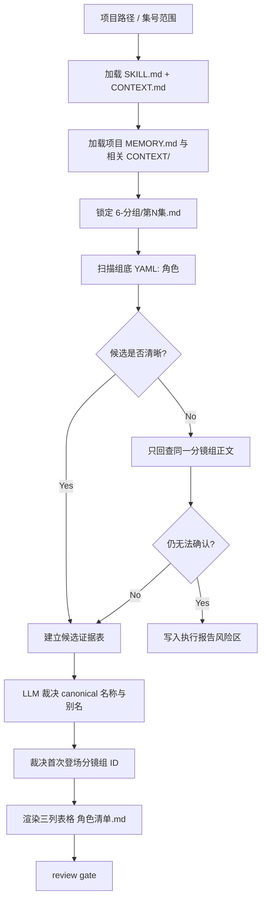
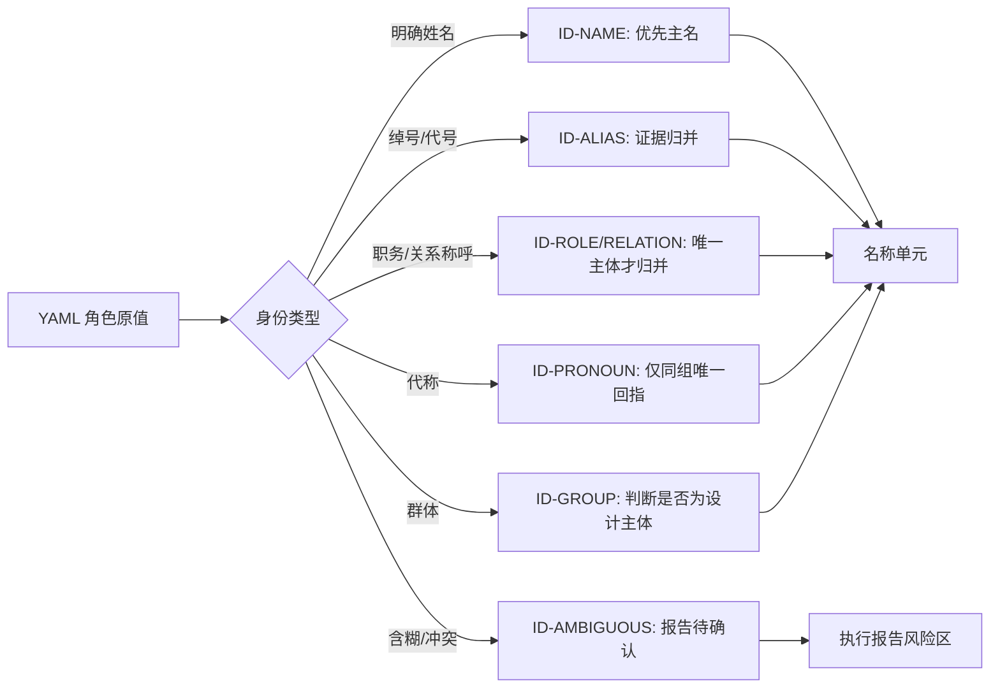
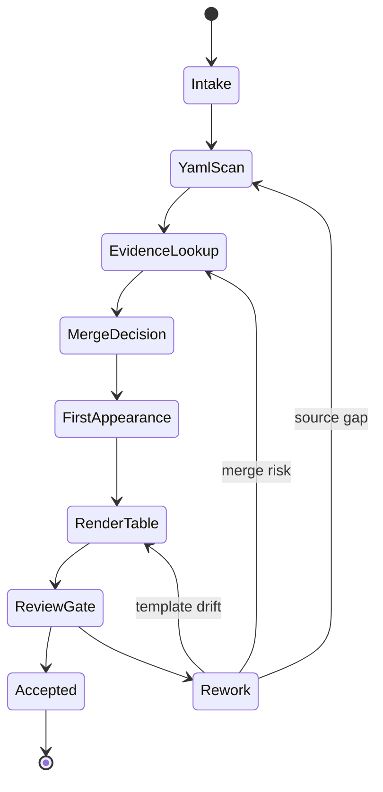

# aigc 7-设计/角色/1-清单

`角色/1-清单` 负责把 `6-分组` 逐集分镜组底部 YAML 的 `角色` 字段汇总为角色设计阶段的第一份 canonical 清单。它只建立“哪些角色需要进入后续设计”的表格真源，不生成角色设计稿、外貌方案、服装方案或镜头提示词。

## Context Loading Contract

- 每次调用 `$aigc-design-character-list` 时，必须同时加载同目录 `CONTEXT.md`。
- 每次调用本技能时，必须同时识别并加载同目录 `types/` 中选中的类型包（单选或多选）。
- 若任务绑定 `projects/aigc/<项目名>/`，必须先加载项目根 `MEMORY.md`，再按需加载项目根 `CONTEXT/` 中与角色命名、长期偏好、禁区和已有设定相关的上下文文件。
- 上游唯一准确信息来源固定为 `projects/aigc/<项目名>/6-分组/第N集.md` 中每个分镜组底部 YAML 的 `角色` 字段；必要时只允许回查同一分镜组正文作为证据。
- 冲突优先级：用户显式请求 > 根 `AGENTS.md` / meta 规则 > 本 `SKILL.md` > `references/` / `steps/` / `types/` / `review/` / `templates/` > `agents/openai.yaml` > 项目 `MEMORY.md` > 项目 `CONTEXT/` > 本 `CONTEXT.md`。
- 角色归并、别名判断、代称识别和首次登场裁决必须由 LLM 直接完成；`scripts/` 只能做读取、抽取、表格列检查、重复项提示和机械校验。

## Input Contract

Accepted input:

- 项目名、项目路径、单个或多个 `projects/aigc/<项目名>/6-分组/第N集.md` 文件。
- 用户要求“角色清单”“从分组 YAML 生成角色列表”“角色 1-清单”“进入 7-设计/角色清单”等任务。
- 已完成或部分完成的 `6-分组` 逐集分镜组稿。

Required input:

- 可定位、可读取的 `projects/aigc/<项目名>/6-分组/第N集.md`。
- 每个可消费分镜组存在可解析的分镜组 ID，例如 `1-1-1`。
- 每个可消费分镜组底部 YAML 至少包含 `角色` 字段；字段为空时必须作为证据缺口记录，不得凭空补角色。

Optional input:

- 项目 `MEMORY.md` 中已确认的角色命名偏好、禁用称呼、别名规则或长期设定。
- 项目 `CONTEXT/` 中已有角色表、前置设定或人工确认的同一角色映射。
- 用户指定的集号范围、仅审查模式、或要求生成执行报告。

Reject or clarify when:

- 上游 `6-分组/第N集.md` 不存在、不可读，且用户没有提供替代可核验证据。
- 用户要求直接从剧情印象、摄影稿或外部设定跳过 `6-分组` YAML 生成清单；本技能 canonical 上游必须是组底 YAML。
- 用户要求脚本自动裁决角色归并、补写角色描述或生成角色设计正文；必须改为 LLM 裁决，脚本仅辅助校验。
- 用户要求把道具、场景或服装清单写入本路径；这些不属于角色清单真源。

## Mode Selection

| mode | 触发信号 | 输出 |
| --- | --- | --- |
| `project_all` | 给定项目且未限制集号 | `7-设计/角色/1-清单/角色清单.md` 与可选执行报告 |
| `episode_range` | 指定一个或多个 `第N集.md` | 覆盖指定范围证据的角色清单更新 |
| `incremental_merge` | 既有 `角色清单.md` 存在，且 `6-分组` 新增/更新了部分 `第N集.md` | merge 更新清单、执行报告与可选 `design-manifest.yaml` |
| `repair` | 已有角色清单漏项、重复、别名未归并或首次登场错误 | 最小修复后的角色清单与问题说明 |
| `review_only` | 用户只要求检查清单 | 审查报告，不改写 canonical 清单，除非用户随后要求修复 |

## Reference Loading Guide

| 场景 | 必读文件 |
| --- | --- |
| 任意角色清单任务 | `references/source-and-merge-contract.md`、`steps/character-list-workflow.md` |
| 既有清单与新增上游对账 | `../../references/incremental-reconciliation-contract.md` |
| 别名、代称、同一角色不同称呼归并 | `types/character-identity-type-map.md` |
| 输出验收、风险分级和人工 review | `review/review-contract.md` |
| 输出样板 | `templates/output-template.md` |
| 脚本辅助边界与机械校验 | `scripts/README.md` |
| 可复用经验 | `knowledge-base/character-list-heuristics.md` |
| 产品入口元数据 | `agents/openai.yaml` |

## Topology Contract

本技能采用 `serial-with-guarded-branches` 拓扑：输入锁定、YAML 扫描、证据回查、LLM 归并、首次登场裁决、表格落盘和验收必须按主干串行推进；只有在 `possible_alias`、`ambiguous_pronoun`、`group_character`、`missing_yaml_role` 等风险出现时，才进入对应分支并回流到主干或执行报告。

## Mermaid Visual Contract

## Execution Contract

1. 读取本 `SKILL.md + CONTEXT.md`，并在项目任务中加载项目 `MEMORY.md` 与相关项目 `CONTEXT/`。
2. 锁定上游 `projects/aigc/<项目名>/6-分组/第N集.md`，按集号和文档顺序遍历所有分镜组；若既有 `角色清单.md` 或 `design-manifest.yaml` 存在，先读取并建立本轮 `reconcile_delta`。
3. 对每个分镜组，只从组底 YAML 的 `角色` 字段收集候选角色；当字段含糊、代称化或疑似漏项时，只回查同一分镜组正文，不跨组臆测。
4. 对候选角色执行 LLM 归并：识别别名、代称、同一角色不同称呼、称谓变化和身份称呼；优先保留项目已确认姓名，其次保留最具体且最早出现的稳定称呼；新增上游只能触发 merge/append，不得静默全量覆盖旧清单。
5. 首次登场使用最早出现该 canonical 角色的分镜组 ID，例如 `1-1-1`；必要时写作 `第N集.md / 1-1-1` 以便回查。
6. `原文描述（关键词式）` 只写来自 YAML `角色` 字段与同组正文证据的关键词，不扩写成角色设定，不加入外貌、性格或剧情推断。
7. 写入 canonical 输出 `projects/aigc/<项目名>/7-设计/角色/1-清单/角色清单.md`；如生成执行报告，写入同目录 `执行报告.md`；可同步更新 `projects/aigc/<项目名>/7-设计/角色/design-manifest.yaml` 的 source/subject 映射。
8. 按 `review/review-contract.md` 检查三列固定、首次登场可回指、归并理由可解释、无脚本主创、无跨域内容和无静默覆盖。

## Script And Metadata Contract

| path | role |
| --- | --- |
| `scripts/README.md` | 说明脚本只能做读取、解析、列检查和重复提示，不替代 LLM 归并判断 |
| `agents/openai.yaml` | 提供产品侧入口元数据，默认提示必须显式提到 `$aigc-design-character-list` |

## Field Mapping

| field_id | 输出/证据 | 内容要求 | 失败码 |
| --- | --- | --- | --- |
| `FIELD-CHAR-LIST-01` | 输入取证 | 项目路径、上游 `6-分组/第N集.md`、分镜组 ID 和 YAML `角色` 字段明确 | `FAIL-CHAR-LIST-01` |
| `FIELD-CHAR-LIST-02` | 角色候选 | 候选角色来自组底 YAML `角色`，正文仅作同组证据回查 | `FAIL-CHAR-LIST-02` |
| `FIELD-CHAR-LIST-03` | 身份归并 | 别名、代称、称谓变化和同一角色不同称呼有 LLM 裁决理由 | `FAIL-CHAR-LIST-03` |
| `FIELD-CHAR-LIST-04` | 首次登场 | 使用最早分镜组 ID，必要时附集文件名 | `FAIL-CHAR-LIST-04` |
| `FIELD-CHAR-LIST-05` | 固定表格 | 只输出 `名称`、`首次登场`、`原文描述（关键词式）` 三个主体字段 | `FAIL-CHAR-LIST-05` |
| `FIELD-CHAR-LIST-06` | LLM-first | 脚本没有生成归并判断、描述关键词或 canonical 清单正文 | `FAIL-CHAR-LIST-06` |
| `FIELD-CHAR-LIST-07` | 增量 merge | 既有清单被读取并对账，新角色追加、旧角色稳定，未静默全量覆盖 | `FAIL-CHAR-LIST-07` |

## Thought Pass Map

| step_id | pass_name | input | judgment | output |
| --- | --- | --- | --- | --- |
| `PASS-CHAR-LIST-01` | 输入锁定 | 项目路径、目标集号、`6-分组/第N集.md` | 是否具备组底 YAML `角色` 字段和分镜组 ID | `input_manifest` |
| `PASS-CHAR-LIST-02` | 候选采集 | 逐组 YAML `角色` 字段 | 候选是否只来自上游 YAML，正文是否仅作同组补证 | `role_candidates` |
| `PASS-CHAR-LIST-03` | 增量对账 | 既有清单、manifest、候选角色 | 新主体、归并候选、同名文件风险是否识别 | `reconcile_delta` |
| `PASS-CHAR-LIST-04` | 别名归并 | 候选角色、同组正文关键词、项目记忆 | 别名、代称、称谓变化是否指向同一角色 | `canonical_role_map` |
| `PASS-CHAR-LIST-05` | 首次登场裁决 | canonical 角色与出现顺序 | 最早可回指分镜组 ID 是否准确 | `first_appearance_map` |
| `PASS-CHAR-LIST-06` | 表格落盘 | canonical 映射与关键词证据 | 三列是否固定且无二创描述 | `角色清单.md` |
| `PASS-CHAR-LIST-07` | 验收回查 | 清单与上游文件 | 来源、归并、字段和路径是否通过 review gate | `review_result` |

## Pass Table

| pass_id | must_do | evidence | Rework Entry |
| --- | --- | --- | --- |
| `PASS-CHAR-LIST-01` | 读取本技能与项目上下文，锁定 `6-分组` 输入 | input manifest | `references/source-and-merge-contract.md` |
| `PASS-CHAR-LIST-02` | 只从组底 YAML `角色` 字段采集候选 | 候选清单与分镜组 ID | `steps/character-list-workflow.md` |
| `PASS-CHAR-LIST-03` | 对既有清单和新增上游执行 merge 对账 | `reconcile_delta` | `../../references/incremental-reconciliation-contract.md` |
| `PASS-CHAR-LIST-04` | 由 LLM 裁决别名、代称和同一角色归并 | canonical role map | `types/character-identity-type-map.md` |
| `PASS-CHAR-LIST-05` | 选择最早分镜组作为首次登场 | first appearance map | `review/review-contract.md` |
| `PASS-CHAR-LIST-06` | 输出固定三列表格 | `角色清单.md` | `templates/output-template.md` |
| `PASS-CHAR-LIST-07` | 执行人工或等价机械验收 | review result | `review/review-contract.md` |

## Root-Cause Execution Contract (Mandatory)

出现以下问题时，必须沿链路上溯并修复源层合同：

- 从非 `6-分组` YAML 的来源直接创建 canonical 清单。
- 把同一角色的姓名、别名、身份称呼或代称拆成多个条目，且无证据说明。
- 把不同角色因为同称谓或同职业错误合并。
- 首次登场晚于上游最早分镜组，或无法回指分镜组 ID。
- `原文描述（关键词式）` 写成二创设定、外貌设计或性格分析。
- 输出表格增加主体字段，导致后续设计阶段消费不稳定。
- 新增部分集数后用局部结果覆盖了既有全局角色清单，或让已有角色设计稿失去清单锚点。
- 脚本、模板拼接或规则启发式替代 LLM 的归并判断。

必经链路：

`Symptom -> Direct Script/Prompt Overreach -> 角色/1-清单 Section Owner -> AGENTS.md LLM-first / Skill 2.0 Rule`

## Output Contract

### Required output

1. 角色清单固定写入 `projects/aigc/<项目名>/7-设计/角色/1-清单/角色清单.md`。
2. 可选执行报告写入 `projects/aigc/<项目名>/7-设计/角色/1-清单/执行报告.md`。
3. 可选增量状态索引写入 `projects/aigc/<项目名>/7-设计/角色/design-manifest.yaml`；它只是 sidecar，不替代 `角色清单.md`。
4. 角色清单必须是 table 式 Markdown。
5. 每个主体字段固定为：`名称`、`首次登场`、`原文描述（关键词式）`。
6. 别名、代称和同一角色不同称呼必须归并到同一 `名称` 单元；若存在低置信度合并，应在执行报告中列为风险，不在清单中强行二创。

### Output format

| output_id | format |
| --- | --- |
| `OUTPUT-CHARACTER-LIST` | Markdown table，主体列固定为 `名称`、`首次登场`、`原文描述（关键词式）` |
| `OUTPUT-CHARACTER-REPORT` | Markdown 执行报告，可选 |

### Output path

| output_id | canonical path |
| --- | --- |
| `OUTPUT-CHARACTER-LIST` | `projects/aigc/<项目名>/7-设计/角色/1-清单/角色清单.md` |
| `OUTPUT-CHARACTER-REPORT` | `projects/aigc/<项目名>/7-设计/角色/1-清单/执行报告.md` |
| `OUTPUT-CHARACTER-MANIFEST` | `projects/aigc/<项目名>/7-设计/角色/design-manifest.yaml` |

### Naming convention

- 清单文件命名为 `角色清单.md`。
- 执行报告命名为 `执行报告.md`。
- 首次登场使用 `集-场-组` 分镜组 ID，例如 `1-1-1`；跨文件或需要消歧时使用 `第N集.md / 1-1-1`。
- `名称` 单元可写 `主名（别名：A、B）`，但不得新增 `别名` 独立主体列。
- 角色设计稿已存在时，清单 merge 不得让同一角色变成新的 canonical 主体；名称变化默认记录映射，不静默重命名文件。

### Completion gate

- 已读取本 `SKILL.md + CONTEXT.md`，并在项目任务中加载项目 `MEMORY.md` 与相关项目 `CONTEXT/`。
- 上游 `6-分组/第N集.md` 可回指，候选角色均来自组底 YAML `角色` 字段。
- 每个清单条目都能回指至少一个分镜组 ID。
- 别名、代称和同一角色不同称呼已由 LLM 裁决；低置信度项进入执行报告风险区。
- 输出表格只含 `名称`、`首次登场`、`原文描述（关键词式）` 三个主体字段。
- 若已有清单或 manifest，已执行 merge 对账，未静默覆盖旧清单、旧设计稿锚点或旧生成资产。
- 已执行 `review/review-contract.md` 的人工审查，或运行等价机械校验确认表格结构与路径。
