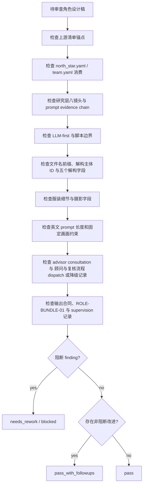

# Review Contract

本文件定义 `角色/2-设计` 的质量门禁、顾问与复核流程 汇流审查和验收输出。

## Default Reviewer Path

- 默认使用本地顾问与复核流程 / reviewers。
- 默认顾问路径按 `../../../_shared/team-advisor-consultation-contract.md` 执行：先从项目 `team.yaml.roles.supervision.stage_profiles."7-设计"` 或共享合同回退路径解析监制 roster，请教角色/服装/美术/摄影/导演相关顾问；顾问问题必须绑定 `steps/character-design-workflow.md` 的当前 `node_id / pass_id / gate_id`、目标角色上下文和 review gate，形成 `advisor_consultation_packet` 后再进入设计稿汇流。
- 默认 review 必须同时读取 `references/design-output-contract.md`、`references/design-slot-review-contract.md` 与 `references/workflow-supervision-contract.md`；`ROLE-BUNDLE-01` 必须被解析为非空 slot bundle 记录。
- 推荐 reviewer：`character-research-reviewer`、`visual-costume-reviewer`、`cinematography-reviewer`、`prompt-length-reviewer`。
- 若当前环境无外部顾问与复核 provider，主 agent 直接采用本地顺序 checklist；不得把本地 checklist 说成外部并行执行。

## Review Dimensions

| dimension | checks |
| --- | --- |
| upstream_anchor | 角色名称、首次登场、原文描述复述是否来自 `角色清单.md` |
| project_context | 是否读取并体现 `north_star.yaml` 和 `team.yaml` 的相关设计上下文 |
| research_layer | 研究是否转化为身份、职业、阶层、地域年代、服饰工艺、身体姿态、禁区、不确定性和 prompt evidence chain |
| llm_first | 研究、物语、解构和提示词是否由 LLM 直接完成，脚本未替代主创 |
| required_sections | 是否包含研究考据、物语、解构、提示词设计 |
| decomposition | `## 4. 解构` 下方是否先写 `主体ID号：<主体ID>`；五个解构字段是否齐全且内容不互相串位 |
| output_naming | 文件名是否为 `<主体ID>-<角色名>.md`，且文件名前缀与解构主体 ID、提示词设计主体 ID、英文 prompt 前缀一致 |
| costume | 服装是否含廓形、材质、色彩、配件、使用痕迹或功能逻辑 |
| cinematography | 是否固定为纯色背景全身定妆照，而非剧情场景或环境肖像 |
| prompt | 英文、以主体 ID 号开头、融合全局风格和服装风格、不超过 1300 characters，且该前缀与解构主体 ID、提示词设计主体 ID 完全一致；整合对象是 `## 4. 解构` 全部有效信息，不是前后缀拼接；关键短语可回指 prompt evidence chain 与 `deconstruction_coverage` |
| design_output_contract | 是否逐条检查 `references/design-output-contract.md` 的结构硬规则、prompt 整合硬规则、字符数、自然语言负向约束和 `--no` 禁用 |
| slot_bundle_review | 是否按 `references/design-slot-review-contract.md` 解析 `ROLE-BUNDLE-01`，并对 `required_slots` 逐项给出证据位置或缺槽 finding |
| fixed_visual | 是否包含 full-body costume fitting photo、solid color background、no scene environment |
| advisor_consultation | 是否按 `team.yaml.roles.supervision.stage_profiles."7-设计"` 或共享合同回退路径请教项目监制顾问；问题是否绑定当前思维·执行节点；顾问是否代入角色意识、创作风格和专业水准给出节点级判断、执行取舍、局部 patch 或风险提示 |
| 顾问与复核流程 | 默认复核流程是否执行；不可用时使用本地流程记录是否完整；是否按 `references/workflow-supervision-contract.md` 留下 supervision 记录 |
| scope | 是否未修改父级、registry、上游清单或其他 worker 范围 |

## Verdict Model

| verdict | meaning |
| --- | --- |
| `pass` | 可作为角色细目设计稿交付 |
| `pass_with_followups` | 可交付，但存在非阻断改进项 |
| `needs_rework` | 字段、风格、prompt 或锚点存在阻断问题 |
| `blocked` | 缺少上游清单、项目初始化上下文或被上层策略阻断 |

## Finding Shape

```yaml
finding:
  severity: critical | high | medium | low
  dimension: upstream_anchor | project_context | research_layer | llm_first | sections | decomposition | output_naming | costume | cinematography | prompt | design_output_contract | slot_bundle_review | fixed_visual | advisor_consultation | 顾问与复核流程 | scope
  symptom: ""
  direct_cause: ""
  source_contract: ""
  rework_target: ""
```

## Research Layer Gate

研究层需逐项通过以下审查：

| gate_id | blocking_when_missing | reviewer_question |
| --- | --- | --- |
| `RESEARCH-IDENTITY` | high | 身份和故事压力是否来自清单/项目上下文，并转化为外观或姿态？ |
| `RESEARCH-OCCUPATION-CLASS` | high | 职业、阶层和资源痕迹是否转化为身体、面料、磨损、配饰或行动功能？ |
| `RESEARCH-REGION-ERA` | medium/high | 地域年代是否明确，特定文化/制度信息是否避免误写？ |
| `RESEARCH-COSTUME-CRAFT` | high | 服装是否写到剪裁、面料、层次、闭合方式、工艺或使用痕迹？ |
| `RESEARCH-BODY-POSTURE` | high | 身体姿态是否可用于纯色背景全身定妆照，而非剧情场景动作？ |
| `RESEARCH-TABOO` | critical | 项目禁区、安全风险、文化误读和固定画面禁区是否已写入 guardrails？ |
| `RESEARCH-UNCERTAINTY` | high | 低证据推演是否标明置信度和待确认项？ |
| `RESEARCH-PROMPT-CHAIN` | high | prompt 中的关键短语是否能回指 `evidence -> design decision -> prompt phrase`？ |

## Review Flow Map



## Gate Rule

不得宣布完成：

- 任一设计稿缺少模板必填块。
- 英文提示词超过 1300 characters。
- 英文提示词没有以主体 ID 号开头。
- 英文提示词只拼接主体 ID、风格、服装或负向词等前缀后缀，未整合 `## 4. 解构` 的全部有效身份、外观、服装、姿态和摄影信息。
- 英文提示词使用 Midjourney `--no` 参数，而不是自然语言负向约束。
- `## 4. 解构` 下方缺少 `主体ID号：<主体ID>`，或该 ID 与 `## 5. 提示词设计` 主体 ID / 英文 prompt 前缀不一致。
- 输出文件名缺少主体 ID 前缀，或文件名前缀与 `## 4. 解构` 主体 ID、`## 5. 提示词设计` 主体 ID、英文 prompt 前缀不一致。
- 摄影字段或英文提示词把角色放进具体场景、建筑空间、街景、室内陈设或复杂环境。
- 缺少全身定妆照、纯色背景或 no scene environment 约束。
- 研究层缺少身份、职业、阶层、地域年代、服饰工艺、身体姿态、禁区、不确定性或 prompt evidence chain 任一关键镜头。
- 研究内容无法说明如何转化为角色外观、服装、姿态、摄影或 prompt。
- prompt 关键短语无法回指研究证据、项目风格、`deconstruction_coverage` 或固定画面合同。
- 未逐条消费 `references/design-output-contract.md`，或输出结构/prompt 整合硬规则只停留在旁路文档。
- 未解析 `ROLE-BUNDLE-01`，或 required slot 缺少证据位置且未形成 blocking finding。
- `references/workflow-supervision-contract.md` 要求的 provider/local checklist/merge 记录为空。
- 默认顾问与复核流程启用时，缺少 `advisor_consultation_packet`，或顾问问题没有绑定当前 `node_id / pass_id / gate_id`，或顾问意见没有转成节点级判断、执行取舍、局部 patch 或风险提示。
- 未消费 `north_star.yaml` 和 `team.yaml` 却声称项目风格对齐。
- 脚本生成了创作正文。
- 默认顾问与复核流程被跳过。
- 任务改动越过 `.agents/skills/aigc/7-设计/角色/2-设计/**` 或项目输出路径。
