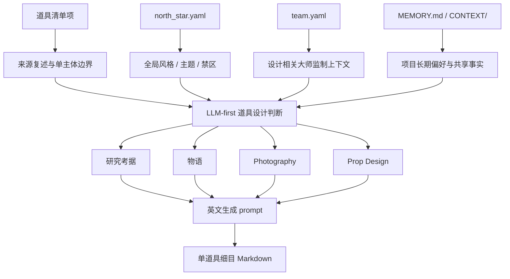
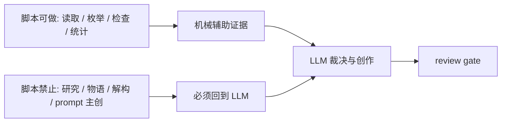

# Prop Design Contract

本文件定义 `道具/2-设计` 的业务细则。根 `SKILL.md` 拥有入口、路由和输出合同；本文件只展开单道具细目设计规则。

## Upstream Contract

必须消费：

- `projects/aigc/<项目名>/7-设计/道具/1-清单/道具清单.md`
- `projects/aigc/<项目名>/0-初始化/north_star.yaml`
- `projects/aigc/<项目名>/team.yaml`

可按需消费：

- `projects/aigc/<项目名>/MEMORY.md`
- `projects/aigc/<项目名>/CONTEXT/`
- 上游首次登场对应的分组稿或分镜稿，仅用于回查原文证据，不用于新增清单外道具。

## LLM-First Creative Authorship

- 研究考据、物语、解构、物品风格和英文 prompt 必须由 LLM 直接创作与裁决。
- 脚本不得通过模板拼接、启发式补句、字段扩写或规则生成来冒充道具设计正文。
- 脚本可以读取清单、枚举项目路径、检查 Markdown 标题、统计 prompt 字符数、生成空目录或报告缺字段。

## Required Design Sections

每个单道具 Markdown 文件必须包含以下章节：

| section | required content |
| --- | --- |
| `名称 / 首次登场 / 原文描述复述` | 清单项名称、首次登场、对上游原文描述的短复述；不得改写成新事实 |
| `研究考据` | 与道具形制、材质、工艺、年代、文化来源或功能逻辑有关的考据；必须附研究证据链，冷门信息可网络搜索 |
| `物语` | 道具在故事中的压力、象征、拥有者痕迹、使用历史或情绪功能 |
| `解构` | `## 4. 解构` 标题下方必须先写 `主体ID号：<主体ID>`，再至少包含 `Photography` 和 `Prop Design` 两个字段 |
| `提示词设计` | 引用全局风格提示词、补充物品风格，列出 prompt evidence chain，并给出英文 prompt，整合 `## 4. 解构` 全部有效信息，使用自然语言负向约束，不使用 `--no`，1300 characters 内 |

## Fixed Visual Constraint

- 道具设计稿默认是纯色背景上的单道具近景特写，用于锁定物件形制、材质和识别点。
- 默认摄影为 close-up prop shot、45-degree view、full prop in view、prop only、solid color background。
- 必须完整展示道具全貌，仅展示道具本体；不得让道具置身于剧情场景、桌面环境、室内陈设、街景、人物手持情境、多物件场景或任何背景元素中。
- 若道具的使用方式需要说明，只能在 `物语` 或 `Prop Design` 中解释，不得让最终画面出现手、角色或场景。

## Design Source Map





## Research Rules

- 研究必须服务可见设计，不写与造型和拍摄无关的百科段落。
- 每条研究结论必须落到至少一个可见或可生成字段：形制、材料、工艺、年代、使用痕迹、功能逻辑、风险/不确定性、prompt evidence token。
- 研究证据链应区分 `source_fact`、`inference`、`inspired_by` 与 `unknown`：确定事实可直接锁定，推断和灵感只能作为设计方向，不得伪装成上游事实。
- 研究输出优先使用短表格或短条目，避免长段抄写；每条最好能回答“它改变了哪个形状、材料、工艺、磨损、年代或 prompt token”。
- 冷门信息允许网络搜索的条件：用户明确要求考据、项目题材依赖真实历史/工艺/地域信息、或 LLM 对事实置信度不足。
- 使用网络搜索时应优先可靠来源，并在输出中用简短来源说明或“不确定性注记”标识，不长篇摘录。
- 若无法验证冷门信息，设计可使用“受某类工艺启发”的措辞，避免伪造具体史实。
- 与现实危险物、医疗器械、武器或违法用途相关的研究只能转译为外观和叙事安全描述，不得提供可执行制造、使用或伤害步骤。

## Research Evidence Chain Contract

研究层必须形成如下最小链路：

```text
source cue -> confidence -> visual translation -> design lock -> prompt evidence token
```

| chain slot | required decision |
| --- | --- |
| `source cue` | 来自清单、north_star、team、项目记忆、项目 CONTEXT、本地知识或网络来源的哪一类证据 |
| `confidence` | `confirmed` / `probable` / `inferred` / `uncertain`，并说明不确定性 |
| `visual translation` | 转成形制、材料、工艺、年代、使用痕迹、功能逻辑或安全边界 |
| `design lock` | 哪些特征必须固定，哪些允许生成时微变 |
| `prompt evidence token` | 最终英文 prompt 中应出现的紧凑 token 或短语 |

推荐研究覆盖面：

| research axis | output expectation |
| --- | --- |
| `form_factor` | 轮廓、比例、开口、接口、可动件、握持/携带方式；不得加入手或场景入镜 |
| `material_system` | 主材、副材、表面处理、反光/吸光、透明度、重量感 |
| `craft_process` | 手作、铸造、锻打、漆面、缝制、雕刻、磨蚀、拼接等可见工艺痕迹 |
| `period_logic` | 年代、地域、技术水平或世界观阶段如何改变形制与装饰 |
| `wear_trace` | 划痕、磨损、污渍、修补、包浆、断裂、氧化等叙事痕迹 |
| `function_logic` | 道具如何被使用、储存、开启、识别或误用；只写可见逻辑，不写操作教程 |
| `risk_uncertainty` | 事实缺口、文化误读、危险用途、生成歧义和需要保守表达的位置 |

## Prompt Evidence Chain Rules

- 英文 prompt 的关键名词、材质、年代、磨损、工艺、形制和禁止项，应能回指 `研究考据`、`物语` 或 `解构` 的字段。
- `prompt evidence chain` 不要求每个英文词都溯源，但必须覆盖会影响生成结果的核心 token。
- 若某 token 只是全局风格提示词的一部分，应标注 `global_style`；若来自物品风格，应标注 `item_style`。
- 不得为了塞入证据链而增加场景、人物、手持、桌面、房间或街景 token。

## North Star And Team Consumption

`north_star.yaml` 应转译为：

- 全局风格提示词或视觉母题。
- 主题、时代、材质、色彩、镜头、禁区。
- 该道具在项目整体美术系统中的位置。

`team.yaml` 应转译为：

- 与设计、摄影、美术、服装、动作、导演或审美有关的大师监制视角。
- 至少一条可见的设计决策，例如材质克制、形制陌生化、手作痕迹、可拍摄反光、握持方式或留白。
- 不把大师名字当装饰性标签；必须说明它如何改变道具方案。

## Deconstruction Rules

`Photography` 字段应回答：

- 镜头距离、角度、焦段感、景深、光线、反光、阴影、运动或静置状态。
- 道具在画面中如何被识别，是否需要特写、边缘光或轮廓隔离。
- 默认固定为近景特写、45 度视角、完整展示道具全貌、仅展示道具、纯色背景；不得把人物、手、桌面、房间、街景、环境对照或背景元素写入默认画面，只能在文字中说明用途。

`Prop Design` 字段应回答：

- 外形轮廓、材质、工艺、颜色、尺度、重量感、使用痕迹、损伤、可动部件、接口、包装或携带方式。
- 哪些元素是生成时必须锁定的识别点，哪些可以随机变化。

## Prompt Rules

- prompt 必须为英文，最多 1300 characters。
- prompt 必须以主体 ID 号开头，格式为 `<主体ID>: ...`；主体 ID 来自上游清单、source row 或安全文件名派生的 ASCII ID。
- prompt 开头的主体 ID 必须与 `## 4. 解构` 下方 `主体ID号：<主体ID>` 和 `提示词设计` 中记录的主体 ID 完全一致。
- prompt 必须同时包含全局风格提示词引用和物品风格。
- 最终英文整合提示词的整合对象是 `## 4. 解构` 的全部有效信息，包括 `Photography` 与 `Prop Design` 中的镜头距离、45 度角度、完整展示、形制、线条、体积、材料、纹理、装饰、年代、磨损、功能逻辑、尺度和固定画面约束；不得只把主体 ID、全局风格、物品风格、固定画面词或负向词作为前缀/后缀拼接后宣布完成。
- prompt 应聚焦单个道具，避免把角色、场景或完整剧情塞入主体。
- prompt 必须包含 `close-up prop shot, 45-degree view, full prop in view, prop only, solid color background, no people, no background elements, no scene environment` 或等价约束。
- prompt 必须使用自然语言负向约束，例如 `avoid people, hands, character, model, body parts, tabletop scene, room set, street, landscape, props cluster, background elements, cropped prop, partial prop`，但不得压过主体设计；不得使用 Midjourney `--no` 参数。
- 若全局风格提示词缺失，必须写明 `Global style prompt: missing upstream source`，并只输出物品风格 prompt 草案。

## Non-Goals

- 不重新生成 `道具清单.md`。
- 不创建图像、视频或生成任务。
- 不修改角色、场景、父级路由、registry 或其他 worker 的文件。
- 不把多个道具合成一个并列总稿。
