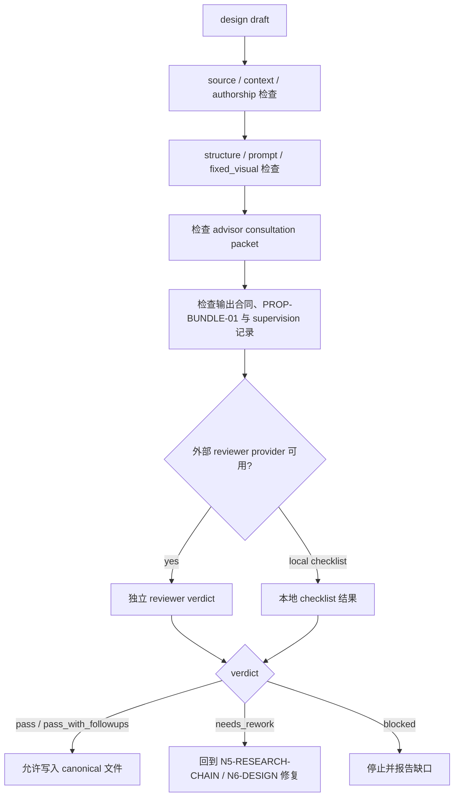

# Prop Design Review Contract

本文件定义 `道具/2-设计` 的质量门禁、reviewer provider 接入和本地 checklist 口径。

## Default Provider

- 默认 worker：`Worker-Prop`
- 默认顾问路径按 `../../../_shared/team-advisor-consultation-contract.md` 执行：先从项目 `team.yaml.roles.supervision.stage_profiles."7-设计"` 或共享合同回退路径解析监制 roster，请教道具/美术/摄影/导演/工艺相关顾问；顾问问题必须绑定 `steps/prop-design-workflow.md` 的当前 `node_id / pass_id / gate_id`、目标道具上下文和 review gate，形成 `advisor_consultation_packet` 后再进入单道具设计汇流。
- 默认 reviewer：独立 prop-design reviewer provider；若无专名，则使用可用的 `code-reviewer` / design reviewer provider 执行结构与语义门禁。
- 默认 review 必须同时读取 `references/design-output-contract.md`、`references/design-slot-review-contract.md` 与 `references/workflow-supervision-contract.md`；`PROP-BUNDLE-01` 必须被解析为非空 slot bundle 记录。
- 若当前运行环境不使用外部 reviewer，直接使用本地 review checklist。

## Review Scope

| dimension | checks |
| --- | --- |
| source | 是否回指 `1-清单/道具清单.md` 的单个清单项 |
| context | 是否读取并消费 `north_star.yaml`、`team.yaml`、项目记忆和相关上下文 |
| authorship | 研究、物语、解构和 prompt 是否为 LLM-first，而非脚本拼接 |
| research_chain | 研究是否转译为形制、材料、工艺、年代、使用痕迹、功能逻辑、风险/不确定性和 prompt evidence token |
| structure | 必填章节是否齐全，`## 4. 解构` 下方是否先写 `主体ID号：<主体ID>`，`Photography` 与 `Prop Design` 是否分离 |
| output_naming | 文件名是否为 `<主体ID>-<安全文件名>.md`，且文件名前缀与解构主体 ID、提示词设计主体 ID、英文 prompt 前缀一致 |
| prompt | 英文 prompt 是否以主体 ID 号开头，包含全局风格 + 物品风格，且 1300 characters 内；prompt 前缀是否与解构主体 ID、提示词设计主体 ID 完全一致；整合对象是否为 `## 4. 解构` 全部有效信息而不是前后缀拼接 |
| design_output_contract | 是否逐条检查 `references/design-output-contract.md` 的结构硬规则、prompt 整合硬规则、字符数、自然语言负向约束和 `--no` 禁用 |
| slot_bundle_review | 是否按 `references/design-slot-review-contract.md` 解析 `PROP-BUNDLE-01`，并对 `required_slots` 逐项给出证据位置或缺槽 finding |
| prompt_evidence | 核心 prompt token 是否能回指研究、物语或解构字段，并包含 `deconstruction_coverage` 说明解构槽位如何进入、合并或被剔除 |
| fixed_visual | 是否为纯色背景单道具近景特写、45 度视角、完整展示道具全貌、仅展示道具、无人物、无背景元素、无场景环境 |
| advisor_consultation | 是否按 `team.yaml.roles.supervision.stage_profiles."7-设计"` 或共享合同回退路径请教项目监制顾问；问题是否绑定当前思维·执行节点；顾问是否代入角色意识、创作风格和专业水准给出节点级判断、执行取舍、局部 patch 或风险提示 |
| workflow_supervision | 是否按 `references/workflow-supervision-contract.md` 记录外部 provider 或本地 checklist 路径、本地 reviewer checklist 和汇流裁决 |
| type | `type_profile` 是否合理，冷门考据和多状态是否按类型处理 |
| scope | 是否只写入 `7-设计/道具/2-设计`，未触碰 registry、父级或其他技能 |

## Review Gates

| gate_id | dimension | fail_code | blocking_when | rework_target | report_evidence |
| --- | --- | --- | --- | --- | --- |
| `GATE-PROP-DESIGN-01` | source | `FAIL-PROP-DESIGN-01` | 缺少 `1-清单/道具清单.md` 来源，或目标道具无法回指单个清单项的名称、首次登场、原文描述 | `N2-UPSTREAM` / `N3-SCOPE` | `upstream_manifest`、清单行号、缺失字段或降级说明 |
| `GATE-PROP-DESIGN-02` | source / scope | `FAIL-PROP-DESIGN-02` | 设计稿混入多个道具主体、新增清单外主体，或把上游冲突静默裁决为新 canonical 真源 | `N3-SCOPE` | `prop_worklist`、单主体边界说明、上游修复建议 |
| `GATE-PROP-DESIGN-02A` | scope | `FAIL-PROP-DESIGN-02A` | 增量补缺时覆盖既有设计稿、为未调度主体补占位，或未记录 alias merge / design gap 状态 | `N3-SCOPE` / `N8-WRITE` | `design_manifest_delta`、跳过/覆盖许可、alias merge 记录 |
| `GATE-PROP-DESIGN-03` | structure | `FAIL-PROP-DESIGN-03` | 必填章节缺失，`## 4. 解构` 下方未先写 `主体ID号：<主体ID>`，或 `Photography` / `Prop Design` 未拆分 | `N6-DESIGN` | 模板块覆盖检查、解构标题证据、缺块 finding |
| `GATE-PROP-DESIGN-04` | context | `FAIL-PROP-DESIGN-04` | 未读取或未实际消费 `north_star.yaml`、`team.yaml`、全局风格、主题禁区或设计相关监制上下文 | `N2-UPSTREAM` / `N5-RESEARCH-CHAIN` | `project_design_context`、advisor roster、已消费字段与缺口说明 |
| `GATE-PROP-DESIGN-05` | authorship | `FAIL-SCRIPT-AUTHORSHIP` | 研究考据、物语、解构、物品风格或英文 prompt 由脚本、模板拼接或启发式补句生成 | `N6-DESIGN` | 脚本职责清单、LLM 主创声明、正文生成来源说明 |
| `GATE-PROP-DESIGN-06` | prompt / output_naming | `FAIL-PROP-DESIGN-05` | 英文 prompt 未以同一主体 ID 开头、未引用全局风格与物品风格、超过 1300 characters、使用 `--no`，或未整合 `## 4. 解构` 全部有效信息 | `N6-DESIGN` | prompt 字符数、三处主体 ID 对照、解构槽位覆盖、自然语言负向约束检查 |
| `GATE-PROP-DESIGN-07` | scope / output_naming | `FAIL-PROP-DESIGN-06` | 输出路径不在 `7-设计/道具/2-设计/`，文件名缺主体 ID 前缀，或触碰父级、`1-清单`、`3-生成`、registry 或其他技能目录 | `N8-WRITE` | 输出路径、文件名前缀、改动文件清单、越界项排除说明 |
| `GATE-PROP-DESIGN-08` | fixed_visual | `FAIL-PROP-DESIGN-07` | `Photography` 或 prompt 未固定纯色背景 45 度单道具近景、完整展示道具全貌、仅展示道具，或出现人物、手、桌面、房间、街景、背景元素 | `N6-DESIGN` | fixed visual phrase 检查、禁用元素清单、prompt 约束位置 |
| `GATE-PROP-DESIGN-09` | research_chain | `FAIL-PROP-DESIGN-08` | 研究停留在百科、气氛词或未验证断言，未转译为形制、材料、工艺、年代、使用痕迹、功能逻辑、风险/不确定性 | `N5-RESEARCH-CHAIN` | research evidence chain、`visual translation`、`risk_uncertainty` |
| `GATE-PROP-DESIGN-10` | prompt_evidence | `FAIL-PROP-DESIGN-09` | prompt 核心 token 无法回指研究、物语或解构字段，或缺少 `deconstruction_coverage` 说明槽位整合/合并/剔除 | `N5-RESEARCH-CHAIN` / `N6-DESIGN` | `prompt_evidence_chain`、`deconstruction_coverage`、缺槽 finding |
| `GATE-PROP-DESIGN-11` | advisor_consultation | `FAIL-PROP-DESIGN-10` | 默认顾问路径启用时未请教项目监制顾问，或顾问问题没有绑定当前 `node_id / pass_id / gate_id` 并转成节点级判断、取舍、patch 或风险提示 | `N5-RESEARCH-CHAIN` / `N7-REVIEW` | `advisor_consultation_packet`、`advisor_node_coverage`、降级原因 |
| `GATE-PROP-DESIGN-12` | design_output_contract | `FAIL-PROP-DESIGN-TEMPLATE-REGISTRY` | 未使用 canonical structured template 登记的结构真源，或组根模板/脚本替代 leaf LLM 正文创作 | `N6-DESIGN` | 模板路径、渲染来源、脚本机械边界说明 |
| `GATE-PROP-DESIGN-SLOT-01` | slot_bundle_review | `FAIL-PROP-DESIGN-SLOT-01` | 未解析非空 `PROP-BUNDLE-01`，或 required slots 缺少证据位置且未形成 blocking finding | `N7-REVIEW` | `slot_bundle_review`、required slot evidence map、缺槽 finding |
| `GATE-PROP-DESIGN-WORKFLOW-01` | workflow_supervision | `FAIL-PROP-DESIGN-WORKFLOW` | `workflow_supervision` 缺 subject、dispatch mode、blocking layer、advisor roster、reviewer roster、本地 checklist、slot findings 或 merge decision | `N7-REVIEW` | `workflow_supervision` packet、dispatch mode、local checklist、unlaunched reviewers |
| `GATE-PROP-DESIGN-WORKFLOW-02` | workflow_supervision | `FAIL-PROP-DESIGN-MERGE-DECISION` | reviewer / checklist / slot bundle findings 未由主 agent 汇流裁决，或留下互相竞争的并列稿 | `N7-REVIEW` / `N6-DESIGN` | `merge_decision`、采纳/拒绝 patch 记录、最终单稿声明 |
| `GATE-PROP-DESIGN-RESEARCH-SAFETY` | research_chain | `FAIL-PROP-DESIGN-RESEARCH-SAFETY` | 冷门网络信息、危险物、医疗器械、武器或违法用途研究被写成确定事实、操作步骤或可执行伤害/制造说明 | `N5-RESEARCH-CHAIN` | 搜索必要性、来源姿态、不确定性/安全转译记录 |

## Verdict Model

| verdict | meaning |
| --- | --- |
| `pass` | 可作为单道具细目设计交付 |
| `pass_with_followups` | 可交付，但有非阻断后续项 |
| `needs_rework` | 有阻断问题，必须返工后再交付 |
| `blocked` | 缺失关键输入、权限或上层策略阻断 |

## Review Flow Map



## Finding Shape

```yaml
finding:
  severity: critical | high | medium | low
  dimension: source | context | authorship | research_chain | structure | output_naming | prompt | design_output_contract | slot_bundle_review | prompt_evidence | fixed_visual | advisor_consultation | workflow_supervision | type | scope
  symptom: ""
  direct_cause: ""
  source_contract: ""
  rework_target: ""
```

## Checklist

- [ ] 文件名为 `<主体ID>-<安全文件名>.md`，对应单个道具主体，未混入总稿。
- [ ] `名称 / 首次登场 / 原文描述复述` 与上游清单一致。
- [ ] 研究考据服务可见设计；冷门信息有来源说明或不确定性注记。
- [ ] 研究证据链覆盖形制、材料、工艺、年代、使用痕迹、功能逻辑、风险/不确定性中的必要项。
- [ ] 研究结论区分确定事实、推断、灵感转译和未知项，没有把不确定信息写成确定史实。
- [ ] 物语没有扩写成新剧情真源。
- [ ] `Photography` 描述拍摄可见语言，`Prop Design` 描述物件造型语言。
- [ ] `## 4. 解构` 下方存在 `主体ID号：<主体ID>`，且与 `## 5. 提示词设计` 的主体 ID 号、英文 prompt 开头完全一致。
- [ ] 文件名前缀与 `## 4. 解构` 主体 ID、`## 5. 提示词设计` 主体 ID、英文 prompt 前缀完全一致。
- [ ] `Photography` 固定为近景特写、45 度视角、完整展示道具全貌、仅展示道具、纯色背景、无人物、无背景元素、无场景环境。
- [ ] 英文 prompt 不超过 1300 characters。
- [ ] 英文 prompt 以主体 ID 号开头，格式为 `<主体ID>: ...`。
- [ ] prompt 引用全局风格提示词，并补充物品风格。
- [ ] prompt evidence chain 覆盖核心 token：主体名、形制、材料、工艺/年代、使用痕迹、功能逻辑、`deconstruction_coverage` 和固定画面约束。
- [ ] 英文 prompt 整合 `## 4. 解构` 的全部有效 Photography + Prop Design 信息，而不是只拼接主体 ID、风格、物品、固定画面或负向词。
- [ ] 英文 prompt 使用自然语言负向约束，未使用 Midjourney `--no` 参数。
- [ ] prompt 明确包含 close-up prop shot、45-degree view、full prop in view、prop only、solid color background、no people、no background elements、no scene environment。
- [ ] 已逐条消费 `references/design-output-contract.md`。
- [ ] 已解析 `PROP-BUNDLE-01`，且 required slots 均有证据位置或 blocking finding。
- [ ] 已按 `references/workflow-supervision-contract.md` 记录 provider/local checklist/merge。
- [ ] 默认顾问与复核流程启用时，`advisor_consultation_packet` 已从 `team.yaml` 顾问请教中提炼出节点级可执行指导、局部 patch 或风险提示，或已使用本地流程。
- [ ] 输出路径在 `projects/aigc/<项目名>/7-设计/道具/2-设计/`。

## Gate Rule

不得在以下情况宣布完成：

- 缺少上游清单来源。
- 缺少必填章节任一项。
- `## 4. 解构` 下方缺少 `主体ID号：<主体ID>`，或该 ID 与 `## 5. 提示词设计` 主体 ID / 英文 prompt 前缀不一致。
- 输出文件名缺少主体 ID 前缀，或文件名前缀与 `## 4. 解构` 主体 ID、`## 5. 提示词设计` 主体 ID、英文 prompt 前缀不一致。
- 研究没有转译为形制、材料、工艺、年代、使用痕迹、功能逻辑或不确定性处理。
- prompt 核心 token 与研究/物语/解构字段脱节，或缺少 `deconstruction_coverage`。
- prompt 非英文、未以主体 ID 号开头、超长、使用 `--no` 参数、没有全局风格 + 物品风格，或只拼接前后缀而未整合 `## 4. 解构` 全部有效信息。
- 未逐条消费 `references/design-output-contract.md`，或输出结构/prompt 整合硬规则只停留在旁路文档。
- 未解析 `PROP-BUNDLE-01`，或 required slot 缺少证据位置且未形成 blocking finding。
- `references/workflow-supervision-contract.md` 要求的 provider/local checklist/merge 记录为空。
- 摄影字段或 prompt 把道具置入具体场景、桌面环境、室内陈设、街景、人物手持情境或背景元素。
- 缺少 close-up、45-degree view、full prop in view、prop only、solid color background、no people、no background elements 或 no scene environment 约束。
- 默认顾问与复核流程启用时，缺少 `advisor_consultation_packet`，或顾问问题没有绑定当前 `node_id / pass_id / gate_id`，或顾问意见没有转成节点级判断、执行取舍、局部 patch 或风险提示。
- 脚本替代 LLM 生成核心创作正文。
- 输出越过本技能授权范围。
