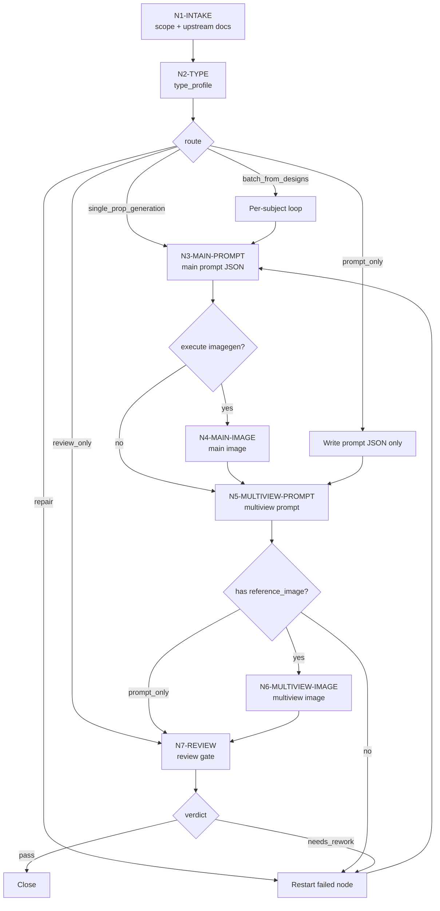
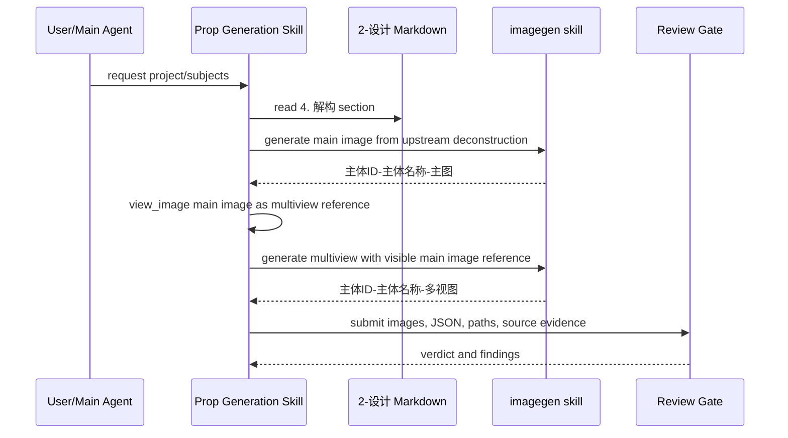

# Prop Generation Workflow

本文件承载 `道具/3-生成` 的思行一体化节点。每个节点同时包含判断、动作、证据和下一门禁。

## Business Requirement Analysis

| slot | value |
| --- | --- |
| `business_goal` | 从上游道具 `2-设计` 文档稳定生成单主体图、多视图主体设计图与同名 JSON 证据。 |
| `business_object` | `projects/aigc/<项目名>/7-设计/道具/2-设计/*.md`、`3-生成/*.json`、`3-生成/*-主图.<ext>`、`3-生成/*-多视图.<ext>`。 |
| `constraint_profile` | LLM-first 提示词裁决、不得重设主体、必须加载 `.agents/skills/cli/imagegen` 合同、默认唯一执行入口为 `.agents/skills/cli/imagegen`、项目资产必须持久化到 canonical 输出目录。 |
| `success_criteria` | 每个被调度主体都有主图、多视图、两份 JSON、来源回指、参照链、review verdict。 |
| `non_goals` | 不创作新道具设定，不修改 `2-设计`，不改 registry/routes，不生成角色或场景资产。 |
| `complexity_source` | 复杂度来自批量分流、prompt-only 路径、主图到多视图的参考链、review/subagent 降级证据。 |
| `topology_fit` | 混合拓扑：前段判型，中段按主体独立循环，后段统一 review 汇流。 |

## Topology

## Node Network

| node_id | objective | inputs | actions | evidence | route_out | gate |
| --- | --- | --- | --- | --- | --- | --- |
| `N1-INTAKE` | 锁定项目、主体、上游文档和权限边界 | 用户请求、项目根、`2-设计/*.md`、本 `SKILL.md + CONTEXT.md` | 读取项目 `MEMORY.md`、相关 `CONTEXT/`、上游设计文档和 `.agents/skills/cli/imagegen` 合同 | `generation_scope` | `N2-TYPE` | 每个主体都有可定位设计文档，或明确进入 reject/clarify |
| `N2-TYPE` | 形成可执行分型 | `generation_scope`、用户是否要求 dry-run/repair/review | 按 `types/prop-generation-type-map.md` 写出 `type_profile`，确认默认执行入口为 `.agents/skills/cli/imagegen` | `type_profile` | `N3-MAIN-PROMPT`、`N7-REVIEW` 或 failed node | `execute_imagegen`、`imagegen_mode`、`subjects` 明确；非 imagegen provider 只能来自用户显式指令 |
| `N3-MAIN-PROMPT` | 把上游 `4. 解构` 投影为主图 JSON | `type_profile`、设计文档解构段 | 填充 `templates/single-subject-prompt.json`，保留 source deconstruction quote 与输出路径 | `主体ID-主体名称-主图.json` | `N4-MAIN-IMAGE` 或 `N5-MULTIVIEW-PROMPT` | JSON 不新增主体设定，能回指上游 `4. 解构` |
| `N4-MAIN-IMAGE` | 生成并持久化单主体图 | 主图 JSON、`.agents/skills/cli/imagegen` 合同 | 通过 imagegen skill 调用图像生成，选择最终图，保存到 `3-生成` | `主体ID-主体名称-主图.<ext>` | `N5-MULTIVIEW-PROMPT` | 主图是单个道具主体，无人物或场景接管 |
| `N5-MULTIVIEW-PROMPT` | 建立主图到多视图的参照链 | 主图路径、上游 `4. 解构`、`prop-multiview-prompt.json` | 填写 `reference_image`、`reference_context_status`、多视图布局和输出路径 | `主体ID-主体名称-多视图.json` | `N6-MULTIVIEW-IMAGE` 或 `N7-REVIEW` | `reference_image` 指向对应 `主体ID-主体名称-主图.<ext>` |
| `N6-MULTIVIEW-IMAGE` | 生成并持久化多视图主体设计图 | 多视图 JSON、主图参照 | 先 `view_image` 主图并标注为道具多视图参照，再通过 imagegen skill 生成正侧背、细节、尺度/功能模块；未显式要求时不得改走其他 provider | `主体ID-主体名称-多视图.<ext>` | `N7-REVIEW` | 多视图与主图保持同一主体、材质、比例和识别点 |
| `N7-REVIEW` | 汇流质量门禁与降级证据 | 图像、JSON、路径、命名、source evidence | 执行 `review/review-contract.md`，记录真实 reviewer 或降级状态 | `review_verdict` | done 或返工 | verdict 为 `pass` 或已路由到具体失败节点 |

## Branch Rules

- `prompt_only`：执行 `N1 -> N2 -> N3 -> N5 -> N7`，不生成图像，但 JSON 中必须保留预期输出路径。
- `repair`：只重跑失败节点及其下游依赖；若主图替换，多视图必须重新评估是否需要重跑。
- `batch_from_designs`：每个设计文档独立执行 `N3-N7`，不得把不同主体合并成一个 prompt。
- `review_only`：从 `N1 -> N2 -> N7`，不得创建、删除或重命名资产。
- `single_prop_generation`：完整执行 `N1 -> N2 -> N3 -> N4 -> N5 -> N6 -> N7`。

## Merge And Failure Loop

| failure | direct route | re-entry node | stop condition |
| --- | --- | --- | --- |
| 缺上游设计文档 | reject / clarify | `N1-INTAKE` | 用户提供项目根或设计文档 |
| 缺 `4. 解构` | 回到 `2-设计` 修复 | `N3-MAIN-PROMPT` | 设计文档存在可引用解构 |
| 主图漂移 | 重写主图 JSON 或重跑主图 | `N3-MAIN-PROMPT` | 主图忠实于上游主体 |
| 多视图断链 | 补 `reference_image`，`view_image` 主图并重跑多视图 | `N5-MULTIVIEW-PROMPT` | 多视图继承主图形态与材质 |
| 输出路径越界 | 持久化到 canonical 输出目录 | `N4-MAIN-IMAGE` 或 `N6-MULTIVIEW-IMAGE` | 图像与 JSON 均在 `3-生成` |
| reviewer/subagent 阻断 | 记录降级来源并执行本地 review | `N7-REVIEW` | verdict 写明 `subagent_status` |

## Evidence Gate

- 每个 `主体ID-主体名称-主图.json` 必须包含 `subject_id`、`subject_id_source`、`source_design_doc`、`source_deconstruction_section`、`output_image`。
- 每个 `主体ID-主体名称-多视图.json` 必须包含同一 `subject_id`、`subject_id_source`、`source_design_doc`、`reference_image`、`reference_context_status`、`output_image`。
- 所有输出路径必须位于 `projects/aigc/<项目名>/7-设计/道具/3-生成/`。
