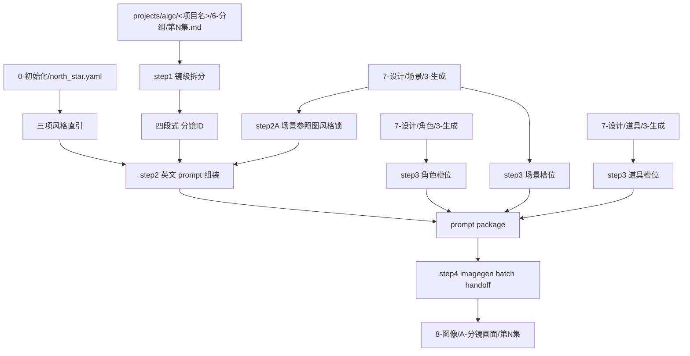
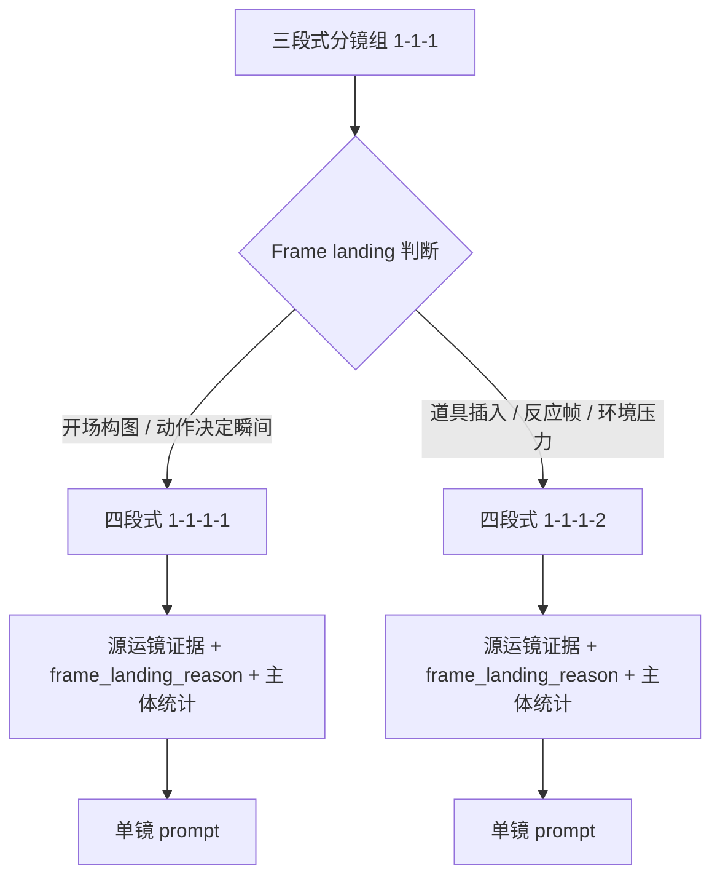
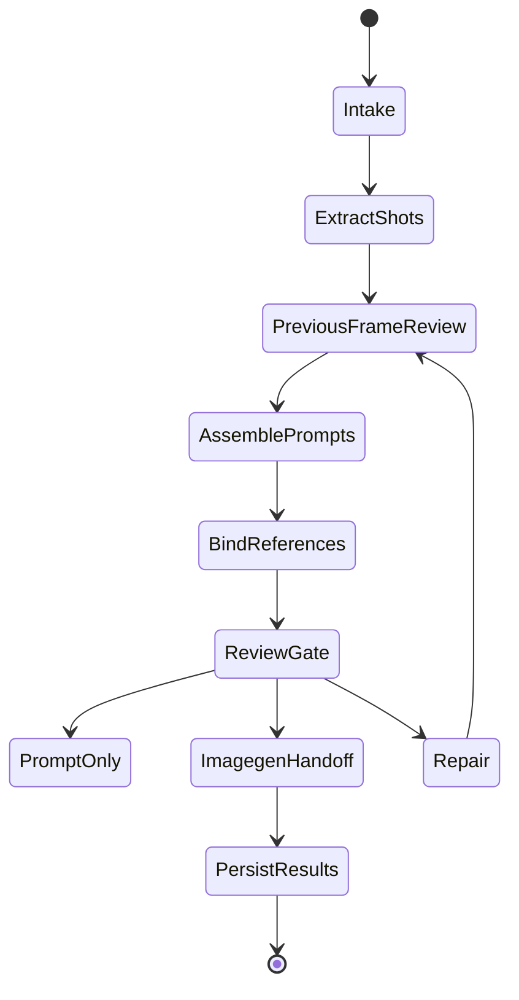

# aigc 8-图像 / A-分镜画面

`A-分镜画面` 负责把 `projects/aigc/<项目名>/6-分组/` 中的分镜组稿拆解到四段式镜级 `分镜ID`，为每个分镜生成英文 AIGC 生图提示词，保守绑定角色、场景、道具参照图，并把通过审查的分镜批量交给 `.agents/skills/cli/imagegen` 执行图像生成。

## Context Loading Contract

- 每次调用 `$aigc-image-storyboard-frame` 时，必须同时加载同目录 `CONTEXT.md`。
- 每次调用本技能时，必须同时识别并加载同目录 `types/` 中选中的类型包（单选或多选）。
- 若任务绑定 `projects/aigc/<项目名>/`，必须先加载项目根 `MEMORY.md`，再加载 `projects/aigc/<项目名>/0-初始化/north_star.yaml` 与项目根 `CONTEXT/` 中和图像阶段相关的上下文。
- `6-分组` 是本技能的主要剧情与镜头真源；不得回到 `5-摄影` 重新改写分组边界，除非用户显式要求修复上游。
- prompt 正文、镜级内容整合、画面表现增量与主体选择必须由 LLM 直接完成；脚本只允许读取、拆分、统计、校验、路径索引和批量执行辅助。
- 画面风格锁定必须同时使用两类证据：`north_star.yaml` 的文字风格直引，以及当前分镜场景参照图的实际图像信息。若存在场景参照图，组织 prompt 前必须先通过 `view_image` 检视该图，并把“画面风格，光影，色调和氛围与场景参照图保持一致。”作为固定提示词和 imagegen handoff 约束；不得只依赖全局风格文字来锁定风格。
- 执行新的画面提示词组织时，若当前分镜与上一分镜处于同一场景且上一分镜已有本地生成图，必须先通过 `view_image` 检视上一画面进入对话上下文，理解已生成画面的站位、走位、朝向、遮挡、道具相对位置和镜头轴线，再在该认知基础上生成当前分镜 prompt；无上一图或不同场景时必须记录原因，不得臆造连续性证据。
- 空间一致性必须按三维空间关系处理，而不是把场景参照图当作平面背景复用；每个同场景分镜都必须定位角色在 3D 空间中的起点、终点、移动轨迹、站位、身体朝向、视线、前后景遮挡、关键道具相对位置和镜头轴线。正反打对话戏中，相邻分镜可呈现镜像相对的南北面、东西面或房间两端背景，但必须保持同一空间坐标、对话轴线和视线闭合逻辑。
- 每个四段式分镜都必须执行单镜锚点投影：`Primary anchor` / `Support anchors` 优先来自当前 `分镜N` 的单镜画面真相和分镜明细，而不是直接继承三段式分镜组的主场景默认锚点。蒙太奇、插入镜、道具特写、转场镜头、路线图、战船远景、城门/飞檐建立镜头等，必须把主锚点重投影到当前可见主体；分组场景锚点只能作为风格或空间回接辅助。
- 批量生成必须采用两阶段拓扑：先为指定范围一次性生成完整 `第N集-分镜画面-prompts.md`、`reference-manifest.json` 与 `imagegen-plan.json`，并通过生成前审查；再按该已落盘 prompt 文档逐镜串行执行 imagegen。第二阶段不得边生成图片边补写后续 prompt，不得跳过完整 prompts 文档直接生图。
- 批量执行第二阶段仍是严格串行任务：`episode_batch_generate` 与 `shot_batch_generate` 只能按 `shot_id` 顺序逐镜完成 `参照检视 -> runtime 上一画面回看 -> imagegen -> 持久化 -> 结果记录`，不得并发、后台并行、分片并跑或跳过前镜结果直接生成后镜。角色、场景、道具参照图规则不变，已绑定本地参照仍必须在当前分镜执行前通过 `view_image` 进入对话上下文。
- 冲突优先级：用户显式请求 > 根 `AGENTS.md` / meta 规则 > `.agents/skills/aigc/SKILL.md` > `.agents/skills/aigc/8-图像/SKILL.md` > 本 `SKILL.md` > `references/` / `steps/` / `types/` / `review/` / `templates/` > `.agents/skills/cli/imagegen/SKILL.md` > `agents/openai.yaml` > 项目 `MEMORY.md` > 项目 `CONTEXT/` > 本 `CONTEXT.md`。

## Input Contract

Accepted input:

- 项目名、项目路径、单集或多集范围，要求从 `6-分组` 生成分镜画面提示词或直接生成分镜图。
- 用户指定一个或多个四段式 `分镜ID`，例如 `1-1-1-1`。
- 已有 `8-图像/A-分镜画面/` prompt 稿、参照绑定稿、生成计划或生成结果需要 repair / review / rerun。

Required input:

- 可定位的 `projects/aigc/<项目名>/6-分组/第N集.md`。
- 可定位的 `projects/aigc/<项目名>/0-初始化/north_star.yaml`，且包含 `全局风格.全局风格提示词`、`类型元素.类型元素提示词`、`细分风格.画面风格`。
- 可定位的设计生成目录：`7-设计/角色/3-生成`、`7-设计/场景/3-生成`、`7-设计/道具/3-生成`；目录缺失时允许继续 prompt-only，但必须在报告中说明参照缺口；执行 prompt 组织前，若当前场景有本地场景参照图，必须先通过 `view_image` 检视并提炼 `scene_visual_style_lock`；执行 built-in `image_gen` 前，所有已绑定的本地参照图必须先通过 `view_image` 检视进入对话上下文。
- 若目标分镜不是该场景首镜，且 `8-图像/A-分镜画面/第N集/images/<上一分镜ID>.*` 或 `第N集-imagegen-results.json` 中存在同场景上一分镜本地生成图，必须在当前 prompt 组织前通过 `view_image` 检视该图片。
- 每个目标分镜必须能从 `6-分组` 中追溯到三段式分镜组 ID 与组内 `分镜N`。

Optional input:

- `prompt_only`：只生成提示词与参照绑定，不执行 imagegen。
- `episode_batch`：一次处理一集。
- `shot_batch`：一次处理多个分镜 ID。
- `imagegen_mode`：默认遵循 `.agents/skills/cli/imagegen` 的内置 `image_gen` 路由；CLI/API fallback 只有用户显式要求时允许。
- 用户指定的 aspect ratio、尺寸、额外禁止项、执行节奏或输出目录。

Reject or clarify when:

- `6-分组` 缺失或目标 `分镜ID` 无法唯一追溯。
- 用户要求改变 `6-分组` 的剧情核心、角色事实、动作结果或镜头顺序。
- 用户要求脚本主创 prompt 正文、自动扩写剧情或用模板拼接替代 LLM 画面判断。
- 任务目标是多格故事板、漫画分镜页或视频首帧连续性，应转入相应故事板、漫画或视频技能。

## Positioning

本技能是 `8-图像` 阶段的镜级单帧入口，向上承接 `6-分组`，向下调用 `.agents/skills/cli/imagegen`。它不拥有 `6-分组` 的剧情改写权，也不拥有 `7-设计` 主体资产的重设计权；它拥有镜级 prompt、参照槽位绑定、批量生图计划和结果回写的裁决权。

## Mode Selection

| mode | 触发信号 | 主要动作 |
| --- | --- | --- |
| `prompt_only` | 只要求提示词、模板或 prompt 包 | 执行 step1-step3，写入 prompt 与 reference manifest |
| `single_shot_generate` | 指定一个四段式 `分镜ID` 且要求出图 | 执行 step1-step4，单镜调用 imagegen |
| `episode_batch_generate` | 指定一集或默认整集批量 | 先对该集全部镜级分镜完成 prompt 文档、manifest、plan，再按 `shot_id` 顺序逐镜串行执行 imagegen |
| `shot_batch_generate` | 指定多个 `分镜ID` | 先为目标分镜集合完成完整 prompt 文档、manifest、plan，再按输入排序后的 `shot_id` 逐镜串行执行，保持独立 prompt 与输出 |
| `repair` | prompt 超字数、槽位错绑、图片缺失、生成计划漂移 | 按 `review/review-contract.md` 定位返工节点 |
| `review_only` | 只检查现有输出 | 审查 prompt、参照、imagegen 计划与落盘结果，不生成新图 |

## Reference Loading Guide

| 场景 | 必读文件 |
| --- | --- |
| 从 `6-分组` 提取镜级剧情与桥段 | `references/group-source-extraction.md` |
| 组装自然英文 prompt、north_star 直引、场景参照图视觉锁与 800 English words 限制 | `references/prompt-assembly-contract.md` |
| 建立三维空间站位、走位、正反打、单镜锚点投影与轴线一致性 | `references/spatial-continuity-contract.md` |
| 场景/画面身份、镜头身份、方向参照和光线结果 | `../../_shared/scene-shot-identity-contract.md`、`references/prompt-assembly-contract.md`、`references/spatial-continuity-contract.md` |
| 查找并绑定角色、场景、道具参照图 | `references/reference-slot-binding.md` |
| 调用 `.agents/skills/cli/imagegen` 与批量生成交接 | `references/imagegen-handoff.md` |
| 执行 step1-step4 主流程 | `steps/frame-image-workflow.md` |
| 判定单镜、整集、多镜、修复模式 | `types/type-map.md` |
| 输出审查与返工 | `review/review-contract.md` |
| 输出模板 | `templates/output-template.md`、`templates/frame-prompt-template.md` |
| 脚本辅助边界 | `scripts/README.md` |
| 可复用经验 | `knowledge-base/frame-image-heuristics.md` |
| 产品侧入口元数据 | `agents/openai.yaml` |

## Visual Maps

## Execution Contract

1. 加载本 `SKILL.md + CONTEXT.md`；项目任务中加载 `MEMORY.md`、`north_star.yaml` 与相关项目上下文。
2. 按 `types/type-map.md` 锁定 mode、集号范围、目标 `分镜ID` 集合、是否执行 imagegen。
3. 执行 step1：以 `projects/aigc/<项目名>/6-分组` 为主要信息来源，解析每个 `## x-y-z` 分镜组，先判断 frame landing，再生成四段式 `x-y-z-N`。最后一段 `N` 表示组内经识别后的分镜帧落点序号，不是上游 `分镜N` 的机械继承；上游 `分镜1`、`分镜2` 等只记录为 `source_camera_units` 证据。一个上游运镜单元可拆成多个 frame landing，多个上游字段也可合并为一个 frame landing；`## x-y-z~x-y-z` 组间连接件默认忽略，不进入镜级 prompt、shot index、参照绑定或生图任务。
4. 执行 step2A 场景参照图风格锁：按当前分镜场景名在 `7-设计/场景/3-生成` 中预绑定场景参照图；若存在本地场景图，必须先 `view_image` 进入对话上下文，提炼该图的光源方向、光比、色温、主色/辅色、饱和度、雾气/烟尘/湿度、材质质感、暗部密度、高光形态和整体氛围，并记录 `scene_visual_style_lock_status: visible_in_conversation_context`；若无场景图，记录 `scene_reference_missing`，只能使用 north_star 文字风格。
5. 执行 step2 前置连续性检查：对每个非场景首镜，判断上一分镜是否与当前分镜同场景；若同场景且上一分镜已有本地生成图，必须用 `view_image` 检视上一画面进入对话上下文，并记录 `previous_frame_context_status: visible_in_conversation_context`、上一图路径、观察到的空间站位、走位方向、角色朝向、遮挡关系、关键道具相对位置和镜头轴线；若不同场景、上一图不存在或上一镜未生成，记录 `not_same_scene` / `previous_image_missing` / `previous_shot_not_generated`，不得臆造。
6. 执行三维空间规划：按 `references/spatial-continuity-contract.md` 建立当前桥段的轻量 `space_model`，并对每个四段式分镜执行 `shot_anchor_projection`；先从当前单镜真相中抽取候选锚点，再决定 `Primary anchor` / `Support anchors`，明确固定锚点、空间轴线、对话轴线、角色起点/终点/移动轨迹、身体朝向、视线目标、前后景遮挡和道具相对位置；正反打镜头必须说明反向机位、相对背景面和视线闭合关系，允许背景面相反但不允许空间漂移；蒙太奇、插入、道具微距、转场或路线镜头不得直接套用分组主场景锚点。
7. 执行 step2：以每个四段式 frame landing 为单位，LLM 直接生成自然英文 AIGC 生图提示词。提示词可以补充构图、光影、镜头、材质、画面表现、空间站位和走位连续性，但不得改变核心内容。每条 prompt 必须在 800 English words 以内，并按模板预留 `Characters:`、`Scene:`、`Props:` 槽位。
8. step2 模板必须包含：`## <分镜ID>`、直引的 `全局风格.全局风格提示词`、直引的 `类型元素.类型元素提示词`、直引的 `细分风格.画面风格`、固定提示词“画面风格，光影，色调和氛围与场景参照图保持一致。”、场景参照图视觉风格锁记录、同场景上一画面回看记录、三维空间连续性规划、`Prompt Design Blueprint`、整合后的英文 prompt。英文 prompt 中必须包含等价约束：`Match the scene reference image's visual style, lighting, color palette, and atmosphere.`，并把 frame identity、scene/frame identity、frame landing truth、continuity、shot-specific anchors、spatial blocking、camera/composition、scene reference style lock、materials/atmosphere、avoid constraints 等完整 prompt 设计体系自然写入英文 prompt 本体。英文 prompt 不得从主体动作摘要直接开始；开头必须先锁定单帧身份、场景身份或镜头观察身份，再写主体空间和动作。重要光线必须写成来源相对位置、照亮对象和阴影/轮廓结果。
9. 执行 step3：检查 `7-设计/角色/3-生成`、`7-设计/场景/3-生成`、`7-设计/道具/3-生成` 中是否存在对应主体名称图片；多视图图片优先，缺多视图时用主图，都没有真实图片时该主体槽位保持空或移除，不得猜测引用。
10. 对 `episode_batch_generate` 与 `shot_batch_generate`，必须先把指定范围内所有目标分镜完整写入 `第N集-分镜画面-prompts.md`，并同步落盘 `第N集-reference-manifest.json` 与 `第N集-imagegen-plan.json`；该 prompts 文档是后续 imagegen 的冻结输入。生成模式不得在 prompt 文档未覆盖完整目标范围时进入 step4。
11. 执行 step4 前，若 reference manifest 中存在本地参照图路径，必须逐张调用 `view_image` 检视，并按 `edit target / character reference / scene reference / prop reference` 标注角色，使图片进入对话上下文后再继续 imagegen handoff；场景参照图必须额外标注 `scene_visual_style_reference`，用于锁定画面风格、光影、色调和氛围；未完成检视的本地参照不得宣称已作为视觉参照使用。
12. 执行 step4：按 `.agents/skills/cli/imagegen` 规范调用图像生成。默认使用内置 `image_gen` 路由；批量任务只能消费已落盘且通过审查的 prompt 文档、reference manifest 与 imagegen plan，并按 `shot_id` 串行逐镜执行，每一镜完成生成、持久化和结果记录后才允许进入下一镜，不得边执行边补写后续 prompt、并发、后台并行或分片并跑；CLI/API fallback 只有用户显式要求时允许。生成计划与结果必须记录 `prompt_package_status: complete_before_imagegen`、`execution_order`、`serial_index`、`previous_shot_status`、`scene_visual_style_lock_status`、`reference_input_status: visible_in_conversation_context`；确无可绑定图片时记录 `no_reference_images_bound`，而不是伪造参照。
13. canonical 输出根路径固定为 `projects/aigc/<项目名>/8-图像/A-分镜画面`；每集可在该根下创建 `第N集/` 子目录组织 prompt、manifest、plan、results、images 与执行报告。
14. 交付前执行 `review/review-contract.md`；prompt 词数、完整 prompt 设计体系、ID 追溯、north_star 直引、场景参照图视觉风格锁、同场景上一画面回看记录、三维空间规划、单镜锚点投影、参照路径存在性、完整 prompts 文档前置生成、imagegen 输出持久化必须通过。

## Field Mapping

| field_id | 输出/证据 | 内容要求 | 失败码 |
| --- | --- | --- | --- |
| `FIELD-FRAME-01` | input manifest | 项目根、集号、`6-分组`、north_star、设计生成目录可追溯 | `FAIL-FRAME-INPUT` |
| `FIELD-FRAME-02` | shot index | `x-y-z-N` 四段式 ID 可回指 `## x-y-z`、`source_camera_units`、`frame_landing_type` 与 `frame_landing_reason` | `FAIL-FRAME-ID` |
| `FIELD-FRAME-03` | prompt package | north_star 三项直引、英文整合 prompt、800 English words 内、核心内容未改写、完整 prompt 设计体系已进入英文 prompt 本体 | `FAIL-FRAME-PROMPT` |
| `FIELD-FRAME-04` | reference manifest | Characters / Scene / Props 槽位只含真实存在图片，多视图优先，并记录本地参照图 `view_image` 检视状态 | `FAIL-FRAME-REF` |
| `FIELD-FRAME-05` | imagegen plan/result | 调用 `.agents/skills/cli/imagegen`，批量计划消费完整 prompts 文档，严格串行执行，参照图已进入对话上下文，输出持久化到项目内 | `FAIL-FRAME-IMAGEGEN` |
| `FIELD-FRAME-06` | execution report | 说明已处理分镜、跳过原因、失败原因、重试入口 | `FAIL-FRAME-REPORT` |
| `FIELD-FRAME-07` | previous frame continuity | 同场景上一生成图 `view_image` 检视状态、空间站位/走位观察、当前 prompt 连续性约束或缺失原因 | `FAIL-FRAME-CONTINUITY` |
| `FIELD-FRAME-08` | 3D spatial continuity | 同场景分镜的三维空间模型、单镜锚点投影、角色起止点/轨迹/站位、正反打相对背景面、轴线与视线闭合关系 | `FAIL-FRAME-SPATIAL` |
| `FIELD-FRAME-09` | scene visual style lock | 场景参照图已 `view_image`，并锁定画面风格、光影、色调、氛围、材质和暗部/高光形态；prompt 含固定提示词 | `FAIL-FRAME-SCENE-STYLE` |
| `FIELD-FRAME-10` | scene/frame identity | 英文 prompt 先锁定单帧、场景和镜头身份：年代/空间功能/环境声与材质光影、摄影机观察位置、相对画面方向、光线可见结果；再写主体动作 | `FAIL-FRAME-SCENE-IDENTITY` |

## Field Master

| field_id | owner | canonical file | must contain | fail code |
| --- | --- | --- | --- | --- |
| `FIELD-FRAME-01` | input lock | `第N集-shot-index.json` / report | 项目根、集号、`6-分组`、north_star、设计生成目录 | `FAIL-FRAME-INPUT` |
| `FIELD-FRAME-02` | shot extraction | `第N集-shot-index.json` | 四段式 `x-y-z-N`、源组、`source_camera_units`、`frame_landing_type`、`frame_landing_reason`、桥段摘要 | `FAIL-FRAME-ID` |
| `FIELD-FRAME-03` | prompt authorship | `第N集-分镜画面-prompts.md` | 三项 north_star 直引、英文 prompt、800 English words 内 | `FAIL-FRAME-PROMPT` |
| `FIELD-FRAME-04` | reference binding | `第N集-reference-manifest.json` | 角色/场景/道具真实图片路径，多视图优先，`view_image` 检视状态 | `FAIL-FRAME-REF` |
| `FIELD-FRAME-05` | imagegen handoff | `第N集-imagegen-plan.json` / `第N集-imagegen-results.json` | 一镜一任务、合法 mode、完整 prompts 文档已前置落盘、串行顺序、参照上下文状态、项目内输出路径 | `FAIL-FRAME-IMAGEGEN` |
| `FIELD-FRAME-06` | convergence | `执行报告.md` | generated / skipped / failed、review verdict、返工入口 | `FAIL-FRAME-REPORT` |
| `FIELD-FRAME-07` | continuity authorship | `第N集-分镜画面-prompts.md` / `执行报告.md` | 同场景上一画面回看状态、观察摘要、当前镜站位走位约束 | `FAIL-FRAME-CONTINUITY` |
| `FIELD-FRAME-08` | 3D spatial authorship | `第N集-分镜画面-prompts.md` / `执行报告.md` | 单镜锚点投影状态、当前帧锚点证据、固定锚点、空间轴线、角色起止点、移动轨迹、正反打轴线与背景面关系 | `FAIL-FRAME-SPATIAL` |
| `FIELD-FRAME-09` | scene image style authorship | `第N集-分镜画面-prompts.md` / `第N集-reference-manifest.json` / `执行报告.md` | 场景参照图视觉风格锁、固定提示词、`scene_visual_style_lock_status` | `FAIL-FRAME-SCENE-STYLE` |
| `FIELD-FRAME-10` | scene/frame identity authorship | `第N集-分镜画面-prompts.md` / `Prompt Design Blueprint` / `执行报告.md` | scene identity、frame identity、camera identity、direction reference、lighting result 均进入英文 prompt 本体 | `FAIL-FRAME-SCENE-IDENTITY` |

## Thought Pass Map

| pass_id | focus field | core question | action | evidence |
| --- | --- | --- | --- | --- |
| `PASS-FRAME-01` | `FIELD-FRAME-01` | 本轮处理哪个项目、集号和分镜范围 | 锁定 mode、读取项目上下文和 north_star | input manifest |
| `PASS-FRAME-02` | `FIELD-FRAME-02` | 三段式组稿如何判断出四段式分镜帧落点 | 解析 `## x-y-z`、上游运镜单元和 frame landing 证据 | shot index |
| `PASS-FRAME-03` | `FIELD-FRAME-03` | 单帧如何变成可生图英文 prompt | LLM 直出自然英文 prompt，填模板并压到 800 English words 内 | prompt markdown |
| `PASS-FRAME-04` | `FIELD-FRAME-04` | 哪些主体有真实本地图片可绑定并进入上下文 | 多视图优先、主图次之、缺图留空；已绑定本地图先 `view_image` | reference manifest |
| `PASS-FRAME-05` | `FIELD-FRAME-05` | 生成任务如何安全批量执行 | 先确认完整 prompts 文档、manifest、plan 已覆盖目标范围，再按 `shot_id` 逐镜串行调用 | prompt markdown / plan / results |
| `PASS-FRAME-06` | `FIELD-FRAME-06` | 输出如何闭环并可返工 | 汇总审查、失败和跳过原因 | execution report |
| `PASS-FRAME-07` | `FIELD-FRAME-07` | 当前镜与同场景上一画面如何保持空间站位和走位一致 | 若上一图存在则先 `view_image` 并提炼连续性约束；若不存在则记录原因 | prompt markdown / report |
| `PASS-FRAME-08` | `FIELD-FRAME-08` | 同场景分镜如何在 3D 空间中保持合理方位、单镜锚点和正反打轴线 | 建立 `space_model`，执行 `shot_anchor_projection`，定位角色起止点、移动轨迹、背景面与视线闭合关系 | prompt markdown / report |
| `PASS-FRAME-09` | `FIELD-FRAME-09` | 当前画面的风格、光影、色调和氛围如何被场景参照图锁定 | prompt 前先 `view_image` 场景图，提炼视觉风格锁，并写入固定提示词和英文 prompt | prompt markdown / manifest / report |
| `PASS-FRAME-10` | `FIELD-FRAME-10` | 当前 prompt 是否先锁定场景/画面/镜头身份，再写主体动作 | 消费 `../../_shared/scene-shot-identity-contract.md`，补年代/空间功能/材质声光、摄影机观察位置、相对方向和光线结果 | prompt markdown / report |

## Pass Table

| pass_id | pass standard | fail code | rework entry |
| --- | --- | --- | --- |
| `PASS-FRAME-01` | 必需输入可读，`north_star.yaml` 三项字段存在 | `FAIL-FRAME-INPUT` | `types/type-map.md` |
| `PASS-FRAME-02` | 每个 `shot_id` 唯一且可回指源组、`source_camera_units`、`frame_landing_type` 与 `frame_landing_reason`；最后一段不是直接继承上游 `分镜N` | `FAIL-FRAME-ID` | `references/group-source-extraction.md` |
| `PASS-FRAME-03` | prompt 为英文单帧，核心内容未改写，整合 prompt <= 800 English words，并包含完整 prompt 设计体系 | `FAIL-FRAME-PROMPT` | `references/prompt-assembly-contract.md` |
| `PASS-FRAME-04` | 所有绑定路径存在，图片选择遵守多视图优先，且已绑定本地图片在生成前完成 `view_image` 检视 | `FAIL-FRAME-REF` | `references/reference-slot-binding.md` |
| `PASS-FRAME-05` | imagegen plan 一镜一任务，默认内置路由，完整 prompts 文档已在执行前覆盖目标范围，记录串行顺序和参照图上下文状态，输出路径在项目内；结果顺序不得跳过前镜或并发写入 | `FAIL-FRAME-IMAGEGEN` | `references/imagegen-handoff.md` |
| `PASS-FRAME-06` | 执行报告记录 verdict、处理范围、失败/跳过与返工入口 | `FAIL-FRAME-REPORT` | `review/review-contract.md` |
| `PASS-FRAME-07` | 同场景非首镜若存在上一分镜生成图，必须已 `view_image`；当前 prompt 保持站位、朝向、动线、遮挡和关键道具空间逻辑一致，或记录无上一图/不同场景原因 | `FAIL-FRAME-CONTINUITY` | `references/prompt-assembly-contract.md` |
| `PASS-FRAME-08` | 同场景分镜不得只复用平面背景；必须有匹配当前单镜真相的 `Primary anchor` / `Support anchors`、3D 空间锚点、角色起点/终点/轨迹、正反打相对背景面、对话轴线和视线闭合说明；蒙太奇/插入/道具特写/转场镜头不得直接沿用分组主场景默认锚点 | `FAIL-FRAME-SPATIAL` | `references/spatial-continuity-contract.md` |
| `PASS-FRAME-09` | 若场景参照图存在，prompt 组织前必须已 `view_image` 并记录 `scene_visual_style_lock_status: visible_in_conversation_context`；prompt 必须包含固定提示词“画面风格，光影，色调和氛围与场景参照图保持一致。”及英文等价约束 | `FAIL-FRAME-SCENE-STYLE` | `references/prompt-assembly-contract.md` |
| `PASS-FRAME-10` | prompt 本体不从主体动作摘要直接开始；已自然写入场景身份、画面身份、镜头身份、方向参照和光线结果 | `FAIL-FRAME-SCENE-IDENTITY` | `../../_shared/scene-shot-identity-contract.md`、`references/prompt-assembly-contract.md` |

## Root-Cause Execution Contract (Mandatory)

出现失败时必须沿链路上溯：

`Symptom -> Direct Cause -> Section Owner -> Source Contract -> AGENTS.md / skill-工作车间`

优先修复：

1. ID 无法追溯：回到 `references/group-source-extraction.md` 与 `steps/frame-image-workflow.md`。
2. prompt 改写剧情或超字数：回到 `references/prompt-assembly-contract.md`。
3. 槽位错绑、路径不存在或猜测引用：回到 `references/reference-slot-binding.md`。
4. imagegen 误用 CLI/API、本地参照图未先 `view_image` 入上下文或输出未持久化：回到 `.agents/skills/cli/imagegen/SKILL.md` 与 `references/imagegen-handoff.md`。
5. 批量任务未先生成完整 prompts 文档、边生图边补后续 prompt、并发执行、分片并跑、跳过前镜结果或结果顺序断链：回到 `references/imagegen-handoff.md` 与 `steps/frame-image-workflow.md`。
6. 同场景当前 prompt 未回看上一生成图、站位走位断裂或上一图缺失原因未记录：回到 `references/prompt-assembly-contract.md` 与 `steps/frame-image-workflow.md`。
7. 空间一致性退化成平面背景复用、正反打背景面误判、角色起止点/移动轨迹/视线闭合缺失，或当前单镜 `Primary anchor` 直接套用分组主场景导致与 `Source truth` 不匹配：回到 `references/spatial-continuity-contract.md`。
8. 只用 north_star 文字风格、未用场景参照图实际视觉信息锁定画面风格/光影/色调/氛围，或缺少固定提示词：回到 `references/prompt-assembly-contract.md`、`references/reference-slot-binding.md` 与 `steps/frame-image-workflow.md`。
8.5. prompt 从人物动作摘要开始、缺少场景/画面/镜头身份、光线只写来源不写结果，或前后左右没有镜头参照：回到 `../../_shared/scene-shot-identity-contract.md` 与 `references/prompt-assembly-contract.md`。
9. 输出格式不一致：回到 `templates/output-template.md`。
10. 同类失败可复用：沉淀到同目录 `CONTEXT.md`，稳定后晋升到本文件或分区规范。

## Output Contract

- Required output: 镜级 prompt 包、参照绑定 manifest、imagegen 执行计划或生成结果、逐集执行报告。
- Output format: Markdown prompt 文档 + JSON manifest / plan / result；生成图片为 PNG/JPEG/WebP 等 bitmap 文件，默认按 imagegen 2K 目标执行。
- Output path: `projects/aigc/<项目名>/8-图像/A-分镜画面`。逐集产物可放在该根路径下的 `第N集/` 子目录；不得写入 `5-Image`、`6-分组`、`7-图像` 或其他平行真源。
- Naming convention: prompt 文档命名 `第N集-分镜画面-prompts.md`；索引命名 `第N集-shot-index.json`；参照清单命名 `第N集-reference-manifest.json`；生成计划命名 `第N集-imagegen-plan.json`；执行报告命名 `执行报告.md`；图片命名 `<分镜ID>.png`，例如 `1-1-1-1.png`。
- Completion gate: 目标分镜帧均可从 `6-分组` 回指到源组、`source_camera_units`、`frame_landing_type` 与 `frame_landing_reason`；每条 prompt 含模板要求的三项 north_star 直引、场景参照图视觉风格锁、固定提示词“画面风格，光影，色调和氛围与场景参照图保持一致。”、同场景上一画面回看记录、三维空间连续性规划、单镜锚点投影记录、`Prompt Design Blueprint` 和英文整合 prompt；每条英文 prompt 不超过 800 English words；英文 prompt 本体必须覆盖 frame identity、frame landing truth、continuity、shot-specific anchors、spatial blocking、camera/composition、scene reference style lock、materials/atmosphere、avoid constraints，不得只写镜头摘要或把体系停留在结构化字段；英文 prompt 中的 `Primary anchor` / `Support anchors` 必须匹配当前四段式分镜帧的单帧画面真相，不得把三段式分镜组主场景默认锚点无条件套给蒙太奇、插入、道具特写、转场或临时换地点画面；同场景非首镜若上一分镜已有本地生成图，必须先 `view_image` 并在当前 prompt 中保持空间站位、走位、朝向、遮挡和关键道具相对位置的逻辑一致；空间一致性必须定位角色起点、终点、移动轨迹、固定锚点、对话轴线、视线闭合和正反打相对背景面，不得退化为平面背景复用；参照槽位只绑定存在的本地图片且多视图优先；执行 prompt 组织前若存在场景参照图，必须先 `view_image` 并记录 `scene_visual_style_lock_status: visible_in_conversation_context`；英文 prompt 必须明确要求生成画面的 visual style、lighting、color palette、atmosphere 与场景参照图一致；执行 built-in `image_gen` 前已绑定本地参照图必须先 `view_image` 进入对话上下文；批量生成必须先完成指定范围的完整 prompts 文档、manifest 和 plan，再按 `shot_id` 严格串行逐镜执行，不得边生图边补写后续 prompt、并发、后台并行、分片并跑或跳过前镜结果；执行 imagegen 时遵循 `.agents/skills/cli/imagegen` 的默认路由与项目持久化门禁；审查结果为 `pass` 或 `pass_with_todo`。
