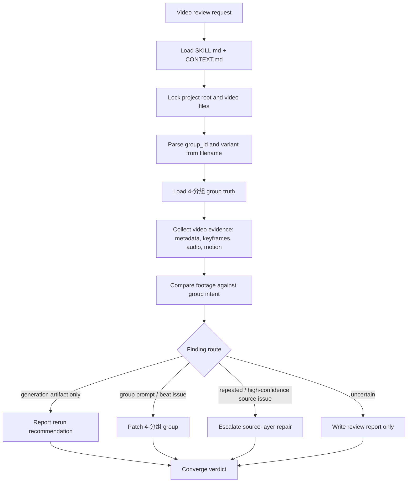
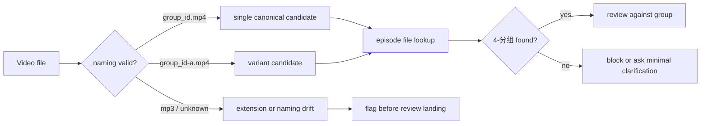
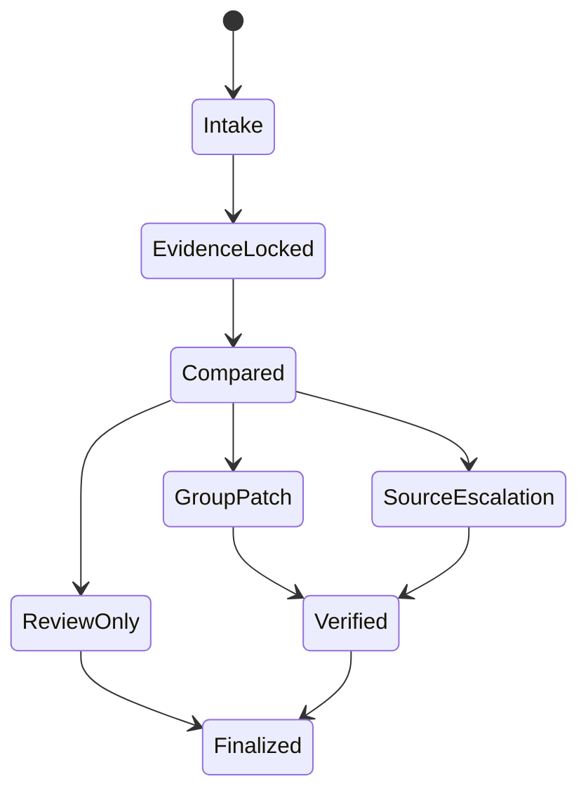
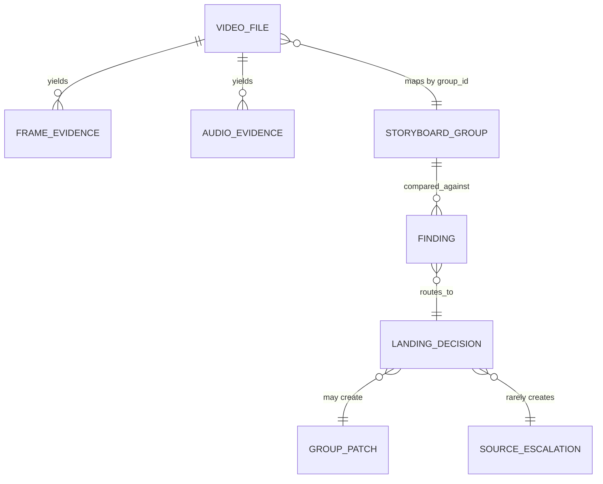

# aigc 8-审片

`8-审片` 是 AIGC 项目的视频成片审查、提示词匹配、创作质量鉴定与回写阶段。它消费 `7-视频` 下载或外部保存的实际视频素材，对照 `4-分组` 的分镜组真源、`7-视频` 的生成路线证据、用户显式给出的 prompt 和项目记忆，判断素材是否准确承载生成意图；同时评估视频本身是否存在废片级缺陷、AIGC 常见瑕疵、逻辑/一致性问题，以及创作层面的平庸、审美和艺术表达问题。

本技能支持用户显式提供好示例与坏示例。审片时应把示例作为当前任务的鉴赏校准证据，多维度比较后输出差异、归因和可执行改进；当示例偏好稳定、可复用且不与上层合同冲突时，将其沉淀到本技能同目录 `CONTEXT.md`，用于提升技能自身的鉴赏力。

## Context Loading Contract

- 每次调用 `$aigc-video-review` 时，必须同时加载同目录 `CONTEXT.md`。
- 每次调用本技能时，必须同时加载同目录 `types/type-map.md`，并按类型画像读取 `references/`、`steps/`、`review/` 中的必要细则。
- 若任务绑定 `projects/aigc/<项目名>/`，必须先加载项目根 `MEMORY.md`、`0-初始化/north_star.yaml`，再按需加载项目 `CONTEXT/` 中与视频审查、风格、角色、场景、道具或制作约束相关的上下文。
- 若本阶段启动 subagents 模式（包含用户显式要求、team reviewer runtime 或仓库合同视为默认启用），必须读取 `projects/aigc/<项目名>/team.yaml` 与 `../_shared/team-advisor-consultation-contract.md`，并按本文件 `Subagents Execution Mechanism` 执行审片监制顾问请教。
- 对任何可定位的目标视频，必须定位对应分镜组：`projects/aigc/<项目名>/4-分组/第N集.md` 中的 `## x-y-z` 是审片事实对照的首要业务真源。
- 真实视频内容分析是本技能的必须条件：任何 verdict、finding、prompt 匹配、创作质量判断或上游修复，都必须先基于真实帧、联系表、运动变化和必要音频检查形成 `observed_content_summary`；不得只凭文件名、prompt、分镜组文本、manifest 或用户预期给出审片结论。
- 冲突优先级：用户显式请求 > 根 `AGENTS.md` / meta 规则 > `.agents/skills/aigc/SKILL.md` > 本 `SKILL.md` > `references/` / `steps/` / `review/` / `types/` > `.agents/skills/aigc/4-分组/SKILL.md` > `.agents/skills/aigc/7-视频/SKILL.md` > 项目 `MEMORY.md` > 项目 `CONTEXT/` > 本 `CONTEXT.md`。

## Business Requirement Analysis

| field | decision |
| --- | --- |
| `business_goal` | 把实际视频素材中的废片级缺陷、AIGC 常见瑕疵、提示词错配、逻辑/一致性问题、创作质量问题和命名不规范转化为可复查的审片结论与上游可执行修复。 |
| `business_object` | `7-视频` 下的 `.mp4` 素材、同组变体、对应 `4-分组` 分镜组、用户给定 prompt、好/坏示例、必要的 `7-视频` prompt / manifest / queue / report。 |
| `constraint_profile` | 审片必须基于真实视频内容理解；不能只凭预期 prompt、分组文本或 manifest 推断；脚本只做元数据、抽帧、统计与结构校验，真实内容分析和核心判断由 LLM 完成。 |
| `success_criteria` | 能先说明实际视频里发生了什么，再对照分镜组意图和用户 prompt、区分 prompt 问题与模型问题、判断创作质量、吸收好坏示例校准，并给出 rerun / 4-分组修复 / 源层优化 / 鉴赏力沉淀落点。 |
| `non_goals` | 不生成新视频；不把单个模型偶发瑕疵直接升级为源层规则；不把审片报告替代 `4-分组` canonical truth。 |
| `topology_fit` | 混合型思行网络：先判型和取证，视觉/音频/命名/真源四路可并行分析；启用 subagents 时加入审片监制顾问分支，最后由主 agent 统一汇流到唯一 verdict 与落盘计划。 |

## Input Contract

Accepted input:

- 单个或多个 `projects/aigc/<项目名>/7-视频/**/<分镜组ID>.mp4` 视频文件。
- 同一分镜组多个变体：`<分镜组ID>-a.mp4`、`<分镜组ID>-b.mp4`、`<分镜组ID>-c.mp4`。
- 当前项目中暂存于 `projects/aigc/<项目名>/7-视频/第N集/` 的外部下载视频。
- 用户要求“审片”“看片”“分析视频内容”“对照分镜组”“把问题改回 4-分组”“从素材反推 prompt / 分组问题”。
- `7-视频` 阶段生成的 prompt、queue、manifest、results 或执行报告，用于辅助定位生成路线和 prompt 证据。
- 用户显式提供的 prompt、好示例、坏示例、参考片段、风格标杆或反例，用于做当前任务的匹配判断与鉴赏校准。

Required input:

- 可读的视频文件，或可从项目根和分镜组 ID 搜索到唯一候选视频。
- 可定位的项目根 `projects/aigc/<项目名>/`。
- 可定位的 `group_id`，优先从文件名提取；若文件名不规范，必须从用户说明、目录上下文或视频内容谨慎推断并报告不确定性。
- 可读的 `projects/aigc/<项目名>/4-分组/第N集.md`。
- 可回指的真实视频内容证据：至少包含元数据、关键帧或联系表、实际画面内容摘要；有音轨时还必须包含音频事实说明。

Reject or clarify when:

- 视频不存在或不可读，且无法从项目路径搜索到候选。
- 文件名无法定位分镜组，且没有足够目录或用户上下文唯一推断。
- 用户要求在没有视频证据的情况下直接“审片结论落盘”。
- 无法观察或描述真实视频内容，却要求给出通过 / 不通过、prompt 匹配、创作质量或上游修复结论。
- 用户要求把低置信缺陷直接改到源层规则。

## Naming Contract

- 规范视频文件名：`<分镜组ID>.mp4`，例如 `1-3-1.mp4`。
- 同组变体规范：`<分镜组ID>-<variant>.mp4`，`variant` 使用小写英文字母 `a`、`b`、`c` 递增，例如 `1-3-1-a.mp4`。
- 文件名中的 `group_id` 必须是三段式 `episode-scene-group`；四段式 `shot_id` 视频素材应先回推所属 `group_id`，并在审片报告中记录命名漂移。
- 用户或外部系统若保存为 `.mp3`，只按音频素材或扩展名异常处理；视频审片 canonical 扩展名仍为 `.mp4`。若用户明确要求音频审查，可审音频但不得视作视频成片通过。
- `7-视频` 生成、下载、整理结果时也必须遵守本命名合同；不得再用 `<group_id>-<sessionId>.mp4` 作为 canonical 成片名。需要保留 sessionId 时写入 queue / results / report，而不是文件名主体。

## Reference Loading Guide

| 场景 | 读取文件 |
| --- | --- |
| 任意审片任务 | `types/type-map.md`、`steps/video-review-workflow.md`、`references/video-evidence-contract.md` |
| 审片阶段启动 subagents 模式 / team reviewer runtime | `../_shared/team-advisor-consultation-contract.md`，并按本 `Subagents Execution Mechanism` 执行 |
| 明确审片维度、prompt 匹配、创作质量 | `references/review-dimensions-contract.md` |
| 用户提供好示例/坏示例或要求提升鉴赏力 | `references/example-comparison-learning-contract.md`、`CONTEXT.md` |
| 文件名、变体、路径定位 | `references/video-naming-contract.md` |
| 发现落盘到 `4-分组` 或审片报告 | `references/finding-landing-contract.md`、`templates/review-report.template.md` |
| 判断是否上升源层优化 | `references/source-escalation-contract.md` |
| 质量门禁和验收 | `review/review-gate.md` |
| 脚本边界 | `scripts/README.md` |

## Subagents Execution Mechanism

当 `8-审片` 启动 subagents 模式时，执行语义固定为“项目审片监制顾问团请教 -> 多维审片参谋汇流 -> 鉴赏/风险上下文沉淀 -> 后续 compare、landing 和复核消费”，而不是让 subagents 直接给最终 verdict、替代真实视频理解、改写 `4-分组`、改写 prompt 或决定源层修复。

1. 主 agent 先读取项目 `team.yaml`，按 `../_shared/team-advisor-consultation-contract.md` 解析监制组相关智能顾问团；优先使用 `roles.supervision.members`、`roles.supervising.members` 或其引用成员，必要时才按共享合同补位并记录原因。
2. 被启动的 subagents 作为审片监制顾问运行：围绕真实视频证据包、`observed_content_summary`、对应 `4-分组` 真源、用户 prompt、`7-视频` 生成证据、好/坏示例、项目 `MEMORY.md`、`north_star.yaml`、相关 `CONTEXT/`、本技能 `PASS-REVIEW-*` 思维通过点、`N*-*` 执行节点和 review gate，代入各自角色意识、创作风格与专业水准进行参谋。
3. 顾问问题不得固定为“好不好看”或静态审片表；主 agent 必须从当前节点的 `input / judgment / action / evidence / route_out / gate / rework target` 派生问题。示例：在 `N3-EVIDENCE` 让顾问指出证据缺口，在 `N4-COMPARE` 让顾问分别判断视频本体、prompt 匹配、创作质量与示例差距，在 `N5-LANDING` 让顾问检查错配归因和修复落点是否越权。
4. 主 agent 负责裁决、去重和汇流，把顾问建议压缩成 `review_advisor_packet.must_check / must_not_accept / quality_bar / rerun_or_repair_guidance / execution_brief`，并保留 `node_ref / pass_ref / gate_ref / role_lens` 等来源锚点，作为后续 compare、landing、报告写入、阶段内修复和复审的额外上下文。
5. `review_advisor_packet` 不拥有真实视频内容事实、最终 verdict、`4-分组` canonical 写回、`7-视频` prompt 组装、源层升级或本技能 `CONTEXT.md` 鉴赏力沉淀的裁决权；顾问建议若与真实视频证据、用户显式请求、分镜组真源或本技能合同冲突，必须舍弃或降级为风险提示。
6. 若真实 subagent dispatch 被 system / developer / tool / user 上层策略阻断，必须在审片报告或执行报告中记录阻断层级、原计划顾问路径、实际降级路径和未启动成员；不得把主 agent 本地顺序扮演写成真实 subagents 已执行。

`review_advisor_packet` 的最小形态：

```yaml
review_advisor_packet:
  project_team_ref: "projects/aigc/<项目名>/team.yaml"
  stage: "8-审片"
  roster_source_note: ""
  consultation_mode: "ask-team-advisors-for-evidence-grounded-video-review"
  roster:
    - name: ""
      skill_path: ""
      source: ""
      selected_for: "video_intrinsic | prompt_alignment | creative_quality | example_calibration | landing_risk"
  consultations:
    - member: ""
      node_ref: ""
      pass_ref: ""
      gate_ref: ""
      role_lens: ""
      consultation_question: ""
      answer_summary: ""
      executable_guidance:
        - ""
      risk_flags:
        - ""
      routeback_targets:
        - node_ref: ""
          reason: ""
  must_check:
    - ""
  must_not_accept:
    - ""
  quality_bar:
    - ""
  rerun_or_repair_guidance:
    - ""
  execution_brief: ""
  downgrade:
    blocked_by: "system | developer | tool | user | none"
    planned_path: ""
    actual_path: ""
    skipped_members: []
```

## Visual Maps









## Thinking-Action Node Network

| node_id | objective | inputs | actions | evidence | route_out | gate |
| --- | --- | --- | --- | --- | --- | --- |
| `N1-INTAKE` | 锁定项目、视频、分镜组和变体 | 用户输入、文件路径 | 解析路径、命名、集号、group_id、variant | input manifest | `N2-SOURCE-LOCK` 或阻断 | group_id 可定位 |
| `N2-SOURCE-LOCK` | 锁定 4-分组真源和可选 7-视频证据 | group_id、项目根 | 读取 `4-分组/第N集.md` 对应组，按需读取 prompt/manifest/report | source excerpt refs | `N3-EVIDENCE` | 组正文唯一 |
| `N3-EVIDENCE` | 取得并理解真实视频内容 | 视频文件 | 读取元数据、抽关键帧、生成联系表、必要时检查音频与场景切换；先描述实际画面、主体、动作、空间、节奏和可见缺陷 | metadata、keyframes、contact sheet、audio note、observed_content_summary | `N3.6-ADVISOR` 或 `N4-COMPARE` | 证据足够支撑真实视频内容分析 |
| `N3.6-ADVISOR` | subagents 审片监制参谋汇流 | `team.yaml`、共享顾问合同、视频证据包、`observed_content_summary`、prompt、分镜组真源、好/坏示例、当前 `PASS-REVIEW-*` / `N*-*` 节点 | 启动或按阻断报告处理 team.yaml 中明确的监制组相关智能顾问团；主 agent 从当前审片节点派生顾问问题，让顾问围绕视频本体、prompt 匹配、创作质量、示例校准和落点风险给可执行参谋 | `review_advisor_packet` 或降级报告 | `N4-COMPARE` / `N3-EVIDENCE` | packet 已包含 roster 来源、node/pass/gate 来源、角色视角、可执行指导、风险提示和 `execution_brief`；若顾问指出证据不足，必须回到 `N3-EVIDENCE` |
| `N4-COMPARE` | 多维度对照素材、prompt 与创作质量 | 组正文、视频证据、prompt、好/坏示例、`review_advisor_packet` | 判断视频本体问题、prompt 匹配、错配归因、反平庸、美学与示例差距；吸收顾问参谋但不让顾问替代 verdict | finding list、quality verdict | `N5-LANDING` | 每条 finding 有证据和维度 |
| `N5-LANDING` | 决定落点 | finding list、quality verdict、置信度 | 分类为 rerun、prompt/group 修复、模型问题、源层候选、鉴赏力沉淀或仅报告 | landing plan | `N6-WRITE` | 不越权升级，不把偏好误作硬规则 |
| `N6-WRITE` | 写入 canonical 输出 | landing plan | 写审片报告；高置信时修 `4-分组`；极高置信时修源层 | changed files / report | `N7-VERIFY` | 改动可追溯 |
| `N7-VERIFY` | 验收与闭环 | 输出文件 | 检查命名、引用、patch 范围、源层升级理由 | review verdict | final | verdict 明确 |

## Finding Severity And Landing

| severity | meaning | default landing |
| --- | --- | --- |
| `P0-blocker` | 视频与分镜组错配、主体错误、不可用、严重安全/审美违背 | 审片报告 + 阻断 rerun；必要时修 `4-分组` |
| `P1-group-repair` | 分镜组提示过载、焦点不清、beat 合并、关键物缺失，且改组能直接改善 | 修对应 `4-分组/第N集.md` 的 `## group_id` |
| `P2-rerun-only` | 单次生成瑕疵、模型手部/文字/小面积伪影、prompt 清楚但模型未执行、无需改组 | 审片报告 + rerun 建议 |
| `P3-source-candidate` | 多素材重复出现，指向阶段合同、命名规则或提示模板问题 | 源层优化候选；满足升级门后才改源层 |
| `P4-quality-learning` | 用户示例显示稳定审美偏好，当前视频创作质量落差可复用 | 审片报告 + `CONTEXT.md` 鉴赏力经验候选 |

## Execution Contract

1. 按 Context Loading Contract 加载技能、项目记忆、north_star 和必要上下文。
2. 解析视频命名：`<group_id>.mp4` 或 `<group_id>-<variant>.mp4`；命名漂移必须作为 finding 记录。
3. 读取视频元数据、抽关键帧并生成联系表；有音轨时检查音频是否为空、是否过响/过弱、是否含明显非预期 BGM 或对白。
4. 从 `4-分组/第N集.md` 抽取对应 `## group_id` 的完整组正文、YAML、入出场或组间连接件。
5. 在任何对照或 verdict 之前，必须先完成真实视频内容分析：用自己的话说明实际画面里出现的主体、场景空间、动作变化、镜头节奏、关键道具、音频事实和明显 AIGC 缺陷；该摘要必须能回指关键帧、联系表或音频证据。
6. 若本轮启用 subagents 模式，必须在真实视频内容分析之后、最终 compare / landing 之前执行 `N3.6-ADVISOR`：按项目 `team.yaml` 真实请教审片监制顾问，或记录上层阻断降级；顾问问题必须绑定当前 node/pass/gate。
7. 对照实际视频与分镜组、用户 prompt、同组变体和用户示例：内容主体、空间、动作、镜头节奏、关键道具、风格、音频、连续性、prompt 匹配、创作质量和美学表达必须逐项判断；可吸收 `review_advisor_packet`，但不得让顾问替代主 agent 裁决。
8. 对 prompt 错配必须归因：优先区分 `prompt_problem`（缺失、矛盾、过载、不可执行、审美指令空泛）与 `model_problem`（prompt 清楚但模型未执行、单次 seed 漂移、模型能力边界、物理/文字/手部等生成瑕疵）。
9. 若用户提供好/坏示例，必须先提炼可观察维度，再用这些维度比较目标视频；只把稳定、可复用、非一次性偏好的结论沉淀为本技能 `CONTEXT.md` 的鉴赏力学习。
10. 形成 finding list，每条 finding 必须包含 `dimension`、`evidence`、`expected`、`actual`、`root_cause_guess`、`severity`、`landing` 和 `confidence`。
11. 若 landing 为 `4-分组`，只改对应组或其直接相邻入场/连接件；不得顺手重写整集。
12. 若 landing 为源层，必须满足 `references/source-escalation-contract.md` 的高置信升级门，并在最终说明中写明 `Symptom -> Direct Cause -> Source Owner -> AGENTS.md`。
13. 写入或更新 `projects/aigc/<项目名>/8-审片/第N集/<group_id>[-variant]-审片.md`；若执行了 `4-分组`、源层修复、`CONTEXT.md` 鉴赏力沉淀或 subagents 顾问请教，同步记录在报告中。
14. 最终对用户输出唯一 verdict、已改文件、思考过程、验证结果和残留风险。

## Field Master

| field_id | owner | canonical file | must contain | fail code |
| --- | --- | --- | --- | --- |
| `FIELD-REVIEW-01` | input lock | review report | project root、video path、group_id、variant、episode | `FAIL-REVIEW-INPUT` |
| `FIELD-REVIEW-02` | source lock | `4-分组/第N集.md` | unique group body and line anchor | `FAIL-REVIEW-SOURCE` |
| `FIELD-REVIEW-03` | real video understanding | review report | metadata、keyframes / contact sheet、audio note、observed_content_summary、content-to-evidence refs | `FAIL-REVIEW-EVIDENCE` |
| `FIELD-REVIEW-04` | finding | review report / patch | expected vs actual、severity、confidence、landing | `FAIL-REVIEW-FINDING` |
| `FIELD-REVIEW-05` | landing | `8-审片` / `4-分组` / source skill | write decision and patch scope | `FAIL-REVIEW-LANDING` |
| `FIELD-REVIEW-06` | prompt alignment | review report / `4-分组` / `7-视频` | prompt match verdict、mismatch owner、prompt/model attribution | `FAIL-REVIEW-PROMPT-MATCH` |
| `FIELD-REVIEW-07` | creative quality | review report / `CONTEXT.md` | anti-banal verdict、aesthetic rationale、example calibration | `FAIL-REVIEW-QUALITY` |
| `FIELD-REVIEW-08` | subagents advisor consult | review report / execution report | 启动 subagents 模式时 `review_advisor_packet` 已绑定 node/pass/gate、角色视角、可执行指导和降级说明 | `FAIL-REVIEW-ADVISOR` |

## Thought Pass Map

| pass_id | focus field | core question | action | evidence |
| --- | --- | --- | --- | --- |
| `PASS-REVIEW-01` | `FIELD-REVIEW-01` | 素材是否能唯一映射分镜组 | 解析命名和路径，必要时搜索项目 | input manifest |
| `PASS-REVIEW-02` | `FIELD-REVIEW-02` | 分镜组真源是否唯一可读 | 抽取 `## group_id` 正文和相邻衔接 | source lock note |
| `PASS-REVIEW-03` | `FIELD-REVIEW-03` | 是否真实理解了视频内容，而非只看 prompt 或分组文本 | ffprobe、抽帧、联系表、音频和切点检查，并写实际画面内容摘要 | evidence pack + observed_content_summary |
| `PASS-REVIEW-04` | `FIELD-REVIEW-04` | 缺陷是素材偶发还是上游可修 | 分级、置信度和落点判断 | finding table |
| `PASS-REVIEW-05` | `FIELD-REVIEW-05` | 是否允许写回 canonical truth | 按落点合同写报告/组修复/源层修复 | changed paths |
| `PASS-REVIEW-06` | `FIELD-REVIEW-06` | 视频是否匹配 prompt，错配应归因到哪里 | 比对 prompt、分组、manifest 和实际视频 | mismatch attribution |
| `PASS-REVIEW-07` | `FIELD-REVIEW-07` | 视频是否平庸或审美失准，示例是否形成可学习偏好 | 对比好/坏示例并提炼维度 | quality calibration note |
| `PASS-REVIEW-08` | `FIELD-REVIEW-08` | 启动 subagents 时顾问参谋是否真实、节点级、可执行且未越权 | 解析 team.yaml、派生顾问问题、汇流 packet 或写降级报告 | `review_advisor_packet` / downgrade |

## Pass Table

| pass_id | pass standard | fail code | rework entry |
| --- | --- | --- | --- |
| `PASS-REVIEW-01` | group_id 与 variant 明确，命名异常已记录 | `FAIL-REVIEW-INPUT` | Naming Contract |
| `PASS-REVIEW-02` | `4-分组` 中只命中一个对应组 | `FAIL-REVIEW-SOURCE` | `references/finding-landing-contract.md` |
| `PASS-REVIEW-03` | 视频内容描述来自真实帧/联系表/音频证据，并在 verdict 前完成 observed content 分析 | `FAIL-REVIEW-EVIDENCE` | `references/video-evidence-contract.md` |
| `PASS-REVIEW-04` | 每条 finding 有 expected/actual/evidence/confidence | `FAIL-REVIEW-FINDING` | `review/review-gate.md` |
| `PASS-REVIEW-05` | 写回范围与置信度匹配，不越权改源层 | `FAIL-REVIEW-LANDING` | `references/source-escalation-contract.md` |
| `PASS-REVIEW-06` | prompt 错配已区分 prompt 问题、模型问题或证据不足 | `FAIL-REVIEW-PROMPT-MATCH` | `references/review-dimensions-contract.md` |
| `PASS-REVIEW-07` | 创作质量判断有可观察依据，不把个人偏好伪装为硬门禁 | `FAIL-REVIEW-QUALITY` | `references/example-comparison-learning-contract.md` |
| `PASS-REVIEW-08` | 启动 subagents 模式时已形成 `review_advisor_packet`，或完整记录上层阻断降级；不得本地模拟冒充真实 dispatch | `FAIL-REVIEW-ADVISOR` | `../_shared/team-advisor-consultation-contract.md` + 本 `Subagents Execution Mechanism` |

## Root-Cause Execution Contract (Mandatory)

审片发现问题时必须沿链路上溯：

`Video Symptom -> Direct Footage Cause -> 4-分组 / 7-视频 / 3-摄影 Source Owner -> Skill Contract -> AGENTS.md LLM-first / Skill 2.0 Rule`

优先判断：

1. 单次模型瑕疵：只建议 rerun，不改上游。
2. 分镜组提示过载或焦点漂移：修 `4-分组` 对应组。
3. 视频生成命名或下载落点漂移：修 `7-视频` 命名/输出合同。
4. 摄影语言长期不可动、镜头不可执行：候选上溯 `3-摄影`，但需多例证据。
5. subagents 启用时跳过 `team.yaml` 顾问请教、顾问问题脱离审片节点、没有汇流 `review_advisor_packet`，或把本地模拟写成真实 dispatch：回到本 `Subagents Execution Mechanism` 和共享团队顾问合同。
6. 技能结构或模板导致系统性错误：才修技能源层，并记录高置信依据。

## Output Contract

- Required output: 审片 verdict、真实视频内容分析、视频证据摘要、prompt 匹配结论、创作质量判断、示例校准摘要、finding list、subagents 顾问 packet 摘要或降级说明、落盘动作、思考过程、验证结果。
- Output format: 面向用户的简短结论 + `projects/aigc/<项目名>/8-审片/第N集/<group_id>[-variant]-审片.md` 报告；必要时还包含 `4-分组` patch 或源层 patch。
- Output path: 本技能 canonical 报告写入 `projects/aigc/<项目名>/8-审片/`；业务修复写回其 owning source，不把修复正文藏在审片报告里。
- Completion gate: 真实视频内容分析已完成且可回指帧/联系表/音频证据；分镜组真源可回指；finding 有分级和落点；启动 subagents 时已有 `review_advisor_packet` 或完整降级说明；所有写回都能解释为什么不只是 rerun。
