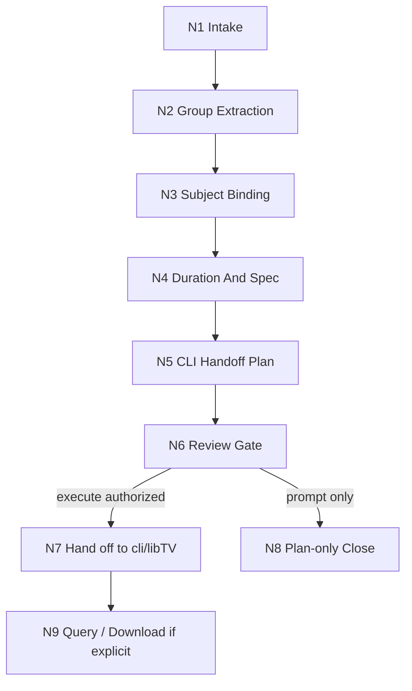

# LibTV Canvas Workflow

本步骤文件是思行网络真源：每个节点同时包含判断、动作、证据、路由和 gate。它只定义计划层到 `.agents/skills/cli/libTV` 的 handoff，不在本技能内直接执行旧会话接口。

## N1 Intake

- 判断任务路线：`subject_reference_flow`、`storyboard_reference_flow`、`prompt_only`、`query_or_download`、`repair_or_review`。
- 锁定 `projects/aigc/<项目名>/`、集数、目标分镜组范围和目标 LibTV 项目。
- Gate: 项目根和 `5-分组/第N集.md` 可读；若真实执行，必须能通过 `.agents/skills/cli/libTV` 登录和选择 project。
- Evidence: route note、project root、episode、group ids、CLI auth/project status。

## N2 Group Extraction

- 读取 `projects/aigc/<项目名>/5-分组/第N集.md`。
- 提取每个 `## x-y-z` 的分镜组正文和 fenced YAML。
- 跳过 `## x-y-z~x-y-z` 连接件。
- Gate: 分镜组 ID 唯一；正文和 YAML 可回指。
- Evidence: extraction summary、source line / heading、excluded connector list。

## N3 Subject Binding

- 从 YAML 的 `角色 / 场景 / 道具` 建立主体清单。
- 读取 `projects/aigc/<项目名>/8-视频/libTV画布流/libtv-canvas-active-registry.json`。
- 优先复用同一 `projectUuid::category::yaml_name` 的 active 记录。
- 缺少 active 记录时，生成 `libtv upload` handoff；上传结果由 `.agents/skills/cli/libTV` 回填为 resource node。
- Gate: 同一主体不能有多条 active；缺图、歧义、预算排除必须写入 manifest / submit plan，不得污染 prompt。
- Evidence: subject binding table、active registry diff、upload handoff 或 missing list。

## N4 Duration And Spec

- 从组底 YAML 的 `时长估算` 投影 `duration_estimate_seconds`。
- 缺失时按组内 `分镜明细` 秒数求和估算；仍无法确定时回退 15 秒并记录原因。
- 生成时长按 4-15 秒 clamp。
- 默认规格：`720p`、`16:9`；用户显式指定时保留。
- Gate: duration source 可追溯，spec 与用户要求无冲突。
- Evidence: duration_source、duration_seconds、resolution、ratio。

## N5 CLI Handoff Plan

- 读取 `.agents/skills/cli/libTV/SKILL.md` 和相关命令文档。
- 生成 `cli_handoff`：
  - `libtv account info`
  - `libtv project use <projectUuid>` 或显式 `-p <projectUuid>`
  - `libtv group <group>` 创建/查询任务分组
  - `libtv upload` 上传缺失主体素材
  - `libtv node <分镜组ID> -t video --prompt <draft prompt> ...` 创建/更新视频节点；按 canonical order 逐张连接参考图，但先不 `--run`
  - `libtv node <分镜组ID>` 查询节点，读取 `data.params.imageList[]`，建立 runtime 编号真源
  - 依据 `node_key + assetId/url` 生成 `runtime_image_placeholder_map[]`，按 runtime map 写入最终 `params.prompt`
  - 在最终节点参数、左侧输入和 `params.prompt` 都写定后，`--run` 前执行一次决定性远端查询
  - 该次查询的 `data.params.imageList[] + data.params.prompt` 是唯一放行真源；远端 prompt 必须无 `{{Portrait N}}`、绑定表、参考图清单、执行锁、路径或诊断文本
  - 决定性查询不通过时，若属于 prompt 占位、prompt 污染或左侧输入可重建问题，先自动修复；只有不可自动修复项才转为 `blocked/needs_rework`
  - `libtv node <分镜组ID> --run` 仅在 `queried_runtime_image_map_verified=true` 后执行
  - 显式下载时 `libtv download`
- Gate: 不出现旧会话命令或本地凭据包装器；所有真实执行点均属于 `.agents/skills/cli/libTV`；每个新视频节点运行前必须完成一次决定性远端 `prompt + imageList` 双重复核。
- Evidence: `<分镜组ID>-cli-handoff-plan.md`、submit plan `cli_handoff`、queried `data.params.imageList[]`、queried `data.params.prompt`、`runtime_image_placeholder_map[]`、command source docs。

## N6 Review Gate

- 执行 `review/review-contract.md`。
- 检查 route、subject binding、runtime image map before run、prompt hygiene、duration/spec、modeType、download policy、CLI handoff 和 evidence artifacts。
- Gate: critical fail 不得进入执行。
- Evidence: review verdict、fail code、rework target。

## N7 Hand Off To cli/libTV

- 只有用户显式要求继续执行或任务本身要求生成时，才运行 `.agents/skills/cli/libTV`。
- 执行摘要只记录 stdout/stderr 的必要字段，不输出 token 或凭据。
- 成功后回写 node id、projectUuid、projectUrl、task / status、download state。
- Gate: 执行结果可追踪到 submit plan 和 queue record；若 `queried_runtime_image_map_verified`、`final_remote_prompt_queried_after_last_prompt_write` 或 `remote_prompt_hygiene_verified` 不是 `true`，不得执行 `--run`。
- Evidence: CLI command log summary、LibTV node / group / project identifiers、runtime image map verification。

## N8 Plan-only Close

- 用户只要计划、缺少 CLI 登录、缺少 projectUuid、主体绑定不完整或 review 阻断时进入。
- 输出 plan-only 报告和最小修复项。
- Gate: 不执行远端、不声称已生成。
- Evidence: blocked reason、next commands。

## N9 Query / Download

- 查询或下载必须先定位原 project / group / node。
- 下载只有显式授权时执行，并命名为 `<分镜组ID>.mp4` 或 `<分镜组ID>-a.mp4`。
- Gate: 本地视频文件名能回推 `5-分组` 的 group id。
- Evidence: download command summary、local path、checksum or file size when available。
