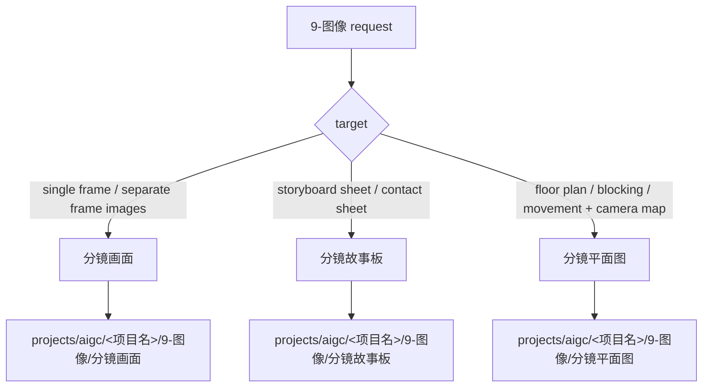

# aigc 9-图像

`9-图像` 是 AIGC 项目的图像阶段父级入口。它负责把来自 `3-主体` 与 `8-分组` 的信息路由到叶子技能，不直接主创 prompt 正文，也不直接替代 `.agents/skills/cli/imagegen` 生成图像。

`8-分组` 中的 `## x-y-z~x-y-z` 组间连接件在 `9-图像` 的分镜画面 / 分镜故事板 / 分镜平面图叶子路线中默认全部忽略：不进入镜级 prompt、组级 storyboard prompt、平面图 prompt、参照 manifest、imagegen plan 或生成图片。未来连接件视频由单独手动视频连接 skill 处理，父级不得默认调度。

当前技能目录 canonical 叶子路径为：

- `.agents/skills/aigc/9-图像/分镜画面/SKILL.md`
- `.agents/skills/aigc/9-图像/分镜故事板/SKILL.md`
- `.agents/skills/aigc/9-图像/分镜平面图/SKILL.md`

`分镜画面`、`分镜故事板`、`分镜平面图` 是真实叶子技能名，也是项目输出目录名。父级路由必须使用当前真实目录；项目内业务输出路径由叶子技能的 `Output Contract` 裁决。

图像阶段默认画面比例为 `16:9`。只有用户显式要求 `9:16`、`1:1` 或其他比例时，父级才把 `aspect_ratio_override` 传给叶子技能；未显式指定时不得把平台、示例图或 provider 默认推断成竖屏/方图。

父级必须把“一次多图能力”与“拼图/contact sheet 输出”区分开：分镜画面路线要求返回多张单独 bitmap。若 provider 或内置工具把多图请求生成为一张网格、拼图、故事板或 contact sheet，父级不得判定为成功，应将其标为 `FAIL-IMG-STAGE-MULTI-IMAGE-SHAPE` 并回交叶子技能处理或请求可返回多文件的 provider handoff。

## Context Loading Contract

- 每次调用 `$aigc-image-stage` 时，必须同时加载同目录 `CONTEXT.md`。
- 每次调用本技能时，必须同时加载同目录 `CONTEXT.md`。
- 若任务绑定 `projects/aigc/<项目名>/`，必须先加载项目根 `MEMORY.md`，再按需加载项目 `CONTEXT/`；需要项目美学边界时读取 `2-美学/类型风格.md`、`2-美学/画面基调/全局风格协议.md` 以及当前集优先/项目级回退的相关风格协议。
- 正式路由、生成、repair 或 review 时，必须加载 `../_shared/upstream-context-application-contract.md`，并把 `Image Upstream Visual Direction Matrix` 作为父级 handoff 要求传给目标叶子：说明 `2-美学`、`3-主体`、`8-分组`、图像侧车和项目上下文如何导向分镜画面 prompt、故事板 layout / atoms 或平面图空间裁决；父级不得把上游风格词直接当作叶子画风真源。
- prompt 正文、画面裁决与主体选择由叶子技能中的 LLM 主创完成；父级只裁决路由和阶段边界。

## Business Requirement Analysis Contract

| field | requirement | evidence | fail_code |
| --- | --- | --- | --- |
| `business_goal` | 将图像阶段请求路由到唯一叶子技能：分镜画面、分镜故事板或分镜平面图 | 用户请求、项目阶段产物、Mode Selection | `FAIL-IMG-STAGE-BUSINESS-GOAL` |
| `business_object` | 处理对象是项目分组稿、主体图、已有图像阶段工件和用户指定图像目标 | 项目根、分组稿路径、主体图目录、目标 ID | `FAIL-IMG-STAGE-BUSINESS-OBJECT` |
| `constraint_profile` | 父级只路由和审查边界，不主创 prompt、不替代 imagegen、不改写上游分组稿 | Context Loading Contract、Execution Contract | `FAIL-IMG-STAGE-CONSTRAINT` |
| `success_criteria` | 目标叶子唯一、叶子 `SKILL.md + CONTEXT.md` 已加载、比例锁定明确、返回形态匹配路线 | route note、aspect_ratio note、result shape note | `FAIL-IMG-STAGE-SUCCESS` |
| `complexity_source` | 复杂度来自分镜画面/故事板/平面图分流、旧版/新版分组输入适配、主体图绑定和 provider 返回形态差异 | Type Map、Mode Selection、Pass Table | `FAIL-IMG-STAGE-COMPLEXITY` |
| `topology_fit` | 父级路由适配业务：1) 保持叶子主创边界；2) 避免分镜画面、故事板与平面图混淆；3) 在 provider 返回 contact sheet 等错误形态时能阻断错误完成 | Visual Maps、Execution Contract、Pass Table | `FAIL-IMG-STAGE-TOPOLOGY-FIT` |

## Multi-Subskill Continuous Workflow

当本主技能包被整体调用时，视为用户已授权按本级声明的同级子技能包自动完成整个技能组任务；在满足本技能必要输入、显式选择和安全门后，不再为“是否继续下一步”额外确认。

- 无序号同级子技能包默认全选并发执行，由本父级汇总、裁决和写回唯一 canonical 输出。
- 数字序号子技能包或节点（如 `1-`、`2-`、`3-`）默认按数字升序串行执行，前一节点产物自动作为后一节点输入。
- 英文序号命名前缀不再用于当前 `9-图像` 叶子目录或项目输出目录；历史 `A-` / `B-` 仅作为 legacy 路径回读信号，不作为新产物 canonical 命名。
- `分镜画面`、`分镜故事板`、`分镜平面图` 三条叶子路线默认按用户意图、父级路由或输入类型单选分流；只有用户明确要求对比、并跑或批量多路线时才多选。
- 连续调度不得绕过本技能的阻断门：缺少必需输入、图像目标无法唯一判断、叶子技能缺失或路线歧义会造成错误 canonical 写回时，必须先停下并给出最小澄清或不可用说明。
- 每个被调度的叶子包仍必须加载自身 `SKILL.md + CONTEXT.md`；脚本只能承担机械辅助，不得替代 LLM 图像 prompt 主创或父级最终裁决；若发现叶子 prompt、storyboard 布局、平面图空间裁决或图像生成决策来自脚本化生成、批量插入、正则套句、映射投影、规则模板、关键词锚点替换、句式轮换或同义改写批量生成，即使形式字段齐全也必须标记 `FAIL-IMG-STAGE-SCRIPTED-PROJECTION`。
- 卫星技能默认不参与本父级的主链聚合。查询、审查、恢复、provider 桥接等卫星能力只有在用户显式命中或叶子技能明确声明为 side input 时才进入本轮证据层，且不得改写父级路线裁决。

## Input Contract

Accepted input:

- 用户命中 `9-图像`、分镜画面、生图提示词、AIGC 生图、分镜故事板、分镜平面图、角色站位图、场面调度平面图或图像阶段批量生成。
- 来自 `projects/aigc/<项目名>/8-分组/` 的分镜组稿。
- 来自旧版 `projects/aigc/<项目名>/5-分组/` 的分组稿可作为测试、迁移或显式 legacy adapter 输入，但不得静默伪装为新版 `8-分组` canonical 真源。
- 来自 `projects/aigc/<项目名>/3-主体/*/3-生成` 的主体生成资产。

Required input:

- 项目名或项目根。
- 可读的上游分镜、主体资产或已有图像阶段工件。

Reject or clarify when:

- 任务实际是视频首帧、视频参照或运动提示词，应转入 `10-画布` 或对应视频技能。
- 用户要求父级脚本替代叶子技能生成 prompt 正文。
- 用户要求把多张分镜画面生成为一张拼图、故事板或 contact sheet；应转入故事板路线或明确说明与分镜画面路线冲突。

## Mode Selection

| mode | trigger | route |
| --- | --- | --- |
| `frame_image` | 单镜、四段式 `分镜ID`、分镜画面、AIGC 生图 prompt、每组多张单独分镜画面 | `分镜画面/SKILL.md` |
| `storyboard_sheet` | 分镜故事板、多格 storyboard、组级画面板、contact sheet | `分镜故事板/SKILL.md` |
| `floor_plan_sheet` | 分镜平面图、角色站位图、场面调度平面图、空间关系图、动线机位平面图 | `分镜平面图/SKILL.md` |
| `repair` | 图像阶段工件漂移 | 先定位叶子技能，再执行 repair |

## Type Routing Matrix

| input_type | signal | route_to | required_nodes | module_load | fail_code |
| --- | --- | --- | --- | --- | --- |
| `frame_image` | 单镜、四段式 `分镜ID`、分镜画面、AIGC 生图 prompt、每组多张单独分镜画面 | Frame Image Leaf | `N1,N2,N3,N5` | `CONTEXT.md` | `FAIL-IMG-STAGE-ROUTE-FRAME` |
| `storyboard_sheet` | 分镜故事板、多格 storyboard、组级画面板、contact sheet | Storyboard Sheet Leaf | `N1,N2,N3,N5` | `CONTEXT.md` | `FAIL-IMG-STAGE-ROUTE-STORYBOARD` |
| `floor_plan_sheet` | 分镜平面图、角色站位图、空间关系图、动线机位平面图 | Floor Plan Leaf | `N1,N2,N3,N5` | `CONTEXT.md` | `FAIL-IMG-STAGE-ROUTE-FLOOR-PLAN` |
| `repair` | 图像阶段工件漂移、provider 返回形态错误、比例漂移、路径漂移 | Repair Route | `N1,N4,N5` | `CONTEXT.md` | `FAIL-IMG-STAGE-ROUTE-REPAIR` |

## Thinking-Action Node Map

| node_id | objective | inputs | actions | evidence | route_out | gate |
| --- | --- | --- | --- | --- | --- | --- |
| `N1-INTAKE` | 锁定项目、任务类型、比例和目标范围 | 用户请求、项目根 | 加载父级 `SKILL.md + CONTEXT.md`；识别 frame/storyboard/floor_plan/repair；未显式指定时设置 `aspect_ratio=16:9` | route note、aspect_ratio note | `N2` / `N4` | 项目或目标无法唯一判断时不得继续 |
| `N2-LEAF-SELECT` | 选择唯一叶子技能 | `N1` route note | 按 Type Routing Matrix 选择 `分镜画面`、`分镜故事板` 或 `分镜平面图` | selected_leaf | `N3` | 叶子必须唯一，不能同时把分镜画面、故事板和平面图混用 |
| `N3-LEAF-HANDOFF` | 加载叶子技能并交出执行权 | selected_leaf、项目上下文 | 加载叶子 `SKILL.md + CONTEXT.md`；向叶子传递项目根、输入路径、目标 ID、`aspect_ratio` / override | loaded skill pair、handoff fields | `N5` | 叶子不可读则报告缺口，不伪造产物 |
| `N4-REPAIR-ROUTE` | 定位图像阶段漂移源层 | fail code、已有工件 | 判断是路线错误、比例漂移、provider 返回 contact sheet、叶子路径漂移还是项目输入缺失 | root_cause_route | `N2` / `N3` / `N5` | 必须有 fail code 和返工目标 |
| `N5-CLOSE` | 汇流父级结果 | route evidence、leaf handoff、result shape evidence | 输出路由说明或叶子产物摘要；若执行生成，审查返回形态是否匹配路线 | closeout note、result shape note | done | 目标叶子明确且已加载；分镜画面路线不能把 contact sheet 判成功 |

## Reference Loading Guide

| 场景 | 读取文件 |
| --- | --- |
| 单镜分镜画面、生图 prompt、主体参照绑定、批量 imagegen | `分镜画面/SKILL.md` + `分镜画面/CONTEXT.md` |
| 分镜故事板或组级多格画面 | `分镜故事板/SKILL.md` + `分镜故事板/CONTEXT.md`，若该叶子缺失则报告未配置 |
| 分镜平面图、角色站位图、空间关系图、动线机位平面图 | `分镜平面图/SKILL.md` + `分镜平面图/CONTEXT.md`，若该叶子缺失则报告未配置 |

## Module Loading Matrix

| module | load_when | authority | forbidden_use | rework_target |
| --- | --- | --- | --- | --- |
| `CONTEXT.md` | 每次调用 | 父级经验、路由陷阱、实测 provider 风险 | 重定义父级输入、输出或叶子主创合同 | `Context Loading Contract` |
| `../_shared/upstream-context-application-contract.md` | 任意正式路由、生成、repair、review，或 `FAIL-IMG-STAGE-UPSTREAM-DIRECTION` | 规定图像阶段如何把上游上下文转成叶子方向矩阵与保真边界 | 替代叶子 prompt/layout/空间裁决主创，或把上游电影风格直接覆盖叶子画风 | `N3-LEAF-HANDOFF` / `N5-CLOSE` |
| `分镜画面/SKILL.md` | `frame_image` 路线 | 分镜画面叶子执行合同、prompt 主创、主体图绑定、imagegen handoff | 生成故事板拼图或改写父级路线 | `Mode Selection` / `PASS-IMG-STAGE-02` |
| `分镜画面/CONTEXT.md` | `frame_image` 路线 | 分镜画面叶子经验层 | 重定义父级路线或叶子 Output Contract | `PASS-IMG-STAGE-02` |
| `分镜画面/SKILL.md` + `分镜画面/CONTEXT.md` | `frame_image`、单镜、四段式 ID、每组多张单独分镜画面 | 分镜画面叶子执行合同、prompt 主创、主体图绑定、imagegen handoff | 生成故事板拼图或改写父级路线 | `Mode Selection` / `PASS-IMG-STAGE-02` |
| `分镜故事板/SKILL.md` | `storyboard_sheet` 路线 | 分镜故事板叶子执行合同 | 代替分镜画面路线生成多张单独图 | `Mode Selection` / `PASS-IMG-STAGE-02` |
| `分镜故事板/CONTEXT.md` | `storyboard_sheet` 路线 | 分镜故事板叶子经验层 | 重定义父级路线或叶子 Output Contract | `PASS-IMG-STAGE-02` |
| `分镜故事板/SKILL.md` + `分镜故事板/CONTEXT.md` | `storyboard_sheet`、多格 storyboard、contact sheet、组级画面板 | 故事板叶子执行合同 | 代替分镜画面路线生成多张单独图 | `Mode Selection` / `PASS-IMG-STAGE-02` |
| `分镜平面图/SKILL.md` | `floor_plan_sheet` 路线 | 分镜平面图叶子执行合同、空间站位图、动线、机位和平面连续性裁决 | 代替故事板路线生成组级画面板，或改写父级路线 | `Mode Selection` / `PASS-IMG-STAGE-02` |
| `分镜平面图/CONTEXT.md` | `floor_plan_sheet` 路线 | 分镜平面图叶子经验层 | 重定义父级路线或叶子 Output Contract | `PASS-IMG-STAGE-02` |
| `分镜平面图/SKILL.md` + `分镜平面图/CONTEXT.md` | `floor_plan_sheet`、角色站位图、空间关系图、动线机位平面图 | 平面图叶子执行合同 | 生成故事板画面或单帧分镜画面 | `Mode Selection` / `PASS-IMG-STAGE-02` |
| 项目 `MEMORY.md` | 绑定 `projects/aigc/<项目名>/` 时 | 项目长期偏好和禁区 | 覆盖技能路由和父级完成门 | `Context Loading Contract` |
| 项目 `MEMORY.md` 与相关 `CONTEXT/` | 绑定 `projects/aigc/<项目名>/` 时 | 项目偏好、长期要求、图像阶段共享上下文和风格边界 | 替代叶子 prompt 主创或主体图事实 | `Context Loading Contract` |
| `2-美学/类型风格.md` + `2-美学/画面基调/全局风格协议.md` + 当前集优先/项目级回退的相关风格协议 | 正式路由、生成、repair 或 review 需要项目美学边界时 | 项目类型、美学基调、风格协议与负向边界 | 替代叶子 prompt/layout/空间裁决主创，或成为第二画风真源 | `Context Loading Contract` |
| 项目 `CONTEXT/` | 项目内有相关图像阶段上下文时 | 项目共享附加上下文 | 作为跨项目经验或父级规则源 | `Context Loading Contract` |

## Module Trigger Matrix

| trigger_signal | required_modules | load_phase | return_gate | mechanical_check |
| --- | --- | --- | --- | --- |
| `frame_image` | `CONTEXT.md` | `N1-N3` | `PASS-IMG-STAGE-02` | leaf files readable through Reference Loading Guide |
| `storyboard_sheet` | `CONTEXT.md` | `N1-N3` | `PASS-IMG-STAGE-02` | leaf files readable through Reference Loading Guide |
| `floor_plan_sheet` | `CONTEXT.md` | `N1-N3` | `PASS-IMG-STAGE-02` | leaf files readable through Reference Loading Guide |
| `FAIL-IMG-STAGE-ROUTE-FRAME` | `CONTEXT.md` | `N4` | `PASS-IMG-STAGE-01` | route can resolve frame leaf |
| `FAIL-IMG-STAGE-ROUTE-STORYBOARD` | `CONTEXT.md` | `N4` | `PASS-IMG-STAGE-01` | route can resolve storyboard leaf |
| `FAIL-IMG-STAGE-ROUTE-FLOOR-PLAN` | `CONTEXT.md` | `N4` | `PASS-IMG-STAGE-01` | route can resolve floor plan leaf |
| `FAIL-IMG-STAGE-ROUTE-REPAIR` | `CONTEXT.md` | `N4` | `PASS-IMG-STAGE-03` | fail code has rework target |
| `FAIL-IMG-STAGE-MULTI-IMAGE-SHAPE` | `CONTEXT.md` | `N4` | `PASS-IMG-STAGE-05` | contact sheet is not accepted for frame_image |
| `FAIL-IMG-STAGE-SCRIPTED-PROJECTION` | `CONTEXT.md` | `N4` / `N5` | `PASS-IMG-STAGE-03` | leaf output authorship evidence is LLM-authored, not script-generated or mapping-projected |
| `FAIL-IMG-STAGE-UPSTREAM-DIRECTION` | `../_shared/upstream-context-application-contract.md`, target leaf `SKILL.md + CONTEXT.md` | `N3/N5` | `PASS-IMG-STAGE-07` | target leaf receives and reports `Image Upstream Visual Direction Matrix` |

## Visual Maps

## Execution Contract

1. 读取本 `SKILL.md + CONTEXT.md`，锁定项目根和任务类型。
2. 若目标是镜级单帧或每个分镜组生成多张单独分镜画面，进入 `分镜画面/SKILL.md`。
3. 若目标是组级故事板、拼图、contact sheet 或多格画面板，进入 `分镜故事板/SKILL.md`；若该叶子不可读，报告缺口，不伪造输出。
4. 若目标是分镜平面图、角色站位图、空间关系图或动线机位平面图，进入 `分镜平面图/SKILL.md`；若该叶子不可读，报告缺口，不伪造输出。
5. 向目标叶子传递 `Image Upstream Visual Direction Matrix` 要求：叶子必须说明上游信号如何导向 prompt、layout、visual atoms、参照保真、空间站位或 imagegen 策略，并说明哪些上游信号只作为 evidence-only。
6. 父级不直接写镜级 prompt、不直接生成图片、不改写 `8-分组`。
7. 未显式指定比例时向叶子传递 `aspect_ratio=16:9`；显式指定时传递 `aspect_ratio_override`。
8. 叶子或 provider 返回图像后，父级审查返回形态：分镜画面路线必须是多张单独文件；故事板和平面图路线才允许单张多格 sheet；一张 contact sheet/grid/storyboard 即使包含全部画面，也不得被误判为分镜画面成功。

## Field Mapping

| field_id | owner | must_contain |
| --- | --- | --- |
| `IMG-STAGE-01` | 父级路由 | 项目根、任务类型、目标叶子 |
| `IMG-STAGE-02` | 目标叶子 | 叶子 `SKILL.md + CONTEXT.md` 加载证据 |
| `IMG-STAGE-03` | 边界 | 父级不替代 prompt 主创或 imagegen 执行 |

## Field Master

| field_id | owner | must contain | fail code |
| --- | --- | --- | --- |
| `FIELD-IMG-STAGE-01` | route lock | 项目根、任务类型、目标叶子 | `FAIL-IMG-STAGE-ROUTE` |
| `FIELD-IMG-STAGE-02` | leaf handoff | 进入叶子技能并加载其 `SKILL.md + CONTEXT.md` | `FAIL-IMG-STAGE-HANDOFF` |
| `FIELD-IMG-STAGE-03` | boundary | 父级不替代 prompt 主创或 imagegen 执行 | `FAIL-IMG-STAGE-BOUNDARY` |
| `FIELD-IMG-STAGE-04` | aspect ratio lock | 未显式指定时 `aspect_ratio=16:9`，显式指定时记录 override | `FAIL-IMG-STAGE-ASPECT` |
| `FIELD-IMG-STAGE-05` | output shape | 分镜画面路线返回多张单独图片；故事板和平面图路线才允许单张多格 sheet | `FAIL-IMG-STAGE-MULTI-IMAGE-SHAPE` |
| `FIELD-IMG-STAGE-06` | upstream visual direction | `Image Upstream Visual Direction Matrix` 已传给目标叶子，且叶子报告中可回指 | `FAIL-IMG-STAGE-UPSTREAM-DIRECTION` |

## Thought Pass Map

| pass_id | focus field | action | evidence |
| --- | --- | --- | --- |
| `PASS-IMG-STAGE-01` | `FIELD-IMG-STAGE-01` | 判定 frame / storyboard / floor_plan / repair | route note |
| `PASS-IMG-STAGE-02` | `FIELD-IMG-STAGE-02` | 加载目标叶子技能 | loaded skill pair |
| `PASS-IMG-STAGE-03` | `FIELD-IMG-STAGE-03` | 检查父级没有越权主创 | closeout note |
| `PASS-IMG-STAGE-04` | `FIELD-IMG-STAGE-04` | 锁定默认比例或显式 override | aspect_ratio note |
| `PASS-IMG-STAGE-05` | `FIELD-IMG-STAGE-05` | 检查返回图片形态是否匹配路线 | result shape note |
| `PASS-IMG-STAGE-07` | `FIELD-IMG-STAGE-06` | 检查目标叶子是否报告上游视觉导向矩阵 | leaf direction matrix evidence |

## Pass Table

| pass_id | pass standard | fail code | rework entry |
| --- | --- | --- | --- |
| `PASS-IMG-STAGE-01` | 目标叶子唯一 | `FAIL-IMG-STAGE-ROUTE` | Mode Selection |
| `PASS-IMG-STAGE-02` | 叶子 `SKILL.md + CONTEXT.md` 可读 | `FAIL-IMG-STAGE-HANDOFF` | Reference Loading Guide |
| `PASS-IMG-STAGE-03` | 父级只路由不主创 | `FAIL-IMG-STAGE-BOUNDARY` | Execution Contract |
| `PASS-IMG-STAGE-04` | 未显式指定比例时固定 `16:9`，显式指定时记录 override | `FAIL-IMG-STAGE-ASPECT` | Execution Contract |
| `PASS-IMG-STAGE-05` | 分镜画面路线必须返回多张单独 bitmap；contact sheet/grid/panel 不通过；故事板和平面图路线才允许单张多格 sheet | `FAIL-IMG-STAGE-MULTI-IMAGE-SHAPE` | Execution Contract |
| `PASS-IMG-STAGE-06` | 叶子 prompt、storyboard 布局、平面图空间裁决和生成决策不得由脚本化生成、批量插入、正则套句、映射投影、规则模板、关键词锚点替换、句式轮换或同义改写批量生成；形式字段齐全但主创证据缺失仍失败 | `FAIL-IMG-STAGE-SCRIPTED-PROJECTION` | leaf `Review Gate Binding` / `Output Contract` |
| `PASS-IMG-STAGE-07` | 目标叶子必须生成或报告 `Image Upstream Visual Direction Matrix`，并区分上游信号的导向用途、保真用途与禁用覆盖边界 | `FAIL-IMG-STAGE-UPSTREAM-DIRECTION` | target leaf `Output Contract` |

## Root-Cause Execution Contract (Mandatory)

失败链路：

`Symptom -> Direct Cause -> Parent Route Owner -> Leaf Skill Contract -> Provider Handoff -> AGENTS.md / Skill 2.0`

## Output Contract

- Required output: 路由到唯一叶子技能，或报告叶子缺失/未配置。
- Output format: 路由说明或叶子技能产物。
- Output path: 父级不直接落业务产物；业务输出路径由叶子技能裁决，当前 `分镜画面` 叶子业务路线固定写入 `projects/aigc/<项目名>/9-图像/分镜画面`，`分镜故事板` 叶子业务路线固定写入 `projects/aigc/<项目名>/9-图像/分镜故事板`，`分镜平面图` 叶子业务路线固定写入 `projects/aigc/<项目名>/9-图像/分镜平面图`。
- Naming convention: 叶子技能自定命名；父级不创建平行真源。
- Completion gate: 目标叶子明确且已加载；比例锁定符合用户请求；若执行生成，返回形态必须符合目标路线；叶子 prompt、storyboard 布局、平面图空间裁决和生成决策有 LLM 主创证据，不是脚本化生成、批量插入、正则套句、映射投影、规则模板、关键词锚点替换、句式轮换或同义改写批量生成；目标叶子已报告 `Image Upstream Visual Direction Matrix`，说明上游美学、主体、分组和项目约束如何导向视觉输出且未覆盖叶子画风/空间真源；若叶子缺失、provider 返回 contact sheet 等错误形态，或命中 `FAIL-IMG-STAGE-SCRIPTED-PROJECTION` / `FAIL-IMG-STAGE-UPSTREAM-DIRECTION`，明确报告缺口或 fail code。
