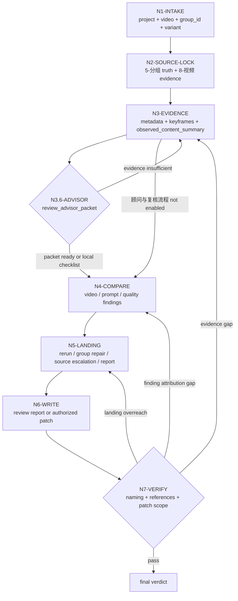

# Video Review Workflow

## Mermaid Topology

## N1 Intake

- 解析项目根、视频路径、集号、group_id、variant。
- 若命名不规范，记录 `naming_drift`。

## N2 Source Lock

- 打开 `projects/aigc/<项目名>/5-分组/第N集.md`。
- 抽取目标 `## group_id`。
- 读取相邻衔接段，判断首尾状态。
- 读取用户显式 prompt、`8-视频` prompt / manifest / queue / report；没有 prompt 证据时标记 `prompt_evidence_gap`。
- 若用户提供好示例或坏示例，锁定示例路径、角色和用户标签。

## N3 Evidence Capture

- 用 `ffprobe` 读取元数据。
- 用 `ffmpeg` 抽关键帧或联系表。
- 有音轨时记录音频强度和内容类型。
- 先形成 `observed_content_summary`，说明真实视频里的主体、动作、空间、节奏、关键物、音频事实和可见缺陷。

## N3.6 Advisor Consultation

仅在执行顾问与复核流程时进入。

- 读取项目 `team.yaml` 和 `../_shared/team-advisor-consultation-contract.md`。
- 按 `SKILL.md#Advisor Consultation Mechanism` 解析审片监制顾问 roster。
- 从当前审片节点派生顾问问题，不使用固定“好不好看”题型：
  - `N3-EVIDENCE`：证据是否足够支撑真实视频理解。
  - `N4-COMPARE`：视频本体、prompt 匹配、创作质量、示例差距是否有遗漏。
  - `N5-LANDING`：rerun、group repair、source escalation、quality learning 的落点是否越权。
- 主 agent 汇流为 `review_advisor_packet`；若外部 provider 调度 不可用，使用本地 checklist，不得伪装成已执行顾问与复核流程。

## N4 Compare

先按三层维度对照：

1. 视频本身问题：基础废片、逻辑合理性、一致性、AIGC 常见瑕疵。
2. 视频和 prompt / 分镜组匹配问题：主体、动作、空间、风格、负面约束、首尾状态是否一致。
3. 创作层面质量问题：反平庸、艺术方向、美学完整性、镜头调度、节奏和记忆点。

细项包括：

- 画面主体
- 空间与场景
- 关键道具
- 镜头运动与节奏
- 首尾状态
- 音频约束
- 风格和材质
- prompt 匹配
- 错配归因：`prompt_problem` / `model_problem` / `mixed_cause` / `evidence_gap`
- 好/坏示例距离
- 反平庸和美学质量
- `review_advisor_packet` 中可执行的审片风险提示和质量门建议

## N5 Landing

- 单次瑕疵：`rerun_only`
- 分组文本导致：`group_repair`
- prompt 缺失、矛盾、过载或不可执行：`group_repair` 或 `source_escalation`
- prompt 清楚但模型未执行：`rerun_only`
- 创作质量弱但可用：`review_only` + 重跑建议
- 用户示例形成可复用鉴赏 heuristic：`quality_learning`
- 多例系统问题：`source_escalation`
- 证据不足：`review_only`
- 顾问与复核流程的顾问指出证据或归因不足：回到 `N3-EVIDENCE` 或 `N4-COMPARE`，不得硬写最终 verdict。

## N6 Write And Verify

- 写 `9-审片` 报告。
- 如有授权和高置信，写 `5-分组` 修复。
- 如形成稳定跨项目鉴赏经验，写入本技能 `CONTEXT.md` 的 `Aesthetic Calibration Heuristics`。
- 若执行顾问与复核流程，使用 `review_advisor_packet` 摘要；不可用时直接使用本地 checklist。
- 运行相关结构检查或人工等价检查。
