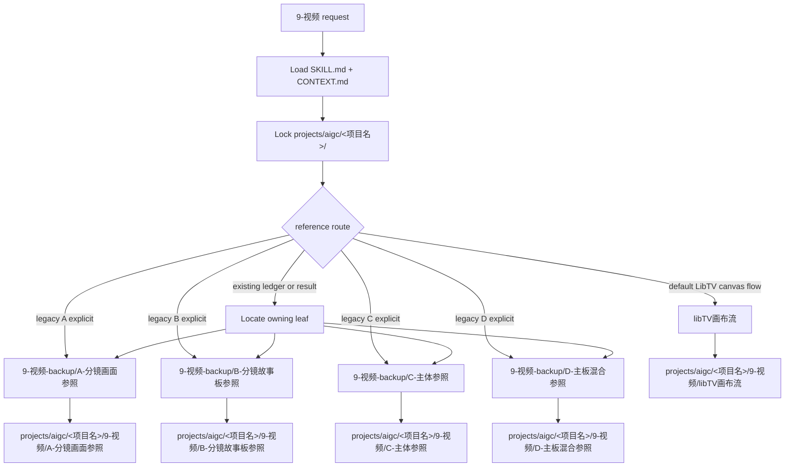

# aigc 9-视频

`9-视频` 是 AIGC 项目的视频阶段父级入口。它只负责判定视频生成路线、加载目标叶子技能、约束项目 runtime 与上游真源边界；不直接主创视频 prompt，不直接调用 LibTV，不直接改写 `6-分组`、`7-设计` 或 `8-图像` 产物。

当前 active 默认叶子为 `.agents/skills/aigc/9-视频/libTV画布流/SKILL.md`。旧 A/B/C/D 叶子已经迁移到 `.agents/skills/aigc/9-视频-backup/`，仅用于兼容回读、修复旧产物或用户明确点名旧路线时的旁路承接。

## Context Loading Contract

- 每次调用 `$aigc-video-stage` 时，必须同时加载同目录 `CONTEXT.md`。
- 每次调用本技能时，必须同时加载同目录 `CONTEXT.md`。
- 若任务绑定 `projects/aigc/<项目名>/`，必须先加载项目根 `MEMORY.md`、`0-初始化/north_star.yaml`，再按需加载项目 `CONTEXT/` 中与视频阶段、风格、角色、场景、主体资产或生成限制相关的上下文。
- 父级只做路由和汇流判断；视频 prompt 组织、参照绑定、LibTV 提交与结果追踪由命中的 `libTV画布流` 或兼容叶子技能负责。
- `libTV画布流` 是当前 active 默认叶子；`A-分镜画面参照`、`B-分镜故事板参照`、`C-主体参照`、`D-主板混合参照` 是 `9-视频-backup` 下的英文序号兼容候选。除非用户明确要求多路线对比、旧产物修复或点名旧路线，否则一次任务默认选择 `libTV画布流`。
- 视频生成默认路由：A/B/C/D 叶子不再持有旧视频工具或本地模型参数真源；未显式指定模型时，直接使用 `$libTV` 的 LibTV 后端默认视频路由。除非用户显式要求其他规格，否则视频基础规格默认 720P、15 秒、16:9；用户显式指定模型、时长、比例、分辨率或质量档时，叶子只把这些要求写入发送给 LibTV 的自然语言任务和 submit plan，不在本地伪造不存在的 CLI 参数。
- LibTV 画布复用是 `9-视频` 父级共享治理合同：绑定 `projects/aigc/<项目名>/` 后，当前 active 叶子默认读取或重建 `projects/aigc/<项目名>/9-视频/libTV画布流/libtv-canvas-active-registry.json`；旧 A/B/C/D 兼容叶子仅在修复旧工件时沿用自身合同。
- LibTV 远端调用锁是 A/B/C/D 共同门禁：所有叶子生成的 `*-libtv-submission.txt` 必须以 `【LibTV 调用锁定】` 开头；父级只检查首行存在和路线归属，具体 `modeType` 与参照字段由对应叶子合同锁定。
- 视频文件命名必须服务下游 `10-审片`：下载或整理后的 canonical 视频命名为 `<分镜组ID>.mp4`；同一分镜组多变体命名为 `<分镜组ID>-a.mp4`、`<分镜组ID>-b.mp4`。sessionId、provider task id、路线名写入 queue / results / report，不写入 canonical 视频文件名。
- `6-分组` 中的 `## x-y-z~x-y-z` 组间连接件在 `9-视频` A/B/C/D 路线中默认全部忽略：不进入视频 prompt、参照 manifest、LibTV job 或 canonical 视频命名。未来连接件视频由单独手动视频连接 skill 处理，父级不得默认调度。
- 冲突优先级：用户显式请求 > 根 `AGENTS.md` / meta 规则 > `.agents/skills/aigc/SKILL.md` > 本 `SKILL.md` > 目标叶子 `SKILL.md` > 目标叶子分区规范 > `.agents/skills/cli/libTV/SKILL.md` > `agents/openai.yaml` > 项目 `MEMORY.md` > 项目 `CONTEXT/` > 本 `CONTEXT.md` > 目标叶子 `CONTEXT.md`。

## Multi-Subskill Continuous Workflow

当本主技能包被整体调用时，视为用户已授权按本级声明的同级子技能包自动完成整个技能组任务；在满足本技能必要输入、显式选择和安全门后，不再为“是否继续下一步”额外确认。

- 无序号同级子技能包默认全选并发执行，由本父级汇总、裁决和写回唯一 canonical 输出。
- 数字序号子技能包或节点（如 `1-`、`2-`、`3-`）默认按数字升序串行执行，前一节点产物自动作为后一节点输入。
- 英文序号子技能包或路线（如 `A-分镜画面参照`、`B-分镜故事板参照`、`C-主体参照`、`D-主板混合参照`）默认按用户意图、父级路由或输入类型单选分流；只有用户明确要求对比、并跑或批量多路线时才多选。
- 卫星技能、查询/恢复/审查类旁路入口不默认纳入 A/B/C/D 主链；只有用户请求、阶段门禁或叶子合同显式需要时才回接。
- 连续调度不得绕过本技能的阻断门：缺少必需输入、视频参照路线无法唯一判断、叶子技能缺失或路线歧义会造成错误 canonical 写回时，必须先停下并给出最小澄清或阻断报告。
- 每个被调度的叶子包仍必须加载自身 `SKILL.md + CONTEXT.md`；脚本只能承担机械辅助，不得替代 LLM 视频 prompt 主创、参照裁决或父级最终裁决。

## Input Contract

Accepted input:

- 用户命中 `9-视频`、视频阶段、生视频、LibTV、分镜参照、故事板参照、主体参照、主板混合参照或批量视频生成。
- 来自 `projects/aigc/<项目名>/6-分组/` 的分镜组稿，需要转为组级视频任务。
- 来自 `projects/aigc/<项目名>/8-图像/A-分镜画面/` 的镜级图像参照，或 `8-图像/B-分镜故事板/` 的组级故事板参照。
- 来自 `projects/aigc/<项目名>/7-设计/*/3-生成/` 的角色、场景、道具主体资产参照。
- 已有 `projects/aigc/<项目名>/9-视频/*/` 的 prompt、manifest、LibTV batch、queue ledger 或生成结果需要 query / download / repair / review / rerun。

Required input:

- 项目名或项目根。
- 可读的上游分镜组稿，或可定位的既有 `9-视频` 阶段工件。
- 能够从用户意图、已有产物或文件路径判断目标参照路线：分镜画面图、分镜故事板图、主体资产、故事板总参照 + 主体参照混合路线，或查询/修复既有路线。

Reject or clarify when:

- 用户要求父级直接生成视频 prompt 正文、直接提交 LibTV、或跨过叶子技能改写业务真源。
- 用户要生成分镜画面图或故事板图本体，应转入 `8-图像` 对应叶子技能。
- 用户要求修改剧情、镜头顺序、角色事实或分组边界，应转回 `6-分组` 或明确声明这是上游修复。
- A/B/C/D 路线无法唯一判断，且自动选择会造成参照资产错用或重复提交。

## Mode Selection

| mode | trigger | route |
| --- | --- | --- |
| `libtv_canvas_flow` | 默认；用户只说进入视频阶段、生视频、LibTV、主体参照或按 `6-分组` 组级出视频 | `libTV画布流/SKILL.md` |
| `frame_visual_reference_legacy` | 用户明确点名旧 A 路线、修复旧 A 路线产物，或已有路径位于 `9-视频/A-分镜画面参照/` | `.agents/skills/aigc/9-视频-backup/A-分镜画面参照/SKILL.md` |
| `storyboard_reference_legacy` | 用户明确点名旧 B 路线、修复旧 B 路线产物，或已有路径位于 `9-视频/B-分镜故事板参照/` | `.agents/skills/aigc/9-视频-backup/B-分镜故事板参照/SKILL.md` |
| `subject_reference_legacy` | 用户明确点名旧 C 路线、修复旧 C 路线产物，或已有路径位于 `9-视频/C-主体参照/` | `.agents/skills/aigc/9-视频-backup/C-主体参照/SKILL.md` |
| `hybrid_board_subject_reference_legacy` | 用户明确点名旧 D 路线、修复旧 D 路线产物，或已有路径位于 `9-视频/D-主板混合参照/` | `.agents/skills/aigc/9-视频-backup/D-主板混合参照/SKILL.md` |
| `query_or_download` | 已有 LibTV `sessionId`、queue ledger、视频结果查询或下载 | 先从路径/ledger 判断所属叶子，再进入该叶子 |
| `repair_or_review` | prompt、manifest、YAML、queue、结果漂移或只审查 | 先定位原产物所属叶子，再执行对应 review / repair |
| `footage_review_handoff` | 用户要求审片、分析已下载视频、对照实际素材、把审片问题改回分镜组 | 转入 `.agents/skills/aigc/10-审片/SKILL.md` |
| `multi_route_compare` | 用户明确要求 A/B/C/D 对比、并跑或方案选择 | 逐个进入被点名叶子，父级只汇总差异与风险 |

## Reference Loading Guide

| 场景 | 读取文件 |
| --- | --- |
| 默认 LibTV 画布视频流 | `libTV画布流/SKILL.md` + `libTV画布流/CONTEXT.md` |
| 旧 A 路线回读、修复或明确点名 | `.agents/skills/aigc/9-视频-backup/A-分镜画面参照/SKILL.md` + 同目录 `CONTEXT.md` |
| 旧 B 路线回读、修复或明确点名 | `.agents/skills/aigc/9-视频-backup/B-分镜故事板参照/SKILL.md` + 同目录 `CONTEXT.md` |
| 旧 C 路线回读、修复或明确点名 | `.agents/skills/aigc/9-视频-backup/C-主体参照/SKILL.md` + 同目录 `CONTEXT.md` |
| 旧 D 路线回读、修复或明确点名 | `.agents/skills/aigc/9-视频-backup/D-主板混合参照/SKILL.md` + 同目录 `CONTEXT.md` |
| LibTV 上传参照图、创建会话、查询、下载或认证排障 | 由目标叶子加载 `.agents/skills/cli/libTV/SKILL.md` |
| LibTV 项目级画布复用 | 先读取 `projects/aigc/<项目名>/9-视频/libtv-canvas-registry.json`；缺失时从 A/B/C/D 既有 queue / results / report 反建；仍缺失时由首个成功提交写入 |
| 上游事实边界核对 | `.agents/skills/aigc/6-分组/SKILL.md + CONTEXT.md`、必要时读取 `7-设计` 或 `8-图像` 对应入口 |

## Visual Maps



## Execution Contract

1. 读取本 `SKILL.md + CONTEXT.md`，锁定项目根、用户目标、上游可用资产和是否已有视频阶段工件。
2. 读取项目级 LibTV 画布 registry：`projects/aigc/<项目名>/9-视频/libtv-canvas-registry.json`。若缺失，先扫描 A/B/C/D 既有 `第N集-libtv-queue.md`、`第N集-libtv-results.json`、`执行报告.md` 中的 `sessionId`、`projectUuid`、`projectUrl` 并反建 registry；仍缺失时标记为 `needs_initial_session`，由第一个成功的叶子提交写入。
3. 根据 `Mode Selection` 选择唯一叶子技能；默认进入 `libTV画布流`，只有用户明确点名旧路线或既有产物位于旧 A/B/C/D 目录时才进入 `9-视频-backup` 对应叶子。
4. 加载目标叶子的 `SKILL.md + CONTEXT.md`，并把本轮输入、项目根、集号/分镜组/分镜 ID 范围、`libtv-canvas-registry.json` 路径和已解析的 canonical canvas metadata 传入叶子合同。
5. 目标叶子调用 `$libTV` 时，若 registry 已有 `canonical_sessionId`，必须通过 `create_session.py "<message>" --session-id <canonical_sessionId>` 复用同项目画布；只有 registry 缺失、session 明确不可用、或用户显式要求新画布 / 隔离项目时，才允许创建新 session。
6. 父级不得直接写视频 prompt、参照 manifest、LibTV batch、queue ledger 或结果报告；这些业务产物必须由目标叶子定义。父级拥有画布复用 schema 与路由合同，叶子负责把实际提交结果回写 registry / queue / report。
7. 目标叶子提交 LibTV 前，父级或叶子 review gate 必须确认 `*-libtv-submission.txt` 首行为 `【LibTV 调用锁定】`；若缺失，返回目标叶子的 prompt / handoff 合同修复，不允许直接把弱口径文本发给远端。
8. 若目标叶子涉及参照图，必须要求叶子输出槽位注册机制：A 用 `frame_uploads + generation_slots` 证明 `shot_id/source_label -> uploaded_url -> imageList[n]`，B 用 `storyboard_uploads + generation_slots` 证明 `group_id/storyboard_sheet -> uploaded_url -> imageList[0]`，C/D 用 `asset_uploads + generation_slots` 证明 `yaml_name/reference_identity -> uploaded_url -> mixedList[n]`。最终匹配标准是 LibTV 端实际传入参照图 URL 与 prompt YAML 中对应名称、分镜 ID 或故事板身份同槽一致；父级不得接受只按 URL 集合或 submit plan 顺序的弱校验。
9. 查询、下载、修复或审查任务必须先定位原产物所属叶子，未定位前不得创建新的平行视频真源。
10. 若目标叶子缺失、不可读或与用户目标不匹配，报告阻断原因和建议入口，不临时伪造叶子合同。

## LibTV Canvas Registry Contract

Registry path:

```text
projects/aigc/<项目名>/9-视频/libtv-canvas-registry.json
```

Minimum shape:

```json
{
  "project_name": "<项目名>",
  "project_root": "projects/aigc/<项目名>",
  "canonical_sessionId": "",
  "projectUuid": "",
  "projectUrl": "",
  "created_at": "",
  "last_used_at": "",
  "source_leaf": "",
  "sessions": []
}
```

- `project_root` 是复用主键；显示项目名只作可读字段。
- `canonical_sessionId` 存在时，同项目 A/B/C/D 默认向该 session 追加任务，避免新增画布。
- `sessions[]` 记录每次提交的 `leaf`、`episode`、`group_id`、`queue_id`、`sessionId`、`projectUuid`、`projectUrl`、`created_at`、`last_used_at`、`status`。
- 若只拿到 `projectUuid/projectUrl` 而没有可用 `sessionId`，不得声称可复用指定画布；当前 `$libTV` 脚本不能按 `projectUuid` 强制新任务落到指定画布。
- `change_project.py` 不接收指定 `projectUuid`，不得用它作为“复用某个项目画布”的默认机制；只在用户显式要求切换 LibTV 项目隔离时使用。

## Field Mapping

| field_id | owner | must_contain |
| --- | --- | --- |
| `VID-STAGE-01` | 父级路由 | 项目根、任务类型、目标叶子、处理范围 |
| `VID-STAGE-02` | 目标叶子 | 叶子 `SKILL.md + CONTEXT.md` 加载证据 |
| `VID-STAGE-03` | 边界 | 父级不替代 prompt 主创、参照绑定或 LibTV 执行 |
| `VID-STAGE-04` | 既有真源 | query / repair / review 时能回指原所属叶子 |
| `VID-STAGE-05` | 画布复用 | 同项目调用 `$libTV` 前已解析或反建 `libtv-canvas-registry.json` |
| `VID-STAGE-06` | LibTV 远端锁定 | A/B/C/D 叶子远端提交文本以 `【LibTV 调用锁定】` 起笔，具体 `modeType` 与参照字段由叶子定义 |
| `VID-STAGE-07` | 参照槽位注册 | A/B/C/D 叶子在最终提交前能证明 prompt YAML 身份、uploaded URL、LibTV `imageList/mixedList[n]` 和 UI 图N 同槽一致 |

## Field Master

| field_id | owner | must contain | fail code |
| --- | --- | --- | --- |
| `FIELD-VID-STAGE-01` | route lock | 项目根、任务类型、目标叶子、处理范围 | `FAIL-VID-STAGE-ROUTE` |
| `FIELD-VID-STAGE-02` | leaf handoff | 进入目标叶子并加载其 `SKILL.md + CONTEXT.md` | `FAIL-VID-STAGE-HANDOFF` |
| `FIELD-VID-STAGE-03` | boundary | 父级不替代 prompt 主创、参照绑定或 LibTV 执行 | `FAIL-VID-STAGE-BOUNDARY` |
| `FIELD-VID-STAGE-04` | existing truth | query / repair / review 时能回指原所属叶子和既有产物 | `FAIL-VID-STAGE-TRUTH` |
| `FIELD-VID-STAGE-05` | libtv canvas registry | 项目级 registry 路径、canonical session metadata、复用/新建判定 | `FAIL-VID-STAGE-CANVAS` |
| `FIELD-VID-STAGE-06` | libtv remote call lock | 叶子 `*-libtv-submission.txt` 首行为 `【LibTV 调用锁定】`，且路线内容归属 A/B/C/D 对应合同 | `FAIL-VID-STAGE-REMOTE-LOCK` |
| `FIELD-VID-STAGE-07` | reference slot registry | A/B/C/D 叶子以各自 upload registry 和 `generation_slots` 证明 `reference_index -> reference_identity -> uploaded_url -> imageList/mixedList[n]` | `FAIL-VID-STAGE-REFERENCE-SLOT-REGISTRY` |

## Thought Pass Map

| pass_id | focus field | action | evidence |
| --- | --- | --- | --- |
| `PASS-VID-STAGE-01` | `FIELD-VID-STAGE-01` | 判定 A / B / C / D / query / repair / multi-route | route note |
| `PASS-VID-STAGE-02` | `FIELD-VID-STAGE-02` | 加载目标叶子技能对 | loaded skill pair |
| `PASS-VID-STAGE-03` | `FIELD-VID-STAGE-03` | 检查父级没有越权主创或提交 | closeout note |
| `PASS-VID-STAGE-04` | `FIELD-VID-STAGE-04` | 对既有产物建立所属叶子回指 | artifact ownership note |
| `PASS-VID-STAGE-05` | `FIELD-VID-STAGE-05` | 查找或反建项目级 LibTV 画布 registry；把 metadata 传给叶子 | registry note |
| `PASS-VID-STAGE-06` | `FIELD-VID-STAGE-06` | 检查远端提交文本首行调用锁；具体 `modeType` 与参照字段交给目标叶子 gate | remote submission lock note |
| `PASS-VID-STAGE-07` | `FIELD-VID-STAGE-07` | 对 A/B/C/D 参照任务，确认叶子 final gate 使用槽位注册表做身份和 URL 同槽校验 | leaf registry gate note |

## Pass Table

| pass_id | pass standard | fail code | rework entry |
| --- | --- | --- | --- |
| `PASS-VID-STAGE-01` | 目标叶子唯一；多路线必须来自用户显式要求 | `FAIL-VID-STAGE-ROUTE` | Mode Selection |
| `PASS-VID-STAGE-02` | 叶子 `SKILL.md + CONTEXT.md` 可读 | `FAIL-VID-STAGE-HANDOFF` | Reference Loading Guide |
| `PASS-VID-STAGE-03` | 父级只导引、路由、汇流，不直接产出业务真源 | `FAIL-VID-STAGE-BOUNDARY` | Execution Contract |
| `PASS-VID-STAGE-04` | 既有视频产物能定位到 A/B/C/D 所属目录 | `FAIL-VID-STAGE-TRUTH` | Reference Loading Guide |
| `PASS-VID-STAGE-05` | 同项目已有 `canonical_sessionId` 时默认复用；缺失时可由首个成功提交创建并回写 registry | `FAIL-VID-STAGE-CANVAS` | LibTV Canvas Registry Contract |
| `PASS-VID-STAGE-06` | A/B/C/D 远端提交文本首行为 `【LibTV 调用锁定】`；叶子专属 `modeType` 与参照字段不互相串线 | `FAIL-VID-STAGE-REMOTE-LOCK` | 目标叶子 LibTV handoff contract |
| `PASS-VID-STAGE-07` | A/B/C/D final 相位不接受只按 URL 集合或 submit plan 顺序的弱校验；必须由叶子注册表证明 prompt YAML 身份、URL、`imageList/mixedList[n]` 同槽一致 | `FAIL-VID-STAGE-REFERENCE-SLOT-REGISTRY` | 目标叶子 reference slot contract |

## Root-Cause Execution Contract (Mandatory)

失败链路：

`Symptom -> Direct Cause -> Parent Route Owner -> Leaf Skill Contract -> AGENTS.md / skill-工作车间`

优先修复：

1. 路由误判或 A/B/C/D 混用：回到本文件 `Mode Selection` 与 `CONTEXT.md` 的 Type Map。
2. 叶子加载缺失：补齐目标叶子的 `SKILL.md + CONTEXT.md` 或报告配置缺口。
3. 父级越权生成 prompt / YAML / queue：回收为叶子技能执行，父级只保留路由说明。
4. 既有产物无法回指：按 `projects/aigc/<项目名>/9-视频/<叶子名>/` 目录、文件名、ledger 和 report 重建所属关系。
5. 同项目重复新增 LibTV 画布：先查 `libtv-canvas-registry.json`，再从 A/B/C/D queue / results / report 反建 canonical session；只有确认 session 不可复用或用户要求新画布时才新建。
6. LibTV 远端把直接生视频任务改成先做图、拆段或合成：回到目标叶子 `*-libtv-submission.txt` 调用锁开头和 handoff contract；父级不替叶子重写正文。

## Output Contract

- Required output: 唯一叶子路由，项目级 LibTV 画布 registry 状态，或明确的多路线用户授权，或阻断原因。
- Output format: 面向用户的简短路由说明；实际视频阶段产物由叶子技能输出。
- Output path: 父级不直接落业务产物；当前 active 叶子写入 `projects/aigc/<项目名>/9-视频/libTV画布流/`，旧 A/B/C/D 兼容叶子仍回写其既有项目目录 `A-分镜画面参照/`、`B-分镜故事板参照/`、`C-主体参照/`、`D-主板混合参照/`。
- Naming convention: canonical 视频命名固定为 `<分镜组ID>.mp4`；同组变体固定为 `<分镜组ID>-a.mp4`、`<分镜组ID>-b.mp4`。叶子技能可自定 prompt、manifest、queue 和 report 名称，但视频文件名必须遵守本规则以便 `10-审片` 反向定位 `6-分组`。
- Completion gate: 目标叶子明确且已加载；若涉及 LibTV 远端提交，目标叶子的 `*-libtv-submission.txt` 以 `【LibTV 调用锁定】` 起笔；若无法唯一判断，已向用户说明需要的最小澄清。
