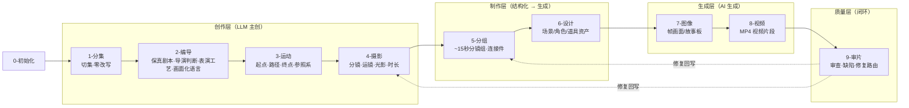
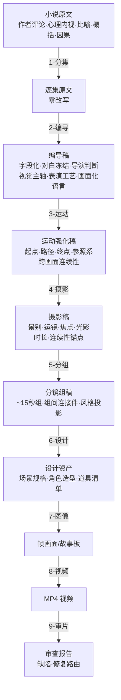

# CONTEXT.md

## Purpose & Loading Contract

本文件是 `.agents/skills/aigc` 根技能经验层知识库，不是第二份根合同。调用 `$aigc` 时，它必须与同目录 `SKILL.md` 一起加载，用于识别 runtime 漂移、卫星越权、legacy 兼容误判和阶段入口断层。

## Context Health

- soft_limit_chars: 20000
- hard_limit_chars: 40000
- status: ok
- recommended_action: keep-root-router-heuristics

## Type Map

| type_id | symptom | likely root layer | immediate fix | verification |
| --- | --- | --- | --- | --- |
| `AIGC-TM-01` | 根入口存在但空文档或未声明项目 runtime | root router layer | 补根 `SKILL.md + CONTEXT.md` 与 `_shared/project-runtime-layout.md` | strict audits 能读到 project runtime |
| `AIGC-TM-02` | 新中文阶段和 legacy 英文阶段混用 | runtime compatibility layer | 把新执行写到中文 runtime，legacy 只作回读 | 根状态表与 routes 不冲突 |
| `AIGC-TM-03` | query/resume/review 被当成主阶段 | satellite boundary layer | 回到卫星 `SKILL.md`，只写辅助证据或 repair route | 阶段业务主稿未被卫星覆盖 |
| `AIGC-TM-04` | 初始化骨架、routes、audit 常量说法不同 | source-layer drift | 同步根合同、registry/routes、共享 layout 与审计器 | `aigc_skill_audit.py --strict` 通过 |
| `AIGC-TM-05` | 多阶段产物修复直接改下游，没有回看源层规则 | repair satellite boundary | 进入 `repair/`，先产出 source rule review、impact map 与 writeback order | 下游修复能追到最早 canonical owner |
| `AIGC-TM-06` | 新学习入口或外部经验只改了局部 skill，根索引和审计未同步 | learning satellite integration | 进入 `learn/`，先建立 target_skill_map、sync_scope 和 isolated audit | root、registry、routes、audit 与 owning skill 口径一致 |

## Repair Playbook

1. 先锁定任务入口：初始化、主阶段、query、resume、review 或 legacy compat。
2. 若项目 runtime 漂移，优先修 `_shared/project-runtime-layout.md`、`0-初始化` runtime 合同和根 `SKILL.md`。
3. 若 registry/routes 与磁盘结构冲突，先修控制面，再修叶子文案。
4. 若 bootstrap 兼容包存在，必须声明它是兼容入口还是 active runtime，避免旧路径反客为主。
5. 若用户请求多阶段局部或整体调整、中文润色、豆包执行或 review finding 回修，优先路由 `repair/`；repair 只拥有诊断、豆包任务包、汇流和验收，不直接夺取阶段主创权。
6. 若用户请求吸收外部方法、学习视频/文档/网页/书籍或优化 AIGC 技能包，优先路由 `learn/`；learn 必须先建立 source digest、target_skill_map 和 sync_scope，再决定是否落盘。
7. 修复或学习改进后同时运行 `skill_context_audit.py --root .agents/skills/aigc --strict` 与 `aigc_skill_audit.py --strict`。

## Reusable Heuristics

- 根 `aigc` 最稳的职责是”选唯一入口 + 保持 runtime 真源”，不是替阶段写业务正文。
- 对大迁移窗口，审计脚本本身也是合同消费点；只改文档不改审计器，会让下一轮维护重新漂移。
- 卫星技能默认不参与主链串行聚合；只有主技能显式声明为 side input 时才回接共享目标。
- `5-Image` 与旧 `6-Video` 在当前树中只能作为 legacy 兼容线索；新执行默认落到 `7-图像` 与 `8-视频`。
- `repair/` 是 source-first 卫星入口；它可以调用豆包做中文分析、润色和创意候选，但 canonical 写回必须回到 owning stage 合同和 review gate。
- `learn/` 是 source-first 学习入口；它吸收外部知识前先判媒介证据、事实冲突、目标 owner 和同步消费者，避免局部改进制造全局矛盾。

## Stage Pipeline — 从原小说到最终视频的完整链路

整个 AIGC 影视流水线是 10 个 active 阶段的串行管道。`2-编导` 已整合旧 `2-编剧 / 3-导演 / 4-表演` 的职责：先忠实剧本化，再注入导演判断与表演工艺，最终全部落成画面化语言；`3-运动` 在编导稿和摄影稿之间补足角色运动的起点、路径、终点、参照系与跨画面连续性；旧 `3-导演`、`4-表演` 技能目录已移除，旧名称只作为兼容触发词回接 `2-编导`。

```text
0-初始化 → 1-分集 → 2-编导 → 3-运动 → 4-摄影 → 5-分组 → 6-设计 → 7-图像 → 8-视频 → 9-审片
```

| 阶段 | 一句话定义 | 输入 | 叠加什么 | 输出 |
| --- | --- | --- | --- | --- |
| `0-初始化` | 锁定项目、风格、制作约束 | 用户请求 | north_star.yaml、team.yaml、项目 MEMORY | 项目骨架 |
| `1-分集` | 把长篇小说切成逐集原文 | 小说全文 | 集边界、字数、frontmatter | `1-分集/第N集.md`（原文，零改写） |
| `2-编导` | 把逐集原文转成可拍、可演、可听的编导稿 | 逐集原文 | slugline、声画配对、对白冻结、小说转译、导演判断、视觉主轴、氛围尾钩、心理反应、台词交付、潜台词行为、场面调度、画面化语言 | `2-编导/第N集.md`（编导稿） |
| `3-运动` | 强化角色运动连续性 | 编导稿 | 起点、路径、终点、参照系、上一画面最终位置回顾 | `3-运动/第N集.md`（运动强化稿） |
| `4-摄影` | 把画面描述翻译成镜头语言 | 运动强化稿 | `分镜明细：`（景别、运镜、焦点、光影、时长、连续性锚点） | `4-摄影/第N集.md`（摄影稿） |
| `5-分组` | 把逐镜切成可生产的分镜组 | 摄影稿 | ~15秒分镜组、组间 3-4 秒连接件、风格投影、统计数据 | `5-分组/第N集.md`（分镜组稿） |
| `6-设计` | 提取并设计场景/角色/道具资产 | 分镜组稿 | 资产清单、设计规格、生成请求 JSON | 设计资产（场景/角色/道具） |
| `7-图像` | 生成分镜画面或故事板 | 分镜组稿 + 设计资产 | AI 生成的帧图像或故事板 | 图像文件 |
| `8-视频` | 生成视频片段 | 图像 + 设计资产 | AI 生成的视频 MP4 | 视频文件 |
| `9-审片` | 审查视频质量，决定是否回修 | 视频 + 分镜组真源 | 审查报告、缺陷分析、修复路由 | 审查报告 + 修复指令 |

### 流程全景



### 每层叠加的维度



### 核心转变逻辑

```text
2-编导 说”文件推过来，纸角擦过冷玻璃桌面；他没立刻伸手，下颌先绷了一下” → 可拍、可演、有导演意图
3-运动 说”以冷玻璃长桌为参照，文件从桌右沿滑向他左手前方；他先停在椅背前，右肩微收后再伸手” → 动作路径和终点连续
4-摄影 说”近景俯拍桌面，文件从右侧入画，纸角翘起，冷玻璃面反射白” → 摄影师知道怎么拍，AI 视频知道怎么生
5-分组 说”这 4 镜组成一个 15 秒分镜组，组间用声音桥连接”          → 制片知道怎么排期
6-设计 说”姜国梁办公室需要：冷玻璃长桌、旧划痕、灰白色调”       → 美术知道怎么置景/建模
7-图像 产出 该分镜组的帧画面                                   → 视觉资产到位
8-视频 产出 该分镜组的 MP4                                     → 影片素材到位
9-审片 说”第 3 镜焦点偏移，建议回到 5-分组 调整景深参数”         → 质量闭环
```
