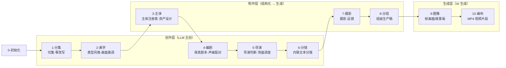
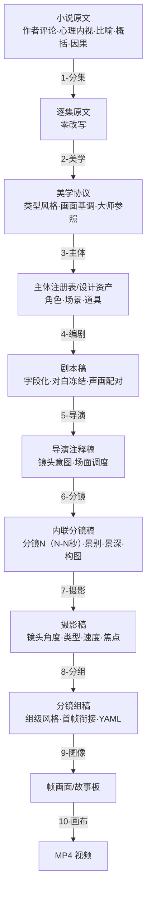

# CONTEXT.md

## Purpose & Loading Contract

本文件是 `.agents/skills/aigc` 根技能经验层知识库，不是第二份根合同。调用 `$aigc` 时，它必须与同目录 `SKILL.md` 一起加载，用于识别 runtime 漂移、卫星越权、legacy 兼容误判和阶段入口断层。

## Context Health

- soft_limit_chars: 20000
- hard_limit_chars: 40000
- status: ok
- recommended_action: keep-root-router-heuristics

## Type Map

| type_id | symptom | likely root layer | immediate fix | verification |
| --- | --- | --- | --- | --- |
| `AIGC-TM-01` | 根入口存在但空文档或未声明项目 runtime | root router layer | 补根 `SKILL.md + CONTEXT.md` 与 `_shared/project-runtime-layout.md` | strict audits 能读到 project runtime |
| `AIGC-TM-02` | 新中文阶段和 legacy 英文阶段混用 | runtime compatibility layer | 把新执行写到中文 runtime，legacy 只作回读 | 根状态表与 routes 不冲突 |
| `AIGC-TM-03` | query/resume/review 被当成主阶段 | satellite boundary layer | 回到卫星 `SKILL.md`，只写辅助证据或 repair route | 阶段业务主稿未被卫星覆盖 |
| `AIGC-TM-04` | 初始化骨架、routes、audit 常量说法不同 | source-layer drift | 同步根合同、registry/routes、共享 layout 与审计器 | `aigc_skill_audit.py --strict` 通过 |
| `AIGC-TM-05` | 多阶段产物修复直接改下游，没有回看源层规则 | repair satellite boundary | 进入 `repair/`，先产出 source rule review、impact map 与 writeback order | 下游修复能追到最早 canonical owner |
| `AIGC-TM-06` | 新学习入口或外部经验只改了局部 skill，根索引和审计未同步 | learning satellite integration | 进入 `learn/`，先建立 target_skill_map、sync_scope 和 isolated audit | root、registry、routes、audit 与 owning skill 口径一致 |
| `AIGC-TM-07` | 阶段产物覆盖率、字段完整或动机证据齐全，但用户仍能看出脚本化、句式复用或锚点替换伪差异 | creative-authorship gate gap | 回 owning skill 补 `authorship / anti-template / differentiation` 独立阻断门；当前候选稿不得 pass | 目标阶段 `SKILL.md` 有 fail code、review gate、返工入口和报告证据；`CONTEXT.md` 有失败模式 |
| `AIGC-TM-08` | 用户只要短视频 prompt，却被路由到正式 2-8 项目阶段落盘 | mini prompt route drift | 进入 `flash/`，只输出当前聊天窗口 `Flash Prompt Pack` | 无项目文件写回；prompt pack 明确 chat-only |
| `AIGC-TM-09` | 下游阶段已读取上游输出，但情节桥段、人物关系、画面空间或风格锚点变得像另一套故事 | upstream context application gap | 同步 `_shared/upstream-context-application-contract.md`，要求 owning stage 报告 `Upstream Context Application Map`，并把“已读取但未应用”列为阻断门 | 阶段 `SKILL.md` 加载共享合同；执行报告能证明 `source_anchor -> local_decision -> preservation_check` |
| `AIGC-TM-10` | 逐集阶段直接读取项目级 2-美学细目风格，忽略同集 `2-美学/第N集/<风格>/` 覆盖 | aesthetic scope resolution gap | 当前集先读逐集风格覆盖，缺失再回退项目级基线；画面基调始终读全局 singleton | 下游 stage 的 `aesthetic_manifest` 记录 episode override / fallback |
| `AIGC-TM-11` | 分集完成后直接进入编剧或分组后再补主体，缺少题材类型、标志性元素、题材专属表现技巧和主体命名真源 | stage-order drift | 回到根主链 `1-分集 -> 2-美学 -> 3-主体 -> 4-编剧`；先由 `2-美学` 基于全量分集故事源输出 `类型风格.md`，再由 `3-主体` 输出 `主体注册表.md` / `subject-registry.yaml` | `3-主体` 的 source/context manifest 包含 `2-美学/类型风格.md`；`4-编剧` 的 source/context manifest 包含 `2-美学/类型风格.md` 和 `3-主体/主体注册表.md` |
| `AIGC-TM-12` | 下游阶段读取了多个上游输入物，但没有说明各自如何引导当前阶段方向 | upstream direction matrix gap | 对 `4-编剧` 输出 `Upstream Creative Direction Matrix`；对 `5-导演` 到 `9-图像` 输出对应创作/制作方向矩阵；对 `10-画布` 输出 `LibTV Upstream Video Direction Matrix` | 阶段执行报告包含 owning stage 方向矩阵，且每行都有 `direction_role`、`used_as`、`stage_decision`、`stage_landing`、`boundary_check` |
| `AIGC-TM-13` | 维护者把“上游上下文”误解成“上一序号阶段产物”，导致用户指定文稿、非相邻真源、主体注册表、画布证据或真实视频证据被忽略 | source bundle narrowing | 回到 `_shared/upstream-context-application-contract.md`，把上下文锁定为授权 source bundle；默认上一阶段只是候选之一，非默认来源必须记录 source override、来源类型、保真边界和缺失项降级 | `Upstream Context Application Map` 的 `upstream_source` 标出 default / non-adjacent / user_override / evidence_only / side_context；方向矩阵能说明每类来源如何导向当前阶段决策 |
| `AIGC-TM-14` | 用户要求对 `2-10` 已有阶段产物多轮调优，却被直接当作 repair 或重新生成主稿 | fine-tuning satellite routing gap | 进入 `fine-tuning/`，先识别调优对象和 owning stage，匹配阶段方案，执行多轮 LLM-first 调优和 comparison gate，再回交 owner-safe patch | 调优报告包含 `target_stage_map`、`scheme_selection_matrix`、`iteration_ledger`、`comparison_acceptance_matrix`、`owner_handoff_patch` |

## Repair Playbook

1. 先锁定任务入口：初始化、主阶段、query、resume、review 或 legacy compat。
2. 若项目 runtime 漂移，优先修 `_shared/project-runtime-layout.md`、`0-初始化` runtime 合同和根 `SKILL.md`。
3. 若 registry/routes 与磁盘结构冲突，先修控制面，再修叶子文案。
4. 若 bootstrap 兼容包存在，必须声明它是兼容入口还是 active runtime，避免旧路径反客为主。
5. 若用户请求多阶段局部或整体调整、中文润色、豆包执行或 review finding 回修，优先路由 `repair/`；repair 只拥有诊断、豆包任务包、汇流和验收，不直接夺取阶段主创权。
6. 若用户请求吸收外部方法、学习视频/文档/网页/书籍或优化 AIGC 技能包，优先路由 `learn/`；learn 必须先建立 source digest、target_skill_map 和 sync_scope，再决定是否落盘。
7. 修复或学习改进后同时运行 `skill_context_audit.py --root .agents/skills/aigc --strict` 与 `aigc_skill_audit.py --strict`。
8. 若任何阶段被指出“脚本化、偷懒、未思考、未差异化”，不要先问是否继续润色；先判定 `AIGC-TM-07`，废弃该候选稿的 pass 资格，并检查 owning skill 是否把脚本批量生成、批量插入、正则套句、映射投影、句式复用和锚点替换伪差异列为独立阻断项。
9. 若用户给少量故事源、参照图、参照视频、图生视频或首尾帧生视频需求，且明确“不保存文档 / 只给 prompt / 当前聊天窗口输出”，优先路由 `flash/`；不要启动正式项目阶段写回。
10. 若用户指出多阶段“读了上游但各说各话”，不要只补一句“参考上游”；先判定 `AIGC-TM-09`，把上游上下文拆成 truth / constraint / handoff seed / style signal，再要求目标阶段输出 `Upstream Context Application Map`。
11. 若用户追问“这些上下文如何引导创作方向”，不要只解释输入物清单；判定 `AIGC-TM-12`。`4-编剧` 使用 `Upstream Creative Direction Matrix`；`5-导演` 使用 `Director Direction Inheritance Matrix`；`6-分镜` 使用 `Storyboard Direction Inheritance Matrix`；`7-摄影` 使用 `Upstream Camera Direction Matrix`；`8-分组` 使用 `Upstream Grouping Direction Matrix`；`9-图像` 使用 `Image Upstream Visual Direction Matrix`；`10-画布` 使用 `LibTV Upstream Video Direction Matrix`。矩阵必须明确每个上游上下文的 direction_role、used_as、stage_decision、stage_landing 和 boundary_check。
12. 若用户提醒“上下文不一定来自上一序号”，不要把阶段链改回线性依赖；判定 `AIGC-TM-13`。先锁定本轮授权 source bundle，再检查默认来源、非相邻来源、用户 override、evidence-only 来源和 side context 各自是否被记录、应用或明确 N/A。
13. 若用户要求“迭代调优 / fine-tuning / 多轮优化 / 比对验收”且目标是 `2-美学` 到 `10-画布` 已有或待验收产物，判定 `AIGC-TM-14`，优先进入 `fine-tuning/`；不要直接改阶段 canonical 主稿，也不要把调优简化成一次润色。

## Reusable Heuristics

- 根 `aigc` 最稳的职责是”选唯一入口 + 保持 runtime 真源”，不是替阶段写业务正文。
- 对大迁移窗口，审计脚本本身也是合同消费点；只改文档不改审计器，会让下一轮维护重新漂移。
- 卫星技能默认不参与主链串行聚合；只有主技能显式声明为 side input 时才回接共享目标。
- `6-分镜` 是文本分镜拆分阶段，`9-图像` 是图像生成父阶段；二者不共享业务真源。显式分镜拆分进入 `6-分镜`，显式生图或故事板生成进入 `9-图像`。
- `5-Image` 与旧 `6-Video` 在当前树中只能作为 legacy 兼容线索；新执行默认落到 `9-图像` 与 `10-画布`。
- `9-图像` 当前叶子目录是 `分镜画面/` 与 `分镜故事板/`，不是旧 `A-分镜画面/` 与 `B-分镜故事板/`；根入口未指定单镜时默认路由 `分镜故事板/`。
- 当前根目录下的工作流编排器为 `workflow/sword10/`；根路由只能把显式 workflow 请求交给该编排器自身 preflight，不得引用旧工作流路径。
- `repair/` 是 source-first 卫星入口；它可以调用豆包做中文分析、润色和创意候选，但 canonical 写回必须回到 owning stage 合同和 review gate。
- `learn/` 是 source-first 学习入口；它吸收外部知识前先判媒介证据、事实冲突、目标 owner 和同步消费者，避免局部改进制造全局矛盾。
- `fine-tuning/` 是输出物迭代调优卫星入口；它不生成首版主稿，不直接写阶段 canonical，只产出多轮调优报告、comparison gate 和 owner-safe patch。
- `flash/` 是 chat-only mini prompt 入口；它压缩串联 2-8 的判断，并在聊天内锁定 mini subject map，但不写任何 stage canonical 文件，也不生成执行报告。
- 创作型阶段的最低源层验收不是“字段都在”，而是“字段背后有不可模板化的观看/叙事/设计判断”。覆盖率、四要素、动机证据和报告章节可以被脚本伪造，必须另设反形式化硬门。
- 上游上下文不是背景资料；它必须被转译为当前阶段的约束、裁决和证据。没有 `source_anchor -> local_decision -> preservation_check` 的链路，就只能说明读取发生过，不能说明上下文被应用。
- `2-美学/画面基调/全局风格协议.md` 是全局 singleton；`2-美学/类型风格.md` 是分集后供 `3-主体`、`4-编剧` 与后续阶段继承的题材类型真源；场景/角色/道具/分镜/摄影风格在逐集任务中优先使用 `2-美学/第N集/<风格>/...`，缺失时才用项目级 `<风格>/...` 作为 fallback。

## Stage Pipeline — 从原小说到最终视频的完整链路

当前 AIGC 影视流水线以根 `SKILL.md` 的 Stage Status Table 为真源。分集后必须先进入 `2-美学` 做题材类型与视觉风格研究配置，再进入 `3-主体` 建立主体注册表和角色/场景/道具清单、设计、生成，然后进入 `4-编剧`；新增文本分镜主链默认走 `2-美学 -> 3-主体 -> 4-编剧 -> 5-导演 -> 6-分镜 -> 7-摄影 -> 8-分组`。`8-分组` 理论上不新增主体，只读引用 `3-主体/subject-registry.yaml`。用户显式指定其他文稿时，各阶段按自身 source override 合同处理。`backup/5-表演`、`backup/6-氛围`、`backup/9-光影` 只用于显式点名、历史回读或恢复计划。

```text
0-初始化 → 1-分集 → 2-美学 → 3-主体 → 4-编剧 → 5-导演 → 6-分镜 → 7-摄影 → 8-分组 → 9-图像 → 10-画布
```

| 阶段 | 一句话定义 | 输入 | 叠加什么 | 输出 |
| --- | --- | --- | --- | --- |
| `0-初始化` | 锁定项目、风格、制作约束 | 用户请求 | north_star.yaml、team.yaml、项目 MEMORY | 项目骨架 |
| `1-分集` | 把长篇小说切成逐集原文 | 小说全文 | 集边界、字数、frontmatter | `1-分集/第N集.md`（原文，零改写） |
| `2-美学` | 从全量分集故事源先建立题材类型、标志性元素、题材专属表现技巧和视觉风格协议 | `1-分集` 全部故事源 + 项目设定 | `类型风格.md`、`画面基调/全局风格协议.md`、逐集或项目级细目风格协议、分镜节奏、美学参照边界 | `2-美学/类型风格.md` + `2-美学/画面基调/全局风格协议.md` + `2-美学/第N集/<风格>/风格协议.md` 或项目级 `<风格>/风格协议.md` |
| `3-主体` | 建立角色/场景/道具命名与资产设计真源 | `1-分集` 全部故事源 + `2-美学/类型风格.md` + 角色/场景/道具风格协议 | `主体注册表.md`、`subject-registry.yaml`、三域清单、设计规格、生成请求 JSON | `3-主体/主体注册表.md` + `3-主体/subject-registry.yaml` + 三域资产 |
| `4-编剧` | 把逐集原文转成可拍、可演、可听且主体命名对齐的剧本稿 | 逐集原文 + `2-美学/类型风格.md` + `3-主体/主体注册表.md` | slugline、声画配对、对白冻结、小说转译、导演判断、视觉主轴、心理反应、台词交付、潜台词行为、场面调度、画面化语言 | `4-编剧/第N集.md` |
| `5-导演` | 在剧本上注入导演判断和场面调度 | 剧本稿 + 美学协议 | 镜头意图、表演空间、声音/视线/节奏组织 | 导演注释稿 |
| `6-分镜` | 在原剧本画面点内联注入文本分镜 | 导演稿或用户指定稿 + 美学协议 | 画面节拍、分镜数量、景别、景深、构图、主体陪体背景、秒段 | `6-分镜/第N集.md`（内联分镜稿） |
| `7-摄影` | 在分镜行后内联注入摄影·运镜手法 | 分镜稿或用户指定稿 + 画面基调/摄影风格 | 镜头角度、镜头类型、速度曲线、焦点行为、连续性交出 | `7-摄影/第N集.md`（摄影运镜稿） |
| `8-分组` | 把逐镜摄影稿切成可生产的分镜组 | 摄影稿或用户指定稿 + `3-主体/subject-registry.yaml` | ~15秒分镜组、组级风格、首帧衔接、引用已登记主体的统计数据 | `8-分组/第N集.md`（分镜组稿） |
| `9-图像` | 生成分镜画面或故事板 | 分镜稿/分镜组稿 + 设计资产 | AI 生成的帧图像或故事板 | 图像文件 |
| `10-画布` | 生成视频片段 | 图像 + 设计资产 | AI 生成的视频 MP4 | 视频文件 |

### 流程全景



### 每层叠加的维度



### 核心转变逻辑

```text
2-美学 说”这是现代权谋/现实压迫型题材，标志性元素是制度空间、文件证据、冷硬办公秩序和沉默压迫；表现技巧应以信息差、物件证据、空间压迫和克制爆点推进” → `类型风格.md` 为主体与编剧提供题材上下文
3-主体 说”姜国梁办公室需要：冷玻璃长桌、旧划痕、灰白色调；姜国梁、冷玻璃长桌、密封文件袋均写入 subject-registry.yaml” → 美术和下游命名知道统一真源
4-编剧 说”文件推过来，纸角擦过冷玻璃桌面；他没立刻伸手，下颌先绷了一下” → 可拍、可演、有导演意图
2-美学/画面基调 说”冷玻璃反射、低饱和灰白、近景压迫、参考某大师的空间压缩但不复刻具体镜头” → 画面基调和分镜风格有边界
6-分镜 说”分镜1（0-2秒）：近景，浅景深，俯拍构图，文件纸角为主体，冷玻璃桌面反光为陪体，灰白办公室背景虚化” → 文本编辑层面的分镜拆分完成
9-图像 产出 该分镜组的帧画面                                   → 视觉资产到位
10-画布 产出 该分镜组的 MP4                                     → 影片素材到位
```
