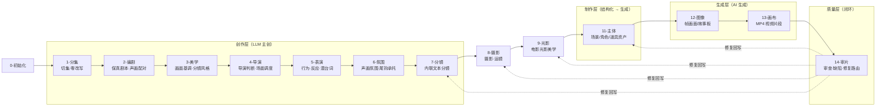
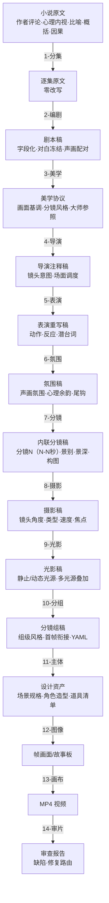

# CONTEXT.md

## Purpose & Loading Contract

本文件是 `.agents/skills/aigc` 根技能经验层知识库，不是第二份根合同。调用 `$aigc` 时，它必须与同目录 `SKILL.md` 一起加载，用于识别 runtime 漂移、卫星越权、legacy 兼容误判和阶段入口断层。

## Context Health

- soft_limit_chars: 20000
- hard_limit_chars: 40000
- status: ok
- recommended_action: keep-root-router-heuristics

## Type Map

| type_id | symptom | likely root layer | immediate fix | verification |
| --- | --- | --- | --- | --- |
| `AIGC-TM-01` | 根入口存在但空文档或未声明项目 runtime | root router layer | 补根 `SKILL.md + CONTEXT.md` 与 `_shared/project-runtime-layout.md` | strict audits 能读到 project runtime |
| `AIGC-TM-02` | 新中文阶段和 legacy 英文阶段混用 | runtime compatibility layer | 把新执行写到中文 runtime，legacy 只作回读 | 根状态表与 routes 不冲突 |
| `AIGC-TM-03` | query/resume/review 被当成主阶段 | satellite boundary layer | 回到卫星 `SKILL.md`，只写辅助证据或 repair route | 阶段业务主稿未被卫星覆盖 |
| `AIGC-TM-04` | 初始化骨架、routes、audit 常量说法不同 | source-layer drift | 同步根合同、registry/routes、共享 layout 与审计器 | `aigc_skill_audit.py --strict` 通过 |
| `AIGC-TM-05` | 多阶段产物修复直接改下游，没有回看源层规则 | repair satellite boundary | 进入 `repair/`，先产出 source rule review、impact map 与 writeback order | 下游修复能追到最早 canonical owner |
| `AIGC-TM-06` | 新学习入口或外部经验只改了局部 skill，根索引和审计未同步 | learning satellite integration | 进入 `learn/`，先建立 target_skill_map、sync_scope 和 isolated audit | root、registry、routes、audit 与 owning skill 口径一致 |
| `AIGC-TM-07` | 阶段产物覆盖率、字段完整或动机证据齐全，但用户仍能看出脚本化、句式复用或锚点替换伪差异 | creative-authorship gate gap | 回 owning skill 补 `authorship / anti-template / differentiation` 独立阻断门；当前候选稿不得 pass | 目标阶段 `SKILL.md` 有 fail code、review gate、返工入口和报告证据；`CONTEXT.md` 有失败模式 |
| `AIGC-TM-08` | 用户只要短视频 prompt，却被路由到正式 2-10 项目阶段落盘 | mini prompt route drift | 进入 `flash/`，只输出当前聊天窗口 `Flash Prompt Pack` | 无项目文件写回；prompt pack 明确 chat-only |
| `AIGC-TM-09` | 下游阶段已读取上游输出，但情节桥段、人物关系、画面空间或风格锚点变得像另一套故事 | upstream context application gap | 同步 `_shared/upstream-context-application-contract.md`，要求 owning stage 报告 `Upstream Context Application Map`，并把“已读取但未应用”列为阻断门 | 阶段 `SKILL.md` 加载共享合同；执行报告能证明 `source_anchor -> local_decision -> preservation_check` |

## Repair Playbook

1. 先锁定任务入口：初始化、主阶段、query、resume、review 或 legacy compat。
2. 若项目 runtime 漂移，优先修 `_shared/project-runtime-layout.md`、`0-初始化` runtime 合同和根 `SKILL.md`。
3. 若 registry/routes 与磁盘结构冲突，先修控制面，再修叶子文案。
4. 若 bootstrap 兼容包存在，必须声明它是兼容入口还是 active runtime，避免旧路径反客为主。
5. 若用户请求多阶段局部或整体调整、中文润色、豆包执行或 review finding 回修，优先路由 `repair/`；repair 只拥有诊断、豆包任务包、汇流和验收，不直接夺取阶段主创权。
6. 若用户请求吸收外部方法、学习视频/文档/网页/书籍或优化 AIGC 技能包，优先路由 `learn/`；learn 必须先建立 source digest、target_skill_map 和 sync_scope，再决定是否落盘。
7. 修复或学习改进后同时运行 `skill_context_audit.py --root .agents/skills/aigc --strict` 与 `aigc_skill_audit.py --strict`。
8. 若任何阶段被指出“脚本化、偷懒、未思考、未差异化”，不要先问是否继续润色；先判定 `AIGC-TM-07`，废弃该候选稿的 pass 资格，并检查 owning skill 是否把脚本批量生成、批量插入、正则套句、映射投影、句式复用和锚点替换伪差异列为独立阻断项。
9. 若用户给少量故事源、参照图、参照视频、图生视频或首尾帧生视频需求，且明确“不保存文档 / 只给 prompt / 当前聊天窗口输出”，优先路由 `flash/`；不要启动正式项目阶段写回。
10. 若用户指出多阶段“读了上游但各说各话”，不要只补一句“参考上游”；先判定 `AIGC-TM-09`，把上游上下文拆成 truth / constraint / handoff seed / style signal，再要求目标阶段输出 `Upstream Context Application Map`。

## Reusable Heuristics

- 根 `aigc` 最稳的职责是”选唯一入口 + 保持 runtime 真源”，不是替阶段写业务正文。
- 对大迁移窗口，审计脚本本身也是合同消费点；只改文档不改审计器，会让下一轮维护重新漂移。
- 卫星技能默认不参与主链串行聚合；只有主技能显式声明为 side input 时才回接共享目标。
- `7-分镜` 是文本分镜拆分阶段，`12-图像` 是图像生成父阶段；二者不共享业务真源。显式分镜拆分进入 `7-分镜`，显式生图或故事板生成进入 `12-图像`。
- `5-Image` 与旧 `6-Video` 在当前树中只能作为 legacy 兼容线索；新执行默认落到 `12-图像` 与 `13-画布`。
- `12-图像` 当前叶子目录是 `分镜画面/` 与 `分镜故事板/`，不是旧 `A-分镜画面/` 与 `B-分镜故事板/`；根入口未指定单镜时默认路由 `分镜故事板/`。
- 当前根目录下的工作流编排器为 `workflow/sword10/`；根路由只能把显式 workflow 请求交给该编排器自身 preflight，不得引用旧工作流路径。
- `repair/` 是 source-first 卫星入口；它可以调用豆包做中文分析、润色和创意候选，但 canonical 写回必须回到 owning stage 合同和 review gate。
- `learn/` 是 source-first 学习入口；它吸收外部知识前先判媒介证据、事实冲突、目标 owner 和同步消费者，避免局部改进制造全局矛盾。
- `flash/` 是 chat-only mini prompt 入口；它压缩串联 2-10 的判断，但不写任何 stage canonical 文件，也不生成执行报告。
- 创作型阶段的最低源层验收不是“字段都在”，而是“字段背后有不可模板化的观看/叙事/设计判断”。覆盖率、四要素、动机证据和报告章节可以被脚本伪造，必须另设反形式化硬门。
- 上游上下文不是背景资料；它必须被转译为当前阶段的约束、裁决和证据。没有 `source_anchor -> local_decision -> preservation_check` 的链路，就只能说明读取发生过，不能说明上下文被应用。

## Stage Pipeline — 从原小说到最终视频的完整链路

当前 AIGC 影视流水线以根 `SKILL.md` 的 Stage Status Table 为真源。新增文本分镜主链默认走 `3-美学 -> 4-导演 -> 5-表演 -> 6-氛围 -> 7-分镜 -> 8-摄影 -> 9-光影 -> 10-分组`；用户显式指定其他文稿时，各阶段按自身 source override 合同处理。

```text
0-初始化 → 1-分集 → 2-编剧 → 3-美学 → 4-导演 → 5-表演 → 6-氛围 → 7-分镜 → 8-摄影 → 9-光影 → 10-分组 → 11-主体/12-图像 → 13-画布 → 14-审片
```

| 阶段 | 一句话定义 | 输入 | 叠加什么 | 输出 |
| --- | --- | --- | --- | --- |
| `0-初始化` | 锁定项目、风格、制作约束 | 用户请求 | north_star.yaml、team.yaml、项目 MEMORY | 项目骨架 |
| `1-分集` | 把长篇小说切成逐集原文 | 小说全文 | 集边界、字数、frontmatter | `1-分集/第N集.md`（原文，零改写） |
| `2-编剧` | 把逐集原文转成可拍、可演、可听的剧本稿 | 逐集原文 | slugline、声画配对、对白冻结、小说转译、导演判断、视觉主轴、心理反应、台词交付、潜台词行为、场面调度、画面化语言 | `2-编剧/第N集.md` |
| `3-美学` | 建立画面基调、场景/角色/道具风格、分镜风格、摄影风格和大师/作品参照 | 项目设定 + 剧本稿 | `画面基调/全局风格协议.md`、细目风格协议、分镜节奏、美学参照边界 | `3-美学/.../风格协议.md` |
| `4-导演` | 在剧本上注入导演判断和场面调度 | 剧本稿 + 美学协议 | 镜头意图、表演空间、声音/视线/节奏组织 | 导演注释稿 |
| `5-表演` | 强化角色表演与行为可拍性 | 导演注释稿 | 动作、表情、潜台词、反应节奏 | 表演重写稿 |
| `6-氛围` | 强化声画氛围、心理反应和尾钩承托 | 表演重写稿 + 美学协议 | 氛围画面、声画配对、环境压迫、情绪余韵 | `6-氛围/第N集.md` |
| `7-分镜` | 在原剧本画面点内联注入文本分镜 | 氛围稿或用户指定稿 + 美学协议 | 画面节拍、分镜数量、景别、景深、构图、主体陪体背景、秒段 | `7-分镜/第N集.md`（内联分镜稿） |
| `8-摄影` | 在分镜行后内联注入摄影·运镜手法 | 分镜稿或用户指定稿 + 画面基调/摄影风格 | 镜头角度、镜头类型、速度曲线、焦点行为、连续性交出 | `8-摄影/第N集.md`（摄影运镜稿） |
| `9-光影` | 在摄影稿分镜行后内联注入电影光影美学 | 摄影稿或用户指定稿 + 画面基调/场景风格/摄影风格 | 静止光、动态光源、浮光掠影、流光溢彩、多光源叠加、明暗与色温 | `9-光影/第N集.md`（光影美学稿） |
| `10-分组` | 把逐镜光影稿切成可生产的分镜组 | 光影稿或用户指定稿 + north_star | ~15秒分镜组、组级风格、首帧衔接、统计数据 | `10-分组/第N集.md`（分镜组稿） |
| `11-主体` | 提取并设计场景/角色/道具资产 | 分镜稿或分镜组稿 | 资产清单、设计规格、生成请求 JSON | 设计资产（场景/角色/道具） |
| `12-图像` | 生成分镜画面或故事板 | 分镜稿/分镜组稿 + 设计资产 | AI 生成的帧图像或故事板 | 图像文件 |
| `13-画布` | 生成视频片段 | 图像 + 设计资产 | AI 生成的视频 MP4 | 视频文件 |
| `14-审片` | 审查视频质量，决定是否回修 | 视频 + 分镜组真源 | 审查报告、缺陷分析、修复路由 | 审查报告 + 修复指令 |

### 流程全景



### 每层叠加的维度



### 核心转变逻辑

```text
2-编剧 说”文件推过来，纸角擦过冷玻璃桌面；他没立刻伸手，下颌先绷了一下” → 可拍、可演、有导演意图
3-美学 说”冷玻璃反射、低饱和灰白、近景压迫、参考某大师的空间压缩但不复刻具体镜头” → 画面基调和分镜风格有边界
6-氛围 说”纸角擦过冷玻璃桌面，空调低鸣压住停顿，他下颌绷紧后才伸手” → 声画氛围和心理余韵到位
7-分镜 说”分镜1（0-2秒）：近景，浅景深，俯拍构图，文件纸角为主体，冷玻璃桌面反光为陪体，灰白办公室背景虚化” → 文本编辑层面的分镜拆分完成
11-主体 说”姜国梁办公室需要：冷玻璃长桌、旧划痕、灰白色调”       → 美术知道怎么置景/建模
12-图像 产出 该分镜组的帧画面                                   → 视觉资产到位
13-画布 产出 该分镜组的 MP4                                     → 影片素材到位
14-审片 说”第 3 镜焦点偏移，建议回到 7-分镜 调整景深参数”         → 质量闭环
```
