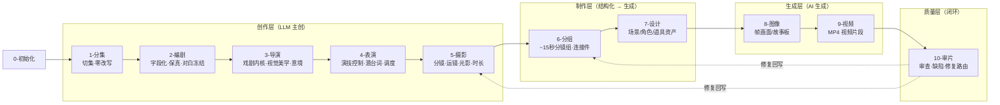
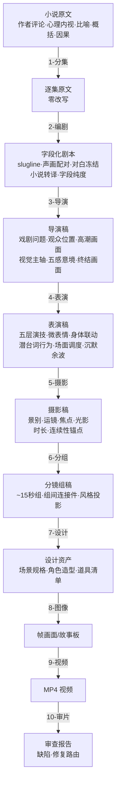

# CONTEXT.md

## Purpose & Loading Contract

本文件是 `.agents/skills/aigc` 根技能经验层知识库，不是第二份根合同。调用 `$aigc` 时，它必须与同目录 `SKILL.md` 一起加载，用于识别 runtime 漂移、卫星越权、legacy 兼容误判和阶段入口断层。

## Context Health

- soft_limit_chars: 20000
- hard_limit_chars: 40000
- status: ok
- recommended_action: keep-root-router-heuristics

## Type Map

| type_id | symptom | likely root layer | immediate fix | verification |
| --- | --- | --- | --- | --- |
| `AIGC-TM-01` | 根入口存在但空文档或未声明项目 runtime | root router layer | 补根 `SKILL.md + CONTEXT.md` 与 `_shared/project-runtime-layout.md` | strict audits 能读到 project runtime |
| `AIGC-TM-02` | 新中文阶段和 legacy 英文阶段混用 | runtime compatibility layer | 把新执行写到中文 runtime，legacy 只作回读 | 根状态表与 routes 不冲突 |
| `AIGC-TM-03` | query/resume/review 被当成主阶段 | satellite boundary layer | 回到卫星 `SKILL.md`，只写辅助证据或 repair route | 阶段业务主稿未被卫星覆盖 |
| `AIGC-TM-04` | 初始化骨架、routes、audit 常量说法不同 | source-layer drift | 同步根合同、registry/routes、共享 layout 与审计器 | `aigc_skill_audit.py --strict` 通过 |

## Repair Playbook

1. 先锁定任务入口：初始化、主阶段、query、resume、review 或 legacy compat。
2. 若项目 runtime 漂移，优先修 `_shared/project-runtime-layout.md`、`0-初始化` runtime 合同和根 `SKILL.md`。
3. 若 registry/routes 与磁盘结构冲突，先修控制面，再修叶子文案。
4. 若 bootstrap 兼容包存在，必须声明它是兼容入口还是 active runtime，避免旧路径反客为主。
5. 修复后同时运行 `skill_context_audit.py --root .agents/skills/aigc --strict` 与 `aigc_skill_audit.py --strict`。

## Reusable Heuristics

- 根 `aigc` 最稳的职责是”选唯一入口 + 保持 runtime 真源”，不是替阶段写业务正文。
- 对大迁移窗口，审计脚本本身也是合同消费点；只改文档不改审计器，会让下一轮维护重新漂移。
- 卫星技能默认不参与主链串行聚合；只有主技能显式声明为 side input 时才回接共享目标。
- `5-Image` 与旧 `6-Video` 在当前树中只能作为 legacy 兼容线索；新执行默认落到 `8-图像` 与 `9-视频`。

## Stage Pipeline — 从原小说到最终视频的完整链路

整个 AIGC 影视流水线是 11 个阶段的串行管道。每一层在上一层的输出上叠加新的维度，不回头改写上游内容。

```text
0-初始化 → 1-分集 → 2-编剧 → 3-导演 → 4-表演 → 5-摄影 → 6-分组 → 7-设计 → 8-图像 → 9-视频 → 10-审片
```

| 阶段 | 一句话定义 | 输入 | 叠加什么 | 输出 |
| --- | --- | --- | --- | --- |
| `0-初始化` | 锁定项目、风格、制作约束 | 用户请求 | north_star.yaml、team.yaml、项目 MEMORY | 项目骨架 |
| `1-分集` | 把长篇小说切成逐集原文 | 小说全文 | 集边界、字数、frontmatter | `1-分集/第N集.md`（原文，零改写） |
| `2-编剧` | 把小说语言翻译成可拍字段 | 逐集原文 | slugline、声画配对、对白冻结、小说转译、字段纯度 | `2-编剧/第N集.md`（字段化剧本） |
| `3-导演` | 注入戏剧问题、视觉美学、氛围意境 | 编剧稿 | 编导内核、高潮画面、视觉主轴、终结画面、五感意境、受控增强 | `3-导演/第N集.md`（导演稿） |
| `4-表演` | 让演员知道怎么演 | 导演稿 | 心理反应可感知化、五层演技控制、潜台词行为化、场面调度、沉默余波 | `4-表演/第N集.md`（表演稿） |
| `5-摄影` | 把画面描述翻译成镜头语言 | 表演稿 | `分镜明细：`（景别、运镜、焦点、光影、时长、连续性锚点） | `5-摄影/第N集.md`（摄影稿） |
| `6-分组` | 把逐镜切成可生产的分镜组 | 摄影稿 | ~15秒分镜组、组间 3-4 秒连接件、风格投影、统计数据 | `6-分组/第N集.md`（分镜组稿） |
| `7-设计` | 提取并设计场景/角色/道具资产 | 分镜组稿 | 资产清单、设计规格、生成请求 JSON | 设计资产（场景/角色/道具） |
| `8-图像` | 生成分镜画面或故事板 | 分镜组稿 + 设计资产 | AI 生成的帧图像或故事板 | 图像文件 |
| `9-视频` | 生成视频片段 | 图像 + 设计资产 | AI 生成的视频 MP4 | 视频文件 |
| `10-审片` | 审查视频质量，决定是否回修 | 视频 + 分镜组真源 | 审查报告、缺陷分析、修复路由 | 审查报告 + 修复指令 |

### 流程全景



### 每层叠加的维度



### 核心转变逻辑

```text
2-编剧 说”文件推过来”            → 可拍
3-导演 说”用阴影和光建立权力空间”   → 有意境
4-表演 说”下颌线比进门时绷紧了一点” → 演员知道怎么演
5-摄影 说”近景俯拍桌面，文件从右侧入画，纸角翘起，冷玻璃面反射白” → 摄影师知道怎么拍，AI 视频知道怎么生
6-分组 说”这 4 镜组成一个 15 秒分镜组，组间用声音桥连接”          → 制片知道怎么排期
7-设计 说”姜国梁办公室需要：冷玻璃长桌、旧划痕、灰白色调”       → 美术知道怎么置景/建模
8-图像 产出 该分镜组的帧画面                                   → 视觉资产到位
9-视频 产出 该分镜组的 MP4                                     → 影片素材到位
10-审片 说”第 3 镜焦点偏移，建议回到 6-分组 调整景深参数”         → 质量闭环
```
