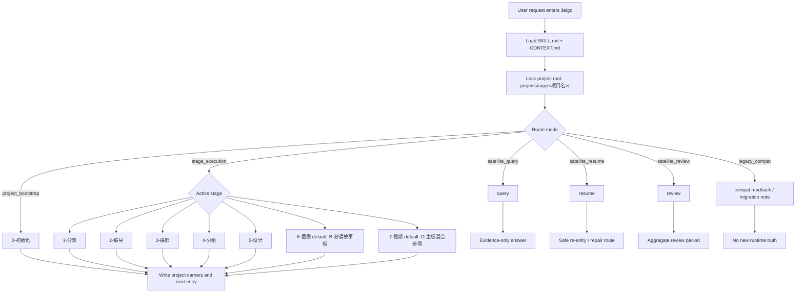

# aigc

`aigc` 是当前仓库 AIGC 影视创作工作流的根入口。它只拥有项目根、阶段路由、卫星技能边界、治理载体和最终回接裁决；具体创作正文、提示词、设计稿、图像或视频生成由命中的阶段/叶子技能负责。

## Context Loading Contract

- 每次调用 `$aigc` 时，必须同时加载同目录 `CONTEXT.md`。
- 每次调用本技能时，必须同时识别并加载同目录 `types/` 中选中的类型包（单选或多选）。
- 若任务绑定 `projects/aigc/<项目名>/`，必须加载项目根 `MEMORY.md`；若存在项目根 `CONTEXT/`，只加载与本轮任务直接相关的文件。
- 项目 runtime 唯一真源固定为 `projects/aigc/<项目名>/`；`.codex/state/tasks/` 只作为可选治理镜像。
- 项目状态载体固定为 `projects/aigc/<项目名>/STATE.json`；结构化治理状态固定为 `projects/aigc/<项目名>/governance-state.yaml`。
- 冲突优先级：用户显式请求 > 根 `AGENTS.md` / meta 规则 > 本 `SKILL.md` > 阶段或卫星 `SKILL.md` > 分区规范 > `agents/openai.yaml` > 项目 `MEMORY.md` > 项目 `CONTEXT/` > 本 `CONTEXT.md`。

## Mode Selection

| mode | trigger | route |
| --- | --- | --- |
| `project_bootstrap` | 初始化影片、电影、影视、视频项目 | `.agents/skills/aigc/0-初始化/SKILL.md` |
| `stage_execution` | 明确命中主阶段或下一阶段推进 | 对应阶段 `SKILL.md` |
| `satellite_query` | 查询项目事实、阶段产物、治理工件 | `.agents/skills/aigc/query/SKILL.md` |
| `satellite_resume` | 中断恢复、治理缺口补齐、安全续跑 | `.agents/skills/aigc/resume/SKILL.md` |
| `satellite_review` | checkpoint / stage / package 审计聚合 | `.agents/skills/aigc/review/SKILL.md` |
| `legacy_compat` | 明确点名 legacy `5-Image` 或旧产物 | 只做搁浅兼容回读或迁移说明 |

## Default Leaf Routing Contract

除非用户显式指定叶子路线、点名目标技能、要求多路线对比，或已有产物 repair / query 必须回到原所属叶子，根入口对阶段内分流采用以下默认：

| stage | default leaf | applies when | explicit override examples |
| --- | --- | --- | --- |
| `6-图像` | `.agents/skills/aigc/6-图像/B-分镜故事板/SKILL.md` | 用户只说进入 `6-图像`、生成图像阶段、下一步生图，且未明确指定单镜分镜画面 | 用户点名 `A-分镜画面`、四段式 `分镜ID`、单镜图、生图 prompt |
| `7-视频` | `.agents/skills/aigc/7-视频/D-主板混合参照/SKILL.md` | 用户只说进入 `7-视频`、生成视频阶段、下一步生视频，且未明确指定 A/B/C/D 任一路线 | 用户点名 `A-分镜画面参照`、`B-分镜故事板参照`、`C-主体参照`、或要求多路线对比 |

该默认只负责根入口初始路由；进入 `6-图像` 或 `7-视频` 后，仍必须加载目标阶段和目标叶子的 `SKILL.md + CONTEXT.md`，并遵循叶子自身输入、输出和审查合同。

## Visual Maps

## Stage Status Table

| stage | skill path | project runtime | status |
| --- | --- | --- | --- |
| `0-初始化` | `.agents/skills/aigc/0-初始化/` | `projects/aigc/<项目名>/0-初始化/` | active |
| `1-分集` | `.agents/skills/aigc/1-分集/` | `projects/aigc/<项目名>/1-分集/` | active |
| `2-编导` | `.agents/skills/aigc/2-编导/` | `projects/aigc/<项目名>/2-编导/` | active |
| `3-摄影` | `.agents/skills/aigc/3-摄影/` | `projects/aigc/<项目名>/3-摄影/` | active |
| `4-分组` | `.agents/skills/aigc/4-分组/` | `projects/aigc/<项目名>/4-分组/` | active |
| `5-设计` | `.agents/skills/aigc/5-设计/` | `projects/aigc/<项目名>/5-设计/` | active |
| `6-图像` | `.agents/skills/aigc/6-图像/` | `projects/aigc/<项目名>/6-图像/` | active；默认叶子 `B-分镜故事板` |
| `7-视频` | `.agents/skills/aigc/7-视频/` | `projects/aigc/<项目名>/7-视频/` | active；默认叶子 `D-主板混合参照` |

Supporting project roots: `projects/aigc/<项目名>/源/`, `projects/aigc/<项目名>/CONTEXT/`, `projects/aigc/<项目名>/MEMORY.md`, `projects/aigc/<项目名>/CHANGELOG.md`, `projects/aigc/<项目名>/STATE.json`, `projects/aigc/<项目名>/governance-state.yaml`.

## Reference Loading Guide

| need | load |
| --- | --- |
| project runtime and bootstrap compatibility | `_shared/project-runtime-layout.md` |
| natural-language routing and registry truth | `.codex/registry/skills.yaml`, `.codex/registry/routes.yaml` |
| initialization | `0-初始化/SKILL.md + CONTEXT.md` |
| design domain routing | `5-设计/SKILL.md + CONTEXT.md` |
| current image stage | `6-图像/SKILL.md + CONTEXT.md`；未显式指定叶子时默认继续加载 `6-图像/B-分镜故事板/SKILL.md + CONTEXT.md` |
| current video stage | `7-视频/SKILL.md + CONTEXT.md`；未显式指定叶子时默认继续加载 `7-视频/D-主板混合参照/SKILL.md + CONTEXT.md` |
| query / resume / review side channels | `query/`, `resume/`, `review/` skill pairs |

## Execution Contract

1. 锁定任务是否是初始化、阶段执行、查询、恢复、审查或 legacy 兼容读取。
2. 若绑定项目，确认 `projects/aigc/<项目名>/`、`STATE.json`、`MEMORY.md` 和必要的治理状态。
3. 选择唯一主入口；若主入口为 `6-图像` 且用户未显式指定叶子，默认进入 `6-图像/B-分镜故事板`；若主入口为 `7-视频` 且用户未显式指定叶子，默认进入 `7-视频/D-主板混合参照`。
4. 用户显式指定、点名已有产物 query / repair、或明确要求多路线对比时，必须尊重用户路线或原所属叶子，不得被默认叶子覆盖。
5. 阶段技能完成后，根入口只汇流下一入口、治理证据与失败回接，不改写阶段业务主稿。
6. 若遇到 legacy `5-Image` 或 `6-Video`，只允许兼容读取或迁移说明，不得把旧路径写成新 runtime。

## Field Master

| field_id | owner | canonical file | must contain | fail code |
| --- | --- | --- | --- | --- |
| `FIELD-AIGC-ROOT-01` | root route | this `SKILL.md` | project root, mode, selected entry | `FAIL-AIGC-ROUTE` |
| `FIELD-AIGC-ROOT-02` | runtime | `_shared/project-runtime-layout.md` | canonical project roots and forbidden legacy roots | `FAIL-AIGC-RUNTIME` |
| `FIELD-AIGC-ROOT-03` | governance | `STATE.json` / `governance-state.yaml` | state carrier and review/resume bridge | `FAIL-AIGC-GOV` |
| `FIELD-AIGC-ROOT-04` | satellite boundary | `query/resume/review` | side-channel ownership and no business-truth overwrite | `FAIL-AIGC-SAT` |

## Thought Pass Map

| pass_id | focus field | core question | action | evidence |
| --- | --- | --- | --- | --- |
| `PASS-AIGC-01` | `FIELD-AIGC-ROOT-01` | 用户诉求应进入哪一个入口 | 判型并锁唯一 route | route note |
| `PASS-AIGC-02` | `FIELD-AIGC-ROOT-02` | 项目 runtime 是否落在 canonical 根 | 检查共享 layout 与项目文件 | runtime evidence |
| `PASS-AIGC-03` | `FIELD-AIGC-ROOT-03` | 是否需要治理桥接 | 检查 state / review / resume carrier | governance evidence |
| `PASS-AIGC-04` | `FIELD-AIGC-ROOT-04` | 是否误用卫星改写业务真源 | 校验卫星边界 | boundary note |

## Pass Table

| pass_id | pass standard | fail code | rework entry |
| --- | --- | --- | --- |
| `PASS-AIGC-01` | route 唯一且有明确技能入口 | `FAIL-AIGC-ROUTE` | Mode Selection |
| `PASS-AIGC-02` | runtime 与 `_shared/project-runtime-layout.md` 对齐 | `FAIL-AIGC-RUNTIME` | shared layout |
| `PASS-AIGC-03` | state/governance carrier 不分叉 | `FAIL-AIGC-GOV` | `resume` or `review` |
| `PASS-AIGC-04` | 卫星只写辅助 truth、repair route 或证据 | `FAIL-AIGC-SAT` | satellite `SKILL.md` |

## Root-Cause Execution Contract (Mandatory)

失败时沿链路上溯：

`Symptom -> Direct Cause -> Root Route / Runtime Owner -> Stage or Satellite Contract -> AGENTS.md`

优先修源层：registry/routes、`_shared/project-runtime-layout.md`、根 `SKILL.md`、命中阶段 `SKILL.md`。若发现可复用经验，先沉淀到本目录 `CONTEXT.md`，稳定后再晋升到根合同或共享规范。

## Output Contract

- Required output: 唯一阶段/卫星入口、项目 runtime 证据、下一步或阻断原因。
- Output format: 面向用户的简短路由结论；需要治理落盘时写对应阶段或卫星定义的 carrier。
- Output path: 根入口不直接写阶段业务主稿；项目级状态只写 `projects/aigc/<项目名>/STATE.json`、`governance-state.yaml` 或阶段定义的 `validation-report.md`。
- Completion gate: route 唯一，runtime 不漂移，legacy 状态明确，未命中单元不参与聚合。
