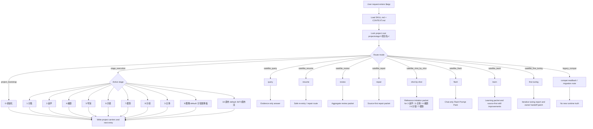

# aigc

`aigc` 是当前仓库 AIGC 影视创作工作流的根入口。它只拥有项目根、阶段路由、卫星技能边界、治理载体和最终回接裁决；具体创作正文、提示词、设计稿、图像或视频生成由命中的阶段/叶子技能负责。

## Context Loading Contract

- 每次调用 `$aigc` 时，必须同时加载同目录 `CONTEXT.md`。
- 根入口不拥有本级 `types/` 类型包；类型判定必须在路由到目标阶段、叶子或卫星后，按目标技能的 `Reference Loading Guide` 加载其同目录 `types/` 中命中的类型包。
- 若任务绑定 `projects/aigc/<项目名>/`，必须加载项目根 `MEMORY.md`，再加载项目根 `CONTEXT/` 中与本轮任务直接相关的文件；若任一项目级载体缺失，先报告基线缺口或路由到 `0-初始化`/`resume` 修复。
- 项目 runtime 唯一真源固定为 `projects/aigc/<项目名>/`；`.codex/state/tasks/` 只作为可选治理镜像。
- 项目状态载体固定为 `projects/aigc/<项目名>/STATE.json`；结构化治理状态固定为 `projects/aigc/<项目名>/governance-state.yaml`。
- 当主链执行或审查落在 `2-美学` 到 `10-画布` 任一 active 阶段，且该阶段声明消费上游输出时，必须加载 `_shared/upstream-context-application-contract.md`；“已读取上游上下文”不等于 pass，必须能证明它如何被投影到当前阶段决策。`9-图像`、`10-画布` 分别使用视觉生成和画布执行方向矩阵，不得误写成编剧式创作矩阵。
- 冲突优先级：用户显式请求 > 根 `AGENTS.md` / meta 规则 > 本 `SKILL.md` > 阶段或卫星 `SKILL.md` > 分区规范 > `agents/openai.yaml` > 项目 `MEMORY.md` > 项目 `CONTEXT/` > 本 `CONTEXT.md`。

## Multi-Subskill Continuous Workflow

当 `$aigc` 主技能包被整体调用时，视为用户已授权根入口按本文件声明的阶段和子技能包连续完成整个技能组任务；在满足必要输入、显式选择和安全门后，不再为“是否继续下一步”额外确认。

- 数字序号阶段包默认按根入口声明的阶段链推进；当前显式阶段链包含 `0-初始化` -> `1-分集` -> `2-美学` -> `3-主体` -> `4-编剧` -> `5-导演` -> `6-分镜` -> `7-摄影` -> `8-分组` -> `9-图像` -> `10-画布`。`2-美学` 是分集后第一研究配置阶段，必须从 `1-分集` 涉及的全部故事源内容中解析题材类型、标志性元素和题材专属表现技巧，并输出 `类型风格.md` 供 `3-主体`、`4-编剧` 和后续阶段继承；`3-主体` 是主体命名与资产设计真源，默认消费 `1-分集` 全量故事源、`2-美学/类型风格.md` 及相关风格协议，先生成 `主体注册表.md` / `subject-registry.yaml`，再并发调度 `场景`、`角色`、`道具` 的清单、设计和生成；`4-编剧` 是当前剧本层真源，默认消费 `1-分集`、`2-美学/类型风格.md` 和 `3-主体/主体注册表.md`，并必须输出 `Upstream Creative Direction Matrix`，说明故事真源、题材方向、主体命名和项目长期约束如何共同引导本集编剧创作方向。`2-编导`、`3-运动`、旧 `4-摄影`、旧 `5-分组` 以及 `backup/5-表演`、`backup/6-氛围`、`backup/9-光影` 只作为 legacy 兼容回读、显式点名试用或迁移线索，不得作为当前 runtime 默认写回真源。显式命中 `5-导演` 时由 `5-导演` 消费剧本和 `2-美学` 生成导演批注稿；显式命中 `6-分镜` 时由 `6-分镜` 默认消费 `5-导演` 或用户指定文稿并结合 `2-美学/画面基调` 与 `2-美学/分镜风格` 生成内联分镜稿；显式命中 `7-摄影` 时由 `7-摄影` 消费 `6-分镜` 或用户指定分镜稿，并结合 `2-美学/画面基调` 与 `2-美学/摄影风格` 逐分镜注入综合运镜手法；显式命中 `8-分组` 时由 `8-分组` 默认消费 `7-摄影` 摄影稿，并只读引用 `3-主体/subject-registry.yaml` 的主体 ID 与 canonical name 写入组底 YAML，不允许新增主体信息；显式命中 `9-图像`、`10-画布` 时分别进入图像和画布视频阶段。
- 无序号同级子技能包默认全选并发执行，由所属父级汇总、裁决和写回唯一 canonical 输出；例如 `3-主体` 整体调用时由其父级并发调度 `场景`、`角色`、`道具`。
- 英文序号子技能包或路线（如 `A-`、`B-`、`C-`、`D-`）默认按用户意图、父级路由或输入类型单选分流；只有用户明确要求对比、并跑或批量多路线时才多选。
- 卫星技能 `query/`、`resume/`、`review/`、`repair/`、`shot-by-shot/`、`flash/`、`learn/`、`fine-tuning/` 不默认纳入主链串行推进；只有用户请求查询、恢复、审查、修复、参考拉片、聊天窗口迷你提示词、学习吸收、阶段输出物多轮调优或阶段门禁需要时才作为旁路回接。
- 连续调度不得绕过阻断门：缺少必需输入、初始化项目名未锁定、破坏性操作未授权、阶段/叶子缺失、路线歧义会造成错误 canonical 写回时，必须先停下并给出最小澄清或不可用说明。
- 每个被调度的阶段或叶子仍必须加载自身 `SKILL.md + CONTEXT.md`；脚本只能承担机械辅助，不得替代 LLM 主创判断或根入口最终裁决。
- 对任何内容创作型阶段或叶子，覆盖率、字段完整、四要素齐全、动机证据存在、报告自证或格式校验通过都只算机械底线；若 owning skill 未把脚本批量生成、批量插入、正则套句、映射投影、句式复用、关键词/锚点替换伪差异、模板批量扩写列为独立阻断项，必须先路由 `learn/` 或目标 skill 源层修复，不得继续判定 canonical pass。

## Upstream Context Application Contract

`2-美学` 到 `10-画布` 是同一故事源的 active 连续投影链。根入口要求每个下游阶段把上游输出当作可审计 source/constraint/evidence，而不是只读作背景材料。

- 凡阶段消费上游输出，必须按 `_shared/upstream-context-application-contract.md` 生成或审查 `Upstream Context Application Map`。
- 上游上下文不是上一序号阶段的同义词。阶段链只表达默认推进顺序；具体 source bundle 可包含非相邻早期真源、用户指定文稿、项目记忆、主体注册表、图像/画布侧车、远端运行证据、真实视频证据或顾问 packet。若使用非默认来源，必须记录 source override、保真边界和缺失项降级。
- 若阶段需要把多个上游输入物共同收束为本阶段方向，必须按 owning stage 合同追加方向矩阵。`4-编剧` 使用 `Upstream Creative Direction Matrix`；`5-导演` 到 `9-图像` 使用对应创作/制作方向矩阵；`10-画布` 使用 `LibTV Upstream Video Direction Matrix`。
- 每个关键新增、改写、注入、裁决或省略，都必须说明使用了哪个 `source_anchor`、投影成当前阶段的什么 `local_decision`、保留了哪些 `preserved_truth`。
- 当前阶段只能投影到本阶段 owning dimension：编剧、风格、导演、分镜、摄影或分组；不得借“继承上游”反向改写上游事实、字段、空间布局或风格真源。
- 缺少 `Upstream Context Application Map`、只写“已读取/已参考/已综合考虑”、或无法证明上下文怎样影响输出时，统一触发 `FAIL-AIGC-UPSTREAM-CONTEXT`，返工到 owning stage 的理解、计划、注入或报告节点。
- 根入口汇流时只接受已经通过本合同的阶段输出；下游产物若与上游同源桥段、人物关系、画面空间或风格锚点脱节，优先判定为上下文应用失败，而不是局部文案问题。

## Input Contract

Accepted input:

- AIGC 影视、电影、视频、短剧项目初始化、阶段推进、阶段切换、续跑、查询、审查或 legacy 兼容读取。
- 指向 `projects/aigc/<项目名>/` 的项目路径、项目名、阶段产物、治理状态或已有生成资产。
- 明确命中某个阶段、叶子路线或卫星技能的自然语言请求。

Required input:

- 可判断的媒介归属：影视 / 视频 / AIGC 短剧项目进入本根入口；小说进入 `projects/story/<项目名>/` 对应 story 技能；漫画进入 `projects/comic/<项目名>/` 对应 comic 技能。
- 初始化任务必须能锁定项目名；`0-初始化` 当前只创建 0-10 目录骨架、项目根 `MEMORY.md` 与项目根 `CONTEXT/`，不要求 `auto/custom`、north-star 或团队输入。
- 阶段执行、查询、恢复或审查任务必须能定位项目根，或由用户提供足够上下文让根入口先路由到唯一阶段/卫星。

Reject or clarify when:

- 任务媒介是小说、漫画或非 AIGC 影视工作流，且用户未明确要求使用本技能。
- 用户要求根入口直接主创阶段正文、设计稿、prompt、图像或视频，而不是路由到 owning 阶段/叶子。
- 缺少项目名、阶段目标或路线选择，且自动推断会造成错误 canonical 写回、覆盖既有产物或误入 legacy 路径。

## Mode Selection

| mode                       | trigger                                 | route                                         |
| -------------------------- | --------------------------------------- | --------------------------------------------- |
| `project_bootstrap`      | 初始化影片、电影、影视、视频项目        | `.agents/skills/aigc/0-初始化/SKILL.md`     |
| `stage_execution`        | 明确命中主阶段或下一阶段推进            | 对应阶段 `SKILL.md`                         |
| `satellite_query`        | 查询项目事实、阶段产物、治理工件        | `.agents/skills/aigc/query/SKILL.md`        |
| `satellite_resume`       | 中断恢复、治理缺口补齐、安全续跑        | `.agents/skills/aigc/resume/SKILL.md`       |
| `satellite_review`       | checkpoint / stage / package 审计聚合   | `.agents/skills/aigc/review/SKILL.md`       |
| `satellite_repair`       | 多阶段输出物局部/整体修复、中文润色、豆包执行、review finding 回修 | `.agents/skills/aigc/repair/SKILL.md` |
| `satellite_shot_by_shot` | 参考影片/视频拉片、逐镜分析、临摹参照包 | `.agents/skills/aigc/shot-by-shot/SKILL.md` |
| `satellite_flash`        | 少量故事源、参照图、参照视频、图生视频或首尾帧需求快速输出聊天窗口统一视频提示词 | `.agents/skills/aigc/flash/SKILL.md` |
| `satellite_learn`        | 外部学习对象吸收、AIGC 技能树差距分析、source-first 改进与同步审计 | `.agents/skills/aigc/learn/SKILL.md` |
| `satellite_fine_tuning`  | `2-美学` 到 `10-画布` 阶段输出物多轮迭代调优、基线对比验收与 owner-safe patch 回交 | `.agents/skills/aigc/fine-tuning/SKILL.md` |
| `workflow_sword10`       | 明确命中 `sword10` 或 `workflow/sword10` subagent 编排 | `.agents/skills/aigc/workflow/sword10/SKILL.md` |
| `legacy_compat`          | 明确点名 legacy `5-Image` 或旧产物    | 只做搁浅兼容回读或迁移说明                    |

## Default Leaf Routing Contract

除非用户显式指定叶子路线、点名目标技能、要求多路线对比，或已有产物 repair / query 必须回到原所属叶子，根入口对阶段内分流采用以下默认：

| stage      | default leaf                                         | applies when                                                                                       | explicit override examples                                                                                     |
| ---------- | ---------------------------------------------------- | -------------------------------------------------------------------------------------------------- | -------------------------------------------------------------------------------------------------------------- |
| `9-图像` | `.agents/skills/aigc/9-图像/分镜故事板/SKILL.md` | 用户只说进入 `9-图像`、生成图像阶段、下一步生图，且未明确指定单镜分镜画面                        | 用户点名 `分镜画面`、四段式 `分镜ID`、单镜图、生图 prompt                                                |
| `10-画布` | `.agents/skills/aigc/10-画布/libTV画布流/SKILL.md`  | 用户只说进入 `10-画布`、生成视频阶段、下一步生视频、LibTV 画布、创建画布项目、上传主体参照图、按 `8-分组` 建视频节点 | 用户明确指定其他当前存在的视频叶子或要求多路线对比 |

该默认只负责根入口初始路由；进入 `9-图像` 或 `10-画布` 后，仍必须加载目标阶段和目标叶子的 `SKILL.md + CONTEXT.md`，并遵循叶子自身输入、输出和审查合同。

## Visual Maps

## Stage Status Table

| stage        | skill path                        | project runtime                      | status                                                                       |
| ------------ | --------------------------------- | ------------------------------------ | ---------------------------------------------------------------------------- |
| `0-初始化` | `.agents/skills/aigc/0-初始化/` | `projects/aigc/<项目名>/0-初始化/` | active                                                                       |
| `1-分集`   | `.agents/skills/aigc/1-分集/`   | `projects/aigc/<项目名>/1-分集/`   | active                                                                       |
| `2-美学`   | `.agents/skills/aigc/2-美学/`   | `projects/aigc/<项目名>/2-美学/`   | active；默认消费 `1-分集` 全部故事源或用户指定 source，先输出 `类型风格.md`，再并发生成画面基调、场景风格、角色风格、道具风格、分镜风格和摄影风格；`画面基调` 为项目级 singleton，其余 5 类风格在单集执行时优先落到 `2-美学/第N集/<风格>/` |
| `3-主体`   | `.agents/skills/aigc/3-主体/`   | `projects/aigc/<项目名>/3-主体/`   | active；默认消费 `1-分集` 全量故事源、`2-美学/类型风格.md` 和相关风格协议，建立 `主体注册表.md` / `subject-registry.yaml` 作为角色、场景、道具命名真源，并并发进入三域清单、设计和生成 |
| `4-编剧`   | `.agents/skills/aigc/4-编剧/`   | `projects/aigc/<项目名>/4-编剧/`   | active；默认消费 `1-分集`、`2-美学/类型风格.md` 与 `3-主体/主体注册表.md`，完成小说到短剧剧本改编、题材/叙事解析、节奏/高潮/尾钩和 AIGC 字段整理 |
| `5-导演`   | `.agents/skills/aigc/5-导演/`   | `projects/aigc/<项目名>/5-导演/`   | active；消费 `4-编剧` 与 `2-美学/画面基调`，逐画面点注入导演批注 |
| `6-分镜`   | `.agents/skills/aigc/6-分镜/`   | `projects/aigc/<项目名>/6-分镜/`   | active；默认消费 `5-导演` 或用户指定文稿，并结合 `2-美学/画面基调` 与 `2-美学/分镜风格` 在原剧本画面点下方内联注入 `分镜N（N-N秒）：...` |
| `7-摄影`   | `.agents/skills/aigc/7-摄影/`   | `projects/aigc/<项目名>/7-摄影/`   | active；默认消费 `6-分镜` 或用户指定分镜稿，并结合 `2-美学/画面基调` 与 `2-美学/摄影风格` 在每条分镜原文后内联注入综合运镜手法 |
| `8-分组`   | `.agents/skills/aigc/8-分组/`   | `projects/aigc/<项目名>/8-分组/`   | active；默认消费 `7-摄影` 摄影稿，用户指定文稿时优先指定 source；组底 YAML 的角色/场景/道具只允许引用 `3-主体/subject-registry.yaml` 中已登记主体 |
| `9-图像`   | `.agents/skills/aigc/9-图像/`   | `projects/aigc/<项目名>/9-图像/`   | active；默认叶子 `分镜故事板`                                            |
| `10-画布`   | `.agents/skills/aigc/10-画布/`   | `projects/aigc/<项目名>/10-画布/`   | active；默认叶子 `libTV画布流` |

归档阶段：`backup/5-表演`、`backup/6-氛围`、`backup/9-光影` 不参与默认主链、初始化骨架或 review release 门禁；只有用户显式点名旧阶段、需要历史产物回读、迁移对照或恢复计划时才进入对应 backup skill。

旧 `2-编导`、`3-运动`、旧 `4-摄影`、旧 `5-分组`、旧 `3-导演`、旧 `4-表演`、`5-Image` 与旧 `6-Video` 只作为 legacy 自然语言兼容触发词或旧产物回读线索；显式 `4-编剧`、`5-导演` 分别路由到当前同名阶段目录，显式 `5-表演`、`6-氛围`、`9-光影` 路由到 `backup/` 兼容入口。

Supporting project roots may be created by later owning workflows as needed. `0-初始化` only creates the current 0-10 stage directories, `projects/aigc/<项目名>/MEMORY.md`, and `projects/aigc/<项目名>/CONTEXT/`.

## Reference Loading Guide

| need                                        | load                                                                                                                        |
| ------------------------------------------- | --------------------------------------------------------------------------------------------------------------------------- |
| project runtime and bootstrap compatibility | `_shared/project-runtime-layout.md`                                                                                       |
| upstream context application for stages 2-10 | `_shared/upstream-context-application-contract.md`；用于证明上游输出如何被当前阶段投影、保真和举证，不得作为第二输出真源 |
| natural-language routing and registry truth | `.codex/registry/skills.yaml`, `.codex/registry/routes.yaml`                                                            |
| initialization                              | `0-初始化/SKILL.md + CONTEXT.md`                                                                                          |
| visual aesthetics                           | `2-美学/SKILL.md + CONTEXT.md`；默认消费 `1-分集` 全部故事源或用户指定 source，先输出 `类型风格.md`，解析最佳适配题材类型、标志性元素、题材专属表现技巧和下游继承边界，再处理画面基调、场景/角色/道具风格、分镜/摄影风格和交互图片/视频参照解析；其中 `画面基调/全局风格协议.md` 的 `Global Style Prompt` 是下游全局风格真源；逐集任务优先消费 `2-美学/第N集/<风格>/...`，缺失时回退 `2-美学/<风格>/...` 项目级基线 |
| subject registry and design domain routing  | `3-主体/SKILL.md + CONTEXT.md`；默认消费 `1-分集` 全量故事源、`2-美学/类型风格.md`、画面基调和角色/场景/道具风格协议，输出 `3-主体/主体注册表.md` 与 `3-主体/subject-registry.yaml`，再并发进入 `场景`、`角色`、`道具` 的清单、设计和生成 |
| screenplay adaptation                       | `4-编剧/SKILL.md + CONTEXT.md`；默认消费 `1-分集`、`2-美学/类型风格.md` 和 `3-主体/主体注册表.md`，先生成 `Upstream Creative Direction Matrix` 明确上游如何引导创作方向，再处理小说到逐集剧本、题材/叙事解析、短剧节奏、高潮尾钩、声画同步和 AIGC 下游字段 |
| director annotation                         | `5-导演/SKILL.md + CONTEXT.md`；默认消费 `4-编剧` 与 `2-美学/画面基调`，逐画面点生成内联导演批注，并用 `Director Direction Inheritance Matrix` 说明上游如何引导导演意图 |
| storyboard split                            | `6-分镜/SKILL.md + CONTEXT.md`；默认消费 `5-导演/第N集.md`，用户指定时优先指定文稿，并加载 `2-美学/画面基调/全局风格协议.md` 与当前集优先的 `2-美学/第N集/分镜风格/分镜风格协议.md`，缺失时回退 `2-美学/分镜风格/分镜风格协议.md`，在原画面点下方内联注入 `分镜N（N-N秒）：景别，景深，构图形式，主体陪体背景描述`，并用 `Storyboard Direction Inheritance Matrix` 说明上游如何引导分镜方向 |
| camera movement injection                   | `7-摄影/SKILL.md + CONTEXT.md`；默认消费 `6-分镜/第N集.md`，用户指定时优先指定分镜稿，并加载 `2-美学/画面基调/全局风格协议.md` 与当前集优先的 `2-美学/第N集/摄影风格/摄影风格协议.md`，缺失时回退 `2-美学/摄影风格/摄影风格协议.md`，在 `分镜N（N-N秒）：原有内容` 后追加镜头角度、镜头类型、速度和焦点行为的综合运镜手法，并用 `Upstream Camera Direction Matrix` 说明上游如何引导摄影方向 |
| storyboard grouping                         | `8-分组/SKILL.md + CONTEXT.md`；默认消费 `7-摄影/第N集.md` 摄影稿，用户指定时优先指定文稿；必须只读 `3-主体/subject-registry.yaml`，按真实集-场-组生成 `x-y-z` 分镜组、组级风格、首帧衔接和引用注册表主体的 YAML 统计，并用 `Upstream Grouping Direction Matrix` 说明上游如何引导分组方向 |
| archived performance / atmosphere / lighting | `backup/5-表演/`, `backup/6-氛围/`, `backup/9-光影/`；仅显式点名、历史回读、迁移对照或恢复计划时加载，不作为 active 主链默认来源 |
| current image stage                         | `9-图像/SKILL.md + CONTEXT.md`；未显式指定叶子时默认继续加载 `9-图像/分镜故事板/SKILL.md + CONTEXT.md`；叶子报告必须映射 `Image Upstream Visual Direction Matrix` 到 source comprehension、visual prompt atoms、source spatial comprehension 或 prompt authorship evidence |
| current video stage                         | `10-画布/SKILL.md + CONTEXT.md`；默认继续加载 `10-画布/libTV画布流/SKILL.md + CONTEXT.md`；执行报告必须包含 `LibTV Upstream Video Direction Matrix`，说明 `8-分组`、主体/图像参照、LibTV runtime 和用户 overrides 如何影响 prompt、imageList、settings 与 run/rerun 边界 |
| query / resume / review / repair / flash / learn / fine-tuning side channels | `query/`, `resume/`, `review/`, `repair/`, `flash/`, `learn/`, `fine-tuning/` skill pairs                                             |
| reference imitation / shot-by-shot analysis | `shot-by-shot/SKILL.md + CONTEXT.md`；按需再加载 `4-编剧`、`6-分镜` 与 `7-摄影` 阶段合同，输出临摹参照包而非阶段 canonical 主稿 |
| chat-only mini prompt pipeline | `flash/SKILL.md + CONTEXT.md`；针对少量故事源、参照图、参照视频、图生视频或首尾帧生视频需求，压缩串联 `2-美学` 到 `8-分组` 核心判断，只在当前聊天窗口输出统一 `Flash Prompt Pack`，不保存文档、不写项目 canonical |
| iterative tuning satellite | `fine-tuning/SKILL.md + CONTEXT.md`；针对 `2-美学` 到 `10-画布` 已有或待验收阶段产物，识别对象、匹配阶段专属多轮调优方案、执行 LLM-first 调优、完成基线对比验收，并把通过的候选作为 owner-safe patch 回交 owning stage，不直接改写阶段 canonical 真源 |
| sword10 subagent workflow | `workflow/sword10/SKILL.md + CONTEXT.md`；按需加载其 `types/`、`steps/`、`references/` 与 `review/`，主窗口只调度和追踪，不直接主创阶段正文 |
| type package selection                      | 根入口只判定 route；目标阶段、叶子或卫星自行加载其同目录 `types/` 命中包                                                  |

## Execution Contract

1. 锁定任务是否是初始化、阶段执行、查询、恢复、审查、修复、学习改进、输出物迭代调优或 legacy 兼容读取。
2. 若绑定项目，确认 `projects/aigc/<项目名>/`、`MEMORY.md`、`CONTEXT/` 和必要的治理状态；`STATE.json` 与 `governance-state.yaml` 仅在对应治理 workflow 需要时检查或创建。
3. 选择唯一主入口；若主入口为 `9-图像` 且用户未显式指定叶子，默认进入 `9-图像/分镜故事板`；若主入口为 `10-画布`，默认进入 `10-画布/libTV画布流`。
4. 用户显式指定、点名已有产物 query / repair、或明确要求多路线对比时，必须尊重用户路线或原所属叶子，不得被默认叶子覆盖。
5. 若主入口属于 `2-美学` 到 `10-画布` 且消费上游输出，确认目标阶段已加载 `_shared/upstream-context-application-contract.md`，并把 `Upstream Context Application Map` 与 owning stage 的方向矩阵纳入完成门。
6. 阶段技能完成后，根入口只汇流下一入口、治理证据与失败回接，不改写阶段业务主稿。
7. 若遇到 legacy `5-Image` 或 `6-Video`，只允许兼容读取或迁移说明，不得把旧路径写成新 runtime。
8. 若用户要求对 `2-美学` 到 `10-画布` 的已有阶段产物做“迭代调优 / fine-tuning / 多轮优化 / 比对验收”，优先进入 `fine-tuning/`；该卫星只产出调优报告、comparison gate 和 owner-safe patch，正式写回仍回到 owning stage。
9. 若阶段产物被用户或审计指出“脚本化、偷懒、未经思考、未差异化、句式复用、锚点替换”，根入口必须把它归类为 owning skill 的源层验收门缺口，优先进入 `learn/execute_improvement` 或对应阶段 `R*-REWORK`；不得用补报告、抽样解释、重复率下降或字段补齐替代返工。

## Field Master

| field_id               | owner              | canonical file                             | must contain                                           | fail code             |
| ---------------------- | ------------------ | ------------------------------------------ | ------------------------------------------------------ | --------------------- |
| `FIELD-AIGC-ROOT-01` | root route         | this `SKILL.md`                          | project root, mode, selected entry                     | `FAIL-AIGC-ROUTE`   |
| `FIELD-AIGC-ROOT-02` | runtime            | `_shared/project-runtime-layout.md`      | canonical project roots and forbidden legacy roots     | `FAIL-AIGC-RUNTIME` |
| `FIELD-AIGC-ROOT-03` | governance         | `STATE.json` / `governance-state.yaml` | state carrier and review/resume bridge                 | `FAIL-AIGC-GOV`     |
| `FIELD-AIGC-ROOT-04` | satellite boundary | `query/resume/review/repair/shot-by-shot/flash/learn/fine-tuning` | side-channel ownership and no business-truth overwrite | `FAIL-AIGC-SAT`     |
| `FIELD-AIGC-ROOT-05` | upstream handoff   | `_shared/upstream-context-application-contract.md` | active stages 2-10 prove upstream context application, preservation, projection and stage-specific direction matrix when multiple upstream contexts jointly guide decisions | `FAIL-AIGC-UPSTREAM-CONTEXT` / `FAIL-AIGC-UPSTREAM-DIRECTION` |

## Thought Pass Map

| pass_id          | focus field            | core question                      | action                               | evidence            |
| ---------------- | ---------------------- | ---------------------------------- | ------------------------------------ | ------------------- |
| `PASS-AIGC-01` | `FIELD-AIGC-ROOT-01` | 用户诉求应进入哪一个入口           | 判型并锁唯一 route                   | route note          |
| `PASS-AIGC-02` | `FIELD-AIGC-ROOT-02` | 项目 runtime 是否落在 canonical 根 | 检查共享 layout 与项目文件           | runtime evidence    |
| `PASS-AIGC-03` | `FIELD-AIGC-ROOT-03` | 是否需要治理桥接                   | 检查 state / review / resume carrier | governance evidence |
| `PASS-AIGC-04` | `FIELD-AIGC-ROOT-04` | 是否误用卫星改写业务真源           | 校验卫星边界                         | boundary note       |
| `PASS-AIGC-06` | `FIELD-AIGC-ROOT-05` | 下游是否真正应用上游上下文并说明方向 | 检查 `Upstream Context Application Map` 与阶段方向矩阵 | upstream application and direction evidence |

## Pass Table

| pass_id          | pass standard                                         | fail code             | rework entry             |
| ---------------- | ----------------------------------------------------- | --------------------- | ------------------------ |
| `PASS-AIGC-01` | route 唯一且有明确技能入口                            | `FAIL-AIGC-ROUTE`   | Mode Selection           |
| `PASS-AIGC-02` | runtime 与 `_shared/project-runtime-layout.md` 对齐 | `FAIL-AIGC-RUNTIME` | shared layout            |
| `PASS-AIGC-03` | state/governance carrier 不分叉                       | `FAIL-AIGC-GOV`     | `resume` or `review` |
| `PASS-AIGC-04` | 卫星只写辅助 truth、repair route 或证据               | `FAIL-AIGC-SAT`     | satellite `SKILL.md`   |
| `PASS-AIGC-05` | 内容创作型 owning skill 已设置反脚本批量生成、反批量插入、反正则套句、反映射投影和反伪差异独立阻断门 | `FAIL-AIGC-FORMALISM-GATE` | `learn` or owning stage `SKILL.md` |
| `PASS-AIGC-06` | `2-美学` 到 `10-画布` 的阶段输出能证明上游 context 如何被应用，并在多上游共同引导时输出 owning stage 方向矩阵，而不是只证明已读取 | `FAIL-AIGC-UPSTREAM-CONTEXT` / `FAIL-AIGC-UPSTREAM-DIRECTION` | owning stage `SKILL.md` / `_shared/upstream-context-application-contract.md` |

## Root-Cause Execution Contract (Mandatory)

失败时沿链路上溯：

`Symptom -> Direct Cause -> Root Route / Runtime Owner -> Stage or Satellite Contract -> AGENTS.md`

优先修源层：registry/routes、`_shared/project-runtime-layout.md`、根 `SKILL.md`、命中阶段 `SKILL.md`。若发现可复用经验，先沉淀到本目录 `CONTEXT.md`，稳定后再晋升到根合同或共享规范。

形式化绕过失败固定上溯：

`Scripted/Formalized Output -> Missing Authorship/Differentiation Gate -> Owning Stage SKILL.md -> learn sync scope -> AGENTS.md LLM-first`

## Output Contract

- Required output: 唯一阶段/卫星入口、项目 runtime 证据、下一步或阻断原因。
- Output format: 面向用户的简短路由结论；需要治理落盘时写对应阶段或卫星定义的 carrier。
- Output path: 根入口不直接写阶段业务主稿；项目级状态只写 `projects/aigc/<项目名>/STATE.json`、`governance-state.yaml` 或阶段定义的 `validation-report.md`。
- Completion gate: route 唯一，runtime 不漂移，legacy 状态明确，未命中单元不参与聚合；内容创作型阶段不得缺少 `PASS-AIGC-05` 对应的反形式化门禁证据；`2-美学` 到 `10-画布` 的下游产物不得缺少 `PASS-AIGC-06` 对应的上游上下文应用证据和阶段方向矩阵证据。
