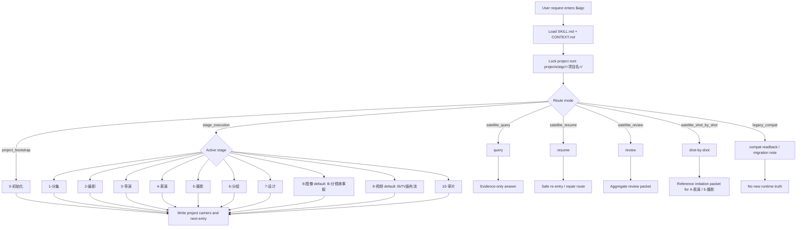

# aigc

`aigc` 是当前仓库 AIGC 影视创作工作流的根入口。它只拥有项目根、阶段路由、卫星技能边界、治理载体和最终回接裁决；具体创作正文、提示词、设计稿、图像或视频生成由命中的阶段/叶子技能负责。

## Context Loading Contract

- 每次调用 `$aigc` 时，必须同时加载同目录 `CONTEXT.md`。
- 根入口不拥有本级 `types/` 类型包；类型判定必须在路由到目标阶段、叶子或卫星后，按目标技能的 `Reference Loading Guide` 加载其同目录 `types/` 中命中的类型包。
- 若任务绑定 `projects/aigc/<项目名>/`，必须加载项目根 `MEMORY.md`；若存在项目根 `CONTEXT/`，只加载与本轮任务直接相关的文件。
- 项目 runtime 唯一真源固定为 `projects/aigc/<项目名>/`；`.codex/state/tasks/` 只作为可选治理镜像。
- 项目状态载体固定为 `projects/aigc/<项目名>/STATE.json`；结构化治理状态固定为 `projects/aigc/<项目名>/governance-state.yaml`。
- 冲突优先级：用户显式请求 > 根 `AGENTS.md` / meta 规则 > 本 `SKILL.md` > 阶段或卫星 `SKILL.md` > 分区规范 > `agents/openai.yaml` > 项目 `MEMORY.md` > 项目 `CONTEXT/` > 本 `CONTEXT.md`。

## Multi-Subskill Continuous Workflow

当 `$aigc` 主技能包被整体调用时，视为用户已授权根入口按本文件声明的阶段和子技能包连续完成整个技能组任务；在满足必要输入、显式选择和安全门后，不再为“是否继续下一步”额外确认。

- 数字序号阶段包（`0-初始化` -> `1-分集` -> `2-编剧` -> `3-导演` -> `4-表演` -> `5-摄影` -> `6-分组` -> `7-设计` -> `8-图像` -> `9-视频` -> `10-审片`）默认按数字升序串行推进，前一阶段 canonical 产物自动作为后一阶段输入。
- 无序号同级子技能包默认全选并发执行，由所属父级汇总、裁决和写回唯一 canonical 输出；例如 `7-设计` 整体调用时由其父级并发调度 `场景`、`角色`、`道具`。
- 英文序号子技能包或路线（如 `A-`、`B-`、`C-`、`D-`）默认按用户意图、父级路由或输入类型单选分流；只有用户明确要求对比、并跑或批量多路线时才多选。
- 卫星技能 `query/`、`resume/`、`review/` 不默认纳入主链串行推进；只有用户请求查询、恢复、审查或阶段门禁需要时才作为旁路回接。
- 连续调度不得绕过阻断门：缺少必需输入、初始化 `auto/custom` 未锁定、破坏性操作未授权、阶段/叶子缺失、路线歧义会造成错误 canonical 写回时，必须先停下并给出最小澄清或阻断报告。
- 每个被调度的阶段或叶子仍必须加载自身 `SKILL.md + CONTEXT.md`；脚本只能承担机械辅助，不得替代 LLM 主创判断或根入口最终裁决。

## Input Contract

Accepted input:

- AIGC 影视、电影、视频、短剧项目初始化、阶段推进、阶段切换、续跑、查询、审查或 legacy 兼容读取。
- 指向 `projects/aigc/<项目名>/` 的项目路径、项目名、阶段产物、治理状态或已有生成资产。
- 明确命中某个阶段、叶子路线或卫星技能的自然语言请求。

Required input:

- 可判断的媒介归属：影视 / 视频 / AIGC 短剧项目进入本根入口；小说进入 `projects/story/<项目名>/` 对应 story 技能；漫画进入 `projects/comic/<项目名>/` 对应 comic 技能。
- 初始化任务必须能锁定项目名，并按 `0-初始化` 的 `auto/custom` 合同补齐必要 north-star 输入。
- 阶段执行、查询、恢复或审查任务必须能定位项目根，或由用户提供足够上下文让根入口先路由到唯一阶段/卫星。

Reject or clarify when:

- 任务媒介是小说、漫画或非 AIGC 影视工作流，且用户未明确要求使用本技能。
- 用户要求根入口直接主创阶段正文、设计稿、prompt、图像或视频，而不是路由到 owning 阶段/叶子。
- 缺少项目名、阶段目标或路线选择，且自动推断会造成错误 canonical 写回、覆盖既有产物或误入 legacy 路径。

## Mode Selection

| mode                       | trigger                                 | route                                         |
| -------------------------- | --------------------------------------- | --------------------------------------------- |
| `project_bootstrap`      | 初始化影片、电影、影视、视频项目        | `.agents/skills/aigc/0-初始化/SKILL.md`     |
| `stage_execution`        | 明确命中主阶段或下一阶段推进            | 对应阶段 `SKILL.md`                         |
| `satellite_query`        | 查询项目事实、阶段产物、治理工件        | `.agents/skills/aigc/query/SKILL.md`        |
| `satellite_resume`       | 中断恢复、治理缺口补齐、安全续跑        | `.agents/skills/aigc/resume/SKILL.md`       |
| `satellite_review`       | checkpoint / stage / package 审计聚合   | `.agents/skills/aigc/review/SKILL.md`       |
| `satellite_shot_by_shot` | 参考影片/视频拉片、逐镜分析、临摹参照包 | `.agents/skills/aigc/shot-by-shot/SKILL.md` |
| `legacy_compat`          | 明确点名 legacy `5-Image` 或旧产物    | 只做搁浅兼容回读或迁移说明                    |

## Default Leaf Routing Contract

除非用户显式指定叶子路线、点名目标技能、要求多路线对比，或已有产物 repair / query 必须回到原所属叶子，根入口对阶段内分流采用以下默认：

| stage      | default leaf                                         | applies when                                                                                       | explicit override examples                                                                                     |
| ---------- | ---------------------------------------------------- | -------------------------------------------------------------------------------------------------- | -------------------------------------------------------------------------------------------------------------- |
| `8-图像` | `.agents/skills/aigc/8-图像/B-分镜故事板/SKILL.md` | 用户只说进入 `8-图像`、生成图像阶段、下一步生图，且未明确指定单镜分镜画面                        | 用户点名 `A-分镜画面`、四段式 `分镜ID`、单镜图、生图 prompt                                                |
| `9-视频` | `.agents/skills/aigc/9-视频/libTV画布流/SKILL.md`  | 用户只说进入 `9-视频`、生成视频阶段、下一步生视频、LibTV 画布流，且未明确指定旧 A/B/C/D 任一路线 | 用户点名 `A-分镜画面参照`、`B-分镜故事板参照`、`C-主体参照`、`D-主板混合参照` 旧路线，或要求多路线对比 |

该默认只负责根入口初始路由；进入 `8-图像` 或 `9-视频` 后，仍必须加载目标阶段和目标叶子的 `SKILL.md + CONTEXT.md`，并遵循叶子自身输入、输出和审查合同。

## Visual Maps

## Stage Status Table

| stage        | skill path                        | project runtime                      | statuså                                                                     |
| ------------ | --------------------------------- | ------------------------------------ | ---------------------------------------------------------------------------- |
| `0-初始化` | `.agents/skills/aigc/0-初始化/` | `projects/aigc/<项目名>/0-初始化/` | active                                                                       |
| `1-分集`   | `.agents/skills/aigc/1-分集/`   | `projects/aigc/<项目名>/1-分集/`   | active                                                                       |
| `2-编剧`   | `.agents/skills/aigc/2-编剧/`   | `projects/aigc/<项目名>/2-编剧/`   | active                                                                       |
| `3-导演`   | `.agents/skills/aigc/3-导演/`   | `projects/aigc/<项目名>/3-导演/`   | active                                                                       |
| `4-表演`   | `.agents/skills/aigc/4-表演/`   | `projects/aigc/<项目名>/4-表演/`   | active                                                                       |
| `5-摄影`   | `.agents/skills/aigc/5-摄影/`   | `projects/aigc/<项目名>/5-摄影/`   | active                                                                       |
| `6-分组`   | `.agents/skills/aigc/6-分组/`   | `projects/aigc/<项目名>/6-分组/`   | active                                                                       |
| `7-设计`   | `.agents/skills/aigc/7-设计/`   | `projects/aigc/<项目名>/7-设计/`   | active                                                                       |
| `8-图像`   | `.agents/skills/aigc/8-图像/`   | `projects/aigc/<项目名>/8-图像/`   | active；默认叶子 `B-分镜故事板`                                            |
| `9-视频`   | `.agents/skills/aigc/9-视频/`   | `projects/aigc/<项目名>/9-视频/`   | active；默认叶子 `libTV画布流`；旧 A/B/C/D 位于 `9-视频-backup` 兼容路径 |
| `10-审片`  | `.agents/skills/aigc/10-审片/`  | `projects/aigc/<项目名>/10-审片/`  | active                                                                       |

Supporting project roots: `projects/aigc/<项目名>/源/`, `projects/aigc/<项目名>/CONTEXT/`, `projects/aigc/<项目名>/MEMORY.md`, `projects/aigc/<项目名>/CHANGELOG.md`, `projects/aigc/<项目名>/STATE.json`, `projects/aigc/<项目名>/governance-state.yaml`.

## Reference Loading Guide

| need                                        | load                                                                                                                        |
| ------------------------------------------- | --------------------------------------------------------------------------------------------------------------------------- |
| project runtime and bootstrap compatibility | `_shared/project-runtime-layout.md`                                                                                       |
| natural-language routing and registry truth | `.codex/registry/skills.yaml`, `.codex/registry/routes.yaml`                                                            |
| initialization                              | `0-初始化/SKILL.md + CONTEXT.md`                                                                                          |
| design domain routing                       | `7-设计/SKILL.md + CONTEXT.md`                                                                                            |
| current image stage                         | `8-图像/SKILL.md + CONTEXT.md`；未显式指定叶子时默认继续加载 `8-图像/B-分镜故事板/SKILL.md + CONTEXT.md`                |
| current video stage                         | `9-视频/SKILL.md + CONTEXT.md`；未显式指定旧叶子时默认继续加载 `9-视频/libTV画布流/SKILL.md + CONTEXT.md`               |
| current footage review stage                | `10-审片/SKILL.md + CONTEXT.md`；对照 `9-视频` 素材和 `6-分组` 真源，必要时回写分镜组修复                             |
| query / resume / review side channels       | `query/`, `resume/`, `review/` skill pairs                                                                            |
| reference imitation / shot-by-shot analysis | `shot-by-shot/SKILL.md + CONTEXT.md`；按需再加载 `4-表演` 与 `5-摄影` 阶段合同，输出临摹参照包而非阶段 canonical 主稿 |
| type package selection                      | 根入口只判定 route；目标阶段、叶子或卫星自行加载其同目录 `types/` 命中包                                                  |

## Execution Contract

1. 锁定任务是否是初始化、阶段执行、查询、恢复、审查或 legacy 兼容读取。
2. 若绑定项目，确认 `projects/aigc/<项目名>/`、`STATE.json`、`MEMORY.md` 和必要的治理状态。
3. 选择唯一主入口；若主入口为 `8-图像` 且用户未显式指定叶子，默认进入 `8-图像/B-分镜故事板`；若主入口为 `9-视频` 且用户未显式指定旧叶子，默认进入 `9-视频/libTV画布流`；若主入口为 `10-审片`，必须定位实际视频素材和对应 `6-分组` 分镜组。
4. 用户显式指定、点名已有产物 query / repair、或明确要求多路线对比时，必须尊重用户路线或原所属叶子，不得被默认叶子覆盖。
5. 阶段技能完成后，根入口只汇流下一入口、治理证据与失败回接，不改写阶段业务主稿。
6. 若遇到 legacy `5-Image` 或 `6-Video`，只允许兼容读取或迁移说明，不得把旧路径写成新 runtime。

## Field Master

| field_id               | owner              | canonical file                             | must contain                                           | fail code             |
| ---------------------- | ------------------ | ------------------------------------------ | ------------------------------------------------------ | --------------------- |
| `FIELD-AIGC-ROOT-01` | root route         | this `SKILL.md`                          | project root, mode, selected entry                     | `FAIL-AIGC-ROUTE`   |
| `FIELD-AIGC-ROOT-02` | runtime            | `_shared/project-runtime-layout.md`      | canonical project roots and forbidden legacy roots     | `FAIL-AIGC-RUNTIME` |
| `FIELD-AIGC-ROOT-03` | governance         | `STATE.json` / `governance-state.yaml` | state carrier and review/resume bridge                 | `FAIL-AIGC-GOV`     |
| `FIELD-AIGC-ROOT-04` | satellite boundary | `query/resume/review`                    | side-channel ownership and no business-truth overwrite | `FAIL-AIGC-SAT`     |

## Thought Pass Map

| pass_id          | focus field            | core question                      | action                               | evidence            |
| ---------------- | ---------------------- | ---------------------------------- | ------------------------------------ | ------------------- |
| `PASS-AIGC-01` | `FIELD-AIGC-ROOT-01` | 用户诉求应进入哪一个入口           | 判型并锁唯一 route                   | route note          |
| `PASS-AIGC-02` | `FIELD-AIGC-ROOT-02` | 项目 runtime 是否落在 canonical 根 | 检查共享 layout 与项目文件           | runtime evidence    |
| `PASS-AIGC-03` | `FIELD-AIGC-ROOT-03` | 是否需要治理桥接                   | 检查 state / review / resume carrier | governance evidence |
| `PASS-AIGC-04` | `FIELD-AIGC-ROOT-04` | 是否误用卫星改写业务真源           | 校验卫星边界                         | boundary note       |

## Pass Table

| pass_id          | pass standard                                         | fail code             | rework entry             |
| ---------------- | ----------------------------------------------------- | --------------------- | ------------------------ |
| `PASS-AIGC-01` | route 唯一且有明确技能入口                            | `FAIL-AIGC-ROUTE`   | Mode Selection           |
| `PASS-AIGC-02` | runtime 与 `_shared/project-runtime-layout.md` 对齐 | `FAIL-AIGC-RUNTIME` | shared layout            |
| `PASS-AIGC-03` | state/governance carrier 不分叉                       | `FAIL-AIGC-GOV`     | `resume` or `review` |
| `PASS-AIGC-04` | 卫星只写辅助 truth、repair route 或证据               | `FAIL-AIGC-SAT`     | satellite `SKILL.md`   |

## Root-Cause Execution Contract (Mandatory)

失败时沿链路上溯：

`Symptom -> Direct Cause -> Root Route / Runtime Owner -> Stage or Satellite Contract -> AGENTS.md`

优先修源层：registry/routes、`_shared/project-runtime-layout.md`、根 `SKILL.md`、命中阶段 `SKILL.md`。若发现可复用经验，先沉淀到本目录 `CONTEXT.md`，稳定后再晋升到根合同或共享规范。

## Output Contract

- Required output: 唯一阶段/卫星入口、项目 runtime 证据、下一步或阻断原因。
- Output format: 面向用户的简短路由结论；需要治理落盘时写对应阶段或卫星定义的 carrier。
- Output path: 根入口不直接写阶段业务主稿；项目级状态只写 `projects/aigc/<项目名>/STATE.json`、`governance-state.yaml` 或阶段定义的 `validation-report.md`。
- Completion gate: route 唯一，runtime 不漂移，legacy 状态明确，未命中单元不参与聚合。
