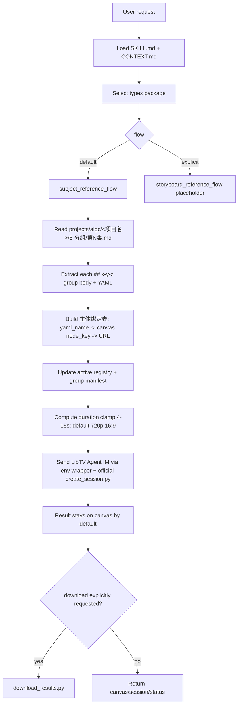

# AIGC 8-视频 / libTV 画布流

`libTV画布流` 是 AIGC 视频阶段面向 LibTV Agent IM 与画布的执行型技能包。它在 `.agents/skills/cli/libTV` 官方 CLI 技能包基础上升级为 Skill 2.0 分区结构：保留官方会话、上传、查询、切换项目和下载脚本的基本调用逻辑，同时为 AIGC 分镜组视频生成增加类型路由、主体绑定表、画布资产命名、时长投影、队列记录和交付门禁。

默认路线是 `subject_reference_flow` 主体参照流；只有用户显式指定“分镜参照流 / storyboard reference flow”时才进入 `storyboard_reference_flow`。本技能不改写 `.agents/skills/cli/libTV` 官方技能包。

## Context Loading Contract

- 每次调用本技能时，必须同时加载同目录 `CONTEXT.md`。
- 每次调用本技能时，必须同时识别并加载同目录 `types/` 中选中的类型包（单选或多选）。
- 若任务绑定 `projects/aigc/<项目名>/`，必须先加载项目根 `MEMORY.md`，再加载项目根 `CONTEXT/` 中与视频阶段、主体资产、画布、音频或生成限制相关的上下文。
- 调用 LibTV 前必须加载 `.agents/skills/cli/libTV/SKILL.md + CONTEXT.md`，并优先遵守其官方脚本路径、鉴权、会话、上传、查询和下载命令逻辑。
- `LIBTV_ACCESS_KEY` 默认配置在仓库根 `.env` 中；实际调用官方脚本前优先使用本技能 wrapper `scripts/run_libtv_with_env.py` 自动加载 `.env` 后转调用官方脚本，不要求用户手动 export，除非 `.env` 缺失或无有效密钥。
- 本技能只在 AIGC 画布流层改变默认策略：生成物默认先沉淀在 LibTV 画布上；自动下载默认关闭，只有用户显式要求下载、归档、审片或本轮门禁要求本地文件时才调用 `download_results.py`。
- 冲突优先级：用户显式请求 > 根 `AGENTS.md` / meta 规则 > `.agents/skills/aigc` 阶段规则 > 本 `SKILL.md` > `types/` 选中类型包 > `references/` / `steps/` / `review/` / `templates/` > `.agents/skills/cli/libTV/SKILL.md` > `agents/openai.yaml` > 项目 `MEMORY.md` > 项目 `CONTEXT/` > 本 `CONTEXT.md`。

## Multi-Subskill Continuous Workflow

当本主技能包被整体调用时，视为用户已授权按本级声明的路线自动完成整个技能组任务；在满足必要输入、显式选择和安全门后，不再为“是否继续下一步”额外确认。

- 无序号同级子技能包默认全选并发执行，由本技能汇总、裁决和写回唯一 canonical 输出。
- 数字序号子技能包或节点默认按数字升序串行执行，前一节点产物自动作为后一节点输入。
- 英文序号子技能包或路线默认按用户意图、父级路由或输入类型单选分流；只有用户明确要求对比、并跑或批量多路线时才多选。
- 卫星技能、query/resume/review 和旁路 reviewer 默认不纳入主链，除非用户请求、阶段门禁或父级合同显式需要。
- 连续调度不得绕过阻断门：缺少项目根、`5-分组/第N集.md`、分镜组正文、主体绑定表、规范命名画布素材、`LIBTV_ACCESS_KEY` 或 LibTV 会话状态会造成错误提交时，必须先阻断并说明最小修复项。
- 每个被调度的子技能仍必须加载自身 `SKILL.md + CONTEXT.md`；脚本只能承担机械辅助，不得替代 LLM 对分镜组、主体绑定、路线选择或交付裁决的判断。

## Input Contract

Accepted input:

- 使用 LibTV / liblib / 画布生成 AIGC 组级视频、视频分镜、视频任务队列或画布素材节点。
- 从 `projects/aigc/<项目名>/5-分组/第N集.md` 读取分镜组，按每个 `## x-y-z` 分镜组直接提交 LibTV Agent IM。
- 使用画布上已预上传并规范命名的角色、场景、道具主体参照图，生成视频任务。
- 用户显式指定分镜参照流时，为未来故事板或分镜图参照路线保留占位。
- 查询、继续、下载、审查或修复已有 LibTV 画布流任务。

Required input:

- 可定位的 `projects/aigc/<项目名>/` 项目根。
- 主体参照流必须有 `projects/aigc/<项目名>/5-分组/第N集.md`，并能解析一个或多个 `## x-y-z` 分镜组正文和 fenced YAML。
- 主体参照流默认假设 LibTV 画布已经存在规范命名主体参照图；主体名称应与组底 YAML 中 `角色 / 场景 / 道具` 的名称一致，或能通过显式主体绑定表唯一对应到 `node_key + URL`。
- 实时调用 LibTV 必须有 `LIBTV_ACCESS_KEY`；若只生成计划或 prompt，可在 `prompt_only` 模式下不调用远端。

Optional input:

- `flow`: 默认 `subject_reference_flow`；用户显式指定时可为 `storyboard_reference_flow`。
- `episode`: `第N集`；缺省时从用户路径或上下文推断。
- `group_ids`: 指定一个或多个三段式分镜组 ID；缺省时可处理整集所有非连接件分镜组。
- `download`: 默认 `false`；只有显式 `true` 或用户要求本地归档时下载。
- `resolution`: 默认 `720p`；`ratio`: 默认 `16:9`；除非用户显式覆盖。
- `duration`: 默认从组底 YAML 的 `时长估算` 提取并按 4-15 秒 clamp。
- `audio`: 保留用户要求；若未指定，按分镜组原文中的声音要求和 LibTV 能力写入提交文本，但不得把生成前不可验证的音频状态说成已验收。
- `allow_libtv_prompt_optimization`: 默认 `false`；只有用户显式要求 LibTV 远端 Agent 优化提示词、镜头压缩或重排时才可改为 `true`，并必须在 submit plan、queue 和 report 中记录 opt-in。

Reject or clarify when:

- `5-分组/第N集.md` 缺失、分镜组 ID 不唯一、组底 YAML 缺失到无法建立主体绑定表。
- 用户要求本技能改写 `5-分组` 剧情、镜头顺序、角色事实或动作结果；除非用户显式声明是在修复上游，否则不得回到 `4-摄影`、`3-Detail` 或更早阶段重写分镜组内容。
- 画布主体参照图未规范命名且没有提供可唯一绑定的 `角色名 -> node_key -> URL` 表。
- 用户要求脚本主创视频 prompt 正文、自动补写缺失分镜或把未知主体猜成已有图片。

## Mode Selection

| mode | trigger | route |
| --- | --- | --- |
| `subject_reference_flow` | 默认；用户提到主体参照、角色/场景/道具参照、按 `5-分组` 生成视频 | 加载 `types/subject-reference-flow.md`，执行 `steps/libtv-canvas-workflow.md` |
| `storyboard_reference_flow` | 用户显式指定“分镜参照流 / storyboard reference flow / 用分镜图参照” | 加载 `types/storyboard-reference-flow.md`；当前只输出占位阻断或计划 |
| `prompt_only` | 用户只要提交文本、主体绑定表或队列计划 | 生成计划，不调用 LibTV |
| `query_or_download` | 用户给出 sessionId、projectUuid、结果 URL 或要求下载 | 复用 `.agents/skills/cli/libTV/scripts/query_session.py` / `download_results.py`；下载仍需显式要求 |
| `repair_or_review` | 主体错绑、图片顺序漂移、画布素材命名错误、任务停滞 | 加载 `review/review-contract.md` 与相关 references 定位返工 |

## Reference Loading Guide

| 场景 | 读取文件 |
| --- | --- |
| 官方 LibTV 基本配置、脚本命令和不得改变的调用逻辑 | `references/official-libtv-base-config.md` |
| 画布资产上传、可见素材节点、节点命名修正 | `references/canvas-asset-management.md` |
| 主体参照流规则、`5-分组` 读取、主体绑定表和时长投影 | `references/subject-reference-flow.md` |
| 分镜参照流 | `references/storyboard-reference-flow.md` |
| 上游分镜组 prompt 的场景/镜头身份、镜头先行顺序、方向参照和光线结果保真 | `../../_shared/scene-shot-identity-contract.md` |
| 执行步骤、阻断门、轮询与显式下载 | `steps/libtv-canvas-workflow.md` |
| 类型包选择与 Seedance 2.0 标准 `modeType` | `types/type-map.md` |
| 质量门禁、主体绑定和 LibTV 提交审查 | `review/review-contract.md` |
| 输出模板、manifest、queue、远端 prompt 与 registry schema | `templates/output-template.md`、`templates/libtv-remote-prompt-template.md`、`templates/subject-reference-manifest.schema.json`、`templates/canvas-active-registry.schema.json`、`templates/submit-plan-template.md`、`templates/queue-record-template.md` |
| 机械脚本边界 | `scripts/README.md` |
| 可复用经验 | `knowledge-base/libtv-canvas-flow-heuristics.md` |
| 产品侧入口元数据 | `agents/openai.yaml` |

## Visual Maps

## Execution Contract

1. 加载本技能对、项目记忆和选中类型包；若执行远端调用，加载 `.agents/skills/cli/libTV/SKILL.md + CONTEXT.md`。
2. 按 `types/type-map.md` 锁定 `subject_reference_flow` 或 `storyboard_reference_flow`。未显式指定时一律使用主体参照流。
3. 主体参照流以 `projects/aigc/<项目名>/5-分组` 为主要信息来源，解析每个 `## x-y-z` 分镜组，完整提取组正文和底部 YAML；`## x-y-z~x-y-z` 组间连接件默认忽略，不进入视频 prompt、YAML 主体槽位、主体参照 manifest、LibTV job 或视频文件命名；视频 prompt 的剧情主体只使用现有组正文，不进行剧情改写。
4. 分镜组视频 prompt 主体直接采用 `5-分组` 的现有分镜组正文；LLM 只负责裁决提取范围、保真组织、缺口说明和审查，不得扩写或改写剧情事实。默认不需要 LibTV 远端 Agent 做提示词优化或镜头压缩，`allow_libtv_prompt_optimization=false`。若组正文已包含定场、场景/镜头身份、镜头先行顺序、方向参照或光线结果，必须按原顺序保留，不得摘要成“人物做了什么”的主体动作段落。
5. 从分镜组 fenced YAML 中读取 `角色 / 场景 / 道具 / 时长估算`。主体参照以组底 YAML 的 `角色 / 场景 / 道具` 为基准；不得用正文泛词、子串或猜测名自动扩展主体列表。`create_generation_task.params.prompt` 底部必须完整保留原 fenced YAML 内容；对已绑定主体，在分镜正文第一次出现处和 YAML 对应主体名后插入 LibTV 画布 `@` 资产引用 / node mention（标准名称待官方确认）。`YAML主体清单`、`主体绑定表`、missing/excluded 诊断和执行参数只写入外层 handoff message、manifest、submit plan、queue record 或 report，不得进入 `params.prompt`。
6. 同一 LibTV `projectUuid/projectID` 画布内，已经按同一 YAML 主体名成功上传并登记为 active 的主体图 URL 可直接复用；active 登记真源固定为 `projects/aigc/<项目名>/8-视频/libTV画布流/libtv-canvas-active-registry.json`，schema 见 `templates/canvas-active-registry.schema.json`。只有缺少 active URL、同名登记歧义、图片被调整/更换或用户明确要求“替换/更新/重新上传”时，才检查 `projects/aigc/<项目名>/6-设计/角色/3-生成`、`6-设计/场景/3-生成`、`6-设计/道具/3-生成` 中的对应主体图片并上传。
7. 需要新上传时多视图优先，没有多视图就主图，都没有就空着并从参照图片数组中移除；名称命中多个候选时先把候选图发送到当前窗口作为可加载上下文自动识图匹配，仍不能唯一确认才列入 `ambiguous`。上传或手工绑定成功后必须更新 active registry；替换/更新时旧记录标记为 `active=false/status=replaced`，新记录写入 `active=true/status=active`。本地图片路径、候选集合和消歧证据只写入 manifest / submit plan，不写进 prompt 正文。
8. 每个非连接件分镜组必须形成 manifest、submit plan、queue record 和执行报告证据链。路径固定在 `projects/aigc/<项目名>/8-视频/libTV画布流/第N集/`，文件名分别为 `<分镜组ID>-subject-reference-manifest.json`、`<分镜组ID>-libtv-submit-plan.json`、`<分镜组ID>-queue-record.json`、`<分镜组ID>-执行报告.md`；对应模板和 schema 在 `templates/`。
9. 提交 LibTV 前必须执行参照预算裁决：单组进入 `images[]` / `mixedList` 的图片最多 9 张；同一 YAML 主体默认只保留一张参照图，除非用户显式要求多视图或多版本对比；超过时角色和场景优先，先排除道具，其次排除重复、不必要或可由源文本保留的次要主体，并在 manifest / submit plan 记录 `excluded_from_libtv_images` 或 `excluded_due_to_budget`；无法合理压缩到 9 张以内时状态为 `needs_rework / reference_budget_unresolved`，不得提交。预算裁决后，`subject_bindings`、`source_node_keys`、`source_node_url_mapping`、`imageList/mixedList` 必须按 canonical reference order 排序：YAML `角色` 原顺序 -> YAML `场景` 原顺序 -> YAML `道具` 原顺序；不得按上传顺序、画布创建时间或本地文件扫描顺序传入。
10. 同步提取组底 YAML 的 `时长估算`，形成 `duration_estimate_seconds`；若缺失则按组内 `分镜明细` 秒数求和估算，区间时长优先取上限，仍无法确定才回退 15 秒并记录 `duration_source=fallback_default`。生成时长按组底 YAML `时长估算` 投影：估算值在 4-15 秒之间时完全等于预估时长；估算值大于等于 15 秒时取 15 秒；估算值小于等于 4 秒时取 4 秒。
11. 默认视频规格为 `720p`、`16:9`；用户显式指定其他分辨率或比例时原样传入 LibTV Agent IM。
12. LibTV 远端 handoff message 与视频节点 `params.prompt` 必须分层组装：
    - 外层 handoff message 可以包含：`把全部工作流和结果都放在画布上`、生成模式、`modeType=mixed2video`、`duration / resolution / ratio / download=false`、`allow_libtv_prompt_optimization=false`、禁止优化锁定句、参考图 `yaml_name / category / node_key / URL` 绑定表，以及“不要按图片顺序匹配”的工具调用要求。
    - `create_generation_task.params.prompt` 只能包含干净创作提示词：`## x-y-z` 下的分镜组正文 + 底部完整 fenced YAML 内容。它不得包含执行锁、生成参数、`YAML主体清单`、`主体绑定表`、参考图清单、missing/excluded 诊断、文件路径、manifest/queue 字段或审计说明。
    - 底部 YAML 必须完整保留原字段和值，包括 `字数统计`、`时长估算`、`角色`、`场景`、`道具` 等；不得只摘要成主体清单。
    - 每个已绑定 YAML 主体在分镜组正文第一次出现时，必须在主体名后插入 LibTV 画布 `@` 资产引用 / node mention；底部 YAML 中对应主体名后也必须插入同一 `@` 引用。`@` 引用必须绑定外层参考绑定表中对应主体的 `canvas_node_name / node_key / URL`，不得伪造成普通文本解释、URL 注释、`{{Portrait N}}`、`〔主体参照: ...〕` 或手写图片编号。
    - 外层参考绑定表和实际工具入参必须声明并遵守 `canonical_reference_order`：先 YAML `角色` 列表原顺序，再 YAML `场景` 列表原顺序，再 YAML `道具` 列表原顺序；被预算排除的主体只从数组中移除，不改变其余主体相对顺序。
    - 当前 CLI 纯文本消息无法单独证明 UI 级 `@` 引用已插入，必须通过查询结果、后端工具参数或画布节点引用回显验证；无法验证时记录 `at_asset_mention_unverified`，不得报告为完全验证通过。
    - 不得改变原文措辞、句序、镜头顺序、台词、动作结果或风格描述；不额外增加 `StyleBible`、`StyleBible_Summary`、角色泛化说明或 `其中，...` 尾部复述。
    - 不得把分镜组正文重排为主体动作先行摘要；上游若已用“定场/镜头/构图/方向/光线结果 -> 人物动作 -> 表演微动态”的执行顺序，`params.prompt` 必须保留该顺序。
13. 主体参照流的视频生成模式必须显式锁定为“全能参考 / 多图主体参考生成视频”，且官方标准 `modeType` 必须显式传入 `mixed2video`。只要本组 `libtv_images_count > 0`，外层 handoff message 和实际工具入参必须逐项写入真实参考图 `URL + node_key + yaml_name + 用途`，并请求 LibTV 按这些参考图生成视频；不得提交或诱导 `text2video` / 纯文生视频。`allow_libtv_prompt_optimization=false` 必须同时以字段和外层自然语言锁定句出现，只表示不授权远端改写 `params.prompt`，不表示取消参考图。
14. 禁止把执行诊断、失败原因、泛化替代说明或负面占位句写进 `create_generation_task.params.prompt`。包括但不限于：`本轮不提交任何参考图 URL`、`没有参考图`、`改为纯文生视频`、`参考图审核失败`、`角色与道具按原文生成`、`令狐冲为男性武侠人物`、`missing_reference_image`、`excluded_due_to_budget`。这些内容只能写入 manifest、submit plan、queue record 或执行报告；若主体缺图，应在证据工件标记 missing/blocked，不得污染视频节点 prompt。
15. 若参考图上传成功但 LibTV/Seedance 在预处理或审核阶段拒绝任一关键角色、场景或道具参考图，不得静默降级为无参考图纯文生视频；状态应为 `needs_rework / reference_asset_review_failed`，并记录被拒素材、URL、错误和最小修复项。只有用户在当前轮显式授权“无参考图继续 / 纯文生继续 / 忽略参考图”时，才可提交 text2video fallback，且 fallback 说明仍不得进入创作 prompt。
16. 用户或上游工件指定 `modeType` 时，必须先按 `types/type-map.md` 归一为 Seedance 2.0 标准称谓：`text2video`、`singleImage2video`、`frames2video`、`image2video`、`audio2video` 或 `mixed2video`；submit plan、queue record、manifest、远端 prompt 和实际工具入参必须一致。无法唯一归一时阻断，不得提交。
17. 官方调用逻辑不在本技能中重写：创建/追加会话、查询、切换项目、上传和显式下载仍使用 `.agents/skills/cli/libTV/scripts/` 官方脚本；本技能 wrapper `scripts/run_libtv_with_env.py` 只负责加载仓库根 `.env` 并转调用官方脚本。
18. 自动下载默认关闭。生成完成的最低交付是 LibTV 画布上的结果节点、sessionId/projectUuid/projectUrl、queue record、manifest 和可续查状态；只有用户显式要求下载、归档、审片或报告需本地文件时，才下载到项目目录。
19. 分镜参照流当前为空白占位：不得伪造执行细则。若用户显式调用该流，返回 `not_implemented_placeholder`，说明待补充的最小输入和预期 owner。
20. 交付前执行 `review/review-contract.md`：检查路线选择、主体绑定表、标准 `modeType`、主体来源、active registry、manifest/queue 证据链、全能参考模式、提示词结构去重、YAML 主体投影、禁止纯文生静默降级、时长 clamp、默认规格、远端优化授权、官方调用逻辑、画布资产命名、下载开关和输出路径。

## Root-Cause Execution Contract

失败链路：

`Symptom -> Direct Cause -> Section Owner -> Source Contract -> AGENTS.md / skill-工作车间`

优先修复：

1. 官方调用逻辑漂移：回到 `references/official-libtv-base-config.md` 与 `.agents/skills/cli/libTV/SKILL.md`。
2. 画布素材不可见或命名错误：回到 `references/canvas-asset-management.md`。
3. 主体图和主体名称错位：回到 `references/subject-reference-flow.md` 的 `主体绑定表` 与 `review/review-contract.md`。
4. 时长错误：回到 `references/subject-reference-flow.md` 的 duration clamp 规则。
5. 自动下载被误触发：回到本文件 `Execution Contract` 和 `Output Contract` 的 download 默认关闭规则。
6. 分镜参照流被当作已实现：回到 `types/storyboard-reference-flow.md` 和 `references/storyboard-reference-flow.md` 的占位声明。

## Field Mapping

| field_id | owner | canonical evidence | must contain | fail code |
| --- | --- | --- | --- | --- |
| `FIELD-LIBTVCANVAS-01` | route lock | route note / submit plan | `subject_reference_flow` 默认或显式 `storyboard_reference_flow` | `FAIL-LIBTVCANVAS-ROUTE` |
| `FIELD-LIBTVCANVAS-02` | group source | `5-分组/第N集.md` | `## x-y-z` 原文、fenced YAML、非连接件判断 | `FAIL-LIBTVCANVAS-GROUP` |
| `FIELD-LIBTVCANVAS-03` | subject binding | `主体绑定表` | `yaml_name -> node_key -> URL -> 用途`，不依赖图片随机顺序 | `FAIL-LIBTVCANVAS-BINDING` |
| `FIELD-LIBTVCANVAS-04` | duration/spec | submit message / plan | duration clamp 4-15s，默认 `720p`、`16:9` | `FAIL-LIBTVCANVAS-SPEC` |
| `FIELD-LIBTVCANVAS-05` | official LibTV handoff | command log / session | 使用官方 CLI 脚本和官方调用语义，不改脚本逻辑 | `FAIL-LIBTVCANVAS-HANDOFF` |
| `FIELD-LIBTVCANVAS-06` | canvas-first output | result report | 生成物先沉淀画布，下载仅显式触发 | `FAIL-LIBTVCANVAS-DOWNLOAD` |
| `FIELD-LIBTVCANVAS-07` | active registry | `libtv-canvas-active-registry.json` | `projectUuid::category::yaml_name` active 记录唯一且含 `node_key/url` | `FAIL-LIBTVCANVAS-REGISTRY` |
| `FIELD-LIBTVCANVAS-08` | evidence artifacts | manifest / submit plan / queue record | opt-in、预算排除、官方脚本和状态证据可追溯 | `FAIL-LIBTVCANVAS-EVIDENCE` |
| `FIELD-LIBTVCANVAS-09` | reference generation mode | submit message / submit plan / queue record | 有可用参考图时显式为“全能参考 / 多图主体参考生成视频”，且远端 prompt 含真实 URL/node_key；不得静默 text2video fallback | `FAIL-LIBTVCANVAS-REFERENCE-MODE` |
| `FIELD-LIBTVCANVAS-10` | prompt assembly | submit message / submit plan / queried tool params | 外层 handoff message 与 `params.prompt` 分层；`params.prompt` 只含分镜组正文 + 完整 YAML，并在正文与 YAML 主体名后绑定画布 `@` 资产引用 / node mention；不含执行锁、生成参数、主体绑定表、missing/excluded 诊断、StyleBible/audio 重复或头尾泛化总结 | `FAIL-LIBTVCANVAS-PROMPT-ASSEMBLY` |
| `FIELD-LIBTVCANVAS-11` | official modeType | submit message / submit plan / queue record / LibTV params | `modeType` 显式传标准称谓；主体参照默认 `mixed2video`；指定类型时全链路一致 | `FAIL-LIBTVCANVAS-MODETYPE` |
| `FIELD-LIBTVCANVAS-12` | prompt execution identity preservation | submit plan / queried tool params | `params.prompt` 保留上游场景/镜头身份、镜头先行顺序、方向参照、光线结果和分镜句序，不压缩成主体动作摘要 | `FAIL-LIBTVCANVAS-PROMPT-IDENTITY` |

## Thought Pass Map

| pass_id | focus field | action | evidence |
| --- | --- | --- | --- |
| `PASS-LIBTVCANVAS-01` | `FIELD-LIBTVCANVAS-01` | 判定 `subject_reference_flow`、`storyboard_reference_flow`、query/download 或 repair/review | route note / selected type package |
| `PASS-LIBTVCANVAS-02` | `FIELD-LIBTVCANVAS-02` | 读取并锁定 `5-分组/第N集.md` 的目标分镜组正文与完整 YAML | group extraction evidence |
| `PASS-LIBTVCANVAS-03` | `FIELD-LIBTVCANVAS-03` | 建立主体绑定表，证明 `yaml_name -> node_key -> URL -> 用途` 不依赖图片顺序 | manifest / submit plan |
| `PASS-LIBTVCANVAS-04` | `FIELD-LIBTVCANVAS-04` | 从 YAML 或分镜明细投影 duration，并确认默认或用户指定规格 | submit plan / queue record |
| `PASS-LIBTVCANVAS-05` | `FIELD-LIBTVCANVAS-05` | 使用 wrapper 转官方 LibTV CLI，不复制或改写官方脚本逻辑 | command evidence / session evidence |
| `PASS-LIBTVCANVAS-06` | `FIELD-LIBTVCANVAS-06` | 确认画布优先交付，只有显式要求才下载本地文件 | result report |
| `PASS-LIBTVCANVAS-07` | `FIELD-LIBTVCANVAS-07` | 更新或复用 active registry，避免同主体重复上传或错绑 | active registry |
| `PASS-LIBTVCANVAS-08` | `FIELD-LIBTVCANVAS-08` | 生成 manifest、submit plan、queue record 和执行报告证据链 | evidence artifact paths |
| `PASS-LIBTVCANVAS-09` | `FIELD-LIBTVCANVAS-09` | 有参考图时锁定全能参考 / `mixed2video`，禁止静默纯文生降级 | submit message / LibTV params |
| `PASS-LIBTVCANVAS-10` | `FIELD-LIBTVCANVAS-10` | 分离 handoff message 与 `params.prompt`，保持 prompt 只含分镜正文、完整 YAML 和主体 `@` 引用 | queried params / review report |
| `PASS-LIBTVCANVAS-11` | `FIELD-LIBTVCANVAS-11` | 校验 `modeType` 在 manifest、submit plan、queue、远端 prompt 和实际工具入参中一致 | type-map normalization evidence |
| `PASS-LIBTVCANVAS-12` | `FIELD-LIBTVCANVAS-12` | 检查远端 `params.prompt` 是否保留上游 scene/shot identity 与镜头先行执行顺序，未被改成动作摘要 | queried params / review report |

## Pass Table

| pass_id | pass standard | fail code | rework entry |
| --- | --- | --- | --- |
| `PASS-LIBTVCANVAS-01` | 路线唯一；默认主体参照流，分镜参照流只在显式指定时进入占位 | `FAIL-LIBTVCANVAS-ROUTE` | Mode Selection / `types/type-map.md` |
| `PASS-LIBTVCANVAS-02` | 可回指目标分镜组原文和完整 YAML；连接件默认跳过 | `FAIL-LIBTVCANVAS-GROUP` | Execution Contract |
| `PASS-LIBTVCANVAS-03` | 主体绑定表含 `yaml_name`、`node_key`、URL 和用途，且不依赖 `Image N` | `FAIL-LIBTVCANVAS-BINDING` | `references/subject-reference-flow.md` |
| `PASS-LIBTVCANVAS-04` | duration clamp 4-15 秒；规格默认为 720p、16:9，除非用户覆盖 | `FAIL-LIBTVCANVAS-SPEC` | Execution Contract |
| `PASS-LIBTVCANVAS-05` | 远端调用通过本技能 wrapper 转官方 CLI，官方脚本仍是真源 | `FAIL-LIBTVCANVAS-HANDOFF` | `references/official-libtv-base-config.md` |
| `PASS-LIBTVCANVAS-06` | 结果默认留在 LibTV 画布；下载仅在显式要求或审片门禁需要时发生 | `FAIL-LIBTVCANVAS-DOWNLOAD` | Output Contract |
| `PASS-LIBTVCANVAS-07` | active registry 对同一 `projectUuid::category::yaml_name` 只有一个 active 记录 | `FAIL-LIBTVCANVAS-REGISTRY` | `references/canvas-asset-management.md` |
| `PASS-LIBTVCANVAS-08` | 每个非连接件分镜组有 manifest、submit plan、queue record 和执行报告 | `FAIL-LIBTVCANVAS-EVIDENCE` | templates / review contract |
| `PASS-LIBTVCANVAS-09` | 有可用参考图时显式 `mixed2video`，不得无授权 text2video fallback | `FAIL-LIBTVCANVAS-REFERENCE-MODE` | `types/type-map.md` |
| `PASS-LIBTVCANVAS-10` | `params.prompt` 不含执行锁、参数、绑定表、诊断或失败说明 | `FAIL-LIBTVCANVAS-PROMPT-ASSEMBLY` | review contract |
| `PASS-LIBTVCANVAS-11` | `modeType` 使用标准称谓且全链路一致 | `FAIL-LIBTVCANVAS-MODETYPE` | `types/type-map.md` |
| `PASS-LIBTVCANVAS-12` | 远端 prompt 未重排上游镜头身份、分镜句序、方向参照和光线结果；未改写成主体动作摘要 | `FAIL-LIBTVCANVAS-PROMPT-IDENTITY` | `../../_shared/scene-shot-identity-contract.md` / Execution Contract |

## Output Contract

- Required output: LibTV 画布流提交状态、sessionId/projectUuid/projectUrl、主体绑定表使用状态、active registry 更新状态、每个分镜组的 manifest/submit plan/queue record 路径、duration/spec 投影、结果是否已在画布上生成；显式下载时还需本地文件路径。
- Output format: 简短中文执行报告；必要时附 JSON/YAML 提交计划，但不粘贴密钥或冗长原始 API 回显。
- Output path: 默认不落本地视频生成物；证据工件写入 `projects/aigc/<项目名>/8-视频/libTV画布流/第N集/`，active registry 写入 `projects/aigc/<项目名>/8-视频/libTV画布流/libtv-canvas-active-registry.json`；显式下载时进入同集目录或用户指定目录。
- Naming convention: 单组视频默认 `<分镜组ID>.mp4`；多变体 `<分镜组ID>-a.mp4`、`<分镜组ID>-b.mp4`；证据工件为 `<分镜组ID>-subject-reference-manifest.json`、`<分镜组ID>-libtv-submit-plan.json`、`<分镜组ID>-queue-record.json`、`<分镜组ID>-执行报告.md`。
- Completion gate: 选中类型包已加载；主体参照流已从 `5-分组` 提取分镜组并建立 `主体绑定表`；active registry、manifest、submit plan 和 queue record 已建立或明确阻断原因；LibTV 消息已使用 env wrapper 转官方 CLI 提交或明确 `prompt_only/blocked`；默认未自动下载，除非用户显式要求。
