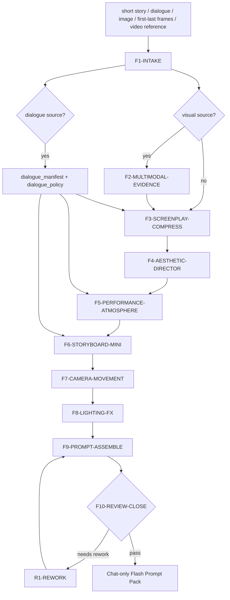

# aigc flash

`flash` 是 `.agents/skills/aigc` 的聊天窗口迷你工作流。它把少量源内容，通常是用户自然语言、台词/对白/旁白片段、一个分镜组、参照图、参照视频、首尾帧或图生视频要求，当作一小段故事源，快速串联吸收 `2-编剧 -> 3-美学 -> 4-导演 -> 5-表演 -> 6-氛围 -> 7-分镜 -> 8-摄影 -> 9-光影 -> 10-分组` 的核心判断，并在当前聊天窗口输出统一视频提示词。

本技能不保存文档、不写 `projects/aigc/<项目名>/` canonical 文件、不生成图片或视频、不替代 2-10 阶段的正式业务真源。它只输出一份可复制给视频模型、图生视频模型或首尾帧视频模型的 `Flash Prompt Pack`。

## Context Loading Contract

- 每次调用 `$aigc-flash`、`flash`、`Flash`、`闪电视频提示词`、`一小段故事转视频 prompt`、`图生视频提示词`、`首尾帧生视频提示词` 或命中本目录时，必须加载本目录 `SKILL.md + CONTEXT.md`。
- 每次调用本技能时，必须同时加载同目录 `CONTEXT.md`。
- 若任务绑定 `projects/aigc/<项目名>/`，只按需读取项目根 `MEMORY.md` 与项目 `CONTEXT/` 中和本轮短片段相关的偏好、禁区、角色/场景事实；不得因此写回项目文件。
- 若用户明确要求对齐正式阶段合同，应按需只读加载 `.agents/skills/aigc/2-编剧`、`3-美学`、`4-导演`、`5-表演`、`6-氛围`、`7-分镜`、`8-摄影`、`9-光影`、`10-分组` 的 `SKILL.md + CONTEXT.md`；默认不全量加载，避免把聊天 prompt 任务膨胀成正式项目阶段执行。
- 若用户提供参照图、首帧、尾帧、视频、截图序列或时间码描述，必须先做多模态理解分析，标注 `confirmed / inferred / insufficient`；不可见或不可读的素材不得输出强视觉结论。
- 若用户提供台词、对白、旁白、角色冒号发言、引号内原话或“必须说/原样保留/不要改”的语句，必须先建立 `dialogue_manifest` 和 `dialogue_policy`。用户给出的明确台词默认按 `hard_frozen` 保真处理，除非用户明示允许改写或压缩。
- 核心故事理解、视觉提炼、表演、分镜、摄影、光影、组级 prompt 裁决必须由 LLM 直接完成。不能用脚本做批量生成、批量插入、正则套句或映射投影。从上到下逐条理解目标对象，并只把 LLM 判断后的结果输出到聊天窗口。
- 冲突优先级：用户显式请求 > 根 `AGENTS.md` / meta 规则 > `.agents/skills/aigc/SKILL.md` > 本 `SKILL.md` > 按需只读加载的阶段 `SKILL.md` > 项目 `MEMORY.md` > 项目 `CONTEXT/` > 本 `CONTEXT.md`。

## Runtime Spine Contract

| block_id | control_block | local_landing |
| --- | --- | --- |
| `B1` | Core Task Contract | 本节、`Input Contract`、`Output Contract` |
| `B2` | Input Contract | 必需输入、可选输入、澄清/拒绝条件 |
| `B3` | Type Routing Matrix | 文本源、台词 overlay、参照图、首尾帧、参照视频、repair/review 路由 |
| `B4` | Thinking-Action Node Map | F1-F10 主节点、证据、gate 和返工 |
| `B5` | Module Loading Matrix | 授权 `CONTEXT.md`、阶段合同、项目上下文和多模态素材的边界 |
| `B5A` | Module Trigger Matrix | 任务信号 / fail code 到加载组合 |
| `B6` | Convergence Contract | prompt pack 汇流条件和失败条件 |
| `B7` | Review Gate Binding | Review question 到 gate / fail / rework / evidence |
| `B8` | Output Contract | 当前聊天窗口唯一输出格式 |
| `B9` | Learning / Context Writeback | 经验写回边界 |
| `B10` | Business Requirement Analysis Contract | 业务目标、对象、约束、成功标准、复杂度、拓扑适配 |
| `B11` | Quantifiable Execution Criteria Contract | 时长、镜头数、台词保真、证据量、阈值、重试和停止 |
| `B12` | Attention Concentration Protocol | 注意力锚点、漂移检测、再集中入口 |
| `B13` | Checkpoint Contract | 高影响动作、语义定稿、验证失败和回归检查点 |
| `B14` | Evaluation Prompt Contract | `test-prompts.json` 典型任务资产 |

## Core Task Contract

Applies when:

- 用户给出一小段故事、台词/对白/旁白片段、分镜组、自然语言场景、画面想法、短视频脚本、广告片段、角色动作或 11.5 秒左右的视频需求，要求输出视频提示词。
- 用户提供参照图、首帧、尾帧、视频、截图序列或时间码描述，要求图生视频、首尾帧生视频、参考视频转 prompt、镜头运动提示词或统一 prompt。
- 用户要求“不要保存文档，只在聊天里给我 prompt / 提示词 / 视频生成提示”。

Core task:

- 把输入视为一个短分镜组，默认目标时长 `11.5秒`；用户指定时长优先，允许 `6-15秒` 的短视频范围。
- 压缩串联 2-10 阶段判断：
  1. `2-编剧`：把故事源转成可拍的冲突、动作、声画和尾钩；若来源含台词，先区分冻结台词、可意译台词和可新增语气词。
  2. `3-美学`：提炼画面基调、角色/场景/道具风格、分镜和摄影风格。
  3. `4-导演`：明确观看焦点、场面调度、镜头意图。
  4. `5-表演`：明确动作、微表情、反应节奏、潜台词外显和台词交付方式，不改写冻结台词文本。
  5. `6-氛围`：补声画氛围、环境压迫、物理特效、心理余韵和对白/旁白与环境声的关系。
  6. `7-分镜`：拆成 1-4 个可生成镜头段；默认 11.5 秒不超过 4 段；若有台词，把台词分配到镜头段和时值。
  7. `8-摄影`：给每段安排机位、镜头类型、运动速度和焦点行为。
  8. `9-光影`：注入光源、色温、材质反射、明暗关系和空气介质。
  9. `10-分组`：汇成一个短分镜组 prompt，处理首帧衔接、全局风格和模型可执行性。
- 针对不同输入形态输出适配策略：
  - `text_to_video`：从故事源直接生成完整视频 prompt。
  - `image_to_video`：先描述参照图可见事实，再输出保持主体/构图/光影一致的动态化 prompt。
  - `first_last_frame_to_video`：分别锁定首帧与尾帧，设计中间运动、情绪变化和连续性。
  - `reference_video_to_prompt`：先拉取可观察的运动、摄影、节奏和光影原则，再转成不复制具体表达的 prompt。
  - `mixed_reference_prompt`：文本 + 图片/视频/首尾帧混合输入时，建立 `source_priority`，避免互相污染。

Non-goals:

- 不写入 `projects/aigc/<项目名>/`、`.codex/state/`、报告、Markdown 包、prompt 文件或执行报告。
- 不执行正式 2-10 阶段落盘，不生成 `第N集.md`、`风格协议.md`、`执行报告.md` 或 `10-分组/第N集.md`。
- 不调用生图/视频 provider，不上传素材，不下载外部视频。
- 不复制参照图/视频中的受保护具体表达、人物身份、商标、文字、独特道具纹样或镜头序列。

Hard prohibitions:

- 不得把用户的自然语言扩写成空泛“电影感、高级感、氛围拉满”。
- 不得输出与输入无关的大世界设定或长篇剧本。
- 不得因默认 11.5 秒而强行压缩用户明确指定的时长。
- 不得在看不到素材时声称“画面中有……”；只能标注 `insufficient` 并基于用户文本约束输出。
- 不得把参考视频的镜头数量、顺序、构图和美术细节照搬为新 prompt。
- 不得遗漏、擅自改写、吞并或字幕化用户要求保留的台词；不得为了短视频节奏静默删除冻结台词。

## Business Requirement Analysis Contract

| field | requirement | evidence | fail_code |
| --- | --- | --- | --- |
| `business_goal` | 把短故事源或多模态参照快速转成聊天窗口统一视频提示词 | 用户请求、输入源、目标模型/时长 | `FAIL-FLASH-BUSINESS-GOAL` |
| `business_object` | 被处理对象是单个短片段、单个分镜组或一组首尾帧/参照素材，不是整集项目阶段 | source manifest、media manifest、duration target | `FAIL-FLASH-BUSINESS-OBJECT` |
| `constraint_profile` | 不保存文件；LLM 主创；默认 11.5 秒；多模态先证据后推断；参照素材只抽可迁移原则 | 本合同、用户限制、media evidence | `FAIL-FLASH-CONSTRAINT` |
| `success_criteria` | 输出 1 份可直接使用的 `Flash Prompt Pack`，含源分析、统一正向 prompt、镜头段、运动/表演/光影/氛围、台词策略、声音与生成规则、连续性、负面约束和多模态适配说明 | final prompt pack、review checklist、dialogue_manifest | `FAIL-FLASH-SUCCESS` |
| `complexity_source` | 复杂度来自 2-10 阶段压缩、台词保真与时值适配、多模态证据等级、首尾帧连续性、短时长镜头数和 provider prompt 可执行性 | Type Routing、Node Map、evidence grades、dialogue_policy | `FAIL-FLASH-COMPLEXITY` |
| `topology_fit` | 先锁输入、证据和台词冻结边界，再做故事压缩，再做美学/导演/表演/氛围，再拆镜头并分配台词，再注入摄影/光影，再汇流 prompt：1) 防止素材误读；2) 防止把 prompt 写成剧本；3) 保持 2-10 的创作顺序；4) 让图生视频/首尾帧任务有连续性证据；5) 让台词成为可审计输入真源 | Visual Maps、节点表、Prompt Pack | `FAIL-FLASH-TOPOLOGY-FIT` |

## Input Contract

Required input:

- 至少一种短片段源：自然语言故事、台词/对白/旁白、分镜组描述、图片、首帧/尾帧、视频、截图序列、时间码描述或用户对参考素材的文字说明。
- 至少一个目标输出方向：文生视频、图生视频、首尾帧生视频、参考视频转 prompt、统一 prompt、短视频提示词、模型提示词优化。

Optional input:

- 目标时长、默认 `11.5秒`；画幅、模型、语言、角色/场景/道具约束、风格禁区、镜头数量、是否保留参照图主体、是否输出英文 prompt。
- 台词保留偏好：`hard_frozen` 原样说出、`soft_preserved` 可轻微口语化、`adapted` 可压缩改写、`silent` 仅转成表演潜台词；用户未说明时，明确引号、角色冒号或“台词/对白/旁白/必须说”标记的内容默认 `hard_frozen`。
- 项目路径、项目长期偏好、参照素材名称、时间码范围、首尾帧说明、运动强度、负面提示词偏好。

Clarify or block when:

- 完全没有故事源、视觉源或可执行目标。
- 用户要求保存文档、生成视频、上传素材或写入项目 canonical 文件；应转交对应 AIGC 阶段或 provider skill，而不是由 `flash` 执行。
- 用户要求复制参考素材中的具体受保护表达。
- 多个素材互相冲突，且会影响主体身份、场景或首尾帧连续性；必须用一个最小问题锁定优先级。
- 冻结台词总量明显无法放入用户指定时长，且用户同时要求“原样保留”和“不能延长/不能删减”；必须用一个最小问题确认放宽时长、删减边界或改成旁白/画外音。

## Mode Selection

| mode | trigger | final_output |
| --- | --- | --- |
| `text_to_video_prompt` | 只有文字故事源、单分镜组、短场景或自然语言需求 | 聊天窗口 `Flash Prompt Pack` |
| `image_to_video_prompt` | 用户提供参照图、首帧或静态画面，要求图生视频 | 含 `image_evidence`、保持项、动态化策略和视频 prompt |
| `first_last_frame_prompt` | 用户提供首帧和尾帧，要求首尾帧生视频 | 含 `first_frame_lock`、`last_frame_lock`、中间运动和连续性 prompt |
| `reference_video_prompt` | 用户提供参考视频、截图序列或时间码描述 | 含 `video_evidence`、可迁移原则、禁止照搬清单和新 prompt |
| `mixed_reference_prompt` | 文本 + 图片/视频/首尾帧混合 | 含 `source_priority`、冲突解决和统一 prompt |
| `prompt_repair` | 用户要求改短、加强运动、加强光影、适配某模型、修复漂移 | 最小修改后的 prompt pack |
| `review_only` | 用户只要求检查现有 prompt | 审查结论与 fail code，不改写或只给建议 |

Dialogue overlay:

- `dialogue_overlay` 不是独立替代模式，而是叠加在上述任一模式上的强制治理层。
- 触发信号包括：`台词`、`对白`、`旁白`、`voice-over`、`VO`、角色名后冒号、引号内发言、用户要求“原样说/别改/必须说”。
- 一旦触发，必须贯穿 `F1/F3/F5/F6/F9/F10`：抽取台词、冻结/改写分级、融入动作链、设计交付表演、分配时码、在输出中声明台词边界。

## Type Routing Matrix

| input_type | signal | route_to | required_nodes | module_load | fail_code |
| --- | --- | --- | --- | --- | --- |
| `text_story` | 文本故事源或自然语言场景 | `Text Prompt Path` | `F1,F3,F4,F5,F6,F7,F8,F9,F10` | `CONTEXT.md` | `FAIL-FLASH-TYPE-TEXT` |
| `reference_image` | 单图、首帧、参照图、静态画面 | `Image-to-Video Path` | `F1,F2,F3,F4,F5,F6,F7,F8,F9,F10` | `CONTEXT.md` | `FAIL-FLASH-TYPE-IMAGE` |
| `first_last_frames` | 同时存在首帧和尾帧 | `First-Last Frame Path` | `F1,F2,F3,F4,F5,F6,F7,F8,F9,F10` | `CONTEXT.md` | `FAIL-FLASH-TYPE-FLF` |
| `reference_video` | 视频、截图序列、时间码、参考运动 | `Reference Video Path` | `F1,F2,F3,F4,F5,F6,F7,F8,F9,F10` | `CONTEXT.md`, `.agents/skills/aigc/shot-by-shot/SKILL.md` | `FAIL-FLASH-TYPE-VIDEO` |
| `mixed_reference` | 文本和多种视觉源混合 | `Mixed Source Path` | `F1,F2,F3,F4,F5,F6,F7,F8,F9,F10` | `CONTEXT.md` | `FAIL-FLASH-TYPE-MIXED` |
| `dialogue_source` | 来源或需求含台词、对白、旁白、角色冒号发言或引号原话 | `Dialogue Lock Overlay` | `F1,F3,F5,F6,F9,F10` | `CONTEXT.md` | `FAIL-FLASH-TYPE-DIALOGUE` |
| `prompt_repair` | 现有 prompt 需优化或适配 | `Repair Path` | `F1,R1,F9,F10` | `CONTEXT.md` | `FAIL-FLASH-TYPE-REPAIR` |
| `review_only` | 只审查 prompt 或素材适配性 | `Review Path` | `F1,V1,F10` | `CONTEXT.md` | `FAIL-FLASH-TYPE-REVIEW` |

## Thinking-Action Node Map

| node_id | objective | inputs | actions | evidence | route_out | gate |
| --- | --- | --- | --- | --- | --- | --- |
| `F1-INTAKE` | 锁定源、模式、时长、目标模型、台词边界和注意力锚点 | 用户请求、素材、文字源、台词/对白/旁白 | 判定 mode；默认 `duration=11.5s`；建立 `source_manifest`、`target_profile`、`business_profile`、`dialogue_manifest`、`dialogue_policy`、`attention_anchor` | 至少 1 个 source、1 个 target、1 个 duration decision；若有台词，至少 1 个 dialogue entry 和 freeze level | `F2` / `F3` / `V1` / `R1` | 无源或无目标不得继续；素材不可见须标注 insufficient；台词不得无记录进入下游 |
| `F2-MULTIMODAL-EVIDENCE` | 多模态理解与证据分级 | 图片、视频、首尾帧、截图、时间码描述 | 记录可见主体、场景、构图、光影、运动、首尾状态；所有结论标注 `confirmed/inferred/insufficient`；建立 `do_not_copy` | `media_evidence_table`、`first_last_state_map`、`rights_boundary` | `F3` / `R1` | 不得把 inferred 当 confirmed；不可见素材不输出强视觉事实 |
| `F3-SCREENPLAY-COMPRESS` | 2-编剧压缩：把源变成可拍短冲突 | source、F2、dialogue_manifest | 提炼人物、目标、阻力、动作链、声画承托、尾钩；保留用户事实；把冻结台词作为源事实嵌入动作链，不用同义句替换 | `mini_screenplay_profile`、`dialogue_integration_plan` | `F4` | 不得扩成长剧本；新增事实必须标注为 prompt adaptation；冻结台词不得改写 |
| `F4-AESTHETIC-DIRECTOR` | 3-美学 + 4-导演压缩 | F3、项目偏好 | 定义全局风格、色彩、材质、场面调度、观看焦点、镜头意图 | `style_director_profile` | `F5` | 风格必须具体到画面、空间、材质或摄影，不用空泛词 |
| `F5-PERFORMANCE-ATMOSPHERE` | 5-表演 + 6-氛围压缩 | F3-F4、dialogue_policy | 明确动作、微表情、反应节奏、潜台词、台词交付方式、环境氛围、物理特效、声音/空气/光尘 | `performance_atmosphere_profile`、`dialogue_delivery_plan` | `F6` | 表演与氛围必须服务故事动作；台词交付只能补语速、停顿、气息和情绪，不得改文本 |
| `F6-STORYBOARD-MINI` | 7-分镜压缩 | F3-F5、duration、dialogue_manifest | 拆 1-4 个镜头段；默认 11.5 秒使用 2-3 段，复杂动作最多 4 段；每段有起止秒、主体、构图、动作；把每句台词分配到镜头段或声明为画外音/旁白 | `mini_shot_plan`、`dialogue_timing_map` | `F7` | 总时长必须等于目标时长；每段可生成、连续、无跳轴；冻结台词不得无时码或被遗漏 |
| `F7-CAMERA-MOVEMENT` | 8-摄影压缩 | F6、目标模型 | 给每段安排机位、景别、镜头类型、运动速度、焦点行为、稳定性约束 | `camera_plan` | `F8` | 运镜必须与画面运动兼容；图生视频不得破坏首帧主体 |
| `F8-LIGHTING-FX` | 9-光影压缩 | F4-F7 | 注入光源、色温、明暗、材质反射、动态光、空气介质、阴影连续性 | `lighting_plan` | `F9` | 光影不改场景事实；参考图任务必须保持主光方向或说明改变理由 |
| `F9-PROMPT-ASSEMBLE` | 10-分组压缩并汇成统一提示词 | F3-F8、mode、dialogue_policy | 写 `Flash Prompt Pack`：正向 prompt、镜头段、运动/表演/氛围/光影、台词策略、首尾帧或图生视频策略、负面约束、模型注意事项 | `candidate_prompt_pack` | `F10` / `R1` | 输出必须是一个统一 prompt pack；不得写项目文件路径；有台词时必须显式列出保留/改写边界 |
| `F10-REVIEW-CLOSE` | 审查并在聊天窗口交付 | candidate、Review Gate | 执行 gate；必要时最小返工一次；输出最终聊天答复 | `review_verdict`、`final_prompt_pack` | done | `GATE-FLASH-01..11` 阻断项为 0 |
| `R1-REWORK` | 最小返工 | fail code、用户反馈 | 回到证据、台词抽取、故事压缩、镜头、摄影、光影或 prompt 组装层修复；同一 fail code 最多 2 轮 | `repair_log` | `F9` / `F10` | 不得泛化重写无关内容；台词问题优先回 `F1/F3/F6/F9` |
| `V1-REVIEW` | 只审查现有 prompt | 用户 prompt、素材可选 | 按 Review Gate Binding 输出问题、fail code、返工目标和建议 | `review_findings` | `F10` | findings 必须可执行 |

## Field Master

| field | source | output/use | owner | gate |
| --- | --- | --- | --- | --- |
| `source_manifest` | 用户文本、图片、视频、首尾帧、截图或时间码描述 | 输入类型、source priority、证据边界 | `F1-INTAKE` | `GATE-FLASH-01` |
| `duration_target` | 用户指定或默认值 | prompt 总时长与镜头段时码 | `F1-INTAKE` / `F6-STORYBOARD-MINI` | `GATE-FLASH-06` |
| `dialogue_manifest` | 用户台词、对白、旁白、引号原话、角色冒号发言 | speaker、line、source_anchor、freeze_level、language、delivery_type | `F1-INTAKE` | `GATE-FLASH-11` |
| `dialogue_policy` | 用户保留偏好、目标模型、时长约束 | `hard_frozen` / `soft_preserved` / `adapted` / `silent` 边界 | `F1-INTAKE` / `F3-SCREENPLAY-COMPRESS` | `GATE-FLASH-11` |
| `media_evidence_table` | 多模态素材或用户描述 | confirmed/inferred/insufficient 分级、保持项、变化项 | `F2-MULTIMODAL-EVIDENCE` | `GATE-FLASH-02` |
| `mini_screenplay_profile` | 故事源和 F2 证据 | 可拍冲突、动作链、声画承托、尾钩 | `F3-SCREENPLAY-COMPRESS` | `GATE-FLASH-03` |
| `style_director_profile` | F3、项目偏好、3-美学/4-导演参考 | 全局风格、观看焦点、场面调度 | `F4-AESTHETIC-DIRECTOR` | `GATE-FLASH-04` |
| `performance_atmosphere_profile` | F3-F4 | 动作、微表情、反应节奏、氛围承托 | `F5-PERFORMANCE-ATMOSPHERE` | `GATE-FLASH-05` |
| `mini_shot_plan` | F3-F5、duration | 1-4 个镜头段、时码、构图、动作 | `F6-STORYBOARD-MINI` | `GATE-FLASH-06` |
| `dialogue_timing_map` | dialogue_manifest、F5、F6 | 每句台词所在镜头段、时码、交付方式、是否可删改 | `F6-STORYBOARD-MINI` / `F9-PROMPT-ASSEMBLE` | `GATE-FLASH-11` |
| `camera_plan` | F6 | 机位、景别、镜头类型、运动、焦点 | `F7-CAMERA-MOVEMENT` | `GATE-FLASH-07` |
| `lighting_plan` | F4-F7 | 光源、色温、明暗、材质、空气介质 | `F8-LIGHTING-FX` | `GATE-FLASH-08` |
| `final_prompt_pack` | F3-F8 汇流 | 当前聊天窗口唯一 `Flash Prompt Pack` | `F9-PROMPT-ASSEMBLE` / `F10-REVIEW-CLOSE` | `GATE-FLASH-10` |

## Thought Pass Map

| pass_id | thinking_focus | action_node | pass_evidence | fail_return |
| --- | --- | --- | --- | --- |
| `PASS-FLASH-01` | 输入是否足以形成短视频 prompt，且不需要正式项目写回 | `F1-INTAKE` | `source_manifest`、`target_profile` | `F1` / `CHK-FLASH-SCOPE` |
| `PASS-FLASH-02` | 视觉素材是否被正确分级，参考素材是否去污染 | `F2-MULTIMODAL-EVIDENCE` | `media_evidence_table`、`do_not_copy` | `F2` / `R1` |
| `PASS-FLASH-03` | 故事是否压缩为 11.5 秒可拍动作链 | `F3-SCREENPLAY-COMPRESS` | `mini_screenplay_profile` | `F3` |
| `PASS-FLASH-03A` | 来源台词是否被抽取、冻结、整合并分配到镜头段 | `F1` / `F3` / `F5` / `F6` / `F9` | `dialogue_manifest`、`dialogue_policy`、`dialogue_timing_map` | `F1` / `F3` / `F6` / `F9` |
| `PASS-FLASH-04` | 美学、导演、表演、氛围是否具体可执行 | `F4` / `F5` | `style_director_profile`、`performance_atmosphere_profile` | `F4` / `F5` |
| `PASS-FLASH-05` | 分镜段、摄影、光影是否连续且适合模型生成 | `F6` / `F7` / `F8` | `mini_shot_plan`、`camera_plan`、`lighting_plan` | `F6` / `F7` / `F8` |
| `PASS-FLASH-06` | 最终输出是否唯一、chat-only、prompt-ready | `F9` / `F10` | `final_prompt_pack`、`review_verdict` | `F9` / `R1` |

## Pass Table

| pass_id | pass_standard | fail_code | rework_entry |
| --- | --- | --- | --- |
| `PASS-FLASH-01` | 至少 1 个源、1 个目标用途、1 个时长决策；未请求落盘或已转路由 | `FAIL-FLASH-INTAKE` | `F1-INTAKE` |
| `PASS-FLASH-02` | 多模态结论均有证据等级；参考复制风险为 0 | `FAIL-FLASH-MEDIA-EVIDENCE` / `FAIL-FLASH-COPY-RISK` | `F2-MULTIMODAL-EVIDENCE` |
| `PASS-FLASH-03` | 故事动作链可在目标时长内拍完，且没有无关长设定 | `FAIL-FLASH-SCREENPLAY` | `F3-SCREENPLAY-COMPRESS` |
| `PASS-FLASH-03A` | 有台词输入时，所有台词均有 `freeze_level`、speaker/source anchor 和镜头段分配；`hard_frozen` 文本逐字保留；超时风险被标注或转为澄清 | `FAIL-FLASH-DIALOGUE` | `F1-INTAKE` / `F3-SCREENPLAY-COMPRESS` / `F6-STORYBOARD-MINI` / `F9-PROMPT-ASSEMBLE` |
| `PASS-FLASH-04` | 风格、导演、表演、氛围均落到画面或动作，不依赖空泛形容词 | `FAIL-FLASH-AESTHETIC` / `FAIL-FLASH-PERFORMANCE` | `F4` / `F5` |
| `PASS-FLASH-05` | 镜头段总时长等于目标时长；运镜、焦点、光影连续 | `FAIL-FLASH-SHOTPLAN` / `FAIL-FLASH-CAMERA` / `FAIL-FLASH-LIGHTING` | `F6` / `F7` / `F8` |
| `PASS-FLASH-06` | 最终答复只输出一个聊天窗口 `Flash Prompt Pack`，文件写回为 0 | `FAIL-FLASH-ASSEMBLY` | `F9-PROMPT-ASSEMBLE` |

## Visual Maps



## Module Loading Matrix

| module | load_when | authority | forbidden_use | rework_target |
| --- | --- | --- | --- | --- |
| `CONTEXT.md` | 每次调用 | 经验层、失败模式、prompt 启发 | 重定义本 SKILL 路由、输出或 gate | `Learning / Context Writeback` |
| `.agents/skills/aigc/2-编剧/SKILL.md + CONTEXT.md` | 用户要求对齐正式剧本规则、台词保真/声画承托复杂或 `FAIL-FLASH-SCREENPLAY` / `FAIL-FLASH-DIALOGUE` | 声画、动作链、尾钩、台词与动作关系边界 | 触发正式写回或长篇改编 | `F3-SCREENPLAY-COMPRESS` |
| `.agents/skills/aigc/3-美学/SKILL.md + CONTEXT.md` | 风格不明确、项目风格约束强或 `FAIL-FLASH-AESTHETIC` | 画面基调和风格继承 | 生成正式风格协议 | `F4-AESTHETIC-DIRECTOR` |
| `.agents/skills/aigc/4-导演/SKILL.md + CONTEXT.md` | 场面调度、镜头意图或导演判断失败 | 导演批注式判断参考 | 写正式导演批注稿 | `F4-AESTHETIC-DIRECTOR` |
| `.agents/skills/aigc/5-表演/SKILL.md + CONTEXT.md` | 表演动作空泛、潜台词不可拍、台词交付不清或 `FAIL-FLASH-DIALOGUE` | 表演外显、反应节奏、台词交付方式 | 写正式表演稿 | `F5-PERFORMANCE-ATMOSPHERE` |
| `.agents/skills/aigc/6-氛围/SKILL.md + CONTEXT.md` | 氛围承托不足、台词与环境声关系不清或物理特效需要边界 | 氛围画面、声画余韵、环境声与对白关系 | 写正式氛围稿 | `F5-PERFORMANCE-ATMOSPHERE` |
| `.agents/skills/aigc/7-分镜/SKILL.md + CONTEXT.md` | 镜头段数量、构图或时值失败 | 分镜拆分和构图起始帧 | 写正式 `7-分镜` 文件 | `F6-STORYBOARD-MINI` |
| `.agents/skills/aigc/8-摄影/SKILL.md + CONTEXT.md` | 运镜、焦点或机位失败 | 摄影运动和焦点行为 | 写正式摄影稿 | `F7-CAMERA-MOVEMENT` |
| `.agents/skills/aigc/9-光影/SKILL.md + CONTEXT.md` | 光影美学失败 | 光源、色温、空气介质 | 写正式光影稿 | `F8-LIGHTING-FX` |
| `.agents/skills/aigc/10-分组/SKILL.md + CONTEXT.md` | 分镜组汇流、首帧衔接或组级风格失败 | 组级汇流和 prompt 连续性参考 | 写正式分组稿 | `F9-PROMPT-ASSEMBLE` |
| `.agents/skills/aigc/shot-by-shot/SKILL.md + CONTEXT.md` | 参照视频、逐镜临摹或版权边界复杂 | 视频证据和禁止照搬边界 | 直接落盘拉片包 | `F2-MULTIMODAL-EVIDENCE` |
| 项目 `MEMORY.md` / `CONTEXT/` | 用户绑定项目且相关 | 长期偏好、禁区、事实边界 | 替代本轮输入或写回记忆 | `F1-INTAKE` |
| `agents/openai.yaml` | 产品入口展示 | UI 元数据 | 作为执行合同 | `agents/openai.yaml` |
| `test-prompts.json` | 回归、审计或达尔文评估 | 典型任务资产 | 替代真实用户输入 | `Evaluation Prompt Contract` |

## Module Trigger Matrix

| trigger | load | stage | return_gate |
| --- | --- | --- | --- |
| 每次调用 | `CONTEXT.md` | F1 | `GATE-FLASH-01` |
| 图生视频、首帧、尾帧、参照图 | `CONTEXT.md` | F2 | `GATE-FLASH-02` |
| 台词、对白、旁白、角色冒号发言、引号原话、voice-over、VO | `CONTEXT.md` | F1/F3/F5/F6/F9 | `GATE-FLASH-11` |
| 参照视频、逐镜、拉片、参考运动 | `.agents/skills/aigc/shot-by-shot/SKILL.md + CONTEXT.md` | F2 | `GATE-FLASH-02` / `GATE-FLASH-09` |
| `FAIL-FLASH-SCREENPLAY` | `.agents/skills/aigc/2-编剧/SKILL.md + CONTEXT.md` | R1 | `GATE-FLASH-03` |
| `FAIL-FLASH-DIALOGUE` | `.agents/skills/aigc/2-编剧/SKILL.md + CONTEXT.md`, `.agents/skills/aigc/5-表演/SKILL.md + CONTEXT.md`, `.agents/skills/aigc/6-氛围/SKILL.md + CONTEXT.md` | R1 | `GATE-FLASH-11` |
| `FAIL-FLASH-AESTHETIC` | `.agents/skills/aigc/3-美学/SKILL.md + CONTEXT.md` | R1 | `GATE-FLASH-04` |
| `FAIL-FLASH-PERFORMANCE` | `.agents/skills/aigc/5-表演/SKILL.md + CONTEXT.md`, `.agents/skills/aigc/6-氛围/SKILL.md + CONTEXT.md` | R1 | `GATE-FLASH-05` |
| `FAIL-FLASH-SHOTPLAN` | `.agents/skills/aigc/7-分镜/SKILL.md + CONTEXT.md` | R1 | `GATE-FLASH-06` |
| `FAIL-FLASH-CAMERA` | `.agents/skills/aigc/8-摄影/SKILL.md + CONTEXT.md` | R1 | `GATE-FLASH-07` |
| `FAIL-FLASH-LIGHTING` | `.agents/skills/aigc/9-光影/SKILL.md + CONTEXT.md` | R1 | `GATE-FLASH-08` |
| `FAIL-FLASH-ASSEMBLY` | `.agents/skills/aigc/10-分组/SKILL.md + CONTEXT.md` | R1 | `GATE-FLASH-10` |

## Convergence Contract

Pass when:

- 有且只有一份 `Flash Prompt Pack`。
- Prompt pack 覆盖 `源分析 -> 正向视频提示词 -> 镜头段 -> 运动/表演 -> 摄影/光影/氛围 -> 台词策略 -> 声音与生成规则 -> 多模态适配 -> 负面约束`。
- 默认时长 11.5 秒或用户指定时长被明确写入，镜头段总时长与目标一致。
- 多模态证据均有 `confirmed / inferred / insufficient` 分级；参考素材有 `do_not_copy`。
- 若来源或需求含台词，必须有 `dialogue_manifest`、`dialogue_policy` 和 `dialogue_timing_map`；`hard_frozen` 台词在最终输出中逐字保留并明确禁止改写。
- 无文件写回、无项目路径落盘声明、无正式阶段执行报告。

Fail when:

- 输出分裂成多个互相竞争的 prompt。
- 看不到素材却写强视觉细节。
- Prompt 是剧本摘要，没有可执行镜头、运动、光影和约束。
- 参考素材复制风险未处理。
- 用户台词被遗漏、静默压缩、擅自意译、改成字幕/屏幕文字，或生成了未授权新增台词。
- 用户要求实际生成视频或写文件但未转路由。

## Review Gate Binding

| review_question | review_gate | fail_code | rework_target | report_evidence |
| --- | --- | --- | --- | --- |
| 是否锁定源、目标和时长？ | `GATE-FLASH-01` | `FAIL-FLASH-INTAKE` | `F1-INTAKE` | `source_manifest`、`duration decision` |
| 多模态事实是否分级？ | `GATE-FLASH-02` | `FAIL-FLASH-MEDIA-EVIDENCE` | `F2-MULTIMODAL-EVIDENCE` | `media_evidence_table` |
| 故事是否可拍而非长篇摘要？ | `GATE-FLASH-03` | `FAIL-FLASH-SCREENPLAY` | `F3-SCREENPLAY-COMPRESS` | `mini_screenplay_profile` |
| 风格和导演意图是否具体？ | `GATE-FLASH-04` | `FAIL-FLASH-AESTHETIC` | `F4-AESTHETIC-DIRECTOR` | `style_director_profile` |
| 表演和氛围是否服务动作？ | `GATE-FLASH-05` | `FAIL-FLASH-PERFORMANCE` | `F5-PERFORMANCE-ATMOSPHERE` | `performance_atmosphere_profile` |
| 镜头段是否总时长匹配且可生成？ | `GATE-FLASH-06` | `FAIL-FLASH-SHOTPLAN` | `F6-STORYBOARD-MINI` | `mini_shot_plan` |
| 运镜和焦点是否明确？ | `GATE-FLASH-07` | `FAIL-FLASH-CAMERA` | `F7-CAMERA-MOVEMENT` | `camera_plan` |
| 光影是否可执行且连续？ | `GATE-FLASH-08` | `FAIL-FLASH-LIGHTING` | `F8-LIGHTING-FX` | `lighting_plan` |
| 参考素材是否去污染？ | `GATE-FLASH-09` | `FAIL-FLASH-COPY-RISK` | `F2` / `F9` | `do_not_copy`、`rights_boundary` |
| 输出是否为聊天窗口唯一 prompt pack？ | `GATE-FLASH-10` | `FAIL-FLASH-ASSEMBLY` | `F9-PROMPT-ASSEMBLE` | `final_prompt_pack` |
| 来源台词是否被完整承接并按冻结等级处理？ | `GATE-FLASH-11` | `FAIL-FLASH-DIALOGUE` | `F1` / `F3` / `F5` / `F6` / `F9` | `dialogue_manifest`、`dialogue_policy`、`dialogue_timing_map`、`final_prompt_pack` |

## Quantifiable Execution Criteria Contract

| criteria_slot | required_content | landing_place | fail_code |
| --- | --- | --- | --- |
| `action_scope` | 每轮默认处理 1 个短故事源或 1 个分镜组；多素材任务先汇成 1 个 `source_priority`；不批量处理整集 | `F1.actions` | `FAIL-FLASH-QUANT-SCOPE` |
| `duration_rule` | 默认 `11.5秒`；用户指定时长优先；短视频范围通常 `6-15秒`；镜头段 1-4 个，默认 2-3 个 | `F1/F6.actions` | `FAIL-FLASH-DURATION` |
| `dialogue_rule` | 有台词输入时，所有台词必须有 freeze level、speaker/source anchor、delivery type 和镜头段/画外音分配；`hard_frozen` 逐字保留；若目标模型不支持音频，明确台词仅作为导演/旁白意图，不生成字幕 | `F1/F3/F5/F6/F9.actions` | `FAIL-FLASH-DIALOGUE` |
| `evidence_count` | 文本源至少 1 个 `mini_screenplay_profile`；视觉源至少 1 个 `media_evidence_table`；台词源至少 1 个 `dialogue_manifest` 与 `dialogue_timing_map`；最终至少 1 个 `mini_shot_plan`、1 个 `camera_plan`、1 个 `lighting_plan`、1 个 `final_prompt_pack` | `Thinking-Action Node Map.evidence` | `FAIL-FLASH-EVIDENCE` |
| `pass_threshold` | `GATE-FLASH-01..11` 阻断项为 0；文件写回 0；强推断未标注 0；参考复制风险未处理 0；镜头段时长不等于目标时长 0；台词漏承接或擅自改写 0 | `F10.gate` | `FAIL-FLASH-THRESHOLD` |
| `retry_limit` | 同一 fail code 最多 2 轮最小返工；仍失败则输出 blocked reason 和最小澄清问题 | `R1.route_out` | `FAIL-FLASH-RETRY` |
| `fallback_evidence` | 素材不可见时只能基于用户文字输出；模型未知时输出通用 prompt；风格未知时采用输入自身风格并标注 `style_inferred` | `Review Gate Binding.report_evidence` | `FAIL-FLASH-FALLBACK` |

## Attention Concentration Protocol

| protocol_id | protocol | requirement | rework_entry |
| --- | --- | --- | --- |
| `ATTE-FLASH-01` | 注意力锚点 | 当前任务永远锚定“聊天窗口短视频 prompt pack”，不是正式阶段落盘 | `F1-INTAKE` |
| `ATTE-FLASH-02` | 转移规则 | 源证据通过后才进入故事压缩；故事可拍后才进风格；镜头段确定后才进摄影/光影 | `Thinking-Action Node Map` |
| `ATTE-FLASH-03` | 漂移检测 | 开始写长剧本、写项目路径、生成报告、照搬参考片、堆空泛形容词、忘记 11.5 秒、丢失/改写/字幕化冻结台词 | `Review Gate Binding` |
| `ATTE-FLASH-04` | 再集中机制 | 回到最近有效节点：素材漂移回 F2，故事漂移回 F3，台词漂移回 F1/F3/F6，prompt 汇流漂移回 F9 | `R1-REWORK` |

## Checkpoint Contract

| checkpoint_id | trigger | required_action | pass_evidence | fail_code |
| --- | --- | --- | --- | --- |
| `CHK-FLASH-SCOPE` | 用户要求保存文件、批量处理整集、调用 provider、或写项目 canonical | 停止 `flash` 写回并转路由或询问 | route note | `FAIL-FLASH-SCOPE` |
| `CHK-FLASH-MEDIA` | 视觉素材不可见、首尾帧冲突、视频证据不足 | 标注 evidence grade，不输出强结论 | `media_evidence_table` | `FAIL-FLASH-MEDIA-CHECKPOINT` |
| `CHK-FLASH-DIALOGUE` | 来源含台词、对白、旁白或用户要求原样保留 | 建 `dialogue_manifest`；声明冻结等级；分配时码；检查最终 prompt 无遗漏、无擅自改写、无字幕化 | `dialogue_manifest`、`dialogue_timing_map` | `FAIL-FLASH-DIALOGUE` |
| `CHK-FLASH-SEMANTIC` | 定稿 prompt 前 | 检查 2-10 压缩链均有对应字段；若有台词，检查 `dialogue_policy` 已进入 prompt pack | `candidate_prompt_pack` | `FAIL-FLASH-SEMANTIC` |
| `CHK-FLASH-VALIDATION` | Review Gate 失败 | 回 R1 最小返工，最多 2 轮 | `repair_log` | `FAIL-FLASH-VALIDATION` |

## Evaluation Prompt Contract

- `test-prompts.json` 至少覆盖：纯文本故事源、含台词文本源、图生视频、首尾帧、参考视频、prompt repair。
- 评估方式可为 dry-run：检查是否输出 chat-only prompt pack、是否默认 11.5 秒、是否处理多模态证据、是否不落盘。

## Output Contract

Required output: 当前聊天窗口唯一 `Flash Prompt Pack`。

Output format:

```text
Flash Prompt Pack

源理解：
- ...

生成模式：
- text_to_video / image_to_video / first_last_frame_to_video / reference_video_to_prompt / mixed_reference
- overlay：dialogue_overlay（有台词时）/ none（无台词时）
- 时长：11.5秒（或用户指定）

统一正向提示词：
<一段可直接给视频模型的完整 prompt>

镜头段：
1. 0-...秒：...
2. ...-11.5秒：...

运动与表演：
- ...

摄影与光影：
- ...

台词策略：
- 台词状态：none / hard_frozen / soft_preserved / adapted / silent
- 原文锁定：speaker/source: "..."（无台词时写“无”）
- 时码分配：0-...秒，speaker，spoken / voice-over / offscreen / silent-intent，交付表演...
- 处理边界：hard_frozen 台词不得改写、删减或换序；soft_preserved 可轻微口语化；adapted 必须说明改写理由；silent 只转成表演潜台词。
- 若目标模型不支持音频：台词仅作为导演/旁白意图保留，不生成字幕或屏幕文字。

声音与生成规则：
- 必须生成现场物理互动音效、氛围感音效、环境声、自然现象声、动作声。
- 若模型支持音频且本轮有台词，只生成 `台词策略` 中列明的 spoken / voice-over / offscreen 台词；不要添加未列出的新台词。
- 音效应与画面动作同步，优先描述具体物理互动、环境空间和自然现象，不写背景音乐设计。
- 不要生成任何字幕、文字、水印、Logo。
- 禁止背景音乐。

多模态适配：
- 图生视频：保持...
- 首尾帧：首帧锁定...；尾帧锁定...；中间过渡...
- 参考视频：只迁移...；不要复制...

负面约束：
- ...
```

Output path: `chat_only`。不得写入任何文件。

Completion gate: `GATE-FLASH-01..11` 通过，最终答复只包含一个 prompt pack 和必要的简短使用说明。

## Learning / Context Writeback

- 本轮发现的 `flash` 可复用 prompt 失败模式，优先写入本目录 `CONTEXT.md`。
- 用户对某项目明确要求“以后都按这个风格/禁区/偏好”，且任务绑定项目根时，才考虑写入项目 `MEMORY.md`；普通一次性 prompt 不写项目记忆。
- 若发现正式 2-10 阶段合同缺口，不在 `flash` 内修补阶段真源；应路由 `aigc/learn` 或对应 owning stage 修复。

## Root-Cause Execution Contract

失败上溯链：

`Prompt Symptom -> Flash Node Failure -> Dialogue / Referenced AIGC Stage Compression Boundary -> aigc root router -> AGENTS.md LLM-first / Skill 2.0`

优先修本技能的节点、gate 或上下文；只有当缺陷属于正式阶段合同缺漏时，才进入 owning stage 或 `aigc-learn`。
