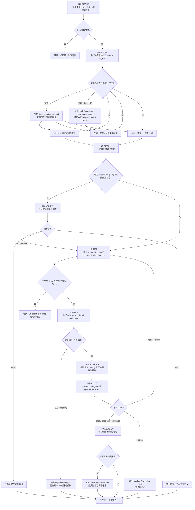

# Learning Workflow

本文件承载 `aigc-learn` 的判断-动作-证据一体化节点。

## Nodes

| node_id | judgment | action | evidence | gate | failure route |
| --- | --- | --- | --- | --- | --- | --- |
| `N1-INTAKE` | 学习对象、目标和权限是否明确 | 锁 source、target、mode、writeback permission | intake summary | source + target + permission | 回到 Input Contract |
| `N2-MEDIA` | 学习对象属于哪些媒介，是否属于视频/书籍复杂对象 | 选择 types，建立 source digest 和 media status；视频加载 `video-learning-contract.md`，书籍/长上下文加载 `book-long-context-learning-contract.md` | source_digest / complex_object_plan | 证据可回指，复杂对象有分轨或覆盖计划 | `references/source-ingestion-contract.md` |
| `N3-DISTILL` | 哪些知识可迁移 | 抽取方法、约束、适用条件和禁区 | knowledge_units | 不复制受保护表达 | N2 或版权 blocker |
| `N4-VERIFY` | 是否存在冲突或高风险事实 | 查可靠来源或降级为待证假设 | verification notes | adopt/adapt/reject/hold | `references/conflict-verification-contract.md` |
| `N5-MAP` | 应影响哪些 skill 和分区 | 建 target_skill_map、gap matrix、landing set | path map | owner 和 sync scope 明确 | `references/global-improvement-contract.md` |
| `N6-PLAN` | 只计划还是执行 | 生成 writeback_order 和 audit_plan | improvement plan | 用户权限匹配 | 阻断或等待授权 |
| `N7-WRITEBACK` | 是否能最窄有效落盘 | 修改 owning 分区并同步消费者 | changed_files / diff | 无越权写回 | N5 |
| `N8-AUDIT` | 改进是否协调一致 | 运行 isolated audit 或 degraded local audit | audit_result + changed_files verified | pass / pass_with_followups = **任务完成** | `references/isolated-audit-contract.md` |
| `N9-DEPOSIT` | 学习经验应沉淀到哪里 | 写目标 `CONTEXT.md` 或本技能 `CONTEXT.md` | deposition note | 不污染 knowledge-base | N5 |
| `N10-CLOSE` | **仅当用户明确要求时**：生成追溯报告 | **可选**：使用 `templates/output-template.md` 生成副产物报告 | final report (optional) | 用户要求报告 = 生成；否则 = 已完成 | N8-AUDIT 通过即完成 |

## Flowchart

**节点完成标志**：

- `N7-WRITEBACK` 完成标志：changed_files 包含实际修改的技能文件
- `N8-AUDIT` 通过（pass / pass_with_followups）= **任务完成**
- `N10-CLOSE`：仅在用户明确要求时执行，报告只是副产物，不是完成标志

## Parallelism

- `N2-MEDIA` 可以并行处理画面、字幕、音频、顺序、文档段落、网页事实。
- `N5-MAP` 可以并行扫描目标 skill、root/router、registry/routes、audit 脚本。
- `N8-AUDIT` 可以并行执行 evidence、ownership、consistency 和 security 检查；汇总时只保留一个 verdict。

## Writeback Order

1. 最早 owning skill 分区。
2. 同一 skill 的 `SKILL.md` 入口或引用表。
3. AIGC 根 `SKILL.md + CONTEXT.md`。
4. `.codex/registry/skills.yaml` 与 `.codex/registry/routes.yaml`。
5. 审计脚本和模板。
6. `CHANGELOG.md` 或报告。
