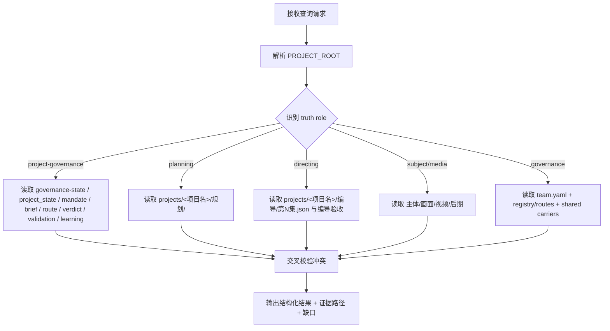

# aigc Query

## Purpose

- `query/` 是 `aigc` 根目录下的事实查询卫星技能，不是新的主阶段。
- 它负责把“我现在到底有哪些项目状态、阶段产物、编导主文件、主体资产、画面/视频结果、治理工件”这类问题，映射到 `projects/<项目名>/` 的真实载体上。
- 它拥有的是 truth-role 判定与证据综合权，不拥有内容生成、阶段执行、验收裁决或真源改写权。

## Stage Position

- 挂载位置：根 `aigc` 同级卫星技能。
- owner office：`shangshu`
- governance domain：`户部`
- 默认回接：若查询暴露出需要实际修复、续跑或复核，再回接根 `aigc`、`resume/` 或 `review/`。

| owns | avoids |
| --- | --- |
| 识别 query 属于哪一种 truth role | 把文件存在当作“已经通过验收” |
| 读取 canonical runtime 与阶段产物 | 代替阶段 skill 改写项目内容 |
| 输出带证据路径的结构化查询结果 | 在路径不明时硬猜项目根目录 |

## When to Use

- 用户询问项目当前阶段、最近产物、阶段验证报告、`第N集.json` 是否存在、主体/画面/视频落点在哪。
- 需要确认某个项目是否已经具备 `mandate / mission-brief / route-plan / preflight / validation / learning` 工件。
- 需要查询 `projects/<项目名>/编导/第N集.json`、`主体/`、`画面/`、`视频/` 的存在状态与最近修改痕迹。
- 需要读取 `team.yaml`、`governance-state.yaml`、`project_state.yaml`、registry / routes 等治理信息来说明当前系统状态。

## When Not to Use

- 需要生成、修改、修补项目内容时，应回到根 `aigc` 或具体阶段。
- 需要恢复中断执行时，应进入 `resume/`。
- 需要给出预审 / 验收 verdict 或更新 `validation-report.md` 时，应进入 `review/`。

## Workflow



## Project Root Guard

先确认真实 `PROJECT_ROOT`，不要把仓库根目录和项目根目录混为一谈。

允许的判定顺序：

1. 若当前工作目录已位于 `projects/<项目名>/` 下，取该最近祖先目录为 `PROJECT_ROOT`。
2. 若用户明确给出项目名，则使用 `projects/<项目名>/`。
3. 若 `projects/` 下只有一个包含 `governance-state.yaml` 或 `project_state.yaml` 的候选项目，可谨慎推断。
4. 若存在多个候选且用户未指明，必须先回到根 `aigc` 或直接向用户确认项目名。

推荐命令：

```bash
REPO_ROOT="$(git rev-parse --show-toplevel 2>/dev/null || pwd)"
find "$REPO_ROOT/projects" -mindepth 1 -maxdepth 2 \\( -name governance-state.yaml -o -name project_state.yaml \\)
```

## Reference Loading

L1 必读：

- [system-data-flow.md](references/system-data-flow.md)
- [project-runtime-layout.md](../_shared/project-runtime-layout.md)

L2 按需：

- 需要解释三省治理闭环时，再读 [office-governance-contract.md](../../../../.codex/templates/harness/office-governance-contract.md)
- 需要解释卫星技能路由时，再读根 [aigc/SKILL.md](../SKILL.md)

## Truth Role Decision

| 问题形状 | 主真源 | 辅助真源 | 禁止偷懒 |
| --- | --- | --- | --- |
| 项目当前跑到哪、治理工件齐不齐 | `governance-state.yaml`、`project_state.yaml`、`mandate.yaml`、`mission-brief.yaml`、`route-plan.yaml`、`preflight-verdict.yaml`、`validation-report.md`、`learning-record.md` | `team.yaml` | 不能只扫聊天记录或目录名 |
| 规划产物、格式、分组、节奏 | `projects/<项目名>/规划/` | `规划/validation-report.md` | 不能拿 `Init/` 代替整阶段规划真源 |
| 组间/明细/第N集事实 | `projects/<项目名>/编导/第N集.json` | `projects/<项目名>/编导/validation-report.md` | 不能因为存在 sidecar 就忽略主 JSON |
| 主体资产状态 | `projects/<项目名>/主体/` | `主体/validation-report.md` | 不能把 `4-主体` 技能目录当作项目资产目录 |
| 画面、视频、后期产物 | `projects/<项目名>/画面/`、`视频/`、`后期/` | 阶段级 `validation-report.md` | 不能把脚本模板当作生成结果 |
| 顾问团、review gate、路由制度 | `team.yaml`、registry、routes、shared carrier | 根 `aigc/SKILL.md` | 不能把 stage 本地约定说成全局制度 |

## Workflow Checklist

```text
查询进度：
- [ ] Step 0: 解析 PROJECT_ROOT
- [ ] Step 1: 识别 truth role
- [ ] Step 2: 加载 L1 reference
- [ ] Step 3: 读取 canonical source
- [ ] Step 4: 交叉校验冲突与缺口
- [ ] Step 5: 输出结果、证据路径与下一入口
```

## Step 0：解析 `PROJECT_ROOT`

必须先确认查询的是真实项目目录，而不是技能树目录。

若 `PROJECT_ROOT` 不成立，立即停止，不继续扫阶段目录。

## Step 1：识别 truth role

先判定用户要的是：

- `project-governance`
- `planning`
- `directing`
- `subject`
- `media`
- `governance-system`

一句话同时命中多个 truth role 时，先回答主问题，再补次问题，不要把多个真源混成一个答案。

## Step 2：加载 reference

所有查询默认读取：

```bash
cat ".agents/skills/aigc/query/references/system-data-flow.md"
cat ".agents/skills/aigc/_shared/project-runtime-layout.md"
```

## Step 3：读取 canonical source

常用读取入口：

```bash
rg --files "$PROJECT_ROOT/规划"
rg --files "$PROJECT_ROOT/编导" | rg '第[0-9]+集\\.json$'
rg --files "$PROJECT_ROOT/主体"
rg --files "$PROJECT_ROOT/画面"
rg --files "$PROJECT_ROOT/视频"
sed -n '1,220p' "$PROJECT_ROOT/project_state.yaml"
sed -n '1,220p' "$PROJECT_ROOT/governance-state.yaml"
sed -n '1,220p' "$PROJECT_ROOT/team.yaml"
```

读 `第N集.json` 时，优先看：

- 文件是否存在
- 最近一轮 `validation-report.md` 是否与其 scope 对齐
- 上游阶段是否已经写出对应验收结论

## Step 4：冲突校验

若 `governance-state.yaml` 缺失但 `project_state.yaml` 存在，只能回答“当前项目仍是 legacy 状态摘要模式，断点治理信息不完整”，并建议回根 `aigc` 或 `resume/` 补治理快照。

若文件存在但没有验收结论，只能回答“存在产物，不等于已通过验收”。

若阶段目录存在但根治理工件缺失，只能回答“内容侧存在，治理链不完整”。

若 registry / routes 与本地技能树不一致，必须显式指出是制度层漂移，而不是只给目录结果。

## Step 5：输出格式

默认输出应包含：

1. 结论
2. 证据路径
3. 当前缺口或冲突
4. 若用户下一步要执行，唯一推荐入口是根 `aigc`、`resume/` 还是 `review/`

## Root-Cause Execution Contract (Mandatory)

当 `query/` 出现以下问题时，必须先修源层，而不是只修一次查询话术：

- 总是把仓库根目录误当项目根目录
- 只会列目录，不会判定 truth role
- 把文件存在混成“已经验收”
- 把 stage 本地约定误说成仓库级制度

必经链路：

`Symptom -> Direct Technical Cause -> Rule Source -> Meta Rule Source -> Fix Landing Points`

优先检查：

- `Rule Source`
  - `.agents/skills/aigc/query/SKILL.md`
  - `.agents/skills/aigc/query/references/system-data-flow.md`
  - `.agents/skills/aigc/_shared/project-runtime-layout.md`
- `Meta Rule Source`
  - `.agents/skills/aigc/SKILL.md`
  - 根 `AGENTS.md`

## Context Preload (Mandatory)

- 每次调用本技能时，必须自动加载同目录 `CONTEXT.md`。
- 冲突优先级：用户显式请求 > 根 `AGENTS.md` > 根 `aigc/SKILL.md` > 本 `SKILL.md` > `CONTEXT.md`。
- 若本次查询暴露出可复用的真源选路问题，应优先回写 `CONTEXT.md` 的 Type Map / Reusable Heuristics。
