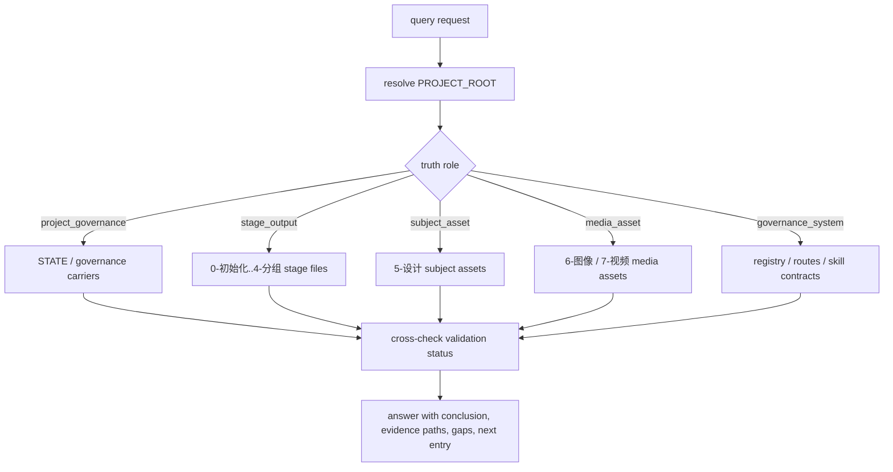

# aigc Query

`query/` 是 `.agents/skills/aigc` 的事实查询卫星技能。它继承 `.agents/skills/aigc-old/query` 的配置意图：先判定用户在问哪一种 truth role，再读取 `projects/aigc/<项目名>/` 的真实载体；它不生成正文、不执行阶段、不替代验收，也不改写项目真源。

## Context Loading Contract

- 每次调用 `$aigc-query` 时，必须同时加载同目录 `CONTEXT.md`。
- 若任务绑定 `projects/aigc/<项目名>/`，必须先加载项目根 `MEMORY.md`，再按需读取项目根 `CONTEXT/` 或 `附加预设/` 中与当前查询相关的事实材料。
- 查询必须先确认真实 `PROJECT_ROOT`，禁止把仓库根、技能目录或 registry 目录当成项目结果目录。
- 冲突优先级：用户显式请求 > 根 `AGENTS.md` / meta 规则 > registry / routes > 本 `SKILL.md` > `references/` / `steps/` / `types/` / `review/` / `templates/` > `agents/openai.yaml` > 项目 `MEMORY.md` > 项目 `CONTEXT/` / `附加预设/` > 本 `CONTEXT.md`。
- 新的稳定真源选路失败模式先沉淀到 `CONTEXT.md`；稳定为强制规则后再晋升到本 `SKILL.md` 或对应分区。

## Input Contract

Accepted input:

- 用户询问 AIGC 项目当前状态、阶段进度、最近产物、断点、治理工件、验收证据或下一入口。
- 用户询问 `projects/aigc/<项目名>/` 下 `0-初始化`、`1-分集`、`2-编导`、`3-摄影`、`4-分组`、`5-设计`、`6-图像`、`7-视频` 的文件是否存在、在哪里、是否通过验收。
- 用户询问角色、场景、道具、分镜组、图像、视频、storyboard reference、subject reference 等资产落点。
- 用户询问某个路由制度、阶段入口或 registry/routes 与本地技能树是否一致。

Required input:

- 可解析的项目名、项目根路径，或足够唯一的 `projects/aigc/<项目名>/` 候选。
- 查询目标的类型信号，例如状态、产物、验收、资产、阶段、制度或下一入口。

Optional input:

- 集号、阶段名、分镜组 ID、四段式分镜 ID、角色/场景/道具名称、文件名或资产类型。
- 用户指定的兼容读取范围，例如 legacy `5-Image`、`6-Video`、`7-Cut`。
- 需要输出的精度：简短结论、证据列表、冲突诊断或下一步入口建议。

Reject or clarify when:

- 无法唯一定位 `PROJECT_ROOT`，且仓库内存在多个候选项目。
- 用户要求查询技能直接生成、修补、移动或验收项目内容；应回接根路由、具体阶段、`resume/` 或 `review/`。
- 用户要求把“文件存在”直接表述为“已完成 / 已通过验收”，但缺少验收载体。

## Mode Selection

| mode | 触发信号 | 输出 |
| --- | --- | --- |
| `project_governance` | 当前状态、断点、治理工件、下一入口 | 状态结论、治理 carrier 证据、缺口与推荐入口 |
| `stage_output` | 某阶段产物、某集文件、阶段目录 | 阶段产物路径、最近修改线索、验收状态 |
| `subject_asset` | 角色、场景、道具、主体资产、设计结果 | `5-设计` 及相关生成资产证据 |
| `media_asset` | 分镜画面、故事板、视频、参照视频、生成结果 | `6-图像` / `7-视频` 产物证据与兼容路径说明 |
| `governance_system` | 路由制度、registry、技能树状态 | registry/routes/技能合同证据与漂移说明 |
| `conflict_diagnosis` | 用户发现路径冲突、阶段名漂移、结果互相矛盾 | 冲突源、主真源裁决、回修入口 |

## Reference Loading Guide

| 场景 | 读取文件 |
| --- | --- |
| 任意查询 | `references/system-data-flow.md`、`references/project-runtime-layout.md` |
| 旧 `aigc-old/query` 语义迁移或路径兼容 | `references/legacy-migration-matrix.md` |
| 执行查询步骤、冲突汇流 | `steps/query-workflow.md` |
| 判定查询类型与 truth role | `types/query-type-map.md` |
| 验收、质量门禁和降级审查 | `review/review-contract.md` |
| 输出样板 | `templates/output-template.md` |
| 机械命令边界 | `scripts/README.md` |
| 可复用经验 | `knowledge-base/query-heuristics.md` |
| 产品入口元数据 | `agents/openai.yaml` |

## Visual Maps

## Execution Contract

1. 读取本 `SKILL.md + CONTEXT.md`，再按任务绑定加载项目 `MEMORY.md` 与相关项目上下文。
2. 按 `steps/query-workflow.md` 解析 `PROJECT_ROOT`；若无法唯一定位，停止并要求用户给出项目名或路径。
3. 按 `types/query-type-map.md` 判定 truth role；一句话命中多类时先回答主问题，再补次问题。
4. 按 `references/system-data-flow.md` 与 `references/project-runtime-layout.md` 读取 canonical carrier；仅在用户或证据需要时读取 legacy 路径。
5. 若问题涉及“完成 / 通过 / 可交付”，必须补读对应 `validation-report.md` 或阶段 `执行报告.md`；没有验收证据时只能说“存在产物”。
6. 若问题涉及“为什么这么路由 / 制度是否一致”，读取 `.codex/registry/skills.yaml`、`.codex/registry/routes.yaml` 与相关阶段 `SKILL.md`。
7. 按 `review/review-contract.md` 做最小质量门禁，再使用 `templates/output-template.md` 的结构返回结论、证据、缺口和下一入口。

## Field Mapping

| field_id | 输出/证据 | 内容要求 | 失败码 |
| --- | --- | --- | --- |
| `FIELD-QUERY-01` | project root lock | 真实 `projects/aigc/<项目名>/`，不是仓库根或技能目录 | `FAIL-QUERY-PROJECT-ROOT` |
| `FIELD-QUERY-02` | truth role | 查询类型唯一或主次明确 | `FAIL-QUERY-TRUTH-ROLE` |
| `FIELD-QUERY-03` | canonical carrier | 读取当前新链路主真源，legacy 只作兼容回读 | `FAIL-QUERY-CARRIER` |
| `FIELD-QUERY-04` | validation distinction | 明确区分产物存在、执行报告存在、验收通过 | `FAIL-QUERY-VALIDATION` |
| `FIELD-QUERY-05` | governance evidence | 制度问题回读 registry/routes/技能合同 | `FAIL-QUERY-GOVERNANCE` |
| `FIELD-QUERY-06` | output shape | 结论、证据路径、缺口、下一入口齐全 | `FAIL-QUERY-OUTPUT` |

## Root-Cause Execution Contract (Mandatory)

当 `query/` 出现以下问题时，必须修源层合同，而不是只修一次回答：

- 把仓库根或技能目录误判为项目根。
- 把文件存在说成已验收。
- 沿用旧 `3-Detail / 4-Design / 5-Image / 6-Video / 7-Cut` 路径，却没有说明它们只是 legacy 兼容。
- 查询制度问题时只看目录，不读 registry/routes。
- 查询阶段产物时只读 registry，不读 `projects/aigc/<项目名>/`。

必经链路：

`Symptom -> Direct Cause -> query Section Owner -> registry/routes or project carrier -> AGENTS.md / skill-工作车间`

优先回修落点：

1. truth role 或 carrier 选错：`references/system-data-flow.md`、`types/query-type-map.md`。
2. 阶段路径漂移：`references/project-runtime-layout.md`、registry/routes。
3. 执行步骤漏证据：`steps/query-workflow.md`。
4. 输出把存在与验收混淆：`review/review-contract.md`、`templates/output-template.md`。
5. 可复用失败模式：`CONTEXT.md`、`knowledge-base/query-heuristics.md`。

## Output Contract

### Required output

1. 查询结论：回答用户主问题，标明置信度与是否存在路径/制度漂移。
2. 证据路径：列出实际读取或可复核的 canonical 文件/目录。
3. 当前缺口或冲突：区分缺文件、缺验收、路径漂移、registry 漂移和信息不足。
4. 下一入口：若用户下一步要执行，给出唯一推荐入口，例如具体阶段、`resume/`、`review/` 或根路由。

### Output format

Markdown 结构化答复；复杂查询使用 `templates/output-template.md` 的四段式结构。

### Output path

默认只输出到当前对话，不改写项目文件。若用户要求保存查询报告，写入 `projects/aigc/<项目名>/reports/query-report-YYYYMMDD.md`。

### Naming convention

- 查询报告命名为 `query-report-YYYYMMDD.md`。
- 不创建 `status.md`、`result.txt`、`query.json` 等平行真源。

### Completion gate

- 已加载本 `SKILL.md + CONTEXT.md`。
- 已确认 `PROJECT_ROOT` 或明确报告无法唯一定位。
- 已判定 truth role 并读取对应 canonical carrier。
- 若涉及完成/验收，已读取对应验收载体或明确报告其缺失。
- 输出包含结论、证据路径、缺口/冲突和下一入口。
