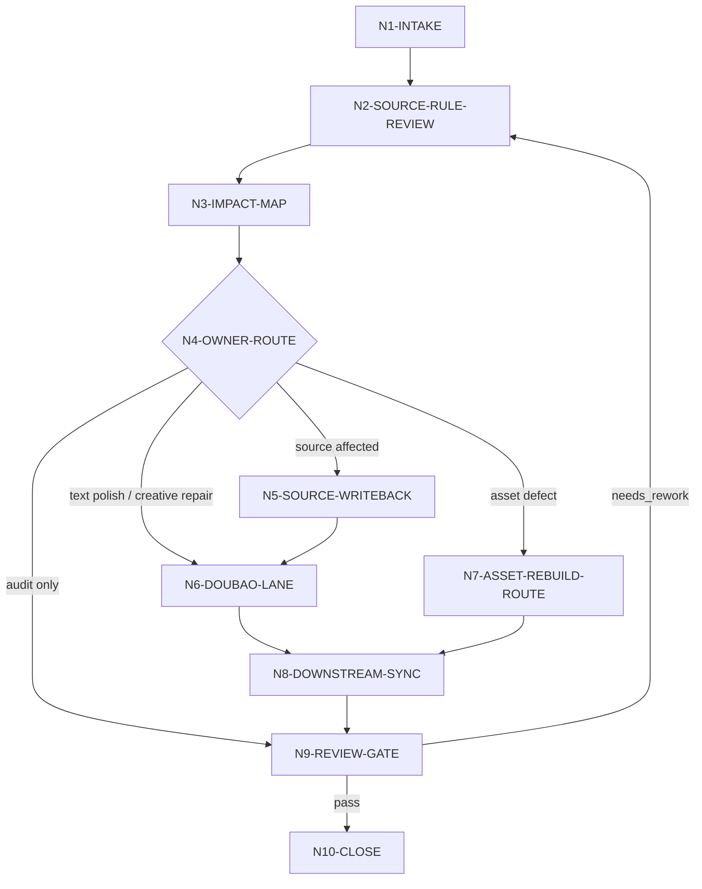

# Repair Workflow

`aigc-repair` 采用混合拓扑：先串行锁定目标与源层规则，再并行收集影响证据，随后按 source owner 串行写回，最后执行豆包证据核验和 review gate。

## Node Table

| node_id | objective | inputs | actions | evidence | route_out | gate |
| --- | --- | --- | --- | --- | --- | --- |
| `N1-INTAKE` | 锁定项目、locality、意图和权限 | 用户请求、项目根、目标路径、finding | 定位 stage/leaf/object，选择 mode 和 types | intake summary | `N2-SOURCE-RULE-REVIEW` | 项目与目标可定位 |
| `N2-SOURCE-RULE-REVIEW` | 回看目标输出物相关源层规则 | owning `SKILL.md + CONTEXT.md`、分区文件 | 读取 source rule，记录 owner 和禁止越权 | `source_rules_reviewed` | `N3-IMPACT-MAP` | 至少有一个 source rule owner |
| `N3-IMPACT-MAP` | 建立跨阶段影响图 | impact contract、types、rg/file evidence、review finding | 列 upstream、neighbors、current、downstream、assets、future、state | impact map | `N4-OWNER-ROUTE` | 影响范围可解释 |
| `N4-OWNER-ROUTE` | 决定 canonical owner 和修复路径 | impact map、source ledger | 生成 writeback_order、stage_routes、asset_actions | repair plan | `N5` / `N6` / `N7` / `N9` | 不允许下游先改源层错误 |
| `N5-SOURCE-WRITEBACK` | 修复最早源层真源 | user authorization、source files | 按 stage 合同最小写回或生成 owner repair brief | changed source files | `N6-DOUBAO-LANE` | 旧源层口径失效或标为 legacy |
| `N6-DOUBAO-LANE` | 执行豆包分析、润色或创意候选 | task packet、source rules、forbidden changes | 调用 provider 或记录降级，形成 provider output | text/report evidence | `N8-DOWNSTREAM-SYNC` | provider evidence 或降级说明齐全 |
| `N7-ASSET-REBUILD-ROUTE` | 处理图像/视频等生成资产 | asset paths、provider reports、review findings | 决定 preserve / invalidate / regenerate / review_only | asset action plan | `N8-DOWNSTREAM-SYNC` | 不伪造生成结果 |
| `N8-DOWNSTREAM-SYNC` | 同步下游产物和后续约束 | writeback order、provider output、asset actions | 更新、失效、重验或添加 guardrail | changed downstream refs | `N9-REVIEW-GATE` | 无已知消费者仍引用旧口径 |
| `N9-REVIEW-GATE` | 审计修复完整性 | review contract、code-reviewer checklist | 检查 source review、owner、provider evidence、asset status | verdict | `N10-CLOSE` 或返工 | PASS 或返工项明确 |
| `N10-CLOSE` | 交付闭环 | changed files、evidence、verdict | 输出 repair packet、残余风险和后续约束 | final report | done | Output Contract 齐全 |

## Failure Loops

| fail_code | symptom | rework_entry |
| --- | --- | --- |
| `FAIL-AIGC-REPAIR-SCOPE` | 只有当前文件修订，没有跨阶段影响图 | `N3-IMPACT-MAP` |
| `FAIL-AIGC-REPAIR-SOURCE-RULE` | 没有回看 owning stage 规则 | `N2-SOURCE-RULE-REVIEW` |
| `FAIL-AIGC-REPAIR-OWNER` | 下游改动早于源层裁决 | `N4-OWNER-ROUTE` |
| `FAIL-AIGC-REPAIR-DOUBAO` | 缺少豆包 evidence 或降级说明 | `N6-DOUBAO-LANE` |
| `FAIL-AIGC-REPAIR-ASSET` | 声称修复图像/视频但没有 provider route | `N7-ASSET-REBUILD-ROUTE` |
| `FAIL-AIGC-REPAIR-REVIEW` | 旧口径仍在 source 或 downstream 命中 | `N9-REVIEW-GATE` |
