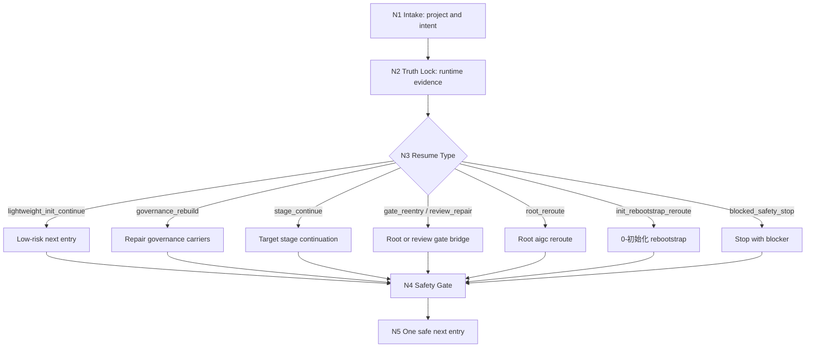

# aigc Resume

`aigc-resume` 是 `.agents/skills/aigc/` 下的根级续跑恢复卫星技能。它负责重建可证明的最后稳定入口、识别治理工件缺口、给出唯一安全回接路径，并把任务交回根 `aigc` 路由或目标阶段技能。它不是新的主阶段，也不拥有阶段业务真稿。

本包按 Skill 2.0 工作车间结构维护：入口、触发、动态引用、关键门禁和输出合同留在 `SKILL.md`；详细恢复协议在 `references/`，思行节点在 `steps/`，类型策略在 `types/`，质量门禁在 `review/`，经验知识库在 `knowledge-base/`，输出样板在 `templates/`，机械辅助边界在 `scripts/`，产品侧元数据在 `agents/`。

## Context Loading Contract

- 每次调用 `$aigc-resume` 时，必须同时加载同目录 `CONTEXT.md`。
- 每次调用本技能时，必须同时识别并加载同目录 `types/` 中选中的类型包（单选或多选）。
- 若任务已绑定 `projects/aigc/<项目名>/`，先读取项目根 `MEMORY.md`，再读取项目根 `CONTEXT/` 中与恢复判断相关的上下文文件；当前中文 runtime 中的 `CONTEXT/` 作为项目补充材料入口，按问题需要读取。
- 冲突优先级：用户显式请求 > 根 `AGENTS.md` / meta 规则 > 本 `SKILL.md` > `references/`、`steps/`、`types/`、`review/`、`templates/` > `agents/openai.yaml` > 项目 `MEMORY.md` > 项目 `CONTEXT/` > 项目 `CONTEXT/` > 同目录 `CONTEXT.md`。
- `CHANGELOG.md` 只用于追溯本技能包配置变更，不作为运行时自动上下文。
- 若恢复暴露出新的可复用失败模式，优先沉淀到同目录 `CONTEXT.md`；稳定后再晋升到本入口合同或对应分区。

## When To Use

- 用户要求继续一个中断的 AIGC 影片、电影、影视或视频项目。
- 用户要重建 `projects/aigc/<项目名>/` 的最后稳定断点、当前阶段、下一入口或治理缺口。
- 用户要补齐或解释 `STATE.json`、`governance-state.yaml`、`mission-brief.yaml`、`route-plan.yaml`、`preflight-verdict.yaml`、`validation-report.md` 等恢复相关治理工件。
- 某阶段产物已存在，但需要判断应该回到根路由、进入目标阶段、补 gate，还是先停下修工件。
- review 已产生 repair route，需要把 `review_bridge` 或 `resume_contract.required_repairs` 转成恢复入口。

## When Not To Use

- 用户明确要求“回到初始化态重来 / 推翻当前方向重新起盘 / 重新初始化项目”。这属于 `0-初始化` 的 `rebootstrap`，不得按续跑处理。
- 用户只问项目事实、文件位置、已有产物清单，应优先进入 `query/`。
- 用户要求执行阶段业务产物生成，应回接到唯一目标阶段技能。
- 用户要求做 checkpoint、stage 或 package 审计，应进入 `review/`。
- 用户要求 Git 回滚、删除源文本、清空资产或其他破坏性动作时，本技能只能做风险说明和非破坏性检查，不得默认执行。

## Input Contract

`$aigc-resume` 必须先判断输入是否足够锁定项目根、恢复模式与唯一下一入口；不足时停止猜测并请求最小缺口。

| input slot | required shape | detail owner |
| --- | --- | --- |
| `project_identity` | 项目名、项目路径，或当前工作目录可证明位于 `projects/aigc/<项目名>/` | `references/project-runtime-layout.md` |
| `resume_intent` | 继续执行、重建断点、补治理工件、gate 回接、review repair 回接之一 | `types/resume-type-map.md` |
| `runtime_evidence` | `STATE.json`、可选 `governance-state.yaml`、初始化核心工件、阶段产物和工作区状态 | `references/workflow-resume.md` |
| `risk_profile` | 低风险读取、普通阶段续跑、高风险执行、破坏性请求或主动 rebootstrap | `types/resume-type-map.md`, `review/resume-review-gate.md` |
| `stage_hint` | 可选；若用户指定阶段，必须与 runtime 证据交叉验证 | `steps/resume-workflow.md` |

Accepted input:

- 明确项目路径或项目名，并要求继续、恢复、补断点或找下一入口
- 项目根下存在 `STATE.json` 或 `0-初始化/north_star.yaml` 等初始化核心工件
- review repair route 或 `governance-state.yaml.resume_contract` 指向待修复入口

Reject or reroute:

- 多个项目候选且用户未说明项目名 -> 先询问项目名
- 明确重起盘 / 重新初始化 -> `0-初始化`
- 纯查询 -> `query/`
- 纯审计 -> `review/`
- 破坏性 Git 或资产删除 -> block，并只给非破坏性检查路径

## Mode Selection

| mode | trigger | default action |
| --- | --- | --- |
| `lightweight_init_continue` | `STATE.json + 0-初始化/* + team.yaml` 足够，但深治理快照尚未生成 | 允许回根 `aigc` 或低风险下一阶段；需要复杂恢复时再补 `governance-state.yaml` |
| `governance_rebuild` | 项目状态缺失、结构化断点缺失，或高风险恢复所需 gate 明显缺失 | 回根 `aigc` 或 `0-初始化` 补治理链，不直接执行高风险阶段 |
| `stage_continue` | 阶段产物存在、scope 清楚、验收闭环未完成 | 回目标阶段继续，并列出必读输入与 gate |
| `gate_reentry` | 内容产物已有，但缺预审、验收或 review bridge | 回根 `aigc` 或 `review/` 做 gate |
| `review_repair_reentry` | review 已写出 repair route 或 `resume_contract.required_repairs` | 回 repair route 指向的唯一阶段或根 gate |
| `root_reroute` | 当前阶段不清、阶段已冻结、路径口径漂移或合同缺失 | 回根 `aigc` 重判唯一路由 |
| `init_rebootstrap_reroute` | 用户明确要求回到初始化态重来 | 直接回 `0-初始化`，不要沿 resume 逻辑硬接 |
| `blocked_safety_stop` | 项目根不唯一、请求 destructive 动作、或恢复证据不足以给唯一入口 | 停止恢复裁决，输出 blocker 与最小补充信息 |

## Reference Loading Guide

按恢复节点动态加载，不要一次性读取所有分区。

| scenario | load |
| --- | --- |
| 恢复证据链、模式细则、hard guards | `references/workflow-resume.md` |
| 当前中文 runtime、legacy 兼容输入、阶段落点 | `references/project-runtime-layout.md` |
| 旧 `aigc-old/resume` 到新版包的语义迁移 | `references/migration-matrix.md` |
| 项目根解析、证据读取、模式判定、回接汇流 | `steps/resume-workflow.md` |
| 恢复类型、风险等级、route profile | `types/resume-type-map.md` |
| 交付前安全 gate、review provider 降级口径 | `review/resume-review-gate.md` |
| 可复用恢复经验与避坑策略 | `knowledge-base/resume-heuristics.md` |
| 输出形态与用户-facing 模板 | `templates/output-template.md` |
| 机械辅助命令边界 | `scripts/README.md` |
| 产品侧入口元数据 | `agents/openai.yaml` |

## Core Workflow Index

Detailed node fields, evidence requirements, branch gates, and failure loops live in `steps/resume-workflow.md`.

## Mandatory Gates

- 必须先锁定真实 `PROJECT_ROOT=projects/aigc/<项目名>/`；否则不得推断“上次跑到哪”。
- 恢复判断必须至少使用 `STATE.json` 与实际工件之一交叉验证；不能只凭最近修改文件或聊天记忆。
- `governance-state.yaml` 若存在，其 `last_stable_checkpoint`、`resume_contract`、`review_bridge` 优先作为结构化恢复证据；若缺失，必须说明当前处于轻量状态或需要补治理快照。
- 高风险继续执行前必须检查 `mission-brief.yaml`、`route-plan.yaml` 与 `preflight-verdict.yaml` 是否需要补齐。
- 阶段目录存在不等于阶段已完成；空 skeleton 不能当作产物证据。
- 明确 rebootstrap 请求必须回 `0-初始化`，不得伪装成普通续跑。
- 不得默认建议或执行 `git reset --hard`、强制删除、清空源文本或资产目录。
- 输出必须给唯一下一入口；若仍无法唯一裁决，输出 blocker 与最小补充信息。

## Root-Cause Execution Contract (Mandatory)

恢复类失败必须沿以下链路上溯：

`Symptom -> Direct Technical Cause -> Section Owner -> Rule Source -> Meta Rule Source -> Fix Landing Points`

优先修复路径：

1. 项目根误判：修 `references/project-runtime-layout.md` 与 `steps/resume-workflow.md`。
2. 断点凭空猜测：修 `references/workflow-resume.md` 的证据链与 `review/resume-review-gate.md`。
3. 治理 gate 被跳过：修 `types/resume-type-map.md` 与 `steps/resume-workflow.md`。
4. rebootstrap 被误判为 resume：修本 `SKILL.md`、`types/resume-type-map.md` 与 `0-初始化` 边界引用。
5. 输出多入口候选：修 `templates/output-template.md` 与 `review/resume-review-gate.md`。
6. 旧英文 runtime 口径泄漏到新版项目：修 `references/project-runtime-layout.md` 与迁移矩阵。

## Field Mapping

| field_id | owner | must contain | fail code |
| --- | --- | --- | --- |
| `RESUME-FIELD-01` | `SKILL.md` | 入口边界、Input Contract、Mode Selection、Reference Loading Guide、Output Contract | `FAIL-RESUME-ENTRY` |
| `RESUME-FIELD-02` | `CONTEXT.md` | Type Map、Repair Playbook、Reusable Heuristics | `FAIL-RESUME-CONTEXT` |
| `RESUME-FIELD-03` | `references/workflow-resume.md` | 恢复证据链、模式细则、hard guards | `FAIL-RESUME-EVIDENCE` |
| `RESUME-FIELD-04` | `references/project-runtime-layout.md` | 当前中文 runtime、legacy 输入兼容、阶段落点 | `FAIL-RESUME-RUNTIME` |
| `RESUME-FIELD-05` | `steps/resume-workflow.md` | 判断-动作-证据一体化节点与汇流门 | `FAIL-RESUME-STEPS` |
| `RESUME-FIELD-06` | `types/resume-type-map.md` | 恢复类型、风险等级、route profile | `FAIL-RESUME-TYPES` |
| `RESUME-FIELD-07` | `review/resume-review-gate.md` | 安全 gate、provider 降级、verdict | `FAIL-RESUME-REVIEW` |
| `RESUME-FIELD-08` | `templates/output-template.md` | 唯一下一入口输出模板与 Output Contract Alignment | `FAIL-RESUME-TEMPLATE` |
| `RESUME-FIELD-09` | `scripts/README.md` | 只读检查与机械辅助边界 | `FAIL-RESUME-SCRIPTS` |
| `RESUME-FIELD-10` | `agents/openai.yaml` | display name、short description、默认唤起提示 | `FAIL-RESUME-METADATA` |

## Output Contract

### Required output

一次恢复裁决包：真实项目根、证据摘要、恢复模式、治理缺口、唯一下一入口、安全操作边界、必要的最小修复项；若执行了文件修复，还必须列出写入路径和验证结果。

### Output format

默认是 Markdown 用户-facing 恢复报告；必要时可附 YAML/JSON patch 建议，但 canonical 业务产物只能由根 `aigc` 或目标阶段技能按其合同写回。

### Output path

默认不写业务真源。若用户明确要求生成恢复报告，写入 `projects/aigc/<项目名>/resume/resume-report-YYYYMMDD.md`；若补治理工件，落点必须是项目根已声明治理 carriers，如 `governance-state.yaml`、`mission-brief.yaml`、`route-plan.yaml`、`preflight-verdict.yaml`、`validation-report.md`。

### Naming convention

恢复报告使用 `resume-report-YYYYMMDD.md`；恢复模式使用本 `Mode Selection` 表中的 ASCII-safe 值；下一入口必须写成一个明确 skill 或项目 runtime 路径，不输出无序候选。

### Completion gate

完成前必须通过 `review/resume-review-gate.md`：项目根已锁定、证据链可复核、风险等级已标注、禁止动作已过滤、唯一下一入口已给出；若无法唯一裁决，必须返回 blocker 和最小补充信息，而不是宣布完成。
