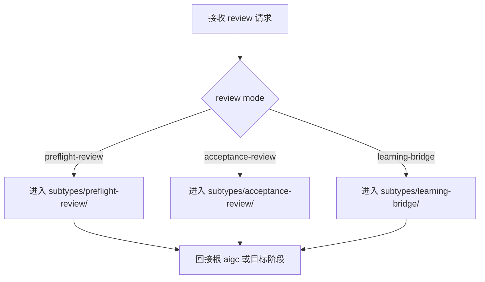

# aigc Review

## Context Loading Contract

- 每次调用本技能时，必须同时加载同目录 `CONTEXT.md` 作为预加载上下文。
- 若同目录 `CONTEXT.md` 缺失，应先补齐最小知识库骨架，或向用户明确报告阻塞；不得在未检查该上下文的情况下执行技能。
- 冲突优先级：用户显式请求 > 仓库/全局 `AGENTS.md` > 本 `SKILL.md` > 同目录 `CONTEXT.md`。

## Purpose

- `review/` 是 `aigc` 根目录下的门下省侧复核卫星技能，不是新的主阶段。
- 它负责承接 `preflight-verdict.yaml`、`validation-report.md`、`learning-record.md` 与 `governance-state.yaml` 中的 review 摘要字段，并把高风险执行、阶段验收与学习桥接收回到同一条 review 轨道。
- 它现在主要承担 mode router：具体 `preflight / acceptance / learning` 合同已下沉到受治理 `subtypes/`。
- 它不替代阶段执行，也不替代阶段内部的内容设计判断。

## Review Method

`review/` 默认采用适配本仓库的 `code-reviewer` 式审查协议：

- findings 优先于概述
- 先证据、后结论
- 默认输出 `severity + dimension + evidence_path + impact + recommended_action + confidence`
- verdict 不再只靠主观语气，而由 severity 与证据包映射

对本仓库，重点审查对象不是单纯业务代码，而是：

- `SKILL.md / CONTEXT.md`
- shared contracts / templates
- registry / routes
- runtime mapping
- audit / validator scripts
- `projects/aigc/<项目名>/` 下的治理载体

## Stage Position

- 挂载位置：根 `aigc` 同级卫星技能。
- owner office：`menxia`
- governance domain：`刑部`
- 默认回接：根 `aigc`、目标阶段、或 `resume/`。

| owns | avoids |
| --- | --- |
| preflight、acceptance、learning bridge verdict | 代替阶段生成内容 |
| 复核治理工件是否完整可执行 | 在无证据时主观放行 |
| 输出 closure triad 与 layered trace | 把 review 结果当执行结果本体 |

## Mode Selection



## Governed Subtypes

| subtype | role | canonical carrier |
| --- | --- | --- |
| `preflight-review` | 高风险执行前置门 | `preflight-verdict.yaml` |
| `acceptance-review` | 项目级或阶段级验收 | scope 对应的 `validation-report.md` |
| `learning-bridge` | review 结束后的经验沉淀 | `learning-record.md` |

硬规则：

1. 根 `review/` 负责 mode 判定与唯一路由，不再在父级平行复制三套详细合同。
2. 一旦 mode 明确，就应进入对应 `subtypes/<mode>/SKILL.md`，再继续执行。
3. `governance-state.yaml` 只承接三个子技能的摘要同步，不作为独立 review 本体。
4. findings 分级、evidence pack 与 verdict 映射统一以 `references/menxia-review-protocol.md` 为准。

## When to Use

- 高风险任务要进正式执行前，需要门下省侧 `preflight-verdict.yaml`。
- 阶段产物已经写出，需要项目级或阶段级 `validation-report.md` 验收。
- 某轮修复或验收结束后，需要把闭环写进 `learning-record.md`。
- 用户明确要求“review 这个 AIGC 项目 / 这个阶段 / 这轮输出”。

## When Not to Use

- 需要继续执行或生成内容时，应回到根 `aigc` 或阶段 skill。
- 需要恢复中断续跑时，应进入 `resume/`。
- 只是事实查询时，应进入 `query/`。

## Project Root Guard

`review/` 必须先锁定真实 `PROJECT_ROOT`，再决定当前 review scope。

支持的 scope：

- `project`
- `1-Planning`
- `2-Global`
- `3-Detail`
- `4-Design`
- `5-Image`
- `6-Video`

`7-Cut` 当前为 `搁浅`，只能返回 review blocker，不进入正式 acceptance。

## Reference Loading

L1 必读：

- [review-modes.md](references/review-modes.md)
- [menxia-review-protocol.md](references/menxia-review-protocol.md)
- [office-governance-contract.md](../../../../.codex/templates/harness/office-governance-contract.md)

L2 按需：

- 需要解释 runtime 时，再读 [project-runtime-layout.md](../_shared/project-runtime-layout.md)
- 需要解释任务生命周期时，再读 [task-lifecycle.md](../../../../.codex/runbooks/task-lifecycle.md)

## Scope To Carrier Mapping

| review scope | canonical carrier |
| --- | --- |
| `project` preflight | `projects/aigc/<项目名>/preflight-verdict.yaml` |
| `project` acceptance | `projects/aigc/<项目名>/validation-report.md` |
| `project` learning | `projects/aigc/<项目名>/learning-record.md` |
| `1-Planning` acceptance | `projects/aigc/<项目名>/1-Planning/validation-report.md` |
| `2-Global` acceptance | `projects/aigc/<项目名>/2-Global/validation-report.md` |
| `3-Detail` acceptance | `projects/aigc/<项目名>/3-Detail/validation-report.md` |
| `4-Design` acceptance | `projects/aigc/<项目名>/4-Design/validation-report.md` |
| `5-Image` acceptance | `projects/aigc/<项目名>/5-Image/validation-report.md` |
| `6-Video` acceptance | `projects/aigc/<项目名>/6-Video/validation-report.md` |

## Workflow Checklist

```text
review 进度：
- [ ] Step 0: 解析 PROJECT_ROOT 与 review scope
- [ ] Step 1: 选择 preflight / acceptance / learning-bridge
- [ ] Step 2: 组装 evidence pack 并锁 review dimensions
- [ ] Step 3: 进入对应 governed subtype
- [ ] Step 4: 由子技能输出 findings + 更新 canonical carrier
- [ ] Step 5: 同步 governance-state 摘要
- [ ] Step 6: 回接根 aigc、目标阶段或 resume
```

## Step 0：解析 `PROJECT_ROOT` 与 scope

先确认 review 是项目级还是阶段级。

若 scope 模糊：

- 先按用户明确的 stage / carrier 路径解释。
- 若仍不清，回根 `aigc` 做总路由，不直接写 review 工件。

## Step 1：选择 review mode 并路由

| mode | trigger | output |
| --- | --- | --- |
| `preflight-review` | 高风险任务进入执行前 | 路由到 `subtypes/preflight-review/` |
| `acceptance-review` | 阶段或项目产物已写出，需要验收 | 路由到 `subtypes/acceptance-review/` |
| `learning-bridge` | 某轮 review 已结束，需要沉淀经验 | 路由到 `subtypes/learning-bridge/` |

根父技能只负责路由，不在这里平行重写三套详细写法。

## Step 2：组装 evidence pack 与 review dimensions

进入 subtype 前，先锁最小证据包：

- `carrier evidence`
- `runtime evidence`
- `rule evidence`
- `execution evidence`

默认 review dimensions：

- `contract_integrity`
- `canonical_source_consistency`
- `runtime_mapping_alignment`
- `audit_coverage`
- `doc_runner_parity`
- `governance_carrier_sync`
- `regression_risk`

## Step 3：交给子技能读取证据

推荐读取：

```bash
sed -n '1,220p' "$PROJECT_ROOT/mission-brief.yaml"
sed -n '1,220p' "$PROJECT_ROOT/route-plan.yaml"
sed -n '1,220p' "$PROJECT_ROOT/governance-state.yaml"
sed -n '1,220p' "$PROJECT_ROOT/preflight-verdict.yaml"
sed -n '1,220p' "$PROJECT_ROOT/validation-report.md"
sed -n '1,220p' "$PROJECT_ROOT/learning-record.md"
```

若 mode 已明确，应立即继续加载对应 `subtypes/<mode>/SKILL.md + CONTEXT.md`。

## Step 4：由子技能给出 findings / verdict / heuristic

`review/` 输出时必须显式包含：

1. `findings`
2. `severity summary`
3. `decision rationale`
4. `root cause location`
5. `immediate fix`
6. `systemic prevention fix`

若是正向沉淀，则输出：

1. `root cause location`
2. `immediate fix`
3. `systemic prevention fix`

或：

1. `success pattern location`
2. `extracted heuristic`
3. `promotion scope`

## Step 5：同步 governance-state 摘要

- `preflight-review` 同步 `review_bridge.latest_preflight_status`
- `acceptance-review` 同步 `review_bridge.latest_acceptance_status`
- `learning-bridge` 同步 `review_bridge.latest_learning_status`
- 如 verdict 改变了唯一下一入口，再同步 `resume_contract`

若本轮发现的是 stage scope blocker，不要越权改 stage 业务真源，只记录 verdict 与下一入口。

## Step 6：回接

默认只给唯一下一入口：

- 回根 `aigc`
- 回目标阶段 skill
- 回 `resume/`

不要让 `review/` 自己继续执行内容任务。

## Root-Cause Execution Contract (Mandatory)

当 `review/` 出现以下问题时，必须先修源层：

- 在无 `mission-brief / route-plan` 情况下直接放行高风险执行
- 把 stage 业务内容修改权拿到自己手里
- 只写口头结论，不更新 canonical carrier
- 项目 runtime 已变更，但 review scope 仍写旧路径
- findings 没有 severity / dimension / evidence path
- audit 全绿被直接当成唯一放行证据

必经链路：

`Symptom -> Direct Technical Cause -> Rule Source -> Meta Rule Source -> Fix Landing Points`

优先检查：

- `Rule Source`
  - `.agents/skills/aigc/review/SKILL.md`
  - `.agents/skills/aigc/review/references/review-modes.md`
  - `.codex/templates/harness/office-governance-contract.md`
- `Meta Rule Source`
  - `.agents/skills/aigc/SKILL.md`
  - 根 `AGENTS.md`
  - `.codex/agents/harness治理/门下省.md`

## Context Preload (Mandatory)

- 每次调用本技能时，必须自动加载同目录 `CONTEXT.md`。
- 冲突优先级：用户显式请求 > 根 `AGENTS.md` > 根 `aigc/SKILL.md` > 本 `SKILL.md` > `CONTEXT.md`。
- 若 mode 已锁定，继续加载对应 `subtypes/<mode>/SKILL.md` 与 `CONTEXT.md`。
- 若本轮 review 暴露出新的 gate 或验收模式，应优先沉淀到 `CONTEXT.md` 或对应 subtype `CONTEXT.md`。
