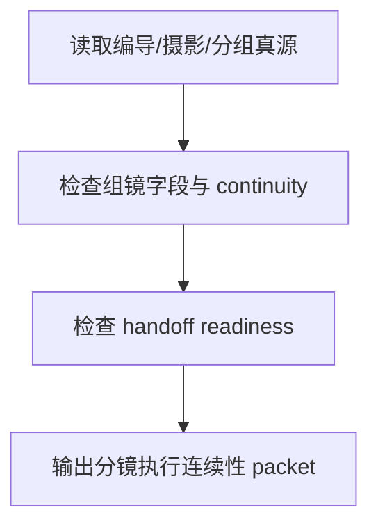

# review / 分镜执行连续性

## Context Loading Contract

- 每次调用本技能时，必须同时加载同目录 `CONTEXT.md`。
- 必须回读父层 `review/SKILL.md`、`../_shared/review-root-contract.md`、`../_shared/review-child-output-contract.md`。

## Invocation Modes

- `checkpoint_inline`
- `stage_acceptance`
- `package_release`

## Parent Positioning

本 child 负责检查：

- `2-编导 / 3-摄影 / 4-分组` 是否形成稳定可消费的导演与镜头事实
- 画面句子、镜头语言、分镜组 continuity 与 handoff readiness

它不负责：

- 设计 prompt、引用绑定、provider pack

## Output Contract

- `role_id`: `detail-execution-validator`
- `dimension_report_ref`: `分镜执行连续性.md`
- 默认返工入口：
  - `2-编导`
  - `3-摄影`
  - `4-分组`

## Visual Map

## Thinking-Action Network

| node_id | objective | actions | evidence | route_out | gate |
| --- | --- | --- | --- | --- | --- |
| `N1-DETAIL-READ` | 锁分镜链路真源 | 读取编导稿、摄影稿、分组稿与 validator evidence | `detail_note` | `N2` | root 明确 |
| `N2-CONTINUITY-CHECK` | 检查组镜连续性 | 核对组、镜、时间、主体与构图/运镜连续性 | `continuity_note` | `N3` | continuity 成立 |
| `N3-HANDOFF-CHECK` | 检查 handoff readiness | 判断是否可安全交给 design/image/video | `handoff_note` | `N4` | handoff 成立 |
| `N4-PACKET-WRITE` | 输出维度 packet | 生成 `dimension_packet + report_ref` | `packet_note` | done | 只写本维度 |

## Lite Field Contract

| field_id | output_slot | pass_standard | fail_code | rework_entry |
| --- | --- | --- | --- | --- |
| `FIELD-DE-01` | detail continuity | 组镜连续性稳定 | `FAIL-DE-01` | `N2` |
| `FIELD-DE-02` | handoff readiness | 可安全交给下游阶段 | `FAIL-DE-02` | `N3` |
| `FIELD-DE-03` | dimension packet | 报告完整可聚合 | `FAIL-DE-03` | `N4` |

## Root-Cause Execution Contract (Mandatory)

若本维度失效，先修 `2-编导 / 3-摄影 / 4-分组` 的结构完整性与 handoff readiness，不要把分镜链路问题伪装成 design/image/video 问题。

## Completion Contract

- 已指出编导/摄影/分组链路的 continuity 或 readiness 问题
- 已给出回退到 `2-编导 / 3-摄影 / 4-分组` 的建议
